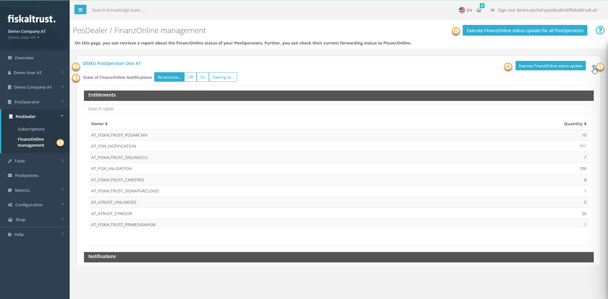

# FinanzOnline Management

:::info summary

After reading this, you know, how to retrieve a report about the FinanzOnline status of your PosOperators. Further, you can check their current forwarding status to FinanzOnline.

:::

## Introduction
Following the steps at [fiskalization](portal-manual-doc\doc\handbook-at\fiskalization.md), you, as a PosDealer, had the option to complete the master data of the PosOperator. Further, you entered and checked the FinanzOnline access data of a single PosOperator. **FinanzOnline Management** offers you the option, to check the status of entitlements, notifications, validations for queues or Signature Creation Units (SCUs). You cn check these for a single one or for of all your PosOperators.

## Work steps

| steps | description                                                                                                                |
|:----------------------:|-------------------------------------------------------------------------------------------------------------------------------------|
| |Enter the [fiskaltrust.Portal](https://portal.fiskaltrust.at/) and select `PosDealer` / `FinanzOnline management`  |
| |Each PosOperator is listed in an own bar at the table. You can use the linked name to change to the account of the PosOperator. |
| |The buttons at `State of FinanzOnline Notifications` show the actual state for notifications. For further information, check the information shown hovering with your mouse pointer over the buttons. |
| |You can use `Execute FinanzOnline status update` to execute a FinanzOnline status update. Note, that after this you will be routed to `PosOperator` / `Overview`. |
| |You can open a detailed overview of open entitlements for the selected PosOperator. |
| |With `Execute FinanzOnline status update` you execute a status update for all your PosOperator. Note that this process requires sufficient permissions for each account. |

## Details on notifications

| steps | description                                                                                                                |
|:----------------------:|-------------------------------------------------------------------------------------------------------------------------------------|
| |Open the Overview. |
| |Scroll down to `Notifications`. |
| |You can search with the inner scroll bar for further notifications. |
| |You can search with the inner scroll bar for formerly sent notifications. |
| |You can open further detais, note, that these are partially sent by FinanOnline and not translated. |