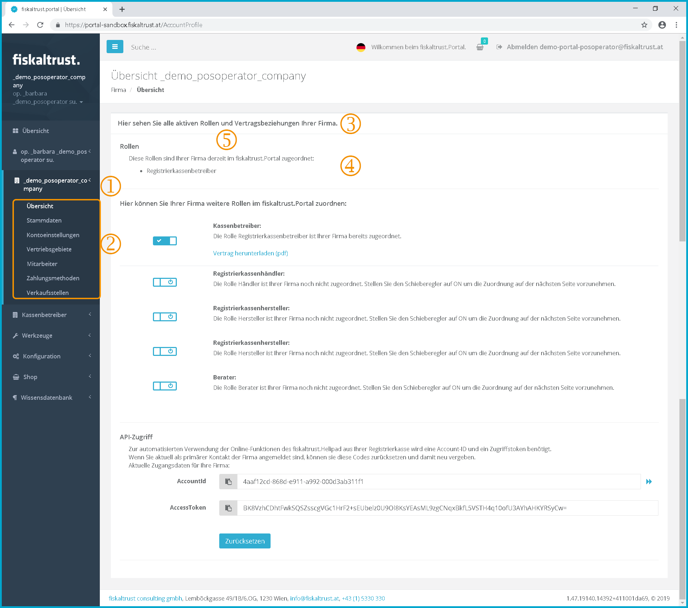
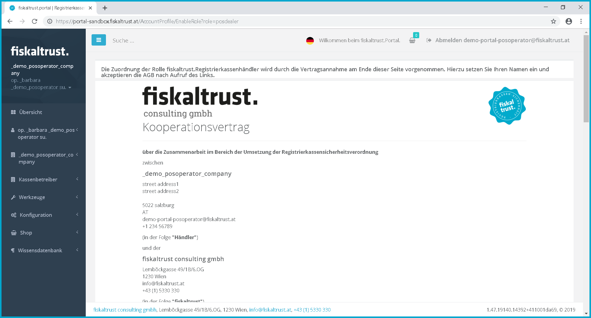
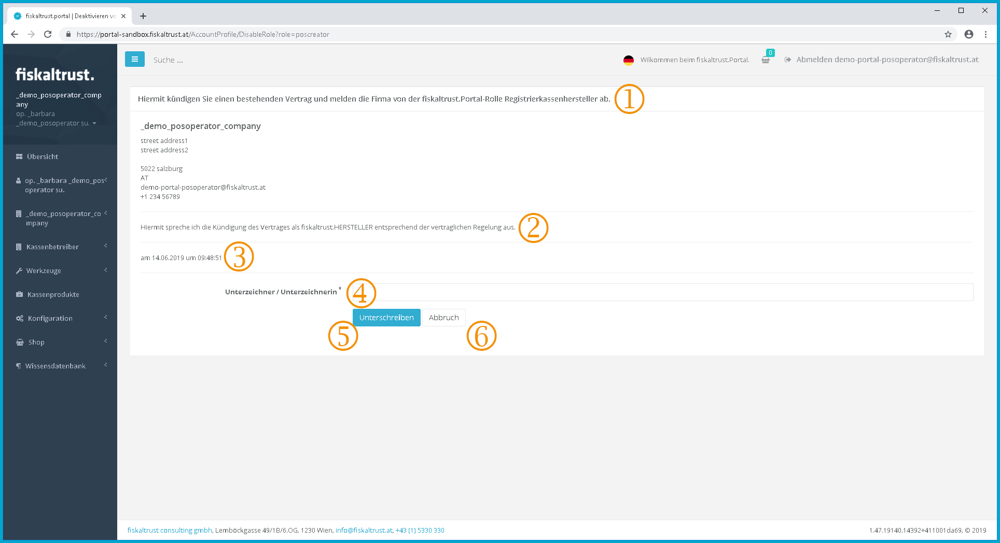
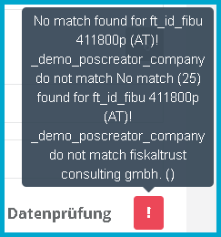
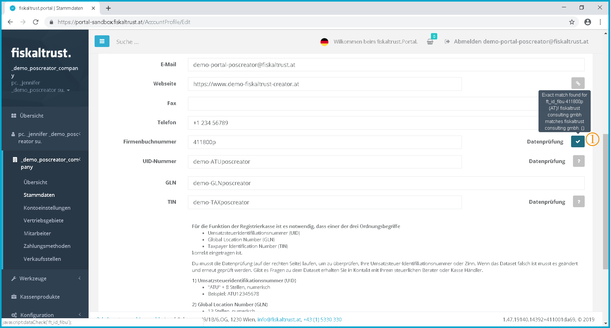
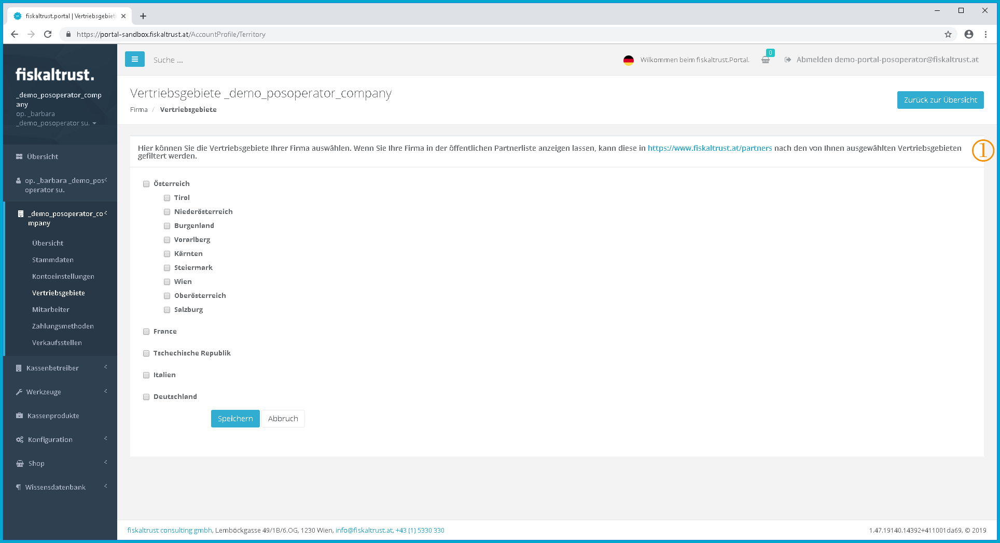

### Company

:::danger **No maintenance anymore**

These manuals are no longer maintained! 

In case of any questions, we encourage you to refer to our current [fiskaltrust Documentation Platform](https://docs.fiskaltrust.cloud).  
For further details, check the corresponding Knowledge Base Articles (KBA), which can be found on the fiskaltrust.Portal.

:::

#### Overview of roles and contractual relationships

If a user has been assigned authorization to manage master data (or is the primary contact), these functions are available to the user.

With the authorization to conclude a contract, the user can enter into the contractual relationships of the company. In this case, the contract is concluded in absentia.

Screenshot-AT 28: Overview of company roles and contractual relationships with fiskaltrust [https://portal.fiskaltrust.at/AccountProfile](https://portal.fiskaltrust.at/AccountProfile)

In this example, the company has not been assigned a role. All sliders are up on the left side.

 Click on the company name to open up the function menu for the company.

 The menu items "Overview", "Master data", "Account settings", "Sales area", "Employees" "Payment methods" and "Outlets" can be called up here.

 **Text:** "Here you see all active roles and contractual relationships of your company."

 **Text:** "Here you can assign further roles in the fiskaltrust.Portal to your company."

The roles "PosOperator", "PosDealer", "PosOperator" and "Consultant" can be managed.

 Since the company is not assigned a role as a partner in this example, no slider is visible with which you can enter the company in the publicly accessible partner list [https://portal.fiskaltrust.at/public/filterpartners](https://portal.fiskaltrust.at/public/filterpartners).

#### Company role PosCreator

This section describes how a company can activate and deactivate the role of a PosCreator. The respective contractual agreements between fiskaltrust consulting gmbh and the company can be concluded or terminated.

The roles PosDealer, consultant and PosOperator are assigned in the same way, which is why the technical representation of these roles is omitted in this document.

##### Cooperation agreement PosCreator

This function enables companies to use the role of a PosCreator in the ft.portal. Thus all functions of a PosCreator, e.g. the creation and administration of employees, cash register products or PosDealers are available to him in the ft.Portal.

Screenshot-AT 29: Slider for assigning the role "controller manufacturer"

 **Text:** "The Cashregister Operator" role hat been assigned to your company. Set the slider to OFF to remove the assignment on the next page

 **Text:** "The "Cashregister Dealer" role has not yet been assigned to your company. Set the slider to ON to make the assignment on the next page."

The slider is switched is by clicking on it. This works in both directions. This is to request that the role is to be accepted or that the underlying contract is to be concluded or terminated. The underlying contracts are presented on the following page. The sole switching of the slider does not lead to the conclusion of a contract or the termination of the contractual relationship.

This functionality applies analogously to the other contractual relationships.

Screenshot-AT 30: Call of the cooperation contract before the conclusion of the contract.

After changing the slider from disabled to enabled, the page with the content of the cooperation agreement will be opened.

This does not yet lead to the conclusion of the contract.

##### Conclusion of contract

Screenshot-AT 31: Conclusion of a contract and thus for role activation.

 **Text:** "GTC and Privacy Policy read and accepted.

Please confirm the contract by entering your name. Furthermore, please click on the GTC to display them, then please accept the GTC by ticking the box and click on send".

 The user must first read the contract text. This forms the basis of the contractual relationship between the company and the fiskaltrust consulting gmbh for each role in the respective version.

 The date and time of the call up of the contract text are logged by fiskaltrust after the conclusion of the contract and transmitted to the user as contract confirmation by e-mail as a .pdf document. The risk of data security and failure to provide information is borne by the user or the company and has no influence on the conclusion of the contract.

 The name of the authorised signatory must be entered in this field.

 Read and accept the terms and conditions. By clicking on "GTC" or "Privacy Policy", the GTC or the Privacy Policy will be opened in a new pop-up window of the Internet browser and must be read. After reading the general terms and conditions or the Privacy Policy, the pop-up window can be closed again.

By ticking the checkbox   to accept the GTC and Privacy Policy and clicking on "Next" , the contractual basis of the GTC is agreed between the user, the company and the fiskaltrust consulting gmbh. Since fiskaltrust has common general terms and conditions for all contracting parties, these are formulated in the same wording as agreed during the registration of user and company.

 Only after activating the checkbox for the "*GTC and Privacy Policy read and accepted*" can the contract be approved by clicking on. \[Sign\]

By clicking on \[Sign\] a contract is concluded between the company and fiskaltrust consulting gmbh and the overview of roles and contractual relationships is then displayed again.

Then the slider for the respective role is changed from \[Disabled\] to \[Enabled\].

 Before clicking  \[Sign\] the process can be canceled by clicking on  \[Cancel\].

Clicking on \[Cancel\] does not lead to the conclusion of a contract and the overview of roles as well as the contractual relationships is called up.

The slider is then reset to the \[Disabled\] position of the respective role.

#### Active role PosCreator

After you have activated the role and concluded the contract, the overview of roles and contract relationships changes.

Screenshot-AT 32: Active role as PosCreator - inactive partner role

 **Text:** "These roles are currently assigned to your company in the fiskaltrust.Portal"

 The slider is set to \[Enabled\]. This indicates that the respective role is enabled. By clicking on the slider the role can be put back and the contract can be cancelled. (see chapter [Resetting the role of PosCreator](#resetting-the-role-of-poscreator))

 **Text:** "The cash register manufacturer role is already assigned to your company."

 **Text:** "Download contract (pdf)"

Click on this link to download the contract text. This is personalised with the name of the signatory as well as the date and time of the conclusion of the contract. (Example: "Read and accepted on 29.05.2016 at 17:40:22 by \_jennifer \_test\_poscreator")

 This slider can be used to set whether the company's contact details appear in the public partner list or not ([https://portal.fiskaltrust.at/public/filterpartners](https://portal.fiskaltrust.at/public/filterpartners)). (see chapter " [Activating the role - Public partner list](#activating-the-role-public-partner-list) ")

After the conclusion of the contract an e-mail confirmation is sent to the user of the company.

Screenshot-AT 33: Email confirmation: Welcome as fiskaltrust.PosCreator

##### Activating the fiskaltrust.Partnerrole

Already with an active role as a "PosCreator", "PosDealer"
or "consultant" one achieves the status as a fiskaltrust partner.

 
Screenshot-AT 34: Email confirmation: Activation of the fiskaltrust partner role

This partnership is free of charge and enables e.g. the use of the ft.service as well as various advertising media.

##### Activating the role - public partner list

With the status ft.partner it is possible to enter a company in the public partner list.

This entry is voluntary, free of charge, revocable and can be changed by the ft.partner at any time via the ft.portal.

Screenshot-AT 35: Entry in the public partner list

 As soon as the role as a "PosCreator", "PosDealer" or "consultant" is active, the status as ft.partner is achieved.

 For each ft.partner the slider is available to display the contact data of his company in the publicly accessible partner list.

 **Text:** "Public Partner List"

Allows you to specify whether your company is displayed in the public partner list.

If this slider is set to ON, the corresponding contact details of your company will be displayed in the Partner List [https://portal.fiskaltrust.at/public/filterpartners](https://portal.fiskaltrust.at/public/filterpartners)."

Screenshot-AT 36: Public partner list | [https://portal.fiskaltrust.at/public/filterpartners](https://portal.fiskaltrust.at/public/filterpartners)

#### Resetting the role of PosCreator

You can use this function to terminate the contractual relationships in accordance with the contractual agreement. For this you switch the slider of the role PosCreator to disabled and get to the termination page.

Screenshot-AT 37: Termination of a role and the existing contract

 **Text:** "You hereby terminate an existing contract and deregister the company from the fiskaltrust.portal and its role as a cash register manufacturer."

 **Text:** "I hereby pronounce the termination of the contract as fiskaltrust.manufacturer in accordance with the contractual provision."

 The date and time of the call up for the cancellation form are logged by fiskaltrust with the cancellation and sent to the user as confirmation by e-mail. The risk of data security and failure to provide information is borne by the user or the company and does not affect the termination of the contract.

 The name of the authorised signatory must be entered in this field.

 The declaration of intent is made by clicking on \[Sign\].

The overview of roles and contract relationships is called up.

Then the slider for the respective role is changed from \[Enabled\] to \[Disabled\].

The functions from the role are therefore no longer available.

 Until you click on \[Sign\], you can cancel the process at any time by clicking on \[Cancel\]. In this case the slider for the respective roller is still set to \[Enabled\].

The process of the resignation and thus termination of the contract is confirmed with an e-mail. The termination provisions in the General Terms and Conditions or in the concluded contracts must be observed.

Screenshot-AT 38: Email confirmation: Resignation of the role as fiskaltrust.PosCreator 

#### Master data of the company

Screenshot-AT 39: Company master data

 **Text:** "Here you can edit the master data of your company. Only if you release the company for the public partner list in the menu item "Overview" will the contact data be displayed in [https://portal.fiskaltrust.at/public/filterpartners](https://portal.fiskaltrust.at/public/filterpartners).

 **Text:** "For the cash register to function, it is necessary that one of these:

- Sales tax identification number (UID)
- Global Location Number (GLN)
- Tax office and tax number (St.Nr.)

is entered correctly.

For the UID or tax number, the data check (on the right side) must also be clicked and checked for its correctness. If an error occurs, the classification key must be corrected and checked again. Your tax advisor or PosDealer can help you with any questions you may have about the classification term.

1\) Sales tax identification number (UID)

- ATU" + 8 digits, numeric
- Example: ATU12345678

2\) Global Location Number (GLN)

- 13 digits, numeric
- Inquiry: [http://www.gepir.at](http://www.gepir.at)
- Example: 1234567890123

3\) Tax office and tax number (St.Nr.)

The tax office and tax number must be entered in the following form:

- Tax office number (two digits) and
- Tax number (seven digits)
- without separator and without blank space
- Example: Tax office Linz (46), tax number 123 / 4567; correct input: 461234567.

The following keywords can be checked with the button .

 "Website" (certificate check; the check is not yet active)

 The "company register number" is not required for the functionality of the signature creation.

 "UID number" with leading "ATU" and the 8-digit number. The UID number is the preferred classification term that is used for the signature creation.

Principally, all companies can apply for a UID number.

Companies that do not have a UID number can use the GLN or the tax number as a classification term for the certificates.

 "GLN" The Global Location Number of a company can be queried e.g. via the WKO Firmen A-Z ([https://firmen.wko.at/](https://firmen.wko.at/)) or the company service portal ([https://www.usp.gv.at](https://www.usp.gv.at)).

"Tax number" \[The check of the tax number via the EU portal can temporarily lead to the error message (505) Bad Gateway.\]

#### Checking the company's classification terms

 After entering the UID number or the tax number as a filing key, they are to be saved. Then you should check an order key with the button .

The positive check is absolutely necessary for the later assignment of ONE classification term for the automated personalization of a signature creation device (SmartCard)\!

Screenshot-AT 40: Entering a new order key for the company

 The status of the check is indicated by the color and the pictogram of the button . Is the test not yet carried out its indicated by a grey pictogram with a question mark: 

The automated checking of the classification terms is carried out by clicking on 

This example shows the check of the company register number:

Screenshot-AT 41: Error when checking a classification key (e.g. company register number)

The status of the check is indicated by the color and the pictogram of the button. A negative test is indicated by a red pictogram with a callsign:

Screenshot-AT 42: Example of a negative check result of a check of the company register number

This example of a check result shows that the company name entered in the company master data (above) does not correspond to the data stored in the company register.

After adjusting the name of the company, saving it again and clicking on , the check is carried out again. If the classification key is checked and the master data are now correct - with few deviations - the check leads to a positive result.

Screenshot-AT 43: Example of a positive check result of a check of the company register number

 The status of the check is indicated by the color and the pictogram of the button. A positive test is indicated by a pictogram with a check mark: 

Only after a positive check of the classification key can this classification key be used to personalize a signature creation device (SmartCard).

To use the ft.Personalization Tool see chapter [ft.Personalization Tool](fiskalization.md#personalization-tool).

#### Account settings

Under the account settings you can set the length of the display for various lists in the ft.Portal.

#### Distribution areas of the company

Screenshot-AT 44: Sales areas company

 **Text:** "Here you can select the sales areas of your company. If you display your company in the public partner list, it can be filtered by these sales territories in [https://portal.fiskaltrust.at/public/filterpartners](https://portal.fiskaltrust.at/public/filterpartners)."