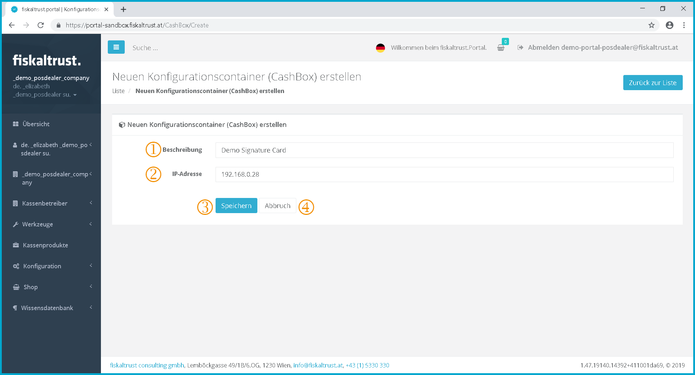
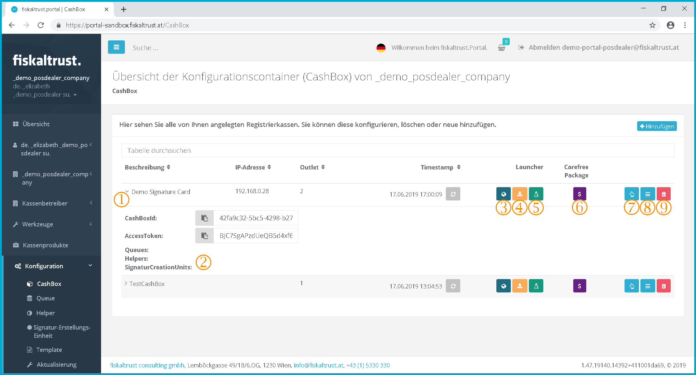
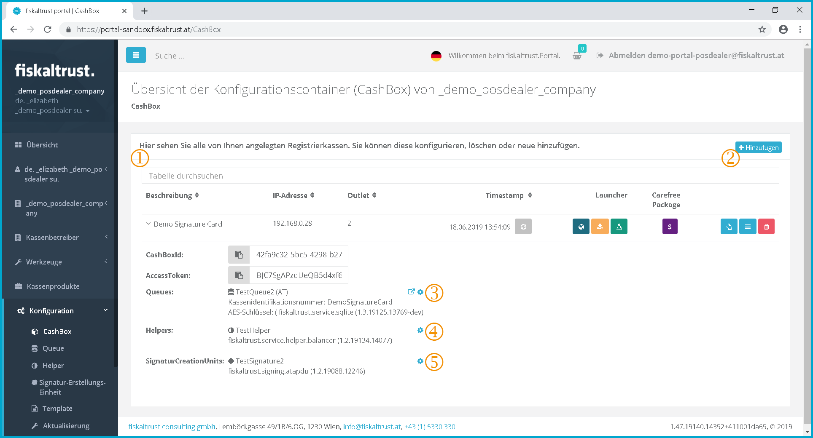
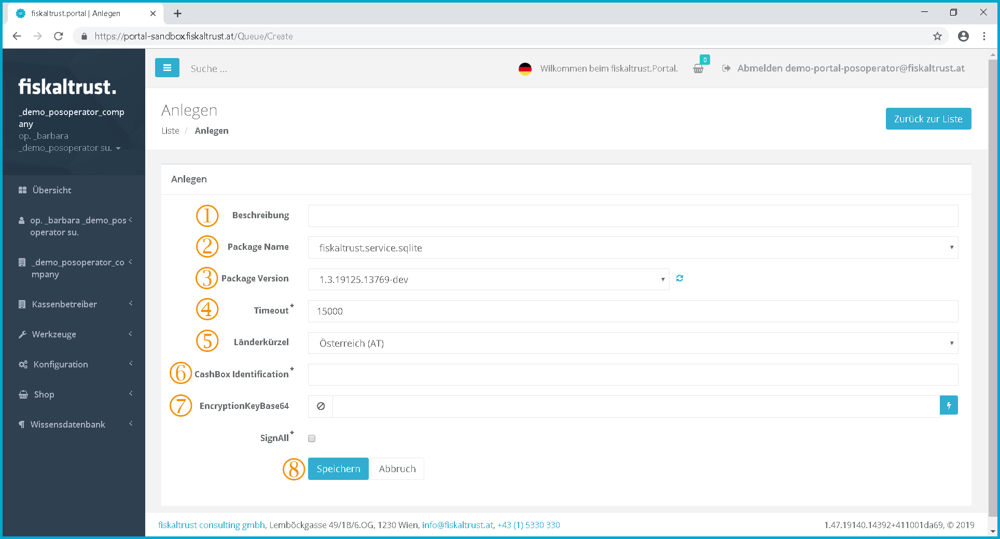
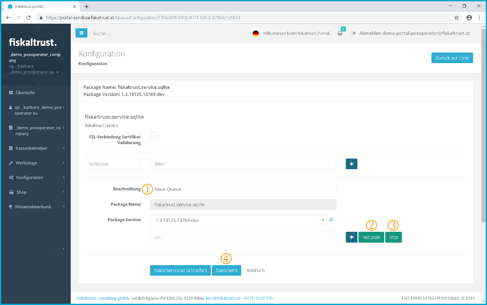
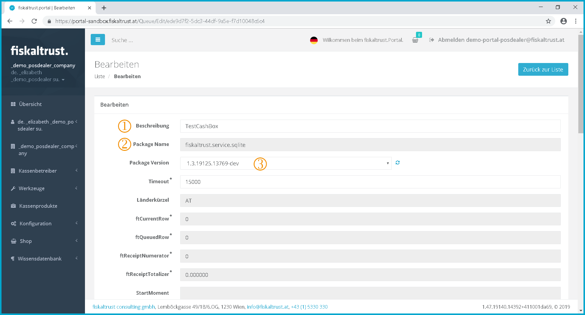
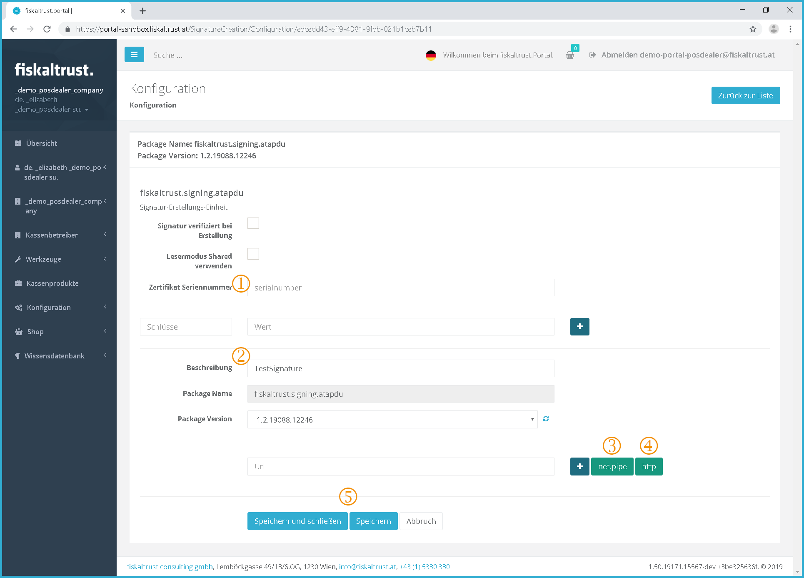

## Configuration

For further information for PosCreators or PosDealers Rollout see chapter [Rollout for PosCreators and PosDealers - Important process steps](fiskalization.md#rollout-for-poscreators-and-posdealers-important-process-steps).

### CashBox

#### Creation of a CashBox

Screenshot-AT 56: Creating the configuration containers

 **Text:** "Here you can see all the cash registers you have created. You can add, delete or configure some."

 To get to the creation and configuration of a queue, click on the menu item "*Queue*".

 Click on \[add\] to create a new configuration container.

#### Add a CashBox

Screenshot-AT 57: Configuration container - Add

 In this field, you can change the name of the configuration container.

 If you are working in a network mode, enter the IP address of the endpoint here. 

 Click on \[Save\] to save the changes to the configuration container.

 Clicking \[Cancel\] cancels the operation without saving the changes.

#### Overview first CashBox

Screenshot-AT 58: Overview - First configuration container 

 After creating a CashBox, it is initially empty, it only has the CashBox ID and the AccessToken which are required to access the CashBox.

 Here you can see the assigned queues, helpers, and SCUs. Since the configuration container has just been created and nothing is stored yet, the fields are empty.

 By clicking on  you can download the "dotnet Launcher". This must be used if there is an Internet connection to the cash register.

 The "dotnet useOffline Launcher" should be used if no internet connection can be established. This can be downloaded by clicking on .

 If you are using a Linux system, download the "mono useOffline Launcher" by clicking on . This is set to "useOffline" by default.

 If no carefree package has yet been purchased, the purchase can be made by clicking on . If a package has already been purchased, the validity date is displayed here.

 The CashBox can be edited with a click on  by Drag\&Drop.

 The CashBox can also be edited in a list view by clicking on .

 By clicking on  the cashbox can be deleted.

#### Edit CashBox by Drag \& Drop

Screenshot-AT 59: Edit CashBox by Drag \& Drop

 Here you can see your already created queues. This corresponds to a data acquisition protocol and therefore a PosSystem in the sense of the RKSV.

 Here you can see your already created helpers. Further information see chapter [Helpers](../handbook-general/configuration.md#helper).

 Here you can see the signature creation devices that you have already created.

 This field contains your CashBox. Using Drag\&Drop, you can now drag units that have already been created from and into the fields.

 Click on \[Save\] to save the changes to the configuration container.

#### Edit CashBox by List

Furthermore, the CashBox can be edited via a list.

Screenshot-AT 60: Edit CashBox by list

 The list view is divided into three sections showing the available objects (Queues, Helper, Signature Creation Device)

 The required objects can be added to the cash box by ticking the checkbox.

 Click  to display the settings for each object.

#### Ready configured CashBox

Screenshot-AT 61: Ready configured CashBox

 **Text:** "Here you can see all the cash registers you have created. You can add, delete or configure them."

 By clicking on "+Add" you can create a new configuration container.

 In the section Queues you will find the deposited cash register identification number as well as the automatically generated AES key (Base64 encryption)

**Only for Austria:**
This key  is required to register the cash register with FinanzOnline. By clicking on  you can configure your queue(s) and set which signature creation devices the queue can access. See Chapter [AT FinanzOnline Messages](messages.md#atfon-messages).

For further information see chapter "[Messages](messages.md) ".

By clicking on  you can edit them again.

 In this section you can see the connected helpers as well as the package name and version. By clicking on  you can edit them again.

 The connected signature creation devices are displayed here, and the package name and version are also displayed. By clicking on  you can edit them again.

##### Example: Overview several ready configured CashBoxes

Screenshot-AT 62: Example: Overview - several ready configured CashBoxes

#### Delete a CashBox

Screenshot-AT 63: Delete CashBox

For legal reasons it is currently not possible to delete a CashBox. However, there is the exception, that if the CashBox was not yet in use, it can still be deleted.

#### Download Launcher

Screenshot-AT 64: Download Launcher

 By clicking on this button, you download the launcher you need for commissioning. This is a ZIP file that you download into the download folder. Extract the file from your download folder with a right-click, then click "Extract" and "Save".

For further information see chapter [Overview first CashBox](#overview-firstcashbox)

### Queue

#### Creating a queue

Screenshot-AT 65: Creating the queue

 To get to the creation and configuration of a queue, click on the menu item "*Queue*".

 Click on \[Create new\] to add a new queue.

#### Add a queue

Screenshot-AT 66: Queue - Adding

 In this field, you can change the name of the queue.

 Here you can select the appropriate storage method depending on your operating system.

 The package version can also be selected using a dropdown menu. These can be updated by clicking on 

 Here you can set a timeout for the connection attempt with the signature creation device. (The time is given in milliseconds)

 Enter the country in which you would like to use fiskaltrust here.

 Enter the desired health insurance identification number here.

 The system automatically generates the encryption key for you when you click on .

 Click on \[Save\] to save the configuration of the queue.

##### Fiskalization example for Germany

Screenshot-AT 67: Fiskalization - Example Germany

German fiskalization does not (yet) include a signature creation device. This function is in test mode.

#### Queue overview

Screenshot-AT 68: Queue overview

 Click on  to go to the receipt check. For further explanations see chapter [Receipt validation](messages.md#receipt-validation)

 Here the current status of the PosSystem is displayed, by clicking on  a message about the status can be sent.

 By clicking on  a status check is immediately transmitted to Finanz Online.

 By clicking on  all transmitted receipts are displayed.

 The Action Journal can be accessed by clicking on . All status changes and important actions are displayed here.

 The queue export can be started by pressing the button . For further information see chapter "Queue - Export" in the national appendices.

 The POS archive can be placed in the shopping cart by clicking on .

 By clicking on  the connected SCUs can be displayed and managed.

 Here the configuration of the queue can be opened by clicking on .

 Click on  to edit the description, package version and timeout of the queue.

 Click  to delete the queue. However, the button for deleting the queue is currently inactive for legal reasons, so no queue can be deleted there will be an option to hide queues in the future.

#### SCUs used by Queues

Screenshot-AT 69: Queue - Connected Signature Creation Devices (SCU)

 By setting a check mark the SCU to be connected to the queue is selected.

 The previously selected URL of the SCU is stored here.

 The drop-down menu allows you to choose between different timeout modes. Normal and Backup, and different times.

 Click on \[Save\]  to save the configuration of the queue.

#### Queue configuration

Screenshot-AT 70: Queue configuration

 In this field, you can change the name of the signature creation device.

 Here you can create a URL for your queue. By clicking on  you get a URL, which is suitable for local use without internet connection, because no firewall settings are required.

 By clicking on , the system generates a URL for you with which the POS system can access the queue. You can rename the URL yourself. This can look like this: http://localhost.1200/Queuefiskaltrust

 Click on \[Save\] to save the configuration of the queue.

#### Receipt journal of a Queue

Screenshot-AT 71: Queue - Overview ReceiptJournal

 The receipts created so far are listed here.

 Click on  to display the respective receipt.

After selecting a receipt, it is displayed as follows.This view makes it possible to verify the accuracy of the receipt content.

Screenshot-AT 105: Queue - Start receipt

#### Edit a queue

Screenshot-AT 72: Queue - Edit

 In this field, you can change the name of the queue.

 The previously selected package name is displayed here.

 Here you can select from the various package versions using the drop-down menu. These can be updated by clicking on .

#### Export a queue

Screenshot-AT 73: Queue - Export

 First you have to define the area which should be exported, this is done with the help of the receipt number and the slider.

 The export format must then be dragged to the left  using Drag\&Drop.

 The export target is also dragged to the left  using Drag\&Drop.

 Click on \[Start\] to start the export, then you will be redirected to a page showing the progress of the export. After completion of the export you will receive an info mail.

### Signature creation unit (SCU)

#### Creation of a SCU

Screenshot-AT 74: Adding a signature creation device

 To create, configure and delete the signature creation devices, click on the "Signature creation device" menu item.

 Click on \[Create\] to open a page where a new signature creation device can be created.

#### Add Signature creation unit

Screenshot-AT 75: Adding a signature creation device

 **Text:** "Here you can assign another signature creation device to your company. Enter the data and click on "Save".

 Here you can name your signature creation device.

 Here you can select the package to be used. This must be specified by the PosCreator.

 Click on \[Save\] to save the configuration of the SCU.

#### Overview of Signature creation units

Screenshot-AT 76: Overview - Signature Creation Devices (SCU)

 To get to the configuration of the signature creation devices, click on the menu item "*Signature creation device*".

 Click on \[Create\] to go to the page for creating a new signature creation device.

 The name of the SCU is displayed here.

 By clicking on , the basic settings and package configuration for individual use of the signature creation device in the cash register can be called up again.

 By clicking on  things like the description, package name, version and mode of SCU may be edited.

 Click on  to delete the SCU. However, the button to delete the helper is currently inactive for legal reasons, so no helper can currently be deleted.

 A brief overview of the data for the selected signature creation device is displayed here.

 The search function can be used to search for a SCU by entering any parameter in the search field.

#### Configuration of a Signature creation unit

Screenshot-AT 77: Signature Creation Device - Configuration

 The serial number of the certificate is stored here after creation.

 In this field, you can change the name of the signature creation device.

 Here you can create a URL for your signature creation device. By clicking on  you get a URL, which is suitable for local use without internet connection, because no firewall settings are required.

 By clicking on the , the system generates a URL for you with which the POS system can access the SCU. You can rename the URL yourself. This can look like this: http://localhost.1200/SCUfiskaltrust

 Click on \[Save\] to save the configuration of the SCU.

#### Edit a Signature creation unit

Screenshot-AT 78: Signature creation device - Edit

 In this field, you can change the name of the signature creation device.

 Here you can use the dropdown menu to select from the various package names.

 The package version can also be selected using a dropdown menu. These can be updated by clicking on .

 In the field Mode you can choose between the different modes "Normal", "Backup" and "Deactivated".

 Click on \[Save\] to save the configuration of the SCU.

#### Delete a Signature creation unit

For legal reasons, it is currently not possible to delete the signature creation device.

Screenshot-AT 79: Signature creation device - Delete

 The button for deleting a SCU is currently inactive.
