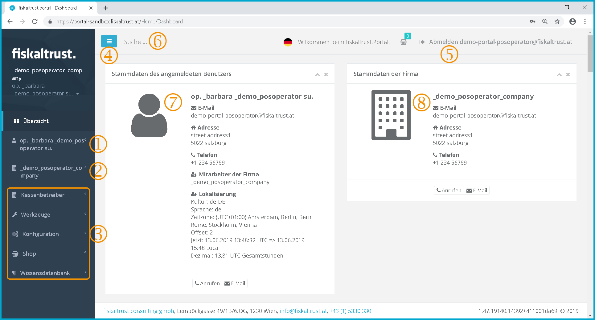

### Dashboard

:::danger **No maintenance anymore**

These manuals are no longer maintained! 

In case of any questions, we encourage you to refer to our current [fiskaltrust Documentation Platform](https://docs.fiskaltrust.cloud).  
For further details, check the corresponding Knowledge Base Articles (KBA), which can be found on the fiskaltrust.Portal.

:::

After a user has logged in, the dashboard an overview page is called up. Via the menu bar on the left side, you can access the functions that have been released for the respective user.

Therefore, the menu structure may look different depending on the roles assigned.

Screenshot-AT 23: Dashboard - overview page with the functions shared with the user

 Name of the user - Click on the username to access the submenus "Overview", "Data", "Change password" and "Change user name".

 Name of the company to which the user is assigned as a contact. If the user is not linked to any company, then no name of the company is given here, only the user. Click on the company name to access the Submenus "Overview", "Master data", "Account settings", "Sales area", "Employees", "Payment Methods" and "Outlets".

 Menus - only the functions available to the user with the respective submenus are displayed.

 By clicking on the symbol  , the displayed menu can be reduced in size on the left margin of the page.

 By clicking on the text "Log out e-mail address" the user is logged out of the ft.portal and the landing page is called up. (see chapter [Landing Page](portal.md#landing-page))

 Search field - The knowledge based articles are searched for the expression entered here.

 The contact details of the currently logged in user are displayed here.

 If the user has been linked to a company, the master data of the active company is displayed here.

### Dashboard display on a mobile device

Screenshot-AT 24: Dashboard on a mobile device

The display differs, for example, when using a smartphone or an Internet browser with a different language setting.

The menus should be usable in any display.
