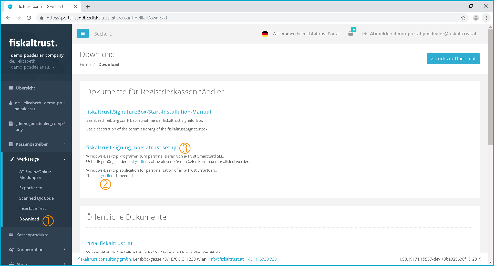
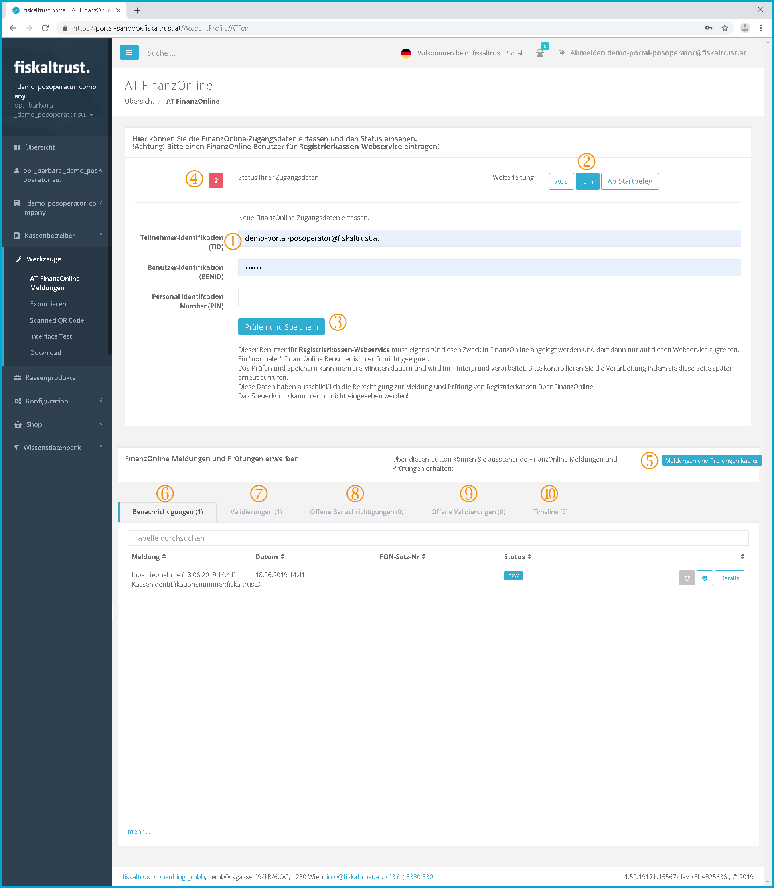
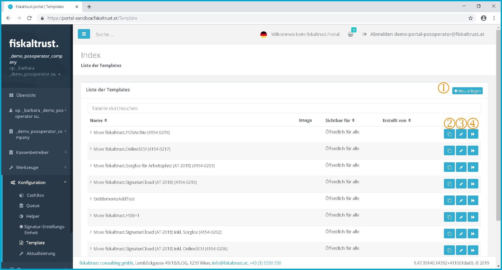

## Fiscalization

:::danger

These manuals are no longer maintained! 

In case of any questions, we encourage you to refer to our current [fiskaltrust Documentation Platform](https://docs.fiskaltrust.cloud).  
For further details, check the corresponding Knowledge Base Articles (KBA), which can be found on the fiskaltrust.Portal.

:::

### ft.Personalization-Tool<a name="personalization-tool"></a>

#### ft.Personalization-Tool Download & installation

[](https://portal-sandbox.fiskaltrust.at/AccountProfile/Download)
Screenshot-AT 80: Overview of the "Download" menu item

 As a PosDealer you will find the download of the personalization tool in the left menu bar under **Download.**

[](https://www.a-trust.at/downloads/)
Screenshot-AT 81: Available downloads from the A-Trust website

 In order to use the ft.personalization tool the "a.Sign Cilent" must be downloaded first. This can be done by clicking on the hyperlink or directly via the [A-Trust website](https://www.a-trust.at/downloads/). The downloaded file must now be executed.

 Afterwards you can click on fiskaltrust.signing.tools.atrust.setup and start the download. Now the file must be executed and the installation must be initiated.

#### ft.Personalization-Tool Login


Screenshot-AT 82: Login mask of the ft.personalization tool

The login data (user name and password) or the account ID and the AccessToken are required for the login.

[](https://portal.fiskaltrust.at/AccountProfile)
Screenshot-AT 83: Overview of the company

 Under the menu item {Company}, "Overview", you can download a file by clicking on it. This file copies the account ID and the AccessToken and automatically opens the ft.personalization tool and inserts the data onto the login screen.

### FinanzOnline

#### Messages

[](https://portal.fiskaltrust.at/AccountProfile/ATFon)
Screenshot-AT 84: AT FinanzOnline / Overview

##### Enter access data

Open FinanzOnline notifications and audits

- notifications
- receipt validation

 Participant identification (PID)

 Forwarding Setting

 Click here to verify and Save

 Click to check the status of your access data

 Click to checkout notifications and validations

 Notifications

 Validations

 Unfinished notifications

 Unfinished validations

 Timeline

#### Report on FinanzOnline status

With the help of the link [https://portal.fiskaltrust.at/posoperator/ATFonReport](https://portal.fiskaltrust.at/posoperator/ATFonReport), it is possible to retrieve a report about the FinanzOnline status.
[](https://portal.fiskaltrust.at/PosOperator/ATFonReport)
Screenshot-AT 85: FinanzOnline status report

 By clicking on all entries listed below it will be resent to FinanzOnline.

 The current forwarding status to FinanzOnline is displayed here.

 The forwarding status can be updated by clicking this button.

 The following list shows a list of existing entitlements, messages, queues and SCUs including their current state at FinanzOnline.

#### Completion the ft.Portal
1. new
2nd inquiry (incident)
    1. a product must have been purchased with which the FinanzOnline messages can be carried out.
3. forwarding (redirect)
4. processed
    2. successful
    3. failed
        1 The FinanzOnline feedback is available as a tooltip at the button.

#### Identification of manual completion

The FinanzOnline notifications can always be carried out manually by the PosOperator or his tax consultant via FinanzOnline.

If the completion of a FinanzOnline message has already been done manually, this is signaled to the fiskaltrust.Portal by clicking on the button "Mark as done manually".

#### Receipt validation

##### Automatic receipt validation

##### Receipt validation in dialog procedure

### Rollout for PosCreators and PosDealers - Important process steps

**Overview:** The following steps are performed for an example rollout. If you have already done a rollout (such as creating an **PosDealer**), you can skip these points.

| All described functions can be tested in the test environment (sandbox) under [*https://portal-sandbox.fiskaltrust.at*](https://portal-sandbox.fiskaltrust.at).|
------------------------------------------------------------------------------------------------------------------------------------------------------------------------------------------------------------------------------------------------------------------------------|
| Attention | \- The e-mails are also actually sent from the sandbox\!<br />Therefore, the data of the real customers should not be tested with the data of the sandbox.<br />- The data created in the sandbox are deleted with the following portal update and would have to be entered again.<br />- With each update, the data from the real system are transferred to the sandbox.<br />- In the real system (https://portal.fiskaltrust.at), the functions are taken over in the same way after the test in the sandbox, but not the test data, but the test data. |

### Preparation collect all necessary information

Please ensure that the following **minimum** information is available:

| Information<br />PosDealer | For the (main) contact | Email address Contact |
|---------------------------------------------------------------|------------------------------------------------------------------------------------------------------------|------------------------|
| | Password | | |
| | First Name || ||
| Last name.
| For the company | Company name | | |
| | E-mail address Company | | |
| Zip code, city, country.
| | UID Number (here optional) | | |
For employees (optional): | e-mail address employees | | |
| | First Name || ||
| Last name.
| PosOperator | For the (main) contact | Contact E-mail address |
| | Contact First Name | | |
| | Contact Surname | | |
| | Password | | |
For the company: | Company name | | |
| Zip code, city, country.
| | UID Number | ||
| | Company e-mail address | | |
| FinanzOnline RK User (WebService) | Subscriber Identification | | |
| | User Identification | | |
| | PIN | ||
| signature creation device | A-Trust SmartCard (per unit) | | |
| Card reader.
| fiskaltrust.map activation tool | Download in fiskaltrust.Portal | | |
| A-Trust a.sign Client<br />(Full installation not necessary) | [https://www.a-trust.at/ATrust/asignclient.aspx](https://www.a-trust.at/ATrust/asignclient.aspx) | | |
Payment in the webshop | Credit card (Mastercard, Visa) or <br />Paypal account (of **PosOperator** or **PosDealer**) | | |

| TIP | Make sure that you can retrieve e-mails from those e-mail addresses that are entered in the fiskaltrust.Portal or contact the persons who have access to them. This is also necessary for the tests in the sandbox. |
|------|-----------------------------------------------------------------------------------------------------------------------------------------------------------------------------------------------------------------------------------|
| TIP | The UID number should be entered in any case.<br />This is useful for the later FinanzOnline messages.                                                                                                           |

### Create the **PosDealer** (contact and company)

| **1 Registration** <br />|
  | To register the contact and the company, please go to [https://portal.fiskaltrust.at](https://portal.fiskaltrust.at)<br />(Test environment under [https://portal-sandbox.fiskaltrust.at](https://portal-sandbox.fiskaltrust.at)) top left on \[Portal\] and follow the instructions<br />(see chapter "[Registration and Login](registration-login.md)")<br />The re-registration of a company and a user on the fiskaltrust.Portal must be performed jointly in order to connect the user as the primary contact with the company. This connection can currently only be established later by the fiskaltrust.support. |
|------------|----------------------------------------------------------------------------------------------------------------------------------------------------------------------------------------------------------------------------------------------------------------------------------------------------------------------|
| **2 TIP** <br />  |
  | The data of the company - especially the name, UID number and postal code - should be recorded and not skipped. In the event that the company is not created, the company can be created by another new contact. A new company can only be created for an existing contact via the fiskaltrust.Hotline.<br />Only if the contact is created NEW and the company already exists in the fiskaltrust.Portal, the entry of company data can be skipped.|
| **3 TIP** |
  |If you (also) log into the production system under this link: [https://portal.fiskaltrust.at](https://portal.fiskaltrust.at), the access data will be transferred from the production system to the sandbox in irregular intervalls. This allows you to register in the sandbox even after the next update.|
| **4 Email confirmation** <br /><br />Screenshot-AT 129 - Example: Confirming your e-mail
  |The fiskaltrust.Portal sends an email to the newly registered address. Please click on the link to complete the registration. Then log in with the access data you have just created.|
| **5 Conclusion of contract** <br />[[Conclusion of contract]](company.md#conclusion-of-contract)|
  |Click on the company name in the menu sidebar on the left and then on {Overview} and move the switch at the PosDealer to ON.<br />
  (see chapter [Overview of roles and contractual relationships - example in which "no role" is assigned](company.md#overview-of-roles-and-conctractual-relationships) |
| **6 Public Partner List** |
  |If desired, set the "Public Partner List" slider to "ON". (this activates the display in the Public Partner List) |
| **7 {AccountID} and {AccessToken}** |
  |In the company overview below you will find the access data for automated access to a cash register via {AccountID} and {AccessToken}. This data is used to configure the cash registers (see below).|
| **8 Add master data** |
  |Please select the company name and master data from the menu on the left and enter the company e-mail address there, as an example.|
| **9 Automated UID confirmation** |
  |Optional: You can also check its validity here to the right of the UID number. This checks whether the EU VAT information system recognizes the VAT number as belonging to the company name.|
|  |
  |If an order key has not been positively checked, it cannot be used to personalize a signature creation device (SmartCard). <br /> Only after a positive check of the order key can this order key be used to personalize a signature creation device (SmartCard).<br /> (see "Checking the company order keys") <br /> If the check fails, you can move the mouse over the "DataCheck" field to see the response.|

### Invitation of a **PosOperator** by the **PosDealer**

| 1 PosOperator | Menu "PosOperator / invitations" |
|------------------|------------------------------------------------------------------------------------------------------------------------------------------------------------------------------------------------------------------------------------------------------------------------------|
| 2 Add | In the line PosOperator click on "**add "** | |
| 3 Data input | Enter the data of the **PosOperator** noted above and save it.                                                                                                                                                                                   |
| TIP | 4 If you want to create many PosOperators at once, you can create a CSV file and import it into the portal.                                                                                                                                              |
| 5 Assign | Click on "Assign" in the line of the created PosOperator, or on "Assign all PosOperators" to send an e-mail invitation to all.                                                                                                                  |
TIP | 6 TIP | It is possible to design the e-mail invitation individually by the PosDealer with an attached PDF document. This PDF document can be used, for example, to refer to further product recommendations or the rollout schedule for the PosOperator. |

### Activating the **PosOperator** in the portal

| The **PosOperator** receives an invitation to register on the fiskaltrust.Portal at his e-mail address <br /> he clicks the link, he arrives at the fiskaltrust.Portal, where he only has to choose a password and accept the terms and conditions, as well as the privacy policy. |
|--------------------|-------------------------------------------------------------------------------------------------------------------------------------------------------------------------------------------------------------------------------------------------------------------------------|
| 2 Activation | This not only creates the **PosOperator** in the fiskaltrust.Portal, but also registers it.                                                                                                                                                                        |

### Assign permissions of the **PosOperator** to the **PosDealer**

| 1 Authorization of the PosDealer | In the menu bar of the **PosOperator** click on **PosOperator / Overview**. The inviting PosDealer is now already listed and can be selected.                                                                                                                                                                    |
|----------------------------------|-------------------------------------------------------------------------------------------------------------------------------------------------------------------------------------------------------------------------------------------------------------------------------------------------------------------------------------------------------------|
| 2 Authorization assignment | In order to carrie out furthrt steps with the PosDealer on behalf of the **PosOperator**, the rights "Write", "Write cash register product" and "Write configuration" must be added here. If this is not done, the following steps must be performed by the **PosOperator**. |
| 3\. Optional Employees | Add employees for the **PosDealer** |
TIP | 4 TIP | The **PosDealer** can create its employees in the portal and grant them access rights.                                                                                                                                                                                                                                                  |
| 5 Add employees | Log in as PosDealer, click on the company name in the menu on the left and employees, click on Add, enter the e-mail address of the employee.                                                                                                                                                                                                     |
|  | Every person who should work with the fiskaltrust.Portal have to be added as employees.<br />(see chapter [Add employees](company.md#Add employee)) |
| 6 E-mail confirmation | If the employee is found in the portal, he can be assigned directly. Otherwise, first name and surname must be added and the employee can be created again. The employee then receives an e-mail invitation with a confirmation link.                                                                           |

### Entry of the **PosDealer** as a **PosOperator**

| 1 TIP | To make portal entries and configurations for the customer (PosOperator), the **PosDealer** (with his own access data) can switch to the view of the **PosOperator**. However, this requires the prior assignment of the authorizations from the **PosOperator**.                        |
|---------------------|---------------------------------------------------------------------------------------------------------------------------------------------------------------------------------------------------------------------------------------------------------------------------------------------------------------------------------|
| 2 Login | Login as **PosDealer** |
| Please note that in the menu, directly under the logo "fiskaltrust", the company name of the **PosDealer** is displayed.                                                                                                                                                                                                            |
| 3 Change company | To the left in the menu go to PosOperator, Overview and click on the name of the **PosOperator** in the list on the left. Under the logo "fiskaltrust" the company name of the **PosOperator** is now displayed, the **PosDealer** can now act like the **PosOperator** (assuming corresponding rights have been assigned) |
| 4 TIP | To return to the view of the **PosDealer**, click on the company name of the **PosOperator** directly below the "fiskaltrust" logo on the left. Then a field will open up with the company name of the **PosDealer**, from which you can switch back.                                                        |

### Completing the master data of the **PosOperator**

| 1 UID number check | Click on the {Company} / Master data in the menu, enter the company e-mail address and UID number, use the {Data Check} to check that the company name matches the UID number. |
|-------------------|--------------------------------------------------------------------------------------------------------------------------------------------------------------------------------------|
| TIP | 2 If the UID check fails, you can move the mouse over the "DataCheck" field to see the cause as a tooltip and then specifically correct it.             |

### Enter and check the FinanzOnline access data of the **PosOperator**

| 1 AT FinanzOnline messages | Click on {Tools} / "AT FinanzOnline messages" in the menu |
|-----------------------------------|--------------------------------------------------------------------------------------------------------------------------------------------------------------------------------------------------------------------------------------------------------------------------------------------------------------------------------------------------------------------------------------------------------------------------------------------------------------------|
| 2 FinanzOnline<br />Login data | Enter the access data of a FinanzOnline user who is authorized for the cash register web service (participant identification (TID), user identification (BenID, PIN). Then: Check and Save |
| TIP | 3 The status of the access data is indicated by a status button at the top of the page. The examination can take several minutes, since the access data is compared with the portal "FinanzOnline". With a browser refresh (key F5) the status can be updated. If the check fails, you can move the mouse pointer over the status button with exclamation and get information why the check failed. |

### Personalize SmartCard and transfer to portal

| 1 A-Sign Client | The A-Sign Client from A-Trust must first be installed on the PC. ([https://www.a-trust.at/ATrust/asignclient.aspx](https://www.a-trust.at/ATrust/asignclient.aspx)) If installed correctly, the red icon in the taskbar is visible |
|-----------------------------------|--------------------------------------------------------------------------------------------------------------------------------------------------------------------------------------------------------------------------------------------------------------------------------------------------------------------------------------------------------------------------------------------------------------------------------------------------------------------|
| 2 Card reader | Connect a card reader, the card must not yet be inserted.|
| 3 Install tool and start | Unpack the fiskaltrust.map activation tool in a directory and start it by double-clicking on "fiskaltrust.signing.tools.atrust.exe" |
| Select card reader | Recognized card readers are displayed in the lower left corner, for multiple card readers the correct one must be selected.|
| 5 Real operation <br />or Sandbox | In test operation "Sandbox" must be checked and the language can be changed to German.<br />In the portal under the Company overview {AccountID} and {AccessToken} of the **PosOperator** enter or copy into the login fields. Register by clicking on the arrow and the company information is read from the portal and displayed. An Internet connection must be established for this. |
| Insert 6 SmartCard | Insert a new SmartCard and select "New SmartCard" from the menu on the left.<br />SmartCards can be ordered in the fiskaltrust.shop: [https://portal.fiskaltrust.at/shop/products](https://portal.fiskaltrust.at/shop/products)
| 7 UID control | The UID number of the **PosOperator** should now be displayed for "Order key". If this is not the case, the UID number check may not have been carried out correctly.                                                                                                                                                                                               |
| 8 Name | A name for the SmartCard that can be freely selected and must be entered (this name is displayed in the portal after personalization to make it easier to assign this SmartCard) |
| 9 Write | Click "Write SmartCard and create in fiskaltrust.Portal". The card is personalized with the selected key (usually the UID number), read and then immediately stored in the fiskaltrust.Portal of the **PosOperator**. The storage can be controlled in the fiskaltrust.Portal under "Configuration / Signature Creation Unit".                                |

### Buy package in shop or use template

In the menu item "Configuration" a "CashBox" can be created manually.

Another possibility is the use of a free or chargeable "template". This is a preconfigured "sample template" with various properties to be defined, which is made available in the [ft.shop](https://portal.fiskaltrust.at/Shop/Products "Fiskaltrust Shop"). With such a template you can easily create many similarly configured CashBoxes. These CashBoxes can then furthermore be processed as described in chapter [Cash Box](configuration.md#cashbox).

If you would like to do so, please contact our support team at [info@fiskaltrust.at](mailto:info@fiskaltrust.at) We will be happy to advise you on the individual implementation.

### Use individual template

Under the menu item "Template" you will find an overview of the templates already created.
[](https://portal.fiskaltrust.at/Template/)
Screenshot-AT 92: Templates overview

 Click on \[Create new\] to create a new template.

 To duplicate an existing template, click on .

 Edit existing template by clicking on .

 Open tool for card personalization by clicking .

#### Creation of a new template

When creating a new template, the following form must be filled out.
[](https://portal.fiskaltrust.at/Template/)
Screenshot-AT 93: Create new template

#### Example for template content

```json
{
  "ftCashBoxId": " |[cashbox_id]| ",
  "ftSignaturCreationDevices": [
    {
      "Id": "scu0_id]|",
      "Package": "fiskaltrust.signing.atapdu",
      "Configuration": { "reader": "0" },
      "Url": [ "net.pipe://localhost/|[scu0_id]|" ]
    }
  ],
  "ftQueues": [
    {
      "Id": "|[queue0_id]|",
      "Package": "fiskaltrust.service.sqlite",
      "Configuration": {
      "init_ftQueue": [
        {
          "ftQueueId": "|[queue0_id]|",
          "ftCashBoxId": "cashbox_id]|",
          "CountryCode": "AT",
          "Timeout": 15000
        }
      ],
      "init_ftQueueAT": [
        {
          "ftQueueATId": "|[queue0_id]|",
          "CashBoxIdentification": "fiskaltrust|[count]|"
        }
      ],
      "init_ftSignatureCreationUnitAT": [
        {
          "ftSignaturCreationUnitATId": "|[scu0_id]|",
          "Url": "net.pipe://localhost/|[scu0_id]|",
          "Fashion": 0
        },
        {
          "Url": "signaturcloud-signing-atrustonline]|",
          "Fashion": 0
        },
        {
          "Url": "signaturcloud-signing-primesignhsm]|",
          "Fashion": 0
        }
      ]
    },
    "Url": [ "http://localhost:1200/fiskaltrust" ]
    }
  ]
}
```

### FinanzOnline signature creation device automated notification

| 1 Signature Creation Unit | Menu "Configuration / Signature Creation Unit" click |
|--------------------------------|-------------------------------------------------------------------------------------------------------------------------------------------------------------------------------------------------------------------------------------------------------------------------------------------------------------------------------------------------------------------------|
| In the list of signature creation devices created previously, click on the "question mark" at "FinanzOnline".                                                                                                                                                                                                                                                      |
| 3 Perform message | Message type: "Signature creation device logon", IMPORTANT: "Check Sandbox mode\! Create notification.                                                                                                                                                                                                                                                    |
| 4 Query status | You are taken to the FinanzOnline Overview, where the status of the message you just created is displayed and updated by browser refresh ("F5" key).                                                                                                                                                                                                      |
TIP | 5 TIP | If there are problems during the execution of the online financial report, you will receive a meaningful error descriptions as a tooltip when you move the mouse over to the "Status" field. You can restart the message on the far right, or confirm it manually. <br />WARNING: In live operation, all FinanzOnline messages are contained in the carefree packages. |

### Register FinanzOnline PosSystem (Queue)

| 1 Queue | Left in menu to "Configuration", "Queue" |
|-------------------|-----------------------------------------------------------------------------------------------------------------------------------------------------------------------------------------------------------------------------------------------------------------------------------------------------------------------------------------------------------------------|
| 2 Select queue | Click on the "?" at "Localization" in the list for the created queue.                                                                                                                                                                                                                                                                                        |
| 3 Start message | Message type: Cash register login, tick Sandbox mode\! Create notification |
| 4 Query status | You are taken to the FinanzOnline Overview, where the status of the message you just created is displayed. The status can be updated using the browser refresh button ("F5" key).                                                                                                                                                                                         |
TIP | 5 TIP | If there are problems during the execution of the online financial report, you will receive a meaningful error descriptions as a tooltip when you move the mouse over the "Status" field. You can restart the message on the far right, or confirm it manually. <br />WARNING: In live operation, all FinanzOnline messages are contained in the carefree packages. |

### Create receipt and perform receipt check

| 1 Call queue | To the left in the menu "Configuration" / "Queue" |
|------------------------|-----------------------------------------------------------------------------------------------------------------------------------------------------------------------------------------------------------------------------------------------------------------------------------------------------------------------------------------------------------------------|
| 2 Start receipt check | Click on "Start receipt check" in the list for the created queue / "Localization" |
| 3 Create check | Either manually copy in the QR code value / DEP value, or the data is automatically stored here if the service has received a start receipt request and is connected to the Internet. Click "Create validation".                                                                                                                         |
| 4 FinanzOnline Status | You are taken to the FinanzOnline overview, where the status of the check you just created is displayed. It can be updated with a browser refresh ("F5" key).                                                                                                                                                                                             |
TIP | 5 TIP | If there are problems during the execution of the online financial report, you will receive a meaningful error descriptions as a tooltip when you move the mouse over the "Status" field. You can restart the message on the far right, or confirm it manually. <br />WARNING: In live operation, all FinanzOnline messages are contained in the carefree packages. |
| 6 TIP | During the execution of this process you have received some e-mails with interesting information.<br />It is worth taking a look at them.