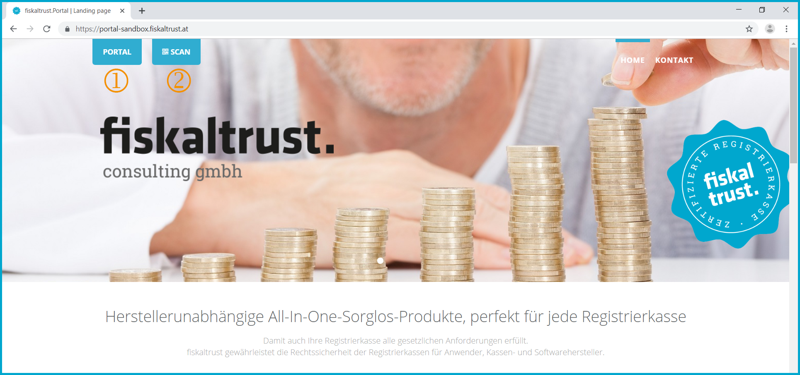

## fiskaltrust.Portal

**[https://portal.fiskaltrust.at](https://portal.fiskaltrust.at)**

Please note that various menus and functions presented in this manual are only visible and therefore available after the corresponding authorization has been assigned in the user administration.

The so-called _primary contact_ is the user who has all authorizations for a company and can therefore administer the authorizations.

### Homepage

**[https://www.fiskaltrust.at](https://www.fiskaltrust.at)**

The fiskaltrust.Portal (hereinafter ft.Portal) can be used free of charge by all partners and their PosOperators. It can be reached directly via the URL [https://portal.fiskaltrust.at](https://portal.fiskaltrust.at) or via the hyperlink on the homepage [https://www.fiskaltrust.at](https://www.fiskaltrust.at).

All PosOperators, PosCreators, PosDealers or consultants can easily manage the necessary functions for operating the cash registers via the ft.portal.

Screenshot-AT 1: Homepage | [https://www.fiskaltrust.at](https://www.fiskaltrust.at) with link to fiskaltrust.Portal

  By clicking on the hyperlink *LOGIN* on the homepage the ft.portal can be accessed.

The registration of a user and the company is explained in chapter "[Registration](registration-login.md#registration)".

### Landing Page

**[https://portal.fiskaltrust.at](https://portal.fiskaltrust.at)**

The Landing-Page is the welcome page of the ft.portal and can be accessed directly via the URL: [https://portal.fiskaltrust.at](https://portal.fiskaltrust.at).

Screenshots AT 2.1 and 2.2: Landing-Page of the ft.portal | [https://portal.fiskaltrust.at](https://portal.fiskaltrust.at)

 
The login or registration of a user in the ft.portal is initiated by clicking on 

 By clicking on  the function to scan receipts is activated. See chapter [Scanned QR-Codes](tools.md#scanned-qr-codes).

 **Text:** Connection partner

These PosCreators, PosDealers and consultants use the fiskaltrust.Service as well as the _All-In-One Carefree Products_.

As a PosCreator, PosDealer and consultant, you can voluntarily register in the list of ft.Partners via the ft.Portal. These companies will be added to the list [https://portal.fiskaltrust.at/public/filterpartners](https://portal.fiskaltrust.at/public/filterpartners) with their contact details.