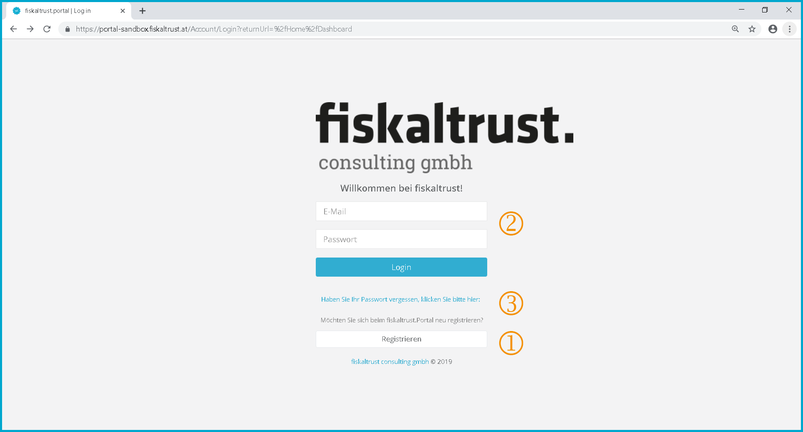
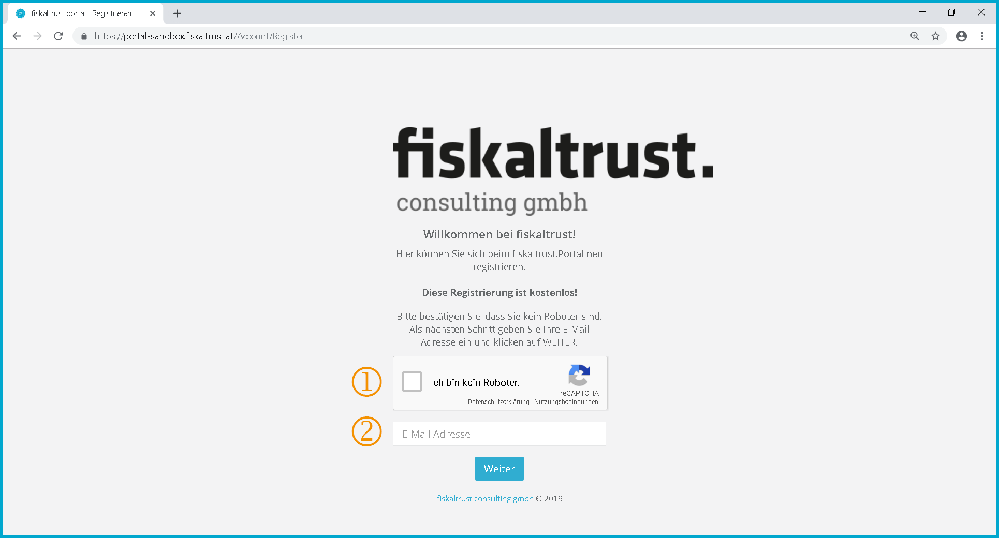
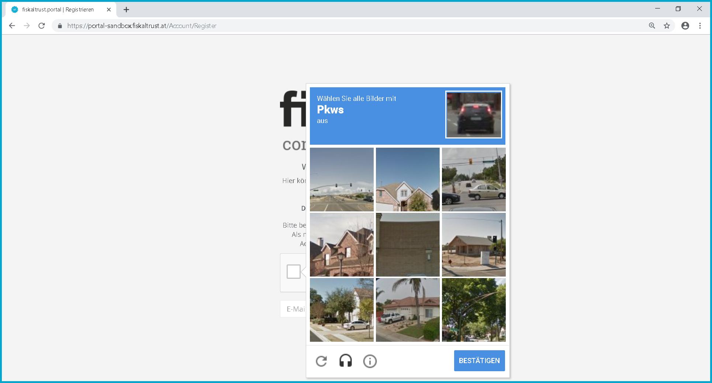
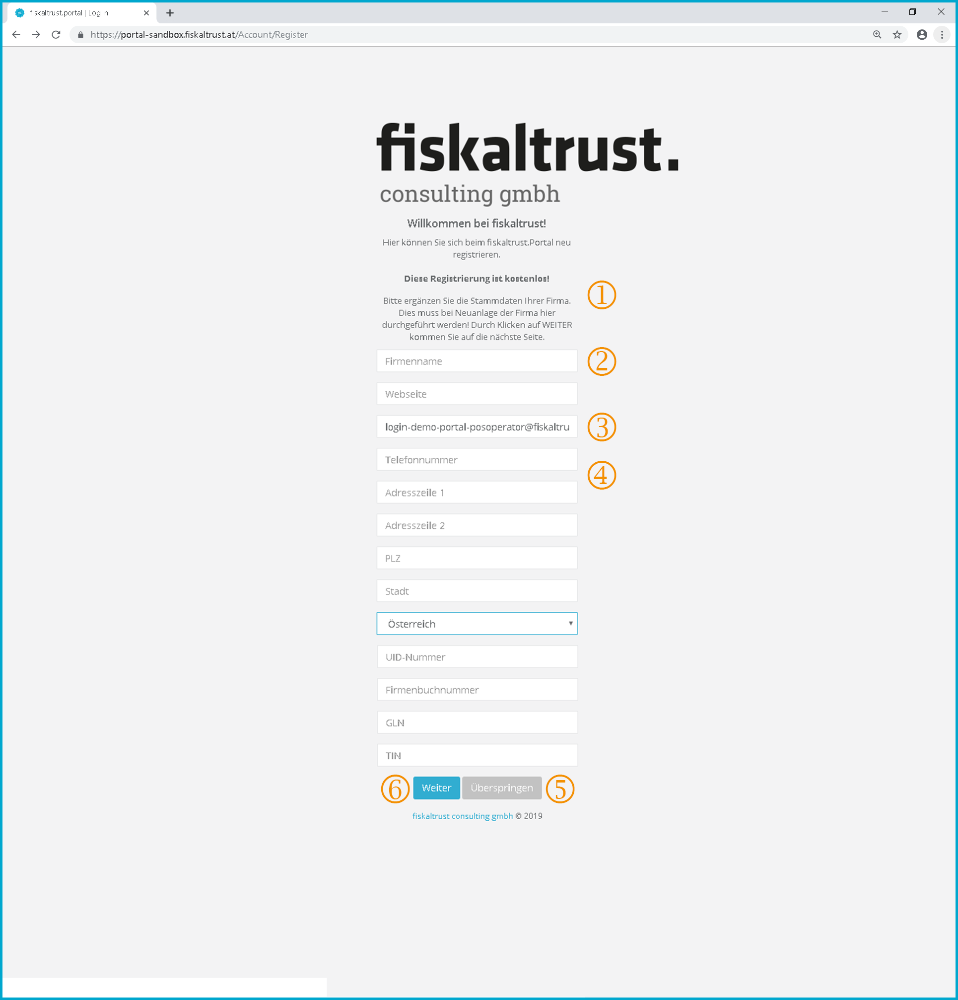
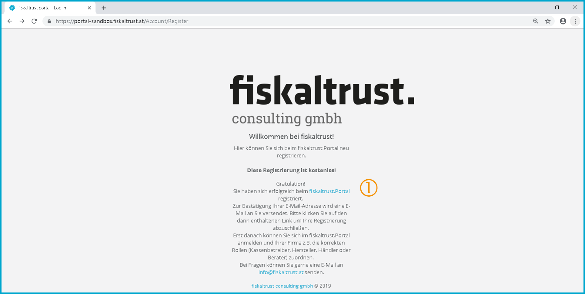
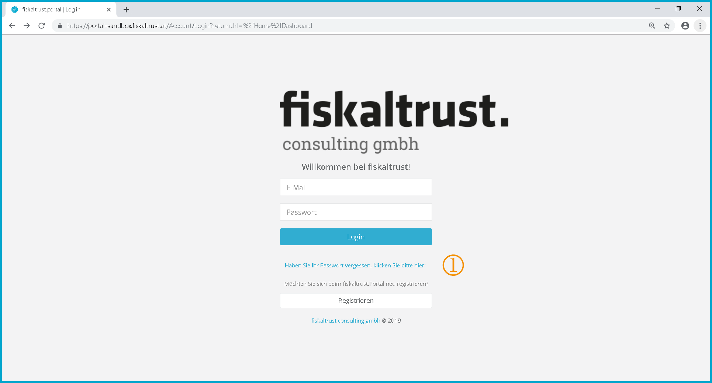
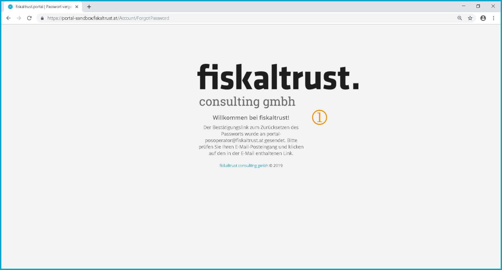

## User and company

### Registration and login

The login or registration of a user takes place after clicking on 

Screenshot-AT 3: Login, link for registration with ft.Portal and password reset | [https://portal.fiskaltrust.at/Account/login](https://portal.fiskaltrust.at/Account/login)

 If you are not registered as a user at the ft.Portal you can click [Register] without filling in the access data and get to the new registration.

 If you are already registered at the ft.Portal and therefore have an e-mail address and a password, you can login by filling in the access data and clicking on [Login]. All portal functions released for the respective user are then available. (see chapter "[Dashboard](dashboard.md)")

 If you have forgotten your password as a user, you can click on "*If you have forgotten your password, please click here:*". This will take you to the page where you can request a new password. (see chapter "[Reset password](#reset-password)")

#### Registration: User's Email address

The "Registration" at the ft.Portal is the first registration of a user, as well as the associated company (company).

This procedure is valid for all users who are to subsequently perform a function as PosOperator, PosCreator, PosDealer or consultant.

Screenshot-AT 4: Registration of a new user at the fiskaltrust.Portal | [https://portal.fiskaltrust.at/Account/Register](https://portal.fiskaltrust.at/Account/Register)

##### Enter Captcha

 The checkbox at _I am not a robot_ must be activated to show that there is a manual activity of a person and no automated access by a (web) robot.

Screenshot-AT 5: Example: Captcha prompt: "Select all images with cars".

Images are to be assigned to the corresponding objects. If necessary, you can request an audio task. (Info: [https://support.google.com/recaptcha](https://support.google.com/recaptcha))

 The e-mail address of the user must be filled in.

- This must be a valid email address.
- The e-mail address of a registered user may not be used.

Click on [Next]

##### Error messages after clicking on [Next]

- If the checkbox is not activated, the error message "Please execute the captcha!" is displayed.
- If the e-mail address of an already registered user has been entered, the following information page with the link for resetting the password will be displayed.

Screenshot-AT 6: Information page after trying to re-register an e-mail address that has already been registered.

 **Text:** "The e-mail address demo-portal-posoperator@fiskaltrust.at is already registered in the fiskaltrust.Portal. If you have forgotten your password, you can reset it using this link."

#### Registration: User

After entering the e-mail address, you will be asked to enter personal user data.

Screenshot-AT 7: Registration - User (contact)

 **Text:** "Welcome to fiskaltrust!
Here you can register at the fiskaltrust.Portal.

This registration is free!

Please choose a password (password must contain at least 6 characters, at least one upper and one lower case letter and at least one digit) to enter your personal data. Click on [Next] to go to the next page."

 Enter a self-selected password and repeat the password to confirm the correct entry, according to the specified syntax.

The fields "Password" and "Confirm password" are mandatory fields.

 Enter the personal data of the user.

The fields "First name" and "Last name" are mandatory fields. For example, you can enter an (academic) title after the name as a suffix.

 Read and accept the terms and conditions.

By clicking on "GTC" or "Privacy Policy", the GTC or the Privacy Policy will be opened in a new pop-up window of the Internet browser and must be read. After reading the general terms and conditions or the Privacy Policy, the pop-up window can be closed again.

By ticking the checkbox  to accept the GTC and Privacy Policy and clicking on , the contractual basis of the GTC is agreed between the user, the company and fiskaltrust consulting gmbh.

Screenshot-AT 8: GTC opened in a new tab. The text must be read and then accepted.

Screenshot-AT 9: Privacy Policy opened in a new tab. The text must be read and then accepted.

 Clicking on [Next] is only possible after filling in the mandatory fields and accepting the GTC and the Privacy Policy. Click on [Next] to go to the next page of the registration process.

The call up of the next page is to be waited for and can also take a longer time.

#### Registration: Company

After entering the user data, you will be asked to enter the firm (company) data.

Screenshot-AT 10: Registration - Company (firm) | [https://portal.fiskaltrust.at/Account/Register](https://portal.fiskaltrust.at/Account/Register)

 **Text:** "Please enter the master data of your company. By clicking on [Next] you will be taken to the next page."

 Enter the name of the company for which the user is registering. In the case of a sole proprietorship, the company name usually corresponds to the name of the sole proprietor.

The field "Company name" is a mandatory field. The company name is to be indicated as with the establishment of the enterprise.

 Since the user is created as the company's so-called "primary contact", the user's e-mail address has already been added to the company and cannot be changed.

 Enter the master data of the company. This master data can be changed later in the ft.Portal and is also the basis for the voluntary display to be released by the user in [https://portal.fiskaltrust.at/public/filterpartners](https://portal.fiskaltrust.at/public/filterpartners). (see chapter "[Overview of roles and contractual relationships](company.md#overview-of-roles-and-conctractual-relationships)")

The fields _Zip Code_ and _City_ are mandatory fields.

If the company has a _UID number_, it should be entered. This can be used to prevent that a company which was already created in the ft.Portal is created again and therefore duplicated.

 Since the subsequent registration of a company via the ft.Portal is currently not possible, the click should only be made if the user is to become active as an employee of an already registered company!

At present the administration of all necessary functions can be carried out by the ft.Team. We are gladly available at [info@fiskaltrust.at](mailto:info@fiskaltrust.at).

It is possible for a user to be assigned to a company as an employee. It is not possible for a user to be deleted by the user via the ft.Portal you can only remove all access rights of a user.

Only an existing connection of a user to a company can be disconnected.

 If you click on [Next], the next page of the registration process will only be opened after the mandatory fields have been filled out. The call up of the next page is to be waited for and can take also longer time.

#### Registration: Confirmation of data entry

The entry of the master data is completed with this information page.

Screenshot-AT 11: Information page for the completion of master data entry

 **Text:** "Congratulations!

You have successfully registered with the fiskaltrust.Portal.

An email will be sent to you to confirm your email address. Please click on the link contained therein to complete your registration. Only then can you log on to the fiskaltrust.Portal and assign the correct roles to your company (e.g. PosOperator, PosCreator, PosDealer or consultant).

If you have any questions, please send an e-mail to [info@fiskaltrust.at](mailto:info@fiskaltrust.at)".

##### Registration: Exception - Company is already created in fiskaltrust.Portal

If the company was already created in the ft.Portal during registration and was found by the entered master data, the user is informed.

Screenshot-AT 12: Information that a company with the same master data was found.

The comparison is made on the basis of the stored master data. (Order: UID number, postal code, city, name, ...)

Since it is currently not possible to subsequently enter a company in the portal, only click on if the user is to become active as an employee of a company!

The administration of various administrative functions can be carried out by the ft.team. We can be reached at [info@fiskaltrust.at](mailto:info@fiskaltrust.at).

It is possible for a user to be assigned to a company as an employee. It is (currently) not possible to delete a user.

#### Registration: Confirmation of Email address

Registration must be completed with confirmation of the e-mail address used.

Screenshot-AT 13 - Example: Confirming your email address

 **Text:** "To complete the registration, process with this e-mail address and log into [https://portal.fiskaltrust.at](https://portal.fiskaltrust.at), please click on the following link and log in with your access data (e-mail address and self-chosen password)".

 By clicking on the word "*click*"  or on the visible link  the portal is called up. By using the coded link the portal recognizes that this link was assigned for the confirmation of the e-mail address of the user and/or the company. This releases the user's e-mail address for the ft.Portal.

Now it is possible to log in with the newly created user data (e-mail address and personal password).

The link sent in the e-mail is only valid for a maximum of 24 hours. When this time has expired, the link must be opened and the password must be entered. This will send a new email confirmation.

#### Confirmation of Email address register organization account

After clicking on the link in the confirmation e-mail, an information page will be opened.

Screenshot-AT 14: Information page after calling the confirmation link

By clicking on "this link" the login page of the ft.Portal will be opened. (see chapter "[Login](#login)")

##### Exception: Activation link has expired or is invalid

If the activation link from the e-mail confirmation for the registration of a user has not been called up correctly (by click) within approximately 24 hours after sending, this activation link expires. An incorrect activation link can also clearly not lead to a confirmation of the e-mail address. If an expired or invalid activation link is called up, an information page is opened.

Screenshot-AT 15: Password assignment after calling up an activation link

A new password can be assigned on this page. This new password has to be used immediately for the login of the user. Before clicking on [Next] the "*GTC* *and the Privacy Policy*" you have to click on them and accept them by activating the check box.

If the activation link has expired, the password cannot be assigned and the following page appears:

Screenshot-AT 16: Information page: expired or invalid password reset link

 **Text:** "Unfortunately this confirmation link has expired. We have now generated a new link and sent it to you by E-Mail."

If you do not receive the e-mail with the confirmation link - e.g. because you do not have access to the e-mail account - you can contact [info@fiskaltrust.at](mailto:info@fiskaltrust.at).

### Login

Screenshot-AT 17: Login of a user

### Reset password

If the user forgets his password, this function can be used to reset the password.

Screenshot-AT 18: Login page with the link to reset password

 **Text:** "If you have forgotten your password, please click here:"

Screenshot-AT 19: Captcha to check whether the function is called by a person.

 **Text:** "If you have already registered your email address, we can email you a password reset link. Enter your e-mail address and click on [send link].

 For the correct execution of the captcha check see chapter [Enter Captcha](#enter-captcha)

Screenshot-AT 20: Information that an email was sent with a confirmation link to reset the password.

 **Text:** "The password reset confirmation link has been sent to *Email address*. Please check your e-mail inbox and click on the link contained in the e-mail".

Screenshot-AT 21: Email with a password reset link.

If the password reset link from the user registration confirmation email has not been called up correctly (by click) within 24 hours of sending, this activation link will expire. If an expired or invalid activation link is called up, an information page is opened.

The procedure for the new login begins anew (see chapter [Exception: Activation link has expired or is invalid](#activation-link-has-expired-or-is-invalid))

If you do not receive the e-mail with the confirmation link - e.g. because you do not have access to the e-mail account - you can contact [info@fiskaltrust.at](mailto:info@fiskaltrust.at).

### Logout

The logout from the active session takes place after a timeout or can be performed manually.

Screenshot-AT 22: Page detail - Menu structure Log off

[https://portal.fiskaltrust.at/home/dashboard](https://portal.fiskaltrust.at/home/dashboard)

You can log out by clicking on the text "Sign out *E-Mail address*".

 Alternatively, you can log out by clicking on the company name or the user name and then clicking on the menu item  "Logout".

After logging out, the landing page is called up. [Landing Page](portal.md#landing-page)