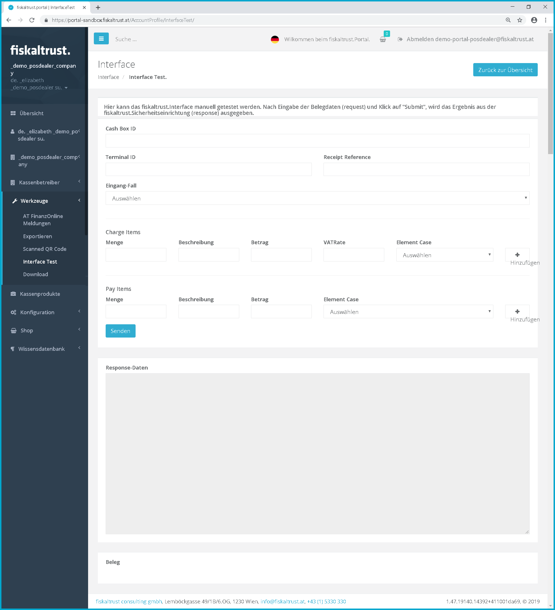
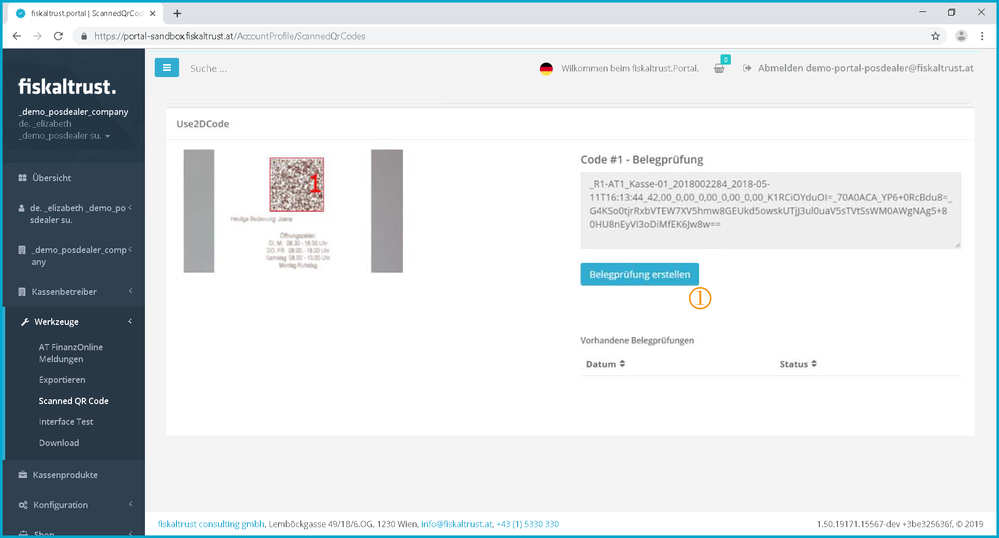

## Tools

:::danger **No maintenance anymore**

These manuals are no longer maintained! 

In case of any questions, we encourage you to refer to our current [fiskaltrust Documentation Platform](https://docs.fiskaltrust.cloud).  
For further details, check the corresponding Knowledge Base Articles (KBA), which can be found on the fiskaltrust.Portal.

:::

### Export

Screenshot-AT 80: Queue export

If the POS-System is configured with an ft.Product to send the data to the ft.Portal, the data can be exported via the ft.Portal.

Check the store for products, that contain the legally required online storage via the ft.Cloud.

By clicking on \[create new export\]  you can access the overview of the Queues. For further information see chapter "[Configuration - Queue](configuration.md#queue)"

### Interface test

Screenshot-AT 52: Interface Test

### Scanned QR codes

Scanned QR codes are displayed here.

First, the required receiptss must be scanned from the portal's homepage [https://portal.fiskaltrust.at](https://portal.fiskaltrust.at).

Screenshot-AT 53: Scanning a receipt via the ft.Portal

 Click on  to activate functions for scanning receipts. This is only possible if the computer system you are using has a camera (webcam) installed.

 By clicking on the (large) image, the QR code can be photographed from a receipt. Then you can see the just created photo as a small icon under the big picture.

Only if a QR code is recognized, the image stops, otherwise it disappears again after a few seconds.

 A recognized QR code is marked with a red frame and can be transferred to the portal for further processing by clicking on the small image. To do this, you must log in to the portal with an existing login.

Thus a start or yearly receipt can be processed automatically in the ft.Portal afterwards.

Now the scanned receipt can be viewed in the portal under "Scanned QR Codes".

Screenshot-AT 54: Scanned QR codes

 Here you can see the preview of a scanned receipt

 Click on  to open the respective receipt for further processing.

Screenshot-AT 55: Create receipt check

 Click on \[Create receipt check\] to start the receipt check.