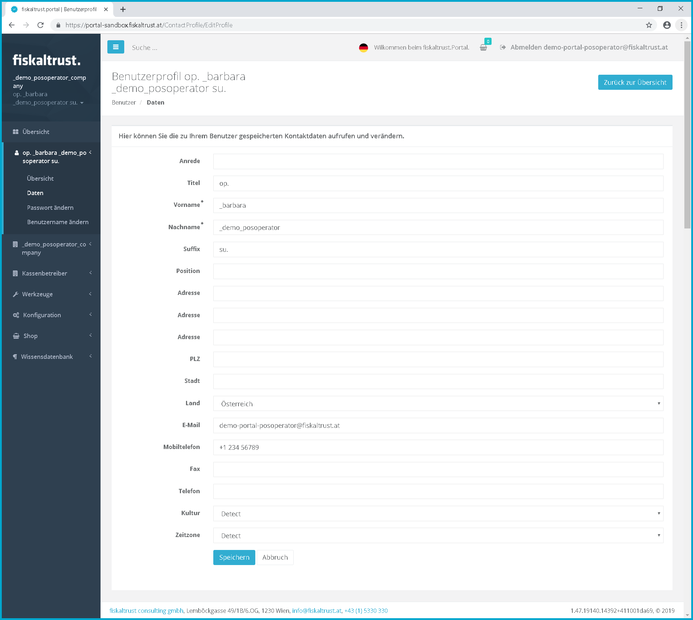
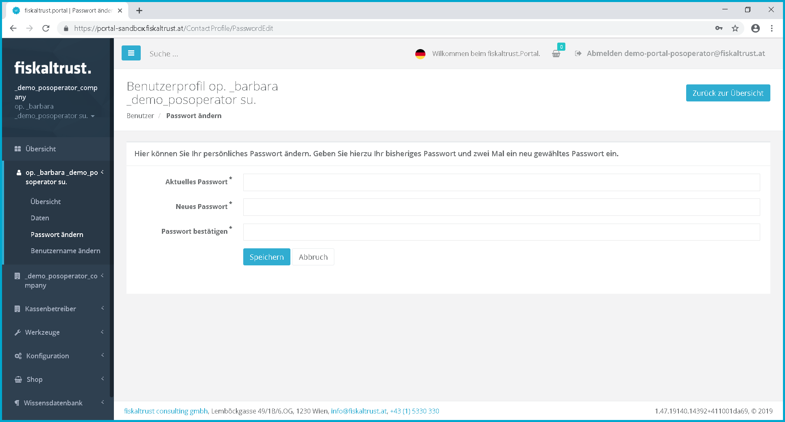

### User

:::danger **DEPRECATED**

The Portal manual is no longer maintained. For the latest documentation, please refer to the PosDealer or PosCreator section of this site.  

In case of any questions, we encourage you to refer to our current [fiskaltrust Documentation Platform](https://docs.fiskaltrust.cloud).  
For further details, check the corresponding Knowledge Base Articles (KBA), which can be found on the fiskaltrust.Portal.

:::

#### Overview

In this menu area the master data of the user can be changed.

Screenshot-AT 25: User overview

 By clicking on *user name* the function menu for users is opened.

 By clicking on *user name* the function menu for the menu items "*Overview*", "*Data*", "*Change password*" and *"Change user name "* can be called up.

#### User data contact

The user master data can be displayed and changed here.

Screenshot-AT 26: User - Edit master data

Fields marked with a sterisk ("__\*__") are mandatory. The more master data is entered, the easier it is for other users to find the user in the ft.portal. This is useful, for example, when assigning the user to an existing company as an employee.

#### User change password

Screenshot-AT 27: Change user login password

With this function you can change your own password. To increase data security, we recommend that you change your password at regular intervals.