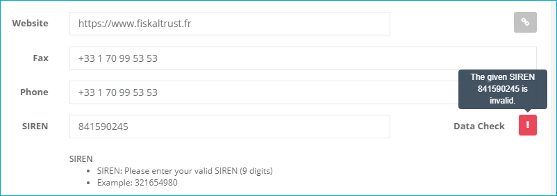

### Company

A click on the company's name in the left sidebar opens the menu with the commands to manage all of the company related data.

#### Overview of the company

Company overview, roles and API-Access

After opening the menu with a click on the <kbd>company name</kbd> the roles of the company can be changed with the command <kbd>Overview</kbd>. Furthermore, the keys for the API-Access can be retrieved or reset.

##### Credentials

 The `CashBoxId` and the `AccessToken` are necessary to gain access to a CashBox and transfer the receipts into the queue.

 The <kbd>[Reset]</kbd> button creates a new AccessToken in case the old one got compromised.

 <kbd>Reset</kbd> the database connection string to the standard value.

 <kbd>Reset</kbd> the storage to the standard value.

##### Roles

In this section all active roles of the company are listed.

##### Assign further roles to your company

This section enables or disables the following roles

* <kbd>PosOperator</kbd> 
* <kbd>PosDealer</kbd> 
* <kbd>PosCreator</kbd> 
* <kbd>Consultant</kbd> 

 The switch for <kbd>Partner</kbd> activates the account to be shown in the public partner list on the website [fiskaltrust.fr](https://fiskaltrust.fr/partenaires).

By clicking on one of the assigned switches, the role can be activated. With this action, a contract has to be signed.

Enabling role

Enter the first and last name in the field `Signatory`. By activating the checkbox the _Terms and Conditions_ and the _Privacy Policy_ of fiskaltrust must be accepted. To read them entirely the link on the words can be clicked.

A click on the Button <kbd>[Sign]</kbd> activates the role and signs the contract. For this an email with the contract as an attachment and the confirmation of the new role is sent to the active user.

Email with contract for the enabled role

##### Download contract

Download contract

The contract - if not received or missing - can be downloaded with the hyperlink beneath the name of the role.

##### Deactivating a role

Clicking on an active switch disables the role. By disabling a role, all associated functions are deactivated too. If the role <kbd>PosOperator</kbd> is disabled and there are active POS-Systems, these are not secured from this moment on.

Deactivating Role

For deactivating a role it is mandatory to enter the first and last name again. This can be done in the field `Signatory`. With a click on the button <kbd>[Sign]</kbd> the selected role gets deactivated immediately. As confirmation, an email with the resigning contract as attachment is sent to the active user.

Email when deactivating a role

#### Master data

Edit the master data of a company

For editing the data of a company the<kbd>company menu</kbd> has to be opened and afterwards the command <kbd>Master data</kbd> has to be activated.

All mandatory fields are marked with an asterisk (*) after the name. For preparing the fiskaltrust.SecurityMechanism, the usage of the fiskaltrust.Middleware and to be compliant with the law the `SIREN` and the `UID number` have to be entered and saved with the button <kbd>[Save]</kbd>.

**One of the two commercial number fields has to be completed and checked in order to use the fiskaltrust.SecurityMechanism according to the French laws.**

##### Pass SIREN data check

The SIREN is an unique identifier for French companies, fiskaltrust uses this number as identifier for companies too. This 9-digit-number has to be entered in the field and afterwards a click on the <kbd>Data Check</kbd>-button on the right side of the field has to be performed.

Passed data check for a SIREN

If a correct SIREN is entered the data check returns a positive result and the button turns to green with a checkmark inside. By hovering over the checkmark button, information about the result is shown. After this the data-field for the SIREN is set as read-only and the SIREN can no longer be changed for this account.

The check of the SIREN is done against the commercial register of France. The enterprise has to be registered there and be active. If the company is newly founded the registration in the public database can least up to five days. Furthermore the company name entered in the first field has to match the one in the commercial register in order to perform a positive check.

###### Invalid SIREN

By entering an invalid SIREN, like a wrong digit or not exact nine digits, the check cannot be performed and the following error message is shown.

Data check for a SIREN with invalid number

###### Wrong SIREN

By entering a valid SIREN from an other company the check fails and the following error message is shown.

Data check for a SIREN from another company

###### Wrong company name

By entering a valid SIREN with a company name does not match, the check fails and the following error message is shown. Check that the company name is not case sensitive but the name matches exact the one in the commercial register.

Data check for a SIREN with a wrong company name

##### UID data check

The UID number is the unique identifier of the company assigned by the French fiscal authorities. If the company has no SIREN, than this number is mandatory in order to use the fiskaltrust.Middleware according to the French laws. This number has to be entered in the field and afterwards a click on the <kbd>Data Check</kbd>-button on the right side of the field has to be performed.

##### UID data check passed

Passed data check for an UID

If a correct UID number is entered the data check returns positive, the button turns to green with a checkmark inside. By hovering over the checkmark button, information about the result is shown.

The check of the UID number is done against the official service offered by the European Union. The company has to be active and the number has to have been assigned for more than seven days. Furthermore the entered company name in the first field has to match the one in the files of the financial authorities of France in order to perform a positive check.

For a correct UID check in France the company's address has to be in France (the field `Country` contains <kbd>France</kbd> as value) and the UID has to start with the two letters <kbd>FR</kbd>.

##### Invalid UID number

By entering an invalid UID number, like a wrong digit or not the exact format, the check cannot be performed and the following error message is shown.

Data check for a UID with invalid number

##### Wrong UID number

By entering a valid UID from an other company the check fails and the following error message is shown.

Data check for a UID from another company

##### Wrong company name

By entering a valid UID and a company name does not match, the check fails and the following error message is shown. Check that the company name is not case sensitive and matches the one in the files of the financial authorities.

Data check for a UID with a wrong company name

#### Sales area

This section is only available for fiskaltrust.Portal users with the role _PosDealer_. By checking the boxes before the named areas the company is shown in the public list of fiskaltrust.Partners on https://portal.fiskaltrust.fr/public/FilterPartners.

Select sales areas for partners

#### Outlets

Before starting with the [configuration](configuration.md) of the fiskaltrust.SecurityMechanism, at least the primary outlet must be completely configured.

List of outlets

For this the outlet management in the company menu has to be opened.

Right after the registration as new PosOperator there is one outlet, the so called _Primary Outlet_ or headquarter, listed. By clicking the <kbd>[Edit Primary Outlet]</kbd>-Button on the outer right of the line this outlet must be updated. Additionally outlets added can be edited with the <kbd>[Edit]</kbd>-Button

Edit an outlet

In the outlet management, all mandatory fields are marked with an asterisk. Further on the following field should be filled out and/or checked.

The `Name` identifies the outlet in all lists used in the fiskaltrust.Portal. This field is only for internal use and helps you to identify the outlet. The `Outlet number` is an internal number for the fiskaltrust.Portal. But the number has to be an integer and unique for each outlet in the active account. With this identifier the [CashBox](configuration.md#Cashbox) can be connected to the outlet.

The field `SIRET` in France, contains the SIRET of the outlet. To use this field correctly the SIREN of the company has to be saved upfront in the [<kbd>Master Data</kbd>](#company-master-data). The first 9 digits of the SIRET are exactly the SIREN, the following four digits are a given number from the French authorities and the last digit is a checksum. All 14 digits must be entered here and afterwards a <kbd>Data Check</kbd>has to be done. This check acts exactly like the [SIREN Data Check](#siren-data-check-passed) in the <kbd>Master Data</kbd>. Therefore, be able to use the outlet for a CashBox this data check has to be returned positive.

The fields shown at  `Address`, `Postal code` and `City` are not mandatory by the fiskaltrust.Portal but should be completed. For a control by the financial authorities this can be proof of correct data management. Further on this field can be used from the fiskaltrust.Middleware to print the outlet's address on any receipt.

Once all data is completed and the data check performed positive the outlet data can be sent to the storage with the <kbd>[Save]</kbd>-Button.
