## Configuration

Before starting with the configuration, the master data of the enterprise and the outlet has to be completed and checked. For this see chapter [_Master data_](company.md#company-master-data) and [_Outlets_](company.md#outlets)

### CashBox<a name="Cashbox"></a>

#### Creation of a CashBox

[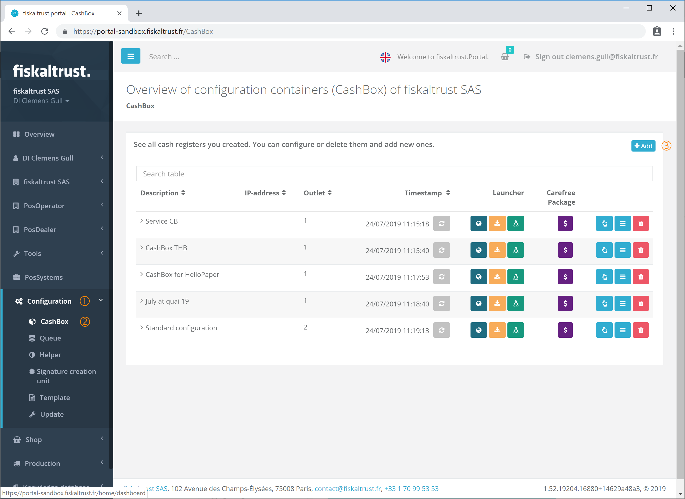](http://portal.fiskaltrust.fr/CashBox)
Creating the configuration containers

By opening the menu _Configuration_ and clicking on _CashBox_ the overview of all configured CashBoxes (configuration containers) is shown.
Click on [+&nbsp;Add] to create a new configuration container.

#### Add a CashBox

[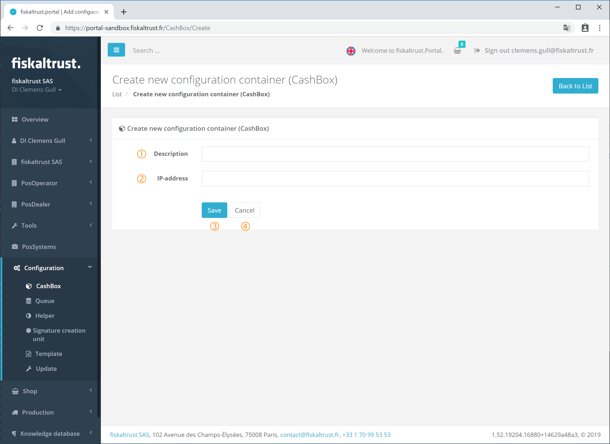](http://portal.fiskaltrust.fr/CashBox)
Configuration container - Add

 In this field, you can change the name of the configuration container. It should be unique so a CashBox can be identified in even a long list.

 If you are working in a network mode, enter the IP address of the endpoint here.

 Click on \[Save\] to save the changes to the configuration container ad go back to the overview.

 Clicking \[Cancel\] cancels the operation without saving the changes and show the overview.

#### Overview first CashBox<a name ="overview-firstcashbox"></a>

[](http://portal.fiskaltrust.fr/CashBox)
Overview - First configuration container

 After creating a CashBox, it is initially empty, it only has the _CashBoxID_ and the _AccessToken_ which are required to access the CashBox. It can be seen by opening the information section by clicking on the chevron on the beginning of the line.

 This area shows all the assigned queues, helpers and SCUs for the configuration container. Since the CashBox has just been created and nothing is stored yet, the fields are empty.

 By clicking on  you can download the _dotnet Launcher_. This must be used if there is an internet connection to the POS-System.

 The _dotnet useOffline Launcher_ should be used if no internet connection can be established. This can be downloaded by clicking on .

 For using the fiskaltrust.Middleware with a MacOS or Linux system the _mono useOffline Launcher_ is needed. It can be downloaded by clicking on . This is set to _useOffline_ by default.

 The CashBox can be edited with a click on  by Drag & Drop.

 The CashBox can also be edited in a list view by clicking on .

 By clicking on  an empty configuration container can be deleted.

#### Edit CashBox by Drag & Drop

[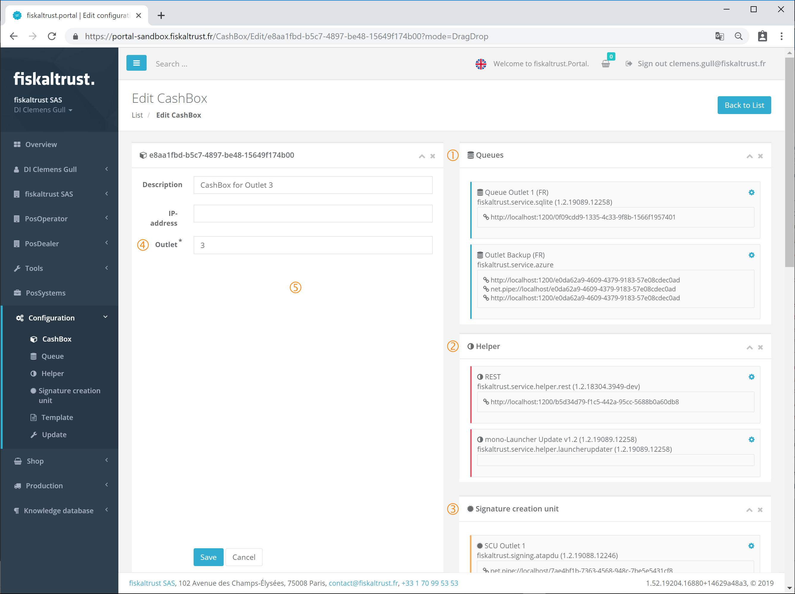](http://portal.fiskaltrust.fr/CashBox)
Edit CashBox by Drag & Drop

 The first widget shows all the created queues in this account. This corresponds to a data acquisition protocol and therefore a POS-System.

 The second widget shows all created Helpers, which can be used in a CashBox. For further information see chapter [_Helpers_](../handbook-general/configuration.md#helper).

 The last widget contains all the SCUs created in this account and can be used in a CashBox, further information can be found in chapter [_Signature creation unit_](#SCU).<br />A SCU must not be directly associated to a CashBox. Because the configuration container has a connection to the outlet and the SCU is coupled to an outlet, a loose coupling exists between them. It is essential for legal compliance to use the same outlet number in the SCU-configuration and the CashBox-configuration.<br />This loose coupling enables the usage of a single SCU for more than one queue in the **same** outlet.

 The field _Outlet_ is mandatory and must contain the number of a valid outlet. For further information see chapter [_Outlets_](company.md#outlets).

 This field contains the active CashBox. Using Drag & Drop, units from the three widgets on the right side can be integrated in this CashBox.

Clicking on \[Save\] stores the changes to the configuration container.

#### Edit CashBox by List

Furthermore, the CashBox can be edited via a list.
[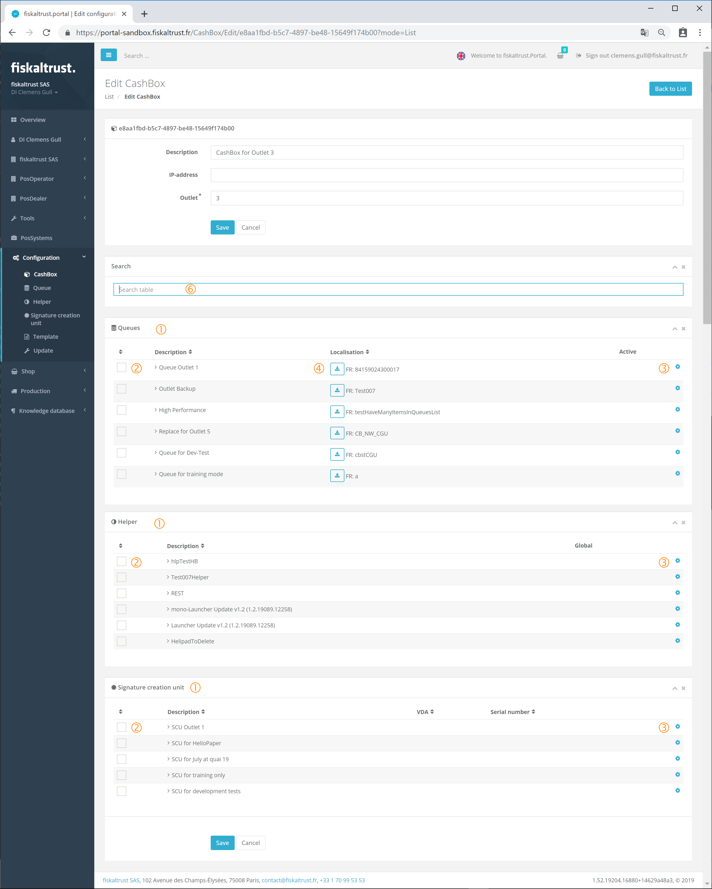](http://portal.fiskaltrust.fr/CashBox)
Edit CashBox by list

 The list view is divided into three sections showing the available objects (_Queues_, _Helper_, _Signature Creation Unit_).

 The required objects can be added to the cashbox by ticking the checkbox at the beginning of the row.

 Click  on the ending of a row to display the settings for each object.

 Each Queue owns a certificate from a SCU for signing all the data send to it. With the button  the certificate of a assigned SCU can be downloaded and verified.

 For filtering all the tables/sections in this window at least 3 characters have to be entered.

#### Ready configured CashBox

[](http://portal.fiskaltrust.fr/CashBox)
Ready configured CashBox

 By clicking on \[+ Add\] you can create a new configuration container (CashBox).

 In the section _Queues_ the deposited POS-System identification number (_CashBoxID_) as well as the automatically generated AES-key (Base64 encryption) (_AccessToken_) can be found.<br /> By clicking on  the configuration of the queue can be edited.

 In this section the connected helpers as well as the package name and version is shown. By clicking on  each helper can be configured in its own window.

 The connected signature creation units can be displayed here. But it is not necessary to connect a CashBox one-to-one to a SCU. Because a SCU can be used more than once for an outlet there is a loose connection between SCU and CashBox.

#### Delete a CashBox

For legal reasons it is currently not possible to delete a CashBox. However, there is one exception, that if the CashBox was not yet in use and is completly empty, it can still be deleted.

Before deleting a CashBox it has to be ensured that all elements from the configuration container are removed. Removing the element from the CashBox does not delete them, they are only put back in the general section for further use.<br />If a CashBox is not empty it can not be deleted.<br />By deleting a CashBox only the wrapping configuration container gets removed from the system. No data, certificate, queue, archives or anything else is touched or deleted.
[](http://portal.fiskaltrust.fr/CashBox)
Delete CashBox

#### Download Launcher

[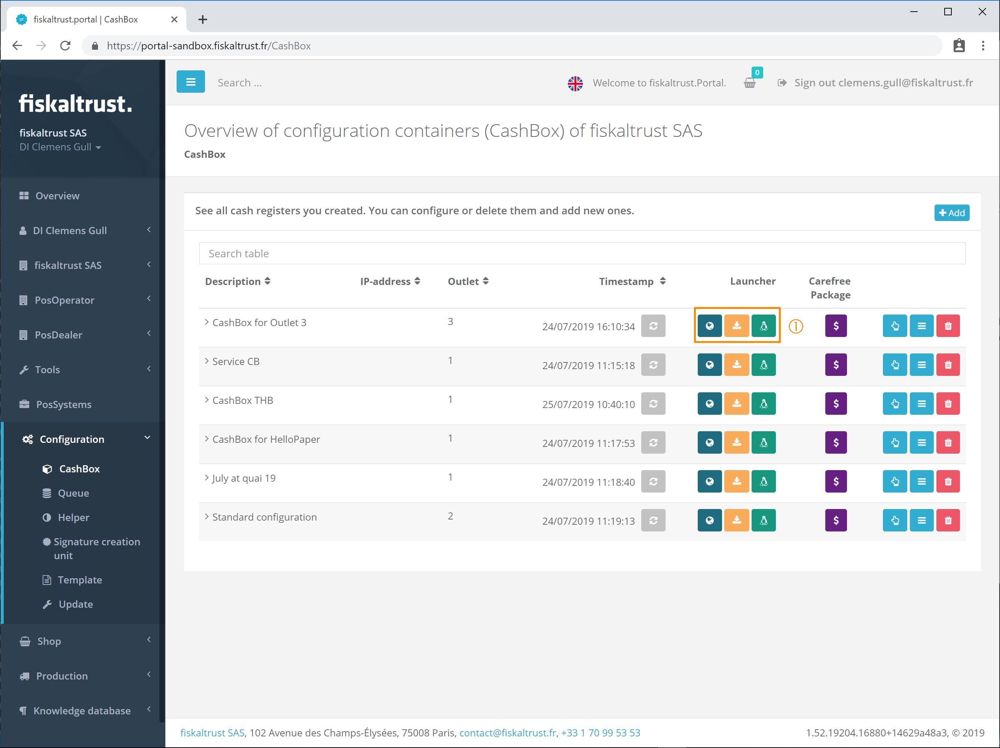](http://portal.fiskaltrust.fr/CashBox)
Download Launcher

 By clicking on one of these buttons, the launcher needed for commissioning is downloaded. This is a ZIP file that you download into the download folder. The zip-file can be founded in the local download-folder and extracted there for further use on a POS-System.
Be aware, that after changement in the configuration the \[Rebuild\]-button should be click before a launcher is downloaded.

For further information see chapter [Overview first CashBox](#overview-firstcashbox)

### Queue<a name="queue"></a>

[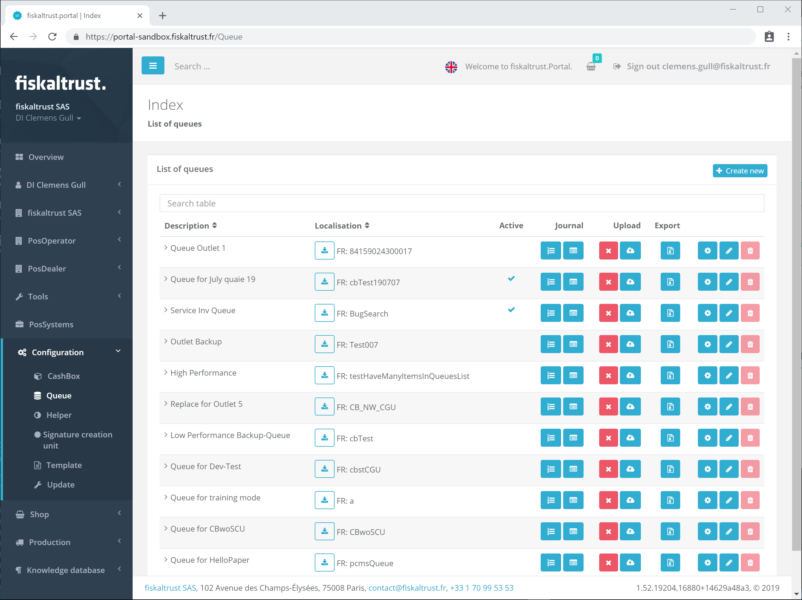](https://portal.fiskaltrust.fr/Queue/)
Overview of queues

To get to the creation and _Configuration_ of a queue, click on the menu item _Queue_.

To find a specific queue, a text can be entered in the search field. Starting with the second entered character, the table beneath gets filtered automatically.

A click on the button _+&nbsp;Create new_ adds a new queue to the account.

#### Add a queue<a name="add-a-queue"></a>

[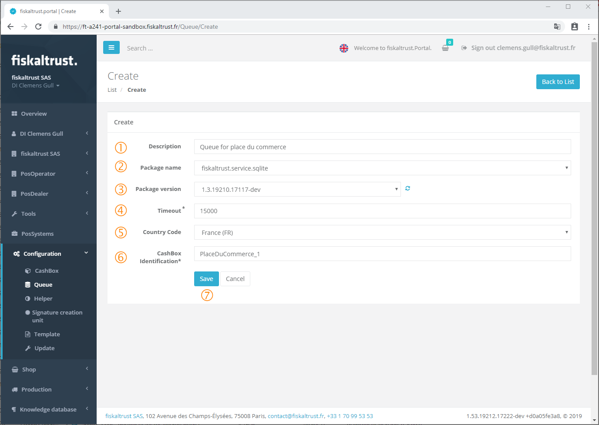](https://portal.fiskaltrust.fr/Queue/)
Queue - Adding

 This field, holds the name of the queue. It can be anything which helps to identify each single queue in the account.

 The appropriate storage method depending on your operating system can be selected. This value cannot be changed after the creation of the queue.

 The package version can also be selected using a dropdown menu. For updating the package version a click on  is mandatory.<br />**To configure the POS-System with a law compliant fiskaltrust.Middleware the correct package has to be selected. The certified version for the used POS-System, is written on the certificate. Your PosDealer or PosCreator knows which version is certified and must be used.**

 Sets a timeout in milliseconds for the connection attempt with the signature creation unit.

 The country in which the queue is used can be selected in this dropdown list. This value can not be changed after creation of the queue.<br />**For a law compliant configuration _France (FR)_ has to be chosen.**

 This identification value has to be unique in the account. This value can not be changed after creation of the queue.

 The \[Save\]-button creates the queue and stores it.

#### Queue configuration<a name="configure-a-queue"></a>

The configuration has to be done directly after the creation of a queue. Nevertheless it can be changed afterwards with the  button in the queue overview.

[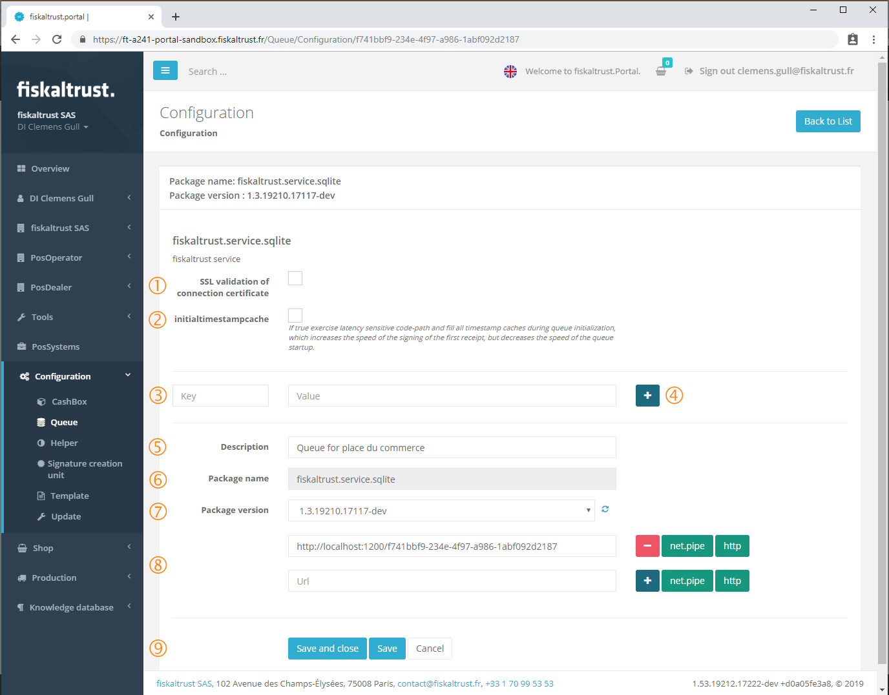](https://portal.fiskaltrust.fr/Queue/)
Queue configuration

 This box can be ticked to activate the verification of the connected certificate.

 Activating this option speeds up the signing of the first certificate, but slows down the queue starting.

 This line gives the possibility to add a key-value-pair to the configuration of the queue.<br /> The  button adds another line for a new pair and the  button removes the line from the configuration.

 The name of the queue can be changed in this field.

 The type of storage can only be defined upon queue creation and can not be changed later on.

 The package version can also be selected using a dropdown menu. For updating the package version a click on  is mandatory.<br />**To configure the POS-System with a law compliant fiskaltrust.Middleware the correct package has to be selected. The certified version for the used POS-System, is written on the certificate. Your PosDealer or PosCreator knows which version is certified and must be used.**

 The URL to access the queue can be defined in this field. By clicking on  a URL is used, which is suitable for local use without internet connection, because no firewall settings are required. By clicking on , the system generates a URL with which the POS-System can access the queue. The URL can be renamed, to have it like this: [http://localhost:1200/Queuefiskaltrust]().<br />The  button adds another line for a new URL and the  button removes the URL from the configuration.

 \[Save\] or \[Save and close\] saves the configuration of the queue (and closes the configuration module).

#### Queue overview<a name="queue-overview"></a>

By opening the _Queue_-Module in the _Configuration_-menu an overview from all created queues are shown.

[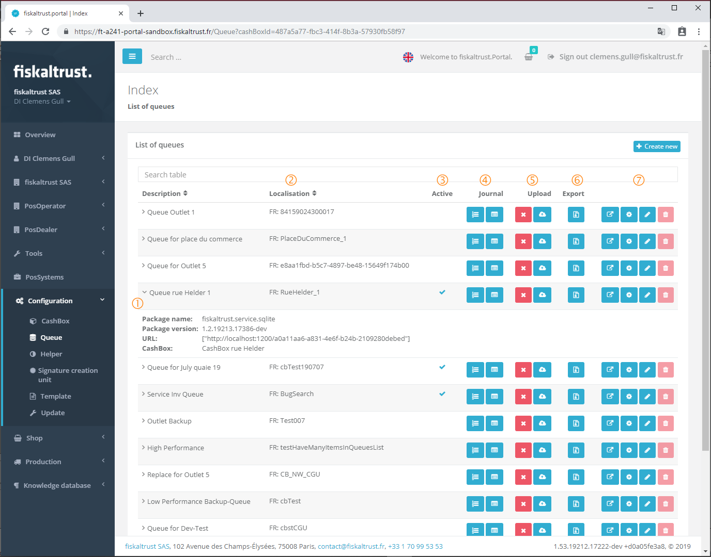](https://portal.fiskaltrust.fr/Queue/)
Queue overview

 Clicking on the _chevron right_ shows the base information for this queue and the used CashBox, if already configured.

 This column shows the localisation (for which country the queue is used) and the _CashBox identification_.

 The third column contains a checkmark  when the queue is activated. A _start receipt_ has been sent and the queue is ready to sign and chain receipts or already contains some receipts.<br />If this column is empty no start receipt has been sent or a _stop receipt_ was sent and the queue does not accept any receipts for chaining and signing.

 A queue contains two type of journals. Both of them are chained and secured against changes and contain already transmitted receipts.<br />By clicking on  all transmitted receipts are displayed in a list, see chapter [_ReceiptJournal of a queue_](#receiptjournal-of-a-queue).<br />By clicking on  all important actions and status changes of the queue are shown in a list, see chapter [_ActionJournal of a queue_](#actionjournal-of-a-queue).

 To stop the transmission from the local POS-System to the queue the  button can be clicked. Starting from this moment the queue does not save any receipt in the cloud. With  the queue receives all the untransmitted receipts from the moment the button is clicked. This can be take several days because the check for missing receipts is started by the first receipt saved in the local queue.

 The queue export can be started by pressing the button . For further information see chapter [_Export a queue_](#export-a-queue).

 The last column contains the commands to manage a queue.<br /> By clicking on  the connected SCUs can be displayed and managed. For further information see chapter [_SCUs used by a queue_](#scus-used-by-a-queue).<br />Here the configuration of the queue can be opened by clicking on , see [_Configure a queue_](#configure-a-queue).<br />Clicking on  edits the description, package version and timeout of the queue, see [_Edit a queue_](#edit-a-queue).<br />Clicking on  deletes the queue. However, the button for deleting the queue **is inactive for legal reasons**, so no queue can be deleted after creation. The possibility to delete a queue does not depend on the status or the content of a queue. Once created no deletion is possible. 

[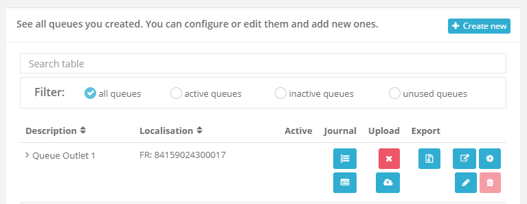](https://portal.fiskaltrust.fr/Queue/)
Filter the list of queues

With a large list of configured queues the overview can be hard. For this the view can be filtered by status of the queue by a click on the corresponding radio button.

#### SCUs used by a queue<a name="scus-used-by-a-queue"></a>

[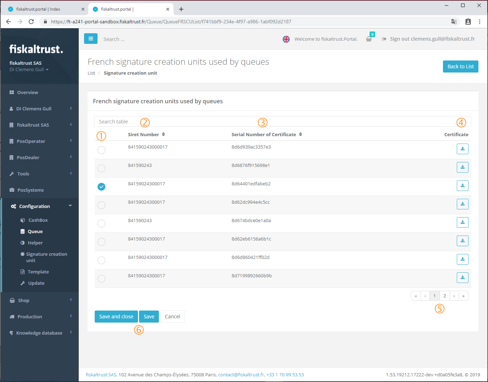](https://portal.fiskaltrust.fr/Queue/)
Queue - Connected Signature Creation Devices (SCU)

 By setting a check mark the SCU to be connected to the queue is selected.
 The SIRET of the attached outlet to the SCU is shown.
 Shows the serial number of the certificate used by this SCU.
 With the button  the certificate of the SCU can be downloaded.

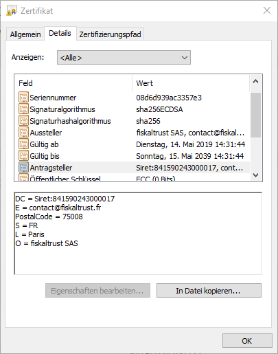
Detail of a certificate

The content of the certificate can verified with a double click on it.

#### Edit a Queue<a name="edit-a-queue"></a>

[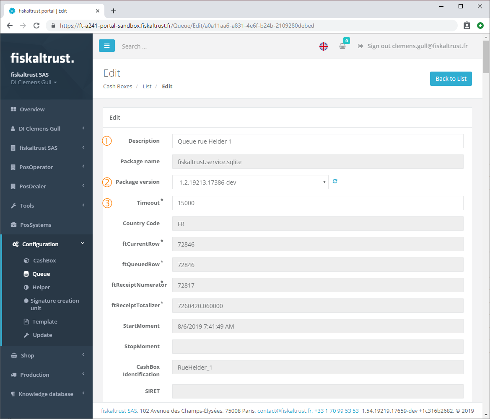](https://portal.fiskaltrust.fr/Queue/)
Edit a queue

 The name of the queue can be changed with this field.

 Various package versions can be selected by using the drop-down menu. These can be updated by clicking on . To take this change in effect on the POS-Systems, this has to be restarted.<br />**To configure the POS-System with a law compliant fiskaltrust.Middleware the correct package has to be selected. The certified version for the used POS-System, is written on the certificate. Your PosDealer or PosCreator knows which version is certified and must be used.**

 Sets a timeout in milliseconds for the connection attempt with the signature creation unit.

All other values shown on the page are read-only and cannot be changed. This value shows the current state of the queue and the saved counters of the different receipt types.

At the bottom of the page the buttons \[Save\] or \[Save and close\] saves the configuration of the queue (and closes the configuration module).

#### ReceiptJournal of a Queue<a name="receiptjournal-of-a-queue"></a>

[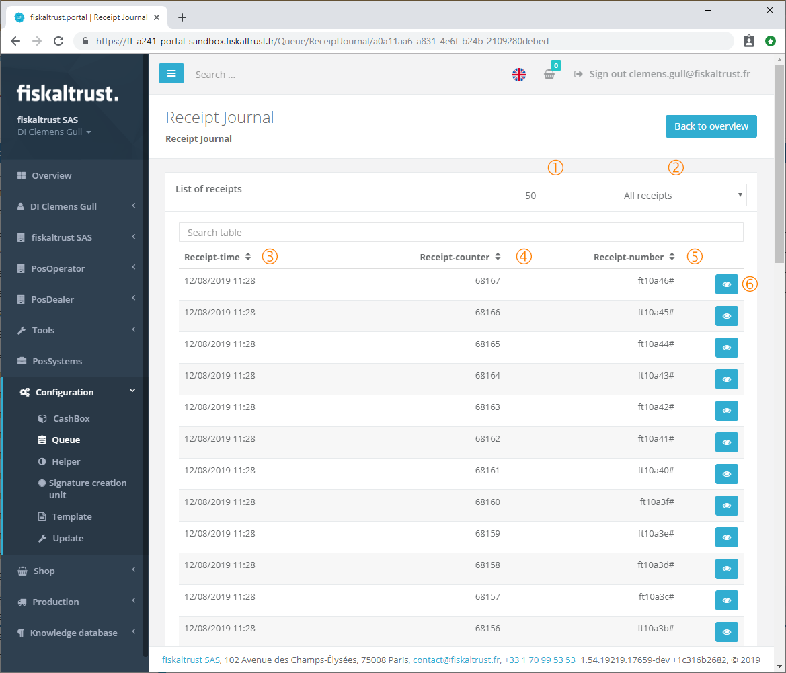](https://portal.fiskaltrust.fr/Queue/)
Queue - Overview ReceiptJournal

This journal shows all receipt created by a POS-System connected to the fiskaltrust.Middleware. All _special receipt types_ like a closure receipt, an archive request or warnings are shown in the [ActionJournal](#actionjournal-of-a-queue).

 This dropdown limits the shown rows of a journal to 50, 100, 500 or a full list. If the journal is long, a _full list_ can take some time to be shown.

 This dropdown list defines the type of receipt shown.

 The first column shows the date/time the receipt was created.

 Shows the overall counter of all receipts in the queue.

 Shows the receipt number created by the fiskltrust.Service.

 The button  displays the respective receipt.

#### Detailed receipt

[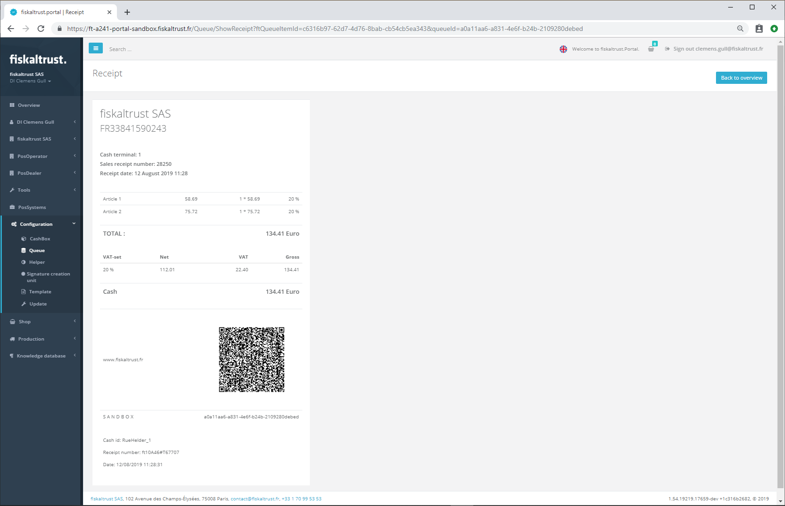](https://portal.fiskaltrust.fr/Queue/)
Queue - Detailed receipt

After selecting a receipt, it is displayed as follows. This view makes it possible to verify the accuracy of the receipt content.

#### ActionJournal of a Queue<a name="actionjournal-of-a-queue"></a>

[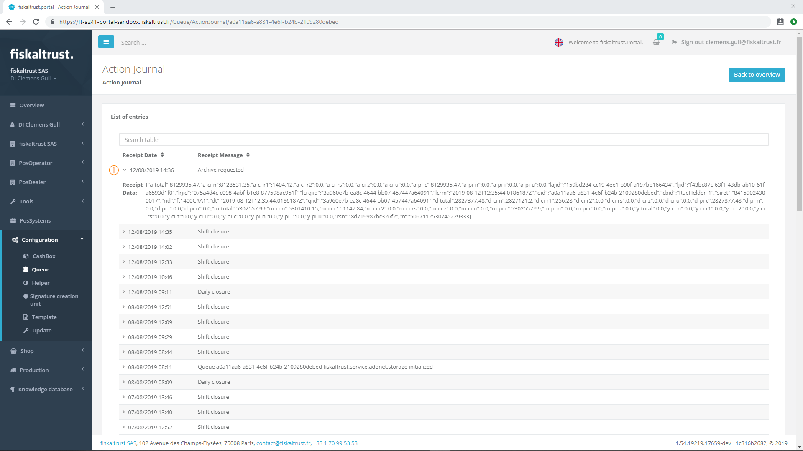](https://portal.fiskaltrust.fr/Queue/)
Queue - Overview ActionJournal

This list shows all _special receipt types_ of a queue. For regular receipts see [ReceiptJournal](#receiptjournal-of-a-queue). A click of the right chevron opens the detailed view of the data of the receipt.

#### Export a queue<a name="export-a-queue"></a>

[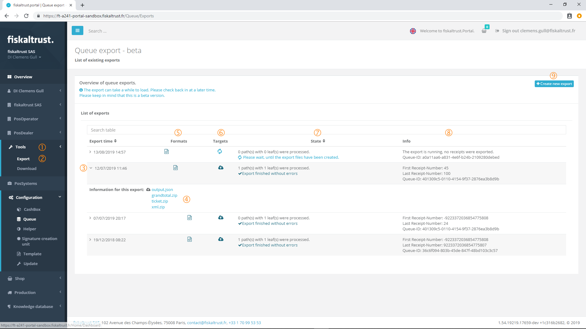](https://portal.fiskaltrust.fr/Queue/Exports/)
Queue - Overview Exports

An overview of all running and finished exports of the account can be seen in the menu _Tools_ and submenu _Export_.

 A line of the table represents an export. By clicking on the chevron on the right more details of the export can be shown. If the export finished successfully, a list of downloadable archives is shown.

 By clicking on the filename this file is transfered from the fiskaltrust.Storage to the local system. 

 The column _Formats_ shows all exported journals and formats as its own icon. For information regarding which format and/or journal is included in the export a tooltip is shown by each icon.

 In the third column the location of the files  is shown or if the export is running .

 The column _State_ shows information to the export. Until the export is finished no detailed information is given. After the export is finished, the chains and paths are shown. In the second line the user is informed if errors occurred or exist in the chain.

 In the last column the number of exported receipts are shown and which queue id is concerned.

 To create a new export a click on [+&nbsp;Create&nbsp;new&nbsp;export] can be done. This function can be called directly with the button  from the queue configuration too, see chapter [_Queue overview_](#queue-overview).

#### Create a new export for a queue

[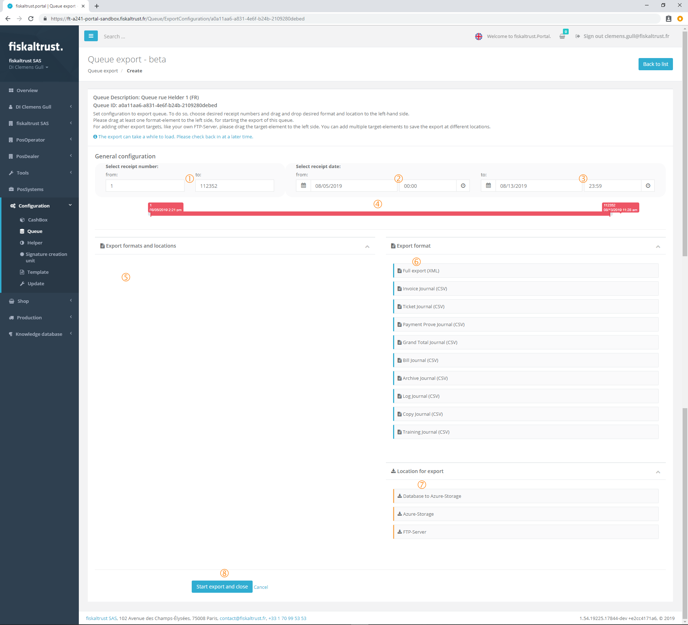](https://portal.fiskaltrust.fr/Queue/Exports/)
Create new export for a queue

 The first and the last receipt number for the export can be defined. By leaving the field open, the information about date and time will be shown at the end points of the slider.

 The date and time for the first receipt to export can be defined. By leaving the field open, the information about date and time will be shown at the end point of the slider.

 The date and time for the last receipt to export can be defined. By leaving the field open, the information about date and time will be shown at the start point of the slider.

 The range of exported receipts can be adjusted by sliding the end points of the slider.

 The drop area holds all the export formats, journals and storages for an export. It can be filled by dragging the elements on the right side, to this area.

 Formats and journals available for an export.<br />The element _Full export (xml)_ creates an archive in xml-format with all receipt types in the selected range. The export result at least two files. The file _XML.fileid.full.xml_ contains all the archived receipts and the file _XML.fileid.path#.xml_ contains the chain of the full journal. If there is more then one path in the queue, for each path a single xml-file is created.<br />All other elements create an archive of the mentioned receipt type. This archive is downloadable as zip-file and contains a single csv-file in plain text with the range of the exported receipts.<br />
With a click on , the used filename can be changed.

[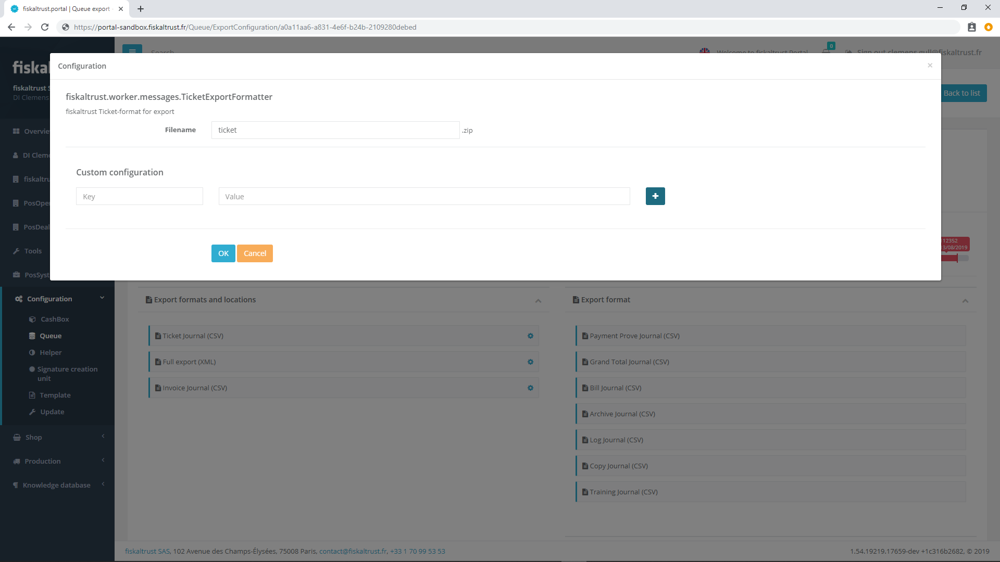](https://portal.fiskaltrust.fr/Queue/Exports/)
Change filename of an archive to export

Each element from the format section can be used only once per export.

 This element defines the storage location of an export. This element can be used more than one time for an export. This offers the possibility to save an export in more than one place at the same time.<br />
The element _Database to Azure-Storage_ exports the database to the used Azure-Storage.<br />
With _Azure-Storage_ another personal storage at Azure can be used to save the export. To use this element the access credentials have to be defined with a click on  this element.

[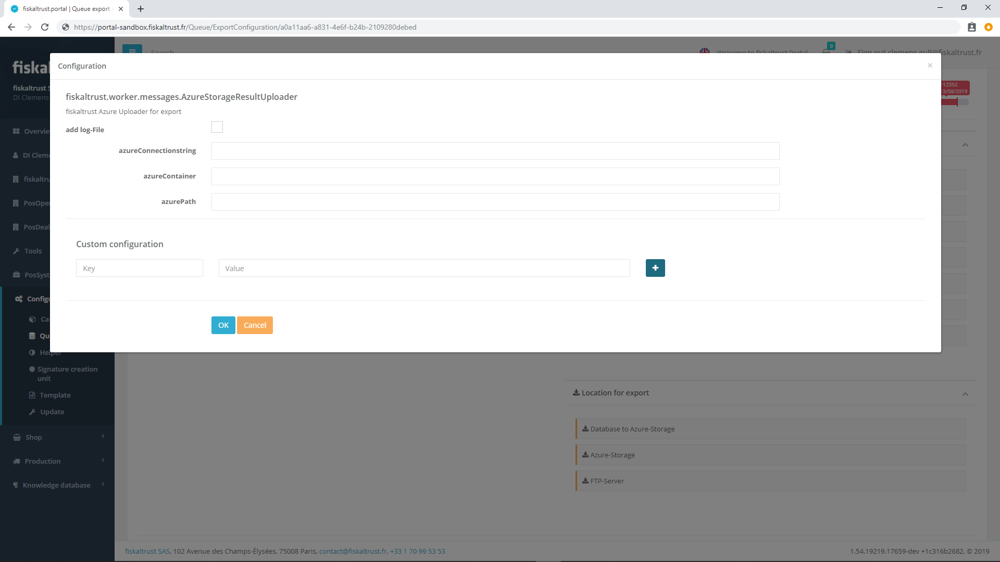](https://portal.fiskaltrust.fr/Queue/Exports/)
Define credentials for the Azure Storage to save the export

The location element _FTP-Server_ offers a ftp-transfer of the exported archives. This element can be used when the ftp-credentials are entered after a click on  this element.

[](https://portal.fiskaltrust.fr/Queue/Exports/)
Define credentials for a FTP-Server to save the export

All entered credentials are not saved from the fiskaltrust.Portal. They are only used once for saving the export in the defined location.

 The click on [Start export and close] queues the export and closes the window. The status of the export can be verified in the list of exports of the queue, see [_Export a queue_](#export-a-queue).

### Signature creation unit (SCU)<a name="SCU"></a>

The SCU is the part of the fiskaltrust.Middleware for securing all the receipts sent to it. In France the SCU is the holder of the certificate to guarantee the unalterability, securtiy, conservation and archiving of the transmitted data.

#### Overview of signature creation units

[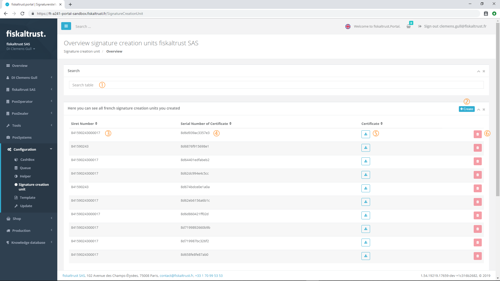](https://portal.fiskaltrust.fr/SignatureCreationUnit/)
Overview - Signature Creation Units (SCU)

To find a specific SCU, a text can be entered in the search field. Starting with the second entered character the table beneath gets filtered automatically.

 Clicking on [+&nbsp;Create] opens the module for creating a new signature creation unit, see [_Creation of a SCU_](#creation-of-a-scu).

 The SIRET used by the SCU is displayed here. This reflects the loose coupling of the SCU to the outlet, see for more information chapter [_Outlets_](company.md#outlets).

 Shows the serial number of the certificate of the SCU. 

 Each SCU holds a certificate for signing all the data send to it. With the button  the certificate of this SCU can be downloaded and verified.

 Click on  to delete the SCU. However, the button to delete any signature creation unit is currently inactive for legal reasons, so no SCU can be deleted.

#### Creation of a SCU<a name="creation-of-a-scu"></a>

[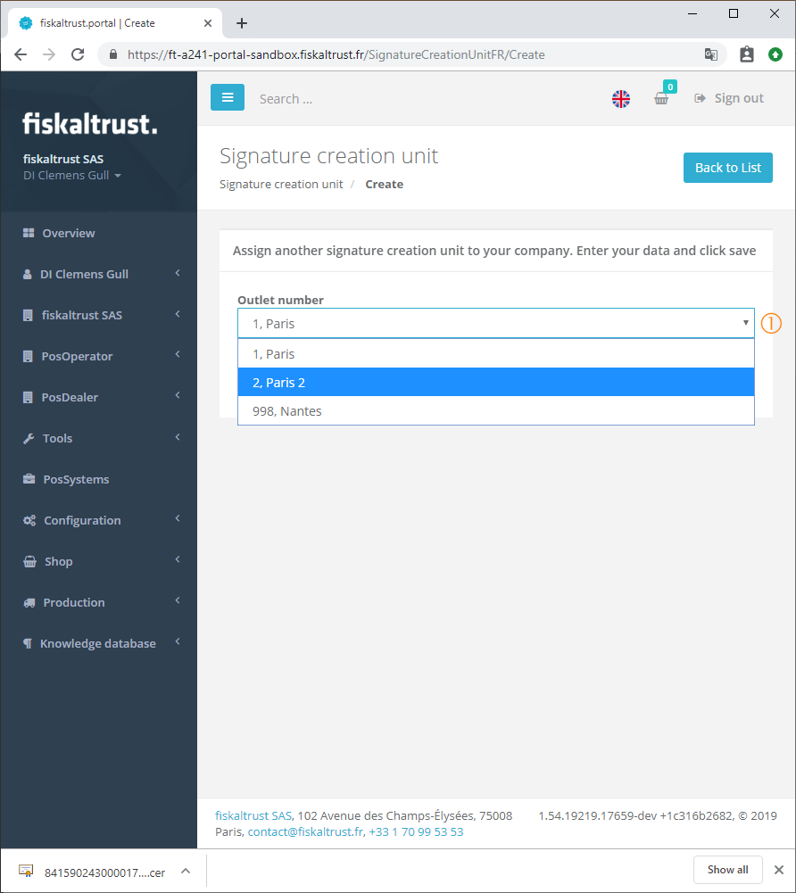](https://portal.fiskaltrust.fr/SignatureCreationUnitFR/)
Adding a signature creation unit

To create the signature creation unit, command _Signature creation device_ in the _Configuration_ menu. A click on [+&nbsp;Create] opens the page for adding a new SCU to the company.

In the dropdown list all [outlets](company.md#outlets) of the company are shown. To create a SCU, an outlet has to be selected. It is not necessary to create more then one SCU for an outlet, but at least one per outlet has to be created. It is not possible to use one signature creation unit for more then one outlet because the SIRET of the selected outlet is used to created the certificate for each SCU.

#### Add signature creation unit

To connect a SCU to a CashBox or more specifically to a queue see [Outlets](company.md#outlets) and[SCUs used by a queue](#scus-used-by-a-queue)

#### Delete a signature creation unit

The button for deleting a signature creation unit is, for legal reasons, inactive. No created SCU can be deleted from the fiskaltrust.Middleware. In the future there will be a filter to hide unused or inactive SCUs.

### Template

[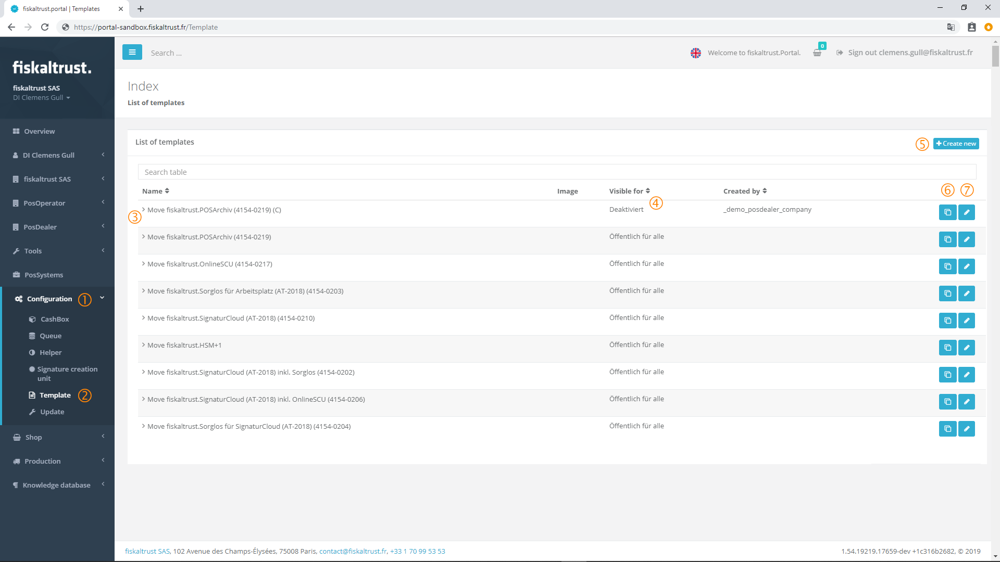](https://portal.fiskaltrust.fr/Template/)
List of available templates

Instead of creating and configuring a CashBox manually, a template (payable or free of charge) can be used. This preconfigured template can be purchased in the fiskaltrust.Shop. With this kind of template many similar CashBoxes can be created easily and further used as described in the chapter [_CashBox_](#cashbox).

If you are in need of templates for creating and configurating CashBoxes, do not hesitate to contact the support at contact@fiskaltrust.fr. fiskaltrust France is happy to help you to reach this goal.

The template management can be found in _Configuration_ at the command _Template_

 In the first column the template name is shown. More information regarding the template will be shown after a click on the chevron right.

 Shows the status of the template. It can be completely deactivated, visible for everyone or only for connected PosDealers and/or PosOperators.

 A click on [+&nbsp;Create new] creates a new template from scratch.

 A click on  clones the template and opens the newly created template for changes.

 The button  opens the template for changes.

#### Create template

[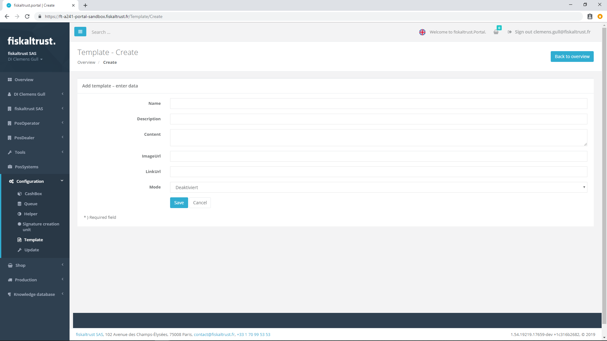](https://portal.fiskaltrust.fr/Template/)
Create a template

The first two fields give the template a clear name and description. In the field _Content_ the commands for this template are saved. This will be normally prefilled from the fiskaltrust.Support.<br />
In _ImageUrl_ an absolute URL to a kind of product image can be stored. For more description of this template an absolute URL can be entered in _LinkUrl_.<br />
The dropdown list in _Mode_ defines the access rights for a template by choosing one of the elements.

A template always start with

```
{ "ftCashBoxId": "|[cashbox_id]|",​
     "ftQueues": [​{​"Id": "|[queue0_id]|",
```

Then add queue type: `"Package": "fiskaltrust.service.azure",`
The type of packages can be found in the dropdown list of [creating a new queue](#add-a-queue).

Then introduce queue parameters, anew block has to be started: `"Configuration": {`

For example a connection string can be included `"connectionstring": "DefaultEndpointsProtocol=http://endpoint.cloud;AccountName=ftRealAccountName;AccountKey=TheACcountKey;",`

or other queue parameter, like `"asscdtretry": 2,`

Then beginning of the queue core starts with

```
"init_ftQueue": [{ "ftQueueId": "|[queue0_id]|",
                   "ftCashBoxId": "|[cashbox_id]|",
                   "CountryCode": "FR",
                   "Timeout": 15000 }],
```

and the specific of the country

```
"init_ftQueueFR": [ { "ftQueueFRId": "|[queue0_id]|",
```

but also the queue name

```
"CashBoxIdentification": "ChaîneCloud|[count]|" } ],
```

then the SCU that this queues connect to:

```
"ftSignaturCreationUnitFRId": "|[scu0_id]|",
```

and the SIRET used for this queue:

```
"Siret": "|[siret]|",
```

To initialize a SCU for a queue the following block can be used:

```
"init_ftSignaturCreationUnitFR": [{
        "ftSignaturCreationUnitFRId": "|[scu0_id]|",
        "Siret": "|[siret]|",
        "CompanyName": "|[company_name]|",
        "CountryCode": "FR",
        "OutletNumber": "|[outlet_number]|"
    }
]
```

As last parameter the endpoint for the ChaîneCloud product has to be defined:

```
"Url": ["https://signaturcloud-azure-sandbox.fiskaltrust.fr/"]
```

##### Example of a standard template

```
{
    "ftCashBoxId": "|[cashbox_id]|",
    "ftQueues": [{
            "Id": "|[queue0_id]|",
            "Package": "fiskaltrust.service.azure",
            "Configuration": {
                "connectionstring": "|[signaturcloud-storage-connectionstring]|",
                "init_ftQueue": [{
                        "ftQueueId": "|[queue0_id]|",
                        "ftCashBoxId": "|[cashbox_id]|",
                        "CountryCode": "FR",
                        "Timeout": 15000
                    }
                ],
                "init_ftQueueFR": [{
                        "ftQueueFRId": "|[queue0_id]|",
                        "ftSignaturCreationUnitFRId": "|[scu0_id]|",
                        "Siret": "|[siret]|",
                        "CashBoxIdentification": "ChaîneCloud|[count]|"
                    }
                ],
                "init_ftSignaturCreationUnitAT": [],
                "init_ftSignaturCreationUnitFR": [{
                        "ftSignaturCreationUnitFRId": "|[scu0_id]|",
                        "Siret": "|[siret]|"
                    }
                ]
            },
            "Url": ["https://signaturcloud-azure-sandbox.fiskaltrust.fr/"]
        }
    ]
}
```

##### Systemvariables

| Variable         | Data type | Value                | Example                              |
|------------------|-----------|----------------------|--------------------------------------|
| `cashbox_id`     | `GUID`    | Random GUID          | c2d68cbb-8963-4dda-84f2-9b28c9049b7b |
| `scu{0-9}_id`    | `GUID`    | Random GUID          | 2dc8896a-20ff-4a90-8020-008a9fc2d080 |
| `helper{0-9}_id` | `GUID`    | Random GUID          | 72e0ef61-4d28-4bf1-acd3-e17e6ced5635 |
| `queue{0-9}_id`  | `GUID`    | Random GUID          | ebb8ab15-88ff-49b9-a8ff-c4fca02701cb |
| `count`          | `int`     | Existing elements +1 | 5                                    |

### Automating CashBox creation

The template system of fiskaltrust can be used for creating a large number of CashBoxes. There is one restriction: **It cannot be used for creating CashBoxes with ChaîneCloud!**

For this purpose, fiskaltrust provides an HTTP API which can be used in the sandbox (https://helipad-sandbox.fiskaltrust.cloud/api/configuration) but also in the live environment (https://helipad.fiskaltrust.cloud/api/configuration).

#### API-Call

Various requirements are necessary to call up the API.

1. You need the `AccountID` and the `AccessToken`, which you can find in your company account (https://portal-sandbox.fiskaltrust.fr/AccountProfile) at the bottom of the page.
2. You need the _SIRET_, _Company Name_ and _Outlet_-Number.
3. The template as JSON string.

The request has to be send with the method `POST` with set to `application/json`. The header has to contain the variables `accountid` and `accesstoken` for which the template should be executed.

#### General information

Variables are identified by specifying them within `|[` and `]|`. It is possible to specify system variables whose values are generated by the fiskaltrust.System during generation as well as to specify your own variables whose values can be transferred later via an API call to generate the CashBox.

In first line of the following example, the system variable: `|[cashbox_id]|` is specified as the value for `ftCashBoxId`. This is the CashboxID, a value that is automatically generated by the system and used at this point to identify later the CashBox.

In the fifth line, on the other hand, a separate variable is used (`|[siret]|`) whose concrete value can be passed later during the API call.

#### Data structure

| Name | Data type | Mandatory<br />Default | Description |
|------|-----------|------------------------|-------------|
| `ftCashBoxId` | `GUID` (string)<br />GUID | yes | Identifies the CashBox in the fiskaltrust.System and must therefore be unique. Will later become part of the authentication of the CashBox. The system variable `|[cashbox_id]|` should be used here to automatically generate a GUID. |
| `ftSignaturCreationDevices` | `PackageConfiguration[]` | no  | Array, contains the configurations of the SCUs to be used. |
| `helpers`| `PackageConfiguration[]` | no  | Array, contains the configurations of the Helpers to be used. |
| `ftQueues`| `PackageConfiguration[]` | yes | Array, contains the configurations of the Queues to be used. |
| `TimeStamp`| `DateTime.UtcNow.Ticks` | no  | Time of creation of the template. |

##### Example
```
{
    "ftCashBoxId": "|[cashbox_id]|",
    "ftSignaturCreationDevices": [{}],
    "helpers": [{}],
    "ftQueues": [{}]
}
```

#### Standard variables for PackageConfiguration

With all `PackageConfiguration`-object the follwoing variables can be used. Depending on each object the possible values can differ.

| Name | Data type | Mandatory<br />Default | Description |
|------|-----------|------------------------|-------------|
| `Id` | `GUID` (string)<br />GUID | yes | Identifies the instance of the element that is configured here (SCU, Queue or Helper). A maximum of the instances can be used (`queue{0-9}_id`, `scu{0-9}_id` or `helper{0-9}_id`. |
| `Package` | `string` | yes | Name of the package to be used to create the element. E. g. _fiskaltrust.service.sqlite_ for a Queue that is installed locally. Currently supported packages can be found below. |
| `Description` |  `string` | no  | Descriptive name of the element.<br>Can only be changed be using it as a parameter in the query string. |
| `Version` | `string`<br />latest version | yes | Version of the package to be used to create the element. If no version is specified, the latest version is used. For France only defined versions are allowed for using with the Queue: **1.2.20342.36753** |
| `Configuration` | `Object` (string) | no  | Configuration parameters for the element. |
| `URL` | `string[]`<br>automatic | no | Array, communication endpoints of the element. E.g. REST endpoint for communication with the queue.<br /> The default value is `http://localhost:1200/` and the GUID of the package. |

##### Available packages and version

| Type   | Package name                    | Description      | Version in FR |
|--------|---------------------------------|------------------|---------------|
| Queue  | fiskaltrust.service.sqlite      | An SQLite database is used as the local persistence layer. | 1.2.20342.36573 |
| Queue  | fiskaltrust.service.sqlite.mono | An SQLite database for mono is used as the local persistence layer. | 1.2.20342.36573 |
| Queue  | fiskaltrust.service.ef          | Entity framework is used as the local persistence layer. | 1.2.20342.36573 |
| Queue  | fiskaltrust.service.azure       | An Azure instance is used as the local persistence layer. | n/a |
| Queue  | fiskaltrust.service.adonet      | adoNet is used as the local persistence layer. | 1.2.20342.36573 |
| Helper | fiskaltrust.service.helper.rest | Adds a new endpoint for the communication protocol _REST_. | 1.2.19134.14077 |

#### PackageConfiguration - Helper

There are no more variables then the ones in the standard definition.

##### Example

```
"helpers": [
    {
        "Id": "|[helper0_id]|",
        "Package": "fiskaltrust.service.helper.rest",
        "Version": "1.2.19134.14077",
        "Url": ["http://localhost:1200/|[helper0_id]|"]
    }
],
```

#### PackageConfiguration - ftSignaturCreationDevices

| Name          | Data type | Mandatory<br />Default | Description |
|---------------|-----------|------------------------|-------------|
| `Siret`       | `string`  | yes | The commercial register number consisting of 14 digits. Has to be transfered with the query string or can be hardcoded.<br />The number must be the exact same as used in the corresponding outlet in the fiskaltrust.Portal. |
| `CompanyName` | `string`  | yes | The name of the company of this CashBox. Has to be set with a query parameter or can be hardcoded in the template.<br />Must be exact the same then the one used for registration of the company in the fiskaltrust.Portal. |
| `CountryCode` | `string`  | yes | 2 letter code for the country. Has to be `FR`. |

##### Example

```
"ftSignaturCreationDevices": [
    {
        "Id": "|[scu0_id]|",
        "Siret": "|[siret]|",
        "CompanyName": "|[company_name]|",
        "CountryCode": "FR"
    }
]
```

#### Configuration - ftQueues

| Name | Data type | Mandatory<br />Default | Description |
|------|-----------|------------------------|-------------|
| `init_ftQueue` | `Configuration` | yes | Initialisation parameters for the queue (general part of the queue configuration). |
| `init_ftQueueFR` | `Configuration` | yes | Initialisation parameters for the queue (national part of the queue configuration). |
| `init_ftSignaturCreationUnitFR` | `Configuration` | no  | Initialisation parameter for linking the queue with an SCU. |
| `connectionstring` | `string` | no  | Connection string to the persistence layer. See below for an example. With SQLite, this field can be omitted if no own database is available. In this case, an SQLite database is automatically created by installing the _Lauchner_. |

##### Examples for connection string

* Entity Framework: `Data Source=.\\!sql-instanz!;Initial Catalog=!fiskaltrust!;User ID=!user!;Password=!password!;MultipleActiveResultSets=True`
* mySQL: `Server=myServerAddress;Database=myDataBase;Uid=myUsername;Pwd=myPassword;`
* SQLite: `Data Source=c:\mydb.db;Version=3;Password=myPassword;`

##### Example

```
   "ftQueues": [
       {
            "Id": "|[queue0_id]|",
            "Package": "fiskaltrust.service.sqlite",
            "Version": "1.2.20342.36753",
            "Configuration": {
                "init_ftQueue": [{ }],
                "init_ftQueueFR": [{ }],
                "init_ftSignaturCreationUnitFR": [{ }]
            }
        }
    ]
```

#### Configuration - init_ftQueue

| Name | Data type | Mandatory<br />Default | Description |
|------|-----------|------------------------|-------------|
| `ftQueueId` | `GUID` (string) | yes<br />GUID | Identification of the queue. The system variable `|[queue{0-9}_id]|` can be used to create a GUID. |
| `ftCashBoxId` | `GUID` (string) | yes | Identification of the CashBox. The system variable `|[cashbox_id]|` can be used here. |
| `CountryCode` | `string` | yes | The two letter code for the country. The only allowed value is `FR`. |
| `Timeout` | `int` | no<br />`15000` | Timeout in milliseconds. |

##### Example

```
"ftQueues": [
    {
        "Configuration": {
            "init_ftQueue": [{
                    "ftQueueId": "|[queue0_id]|",
                    "ftCashBoxId": "|[cashbox_id]|",
                    "CountryCode": "FR",
                    "Timeout": 15000
                }
            ]
        }
    }
]
```

#### Configuration - init_ftQueueFR

| Name | Data type | Mandatory<br />Default | Description |
|------|-----------|------------------------|-------------|
| `ftQueueFRID` | `GUID` (string) | yes | Identification of the queue. The system variable `|[queue{0-9}_id]|`  can be used. (The same value as for `ftQueueId` in `init_ftQueue` must be used here). |
| `CashBoxIdentification` | `string` (printable)<br>`ftyyyyMMddhhmmss` | yes | Cash register serial number. Must be a printable string with max. 20 characters. This value must be unique in the PosOperator's account. |
| `ftSignaturCreationUnitFRId` | `GUID` (string) | yes | The ID of the SCU to which this Queue should connect. The system variable `|[scu{0-9}_id]|` can be used here. When `ftSignaturCreationDevices` is used, the same value as in `Id` must be used.
| `Siret` | `string` | yes | The commercial register number consisting of 14 digits. Has to be transfered with the query string or can be hardcoded. |

##### Example

```
"ftQueues": [
    {
        "Configuration": {
            "init_ftQueueFR": [
                {
                    "ftQueueFRId": "|[queue0_id]|",
                    "CashBoxIdentification": "CashBox_|[count]|",
                    "ftSignaturCreationUnitFRId": "|[scu0_id]|",
                    "Siret": "|[siret]|"
                }
            ]            
        }
    }
]
```

#### Configuration - init_ftSignaturCreationUnitFR

If the object `ftSignaturCreationDevices` is used in the template the same values from the object must be used in this object.

| Name | Data type | Mandatory<br />Default | Description |
|------|-----------|------------------------|-------------|
| `ftSignaturCreationUnitFRId` | `GUID` (string) | yes | Identification of the SCU to which this queue should connect. The system variable |[scu{0-9}_id]| can be used. |
| `Siret`       | `string`  | yes | The commercial register number consisting of 14 digits. Has to be transfered with the query string or can be hardcoded.<br />The number must be the exact same as used in the corresponding outlet in the fiskaltrust.Portal. |
| `CompanyName` | `string`  | yes | The name of the company of this CashBox. Has to be set with a query parameter or can be hardcoded in the template.<br />Must be exact the same then the one used for registration of the company in the fiskaltrust.Portal. |
| `OutletNumber` | `int` | yes | The number of the outlet for which the SCU is used. The outlet has to exist in the fiskaltrust.Portal and the SIRET has to be checked in the outlet.<br />For dynamic usage the outlet-number should be transferred in the query string. |
| `CountryCode` | `string`  | yes | 2 letter code for the country. Has to be `FR`. |

##### Example

```
"ftQueues": [
    {
        "init_ftSignaturCreationUnitFR": [
            {
                "ftSignaturCreationUnitFRId": "|[scu0_id]|",
                "Siret": "|[siret]|",
                "CompanyName": "|[company_name]|",
                "OutletNumber": "|[outlet_number]|",
                "CountryCode": "FR"
            }
        ]
    }
]
```

#### Send the template to the API

##### Template

```
{
    "ftCashBoxId": "|[cashbox_id]|",
    "ftSignaturCreationDevices": [{
            "Id": "|[scu0_id]|",
            "Siret": "|[siret]|",
            "CompanyName": "|[company_name]|",
            "CountryCode": "FR"
        }
    ],
    "helpers": [{
            "Id": "|[helper0_id]|",
            "Package": "fiskaltrust.service.helper.rest",
            "Version": "1.2.19134.14077",
            "Url": ["http://localhost:1200/|[helper0_id]|"]
        }
    ],
    "ftQueues": [{
            "Id": "|[queue0_id]|",
            "Package": "fiskaltrust.service.sqlite",
            "Version": "1.2.20342.36753",
            "Configuration": {
                "init_ftQueue": [{
                        "ftQueueId": "|[queue0_id]|",
                        "ftCashBoxId": "|[cashbox_id]|",
                        "CountryCode": "FR",
                        "Timeout": 15000
                    }
                ],
                "init_ftQueueFR": [{
                        "ftQueueFRId": "|[queue0_id]|",
                        "CashBoxIdentification": "API-CB-|[outlet_number]|",
                        "ftSignaturCreationUnitFRId": "|[scu0_id]|",
                        "Siret": "|[siret]|"
                    }
                ],
                "init_ftSignaturCreationUnitFR": [{
                        "ftSignaturCreationUnitFRId": "|[scu0_id]|",
                        "Siret": "|[siret]|",
                        "CompanyName": "|[company_name]|",
                        "CountryCode": "FR",
                        "OutletNumber": "|[outlet_number]|"
                    }
                ]
            },
            "Url": ["http://localhost:1200/ftAPI"]
        }
    ]
}
```

##### JSON string

```
"{\"ftCashBoxId\":\"|[cashbox_id]|\",\"ftSignaturCreationDevices\":[{\"Id\":\"|[scu0_id]|\",\"Siret\":\"|[siret]|\",\"CompanyName\":\"|[company_name]|\",\"CountryCode\":\"FR\"}],\"helpers\":[{\"Id\":\"|[helper0_id]|\",\"Package\":\"fiskaltrust.service.helper.rest\",\"Version\":\"1.2.19134.14077\",\"Url\":[\"http:\/\/localhost:1200\/|[helper0_id]|\"]}],\"ftQueues\":[{\"Id\":\"|[queue0_id]|\",\"Package\":\"fiskaltrust.service.sqlite\",\"Version\":\"1.2.20342.36753\",\"Configuration\":{\"init_ftQueue\":[{\"ftQueueId\":\"|[queue0_id]|\",\"ftCashBoxId\":\"|[cashbox_id]|\",\"CountryCode\":\"FR\",\"Timeout\":15000}],\"init_ftQueueFR\":[{\"ftQueueFRId\":\"|[queue0_id]|\",\"CashBoxIdentification\":\"API-CB-|[outlet_number]|\",\"ftSignaturCreationUnitFRId\":\"|[scu0_id]|\",\"Siret\":\"|[siret]|\"}],\"init_ftSignaturCreationUnitFR\":[{\"ftSignaturCreationUnitFRId\":\"|[scu0_id]|\",\"Siret\":\"|[siret]|\",\"CompanyName\":\"|[company_name]|\",\"CountryCode\":\"FR\",\"OutletNumber\":\"|[outlet_number]|\"}]},\"Url\":[\"http:\/\/localhost:1200\/ftAPI\"]}]}"
```

##### Query string

In the query string the description for several packages are included. This is the only way to overwrite the default values.

```
https://helipad-sandbox.fiskaltrust.cloud/api/configuration?outlet_number=26&siret=12345678912345&cashbox_description=CB_Local%20Outlet%20N%C2%B0%2026_18&queue0_description=QU_Local%20Outlet%20N%C2%B0%2026_18&scu0_description=SCU_Local%20Outlet%20N%C2%B0%2026_18&company_name=fiskaltrust%20SAS&helper0_description=REST_Local%20Outlet%20N%C2%B0%2026_18
```

#### Response of the API call

The API sends a response with all the initial values back to the sender. This JSON contains three objects: `cashBoxId`, `accessToken` and `configuration`. With this you can do an automatic rollout.

Download at first the _Online Launcher_ form the fiskaltrust.Portal. This is a general zip-File with all the necessary files to run the fiskaltrust.Middleware on a local system.

It is important to ensure that the fiskaltrust.Middleware is initialized correctly, i.e. with the corresponding CashBox. The launcher provides a configuration file (`fiskaltrust.exe.config`) for this purpose. You can adapt this accordingly before rolling out the launcher to the operator's CashBox.

Please enter the values for `cashboxid` and `accesstoken` in the `appSetting` area you received as answer from the API-call.

```
<configuration>
  <appSettings>
    <add key="cashboxid" value="your-cashbox-id" />
    <add key="accesstoken" value="your-access-token" />
  </appsettings>
</configuration>
```

Now you can deliver the launcher with the customized configuration file to the operator's POS system and start it with `fiskaltrust.exe` or install it with `install-service.cmd`. The launcher will automatically download the configuration container for the `cashboxid` specified in `fiskaltrust.exe.config` from the fiskaltrust.Server and configure and start the fiskaltrust.Middleware accordingly.

Alternatively to adjusting the configuration in the `fiskaltrust.exe.config` file, you can pass the `cashboxid` and the `accesstoken` as parameters when starting the launcher (`fiskaltrust.exe`). This specification overwrites the existing configuration. The description of the possible start parameters can be found in the [middleware documentation](https://docs.fiskaltrust.cloud/doc/interface-doc/doc/general/installation/installation.html).
