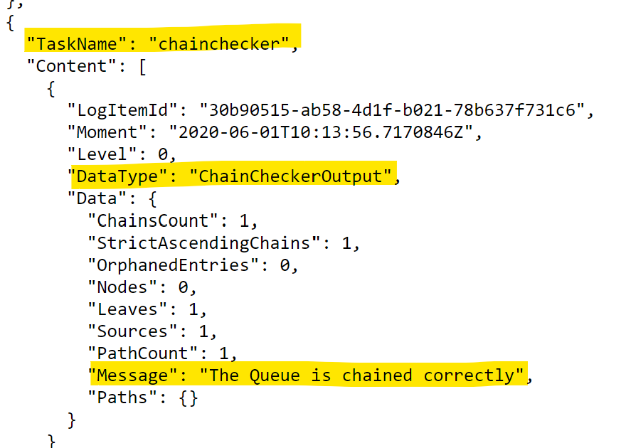
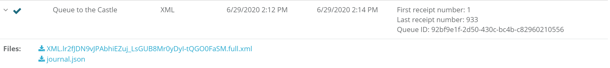
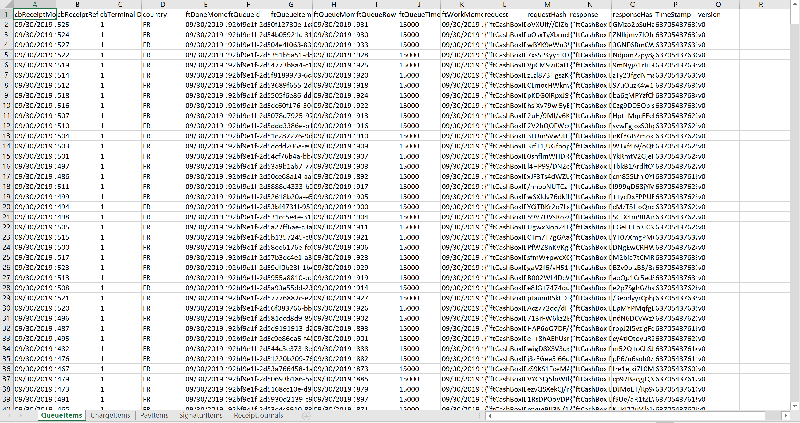
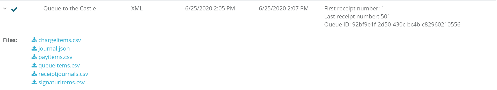
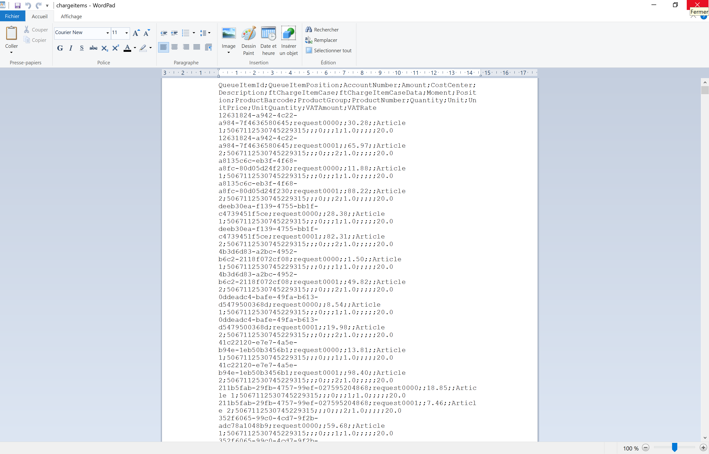
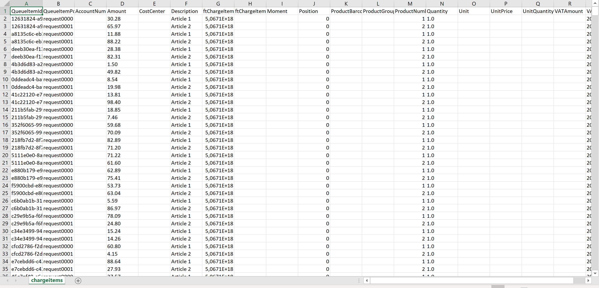

## Access for fiscal control

:::danger **No maintenance anymore**

These manuals are no longer maintained! 

In case of any questions, we encourage you to refer to our current [fiskaltrust Documentation Platform](https://docs.fiskaltrust.cloud).  
For further details, check the corresponding Knowledge Base Articles (KBA), which can be found on the fiskaltrust.Portal.

:::

### 1. Login

In order to access the fiscal information, the auditor will need the PosOperator to login to the portal at https://portal.fiskaltrust.fr with his proper credentials.

  
Export fiscal archive - Login to the fiskaltrust.Portal

 Enter the e-mail address of the account to get fiscal archives.

 Enter the password according to the e-mail address used as user.

 Click on button \[Login\] to gain access to the fiskaltrust.Portal.

### 2. Identify queue for creating the fiscal archive

As the second step, the queue for the POS-System and/or outlet must be identified for the fiscal control. An outlet usually has one queue which holds all the receipts issued. To enhance performance or avoid working issues there can be more than one queue per outlet. In this case, this and the following steps have to be repeated to get for each queue to access the fiscal information.

Export fiscal archive - Identify the queue to be exported in the fiskaltrust.Portal

 On the left side of the portal the menu can be found. Click on the word _Configuration_ to open this menu.

 Click on _Queue_ to show the whole list of queues created for the company.

 Each queue has its own description shown in this list. Normally the description should be clear enough to identify the queue.

 Each queue is assigned to a _CashBox_ (a configuration container) and the ID of the CashBox can be found in the column _Localisation_. The _name/description_ can be found in the details of a queue. To access this information click on the chevron just in front of the queue description.

 To start the configuration of the queue's export click on the export button .

### 3. Define the limits of the receipts to export

The first step to create a fiscal archive is the definition of which receipts to include. For defining these limits several possibilities are offered by the fiskaltrust.Portal. Each of the methods result in the same export. They are present to offer the best ways to define the limits of the export.

  
Export fiscal archive - Define the receipts to be included in the fiscal archive

#### Select by receipt number
Here the fiskaltrust receipt number of the queue itself is to be used. **Do not use the local receipt number created by the Pos-System**. By changing value in the first line, the slider limits are adjusted automatically.

 Enter the number of the first receipt (which will be included) to export. If this number is larger than the maximum of the receipts stored in the queue nothing is exported.

 Enter the number of the last receipt (which will be included) to export. If this number is larger than the maximum of the receipts stored in the queue, the whole queue starting with the number entered by _from:_ is exported.

#### Select by date and time

Here the time or the date of the fiskaltrust.Service is used. For this the date and/or time cannot be tampered with by the POS-System.

 Enter the date of the first day which should be included in the fiscal archive. By changing the date, the time of this day is set to _00:00_ so the first receipt of the day is included. By clicking on  the date can be selected from a graphical calendar.

 To adjust the time of first receipt in the fiscal archive, a time can be entered here. This can be used for example to export by the start of a shift. By clicking on  the time can be selected from a graphical clock.

 Enter the date of the last day which should be included in the fiscal archive. By changing the date the time of this day is set to _23:59_ so the last receipt of the day is included. By clicking on  the date can be selected from a graphical calendar.

 To adjust the time of last receipt in the fiscal archive a time can be entered here. This can be used for example to export to the end of a shift. By clicking on  the time can be selected from a graphical clock.

#### Select with the slider

 By dragging the left handle of the slider the starting point of the export can be fixed. When the dragging is finished and the mouse button is released, the date and time of the last receipt to be exported will be shown in the *from* date and time fields.

 By dragging the right handle of the slider the end point of the export can be fixed. When the dragging is finished and the mouse button is released the date and time of the last receipt to be exported will be shown in the *to* date and time fields.

### 4. Define export type

The all journals are included in an export. The fiskaltrust.Service offers several options for exporting the journals.

  
Export fiscal archive - Export types

There are three types of exports that can be selected under the heading *Export type* in order to start the export of the concerned data:

 XML Export:  
A full export of the data that was sent from the Queue. The data will be aggregated in an XML file that can be opened with Microsoft Excel, for example.

 CSV Export:  
A full export of the data that was sent from the Queue. The data will be aggregated into CSV files that can be opened with Microsoft Excel, for example.

 FR-DEX Export:  
A full export of the data that was sent from the Queue. The data will be aggregated in CSV files, by chain type and can be opened with Microsoft Excel, for example. This export is the fiscal archive that fiskaltrust offers and is not free of charge. This option is only available to clients who have opted to have the fiscal archive option.

In order to select the type of file locate the *Export format* column on the left side of the screen and click on the radio button beside the desired format of the export. Only one format may be selected, per export.

List of journal included in the FR-DEX export:  
* Ticket journal This is a part of the content of FR-DEX. The fields are descriped in detail at the end of this document in chapter("T" group export) **Content of the FR-DEX**

* Bill journal This is a part of the content of FR-DEX. The fields are descriped in detail at the end of this document in chapter ("B" group export) **Content of the FR-DEX**

* Invoice journal This is a part of the content of FR-DEX. The fields are descriped in detail at the end of this document in chapter ("I" group export) **Content of the FR-DEX**

* Copy journal This is a part of the content of FR-DEX. The fields are descriped in detail at the end of this document in chapter ("C" group export) **Content of the FR-DEX**

* Payment Prove journal This is a part of the content of FR-DEX. The fields are descriped in detail at the end of this document in chapter ("P" group export) **Content of the FR-DEX**

* Training journal This is a part of the content of FR-DEX. The fields are descriped in detail at the end of this document in chapter ("X" group export) **Content of the FR-DEX**

* Grand total journal This is a part of the content of FR-DEX. The fields are descriped in detail at the end of this document in chapter ("G" group export) **Content of the FR-DEX**

* Archive journal This is a part of the content of FR-DEX. The fields are descriped in detail at the end of this document in chapter ("A" group export) **Content of the FR-DEX**

* Log journal This is a part of the content of FR-DEX. The fields are descriped in detail at the end of this document in chapter ("L" group export) **Content of the FR-DEX**

### 5. Define export locations

Next, the *Export target* must be selected. The export can be saved in additional locations. These elements can be selected on the right side of the screen. Multiple locations can be selected for each export. if no external storage location is selected, the default storage for the export is the clients storage from fiskaltrust and no additional location has to be used.

  
Export fiscal archive - Export locations

There are three options for the export location:

 Azure Storage:  
Uploads the output data (e.g. zip files) to a configurable Azure Blob Storage.

 FTP Server:  
Uploads the output data (e.g. zip files) to a configurable FTP server.

 Default (if no selection is made):  
If neither option above is selected, the export can be downloaded from the fiskaltrust servers via the fiskaltrust.Portal once the export is complete.

For each location element in the export container credentials have to be entered. Each storage location window is expanded after selecting the checkbox for the desired location. Depending on the type of location the necessary credentials differ. No credentials are saved on the fiskaltrust.Portal and are only used once to access the storage for saving the export.

### 6. Start the export

After selecting the necessary journals and storage location the export has to be started.

  
Export fiscal archive - Storage locations of the export

At the bottom of the export module the button [Start export] has to be clicked to start running the export in the background.

### 7. Running export

If the export has started, the status can be verified in the fiskaltrust.Portal.

  
Export fiscal archive - Verify a running export

The most recently started export is shown on top of a list which can be called in the menu _Tools_ with the command _Export_.

In the first column the start date and time is shown. In the column _Status_ the symbol  is shown until the end of the export.

### 8. Finished export

For a finished export the information shown in the above window changes.

  
Export fiscal archive - Finished export

The symbol in the column _Status_ changes to . For each export, only one icon is shown.

The column _Queue description_ lists the name of the Queue from which the export was created.

In the column _Export type_ the format of the finished archive is shown.

The columns _Start time_ and _Finish time_ show when the export was started and when the creation was compelted. 

In the last column _Details_ the first and last exported receipt number is shown and in the last row which Queue ID was exported.

By clicking on chevron beside the  the downloadable files are shown. Each export started in the fiskaltrust.Portal gets uploaded to the storage of the active client account.

#### Information about the export

The file _journal.json_ contains the information about the processed export and the checked data.

  
Export fiscal archive - Example of _journal.json_

| field name | type        | meaning                              | example                                  |
|------------|-------------|--------------------------------------|------------------------------------------|
| LogItemId  | GUID        | ID of this export in the log journal | `7948984a-ef54-4c78-8404-66b397280442`   |
| Moment     | date / time | Moment of finished export            | `2019-08-19T23:18:44.245682Z`            |
| Level      | integer     |                                      | `0`                                      |
| DataType   | string      |                                      | `AzureStorageDownloaderOutput`           |
| Data       | json object |                                      |                                          |  

Export fiscal archive - content of the _journal.json_ (main part)

| field name            | type        | meaning                              | example                        |
|-----------------------|-------------|--------------------------------------|--------------------------------|
| ChainsCount           | integer     | number of chains exported            | `1`                            |
| StrictAscendingChains | integer     | number of chains with no errors      | `1`                            |
| OrphanedEntries       | integer     | entries with no parents and child    | `0`                            |
| Nodes                 | integer     | number of nodes in a chain           | `0`                            |
| Leafs / Leaves                 | integer     | number of leafs in a chain           | `1`                            |
| Sources               | integer     | number of sources in a chain         | `1`                            |
| Paths                 | integer     | number of paths in a chain           | `1`                            |
| Message               | string      |                                      | The Queue is chained correctly |  

Export fiscal archive - content of the _journal.json_ (data object)

#### Verification of integrity of data exported and how it works

In order to secure the cash register data, the fiskaltrust.SecurityMechanism provides the following general functions:  

• chaining receipts, archiving entries and other journal entries;  
• signing the payload with the private key of the queue;  
• saving all the data in a read only format.  

In order to create a chain, the signature of the previous receipt produced by the fiskaltrust.SecurityMechanism, has to be incorporated in the end of the next one. If a transaction is not sent to the fiskaltrust.SecurityMechanism for signing and chaining, the chain is broken and will be apparent when the _“chainchecker”_ function is run. The archives are chained among themselves and contain all receipts, journal entries, summary counters and the archive journal itself. There are no possibilities to change any stored data. Any new data or “change of data” is written as new line in the journal with the respective receipt or journal type and automatically chained from the fiskaltrust.Service with the preceding line. 

The file _journal.json_ contains the information about the processed export and the verified data. The fiscal controller can check the integrity of the data by verifying there has been no break in the chaining by downloading and examining the _journal.json_ file. After opening the file, the controller can look for the _"TaskName": "chainchecker"_, section. The task _“chainchecker”_ is run while the export is being prepared. If there are no breaks in the chain, then the message _“The Queue is chained correctly”_ appears in the data set. The example below shows that the fiskaltrust.SecurityMechanism, has not detected any breaks or inconsistencies within the data set.

  
Export fiscal archive - Example of _Chainchecker_

#### XML export

The full export in XML format contains all the journals of a queue in an XML structure and are separated by data structure (see table below called "*Data structures included in the XML and CSV files*"). Once the export has been run, the completed export can be found in the Portal by clicking on the chevron beside the  and selecting the XML file that appears.

  
Export fiscal archive - xml export in portal

This xml format is created as plain text file and readable with any editor, as shown in the following picture.

  
Export fiscal archive - Example of xml export (code)

The xml export structure is created in the way that if it is opened in _Microsoft Excel_, it will appear as shown in the following picture. If the Queue has a large number of entries, the journals will be split into smaller files and labeled, for example, *ReceiptJournals, ReceiptJournals1,etc*.

  
Export fiscal archive - Example of xml export (_Microsoft Excel Workbook__)

#### CSV export

The CSV export consists of more then one file. The full export in CSV format contains seperate files all the data structures (see table below called "*Data structures included in the XML and CSV files*"). of a queue in a CSV structure. Once the export has been run, the completed export can be found in the Portal by clicking on the chevron beside the  and selecting the each individual CSV journal file that appears.

  
Export fiscal archive - CSV export in portal

This CSV format is created as plain text file and readable with any editor, as shown in the following picture.

  
Export fiscal archive - Example of CSV export (code)

The CSV export structure is created in the way that if it is opened in _Microsoft Excel_, it will appear as shown in the following picture.

  
Export fiscal archive - Example of CSV export (_Microsoft Excel Workbook__)

## Data structures included in the XML and CSV files
| Name                             | Description                                                                                                                                                                                                                                                                                                          |
|----------------------------------|----------------------------------------------------------------------------------------------------------------------------------------------------------------------------------------------------------------------------------------------------------------------------------------------------------------------|
|QueueItems|Technical overview of each receipt in the exported queue|
|ChargeItems|services or items sold|
|PayItems|payments of business transactions received|
|SignaturItems|mandatorySignature block, which the cash register printed onto the receipts|
|ReceiptJournals|data related to receipts handled by the service|

## Content of the fiscal archive

The fiscal archive consists of more then one file. The *FR-DEX (**Fr**ench **D**ata **Ex**port)* is a file containing the receipt data, counters and security elements.
The additional files are containing the detailed data of any receipt and are referred on with a unique id.

### Content of the FR-DEX

| Fieldname                        | Description                                                                                                                                                                                                                                                                                                          | example data                                   |
|----------------------------------|----------------------------------------------------------------------------------------------------------------------------------------------------------------------------------------------------------------------------------------------------------------------------------------------------------------------|------------------------------------------------|
| QueueId                          | Unique id for the queue containing the receipt. Can be found on the *Queue Configuration page* in the portal.                                                                                                                                                                                                        | `a0a11aa6-a831-4e6f-b24b-2109280debed`         |
| CashBoxIdentification            | Value to identify the Queue. Can be found on the *Queue Configuration page* in the portal.                                                                                                                                                                                                                           | `RueHelder_1`                                  |
| Siret                            | The SIRET of the outlet using the queue. Can be found on the *Outlets page* as *Location Id* and on the *Queue Configuration page* in the used SCU.                                                                                                                                                                  | `84159024300017`                               |
| ReceiptId                        | Up counting receipt number allocated through fiskaltrust.SecurityMechanisms when send a request. It consists of two values the up counting value in hexadecimal value starting with *ft* and ending with *#*. The second part is an up counting number within the used journal, which is written as starting letter. | `ft1F4#T499`                                   |
| ReceiptMoment                    | The time of receipt creation in UTC (Coordinated Universal Time)                                                                                                                                                                                                                                                     | `08.06.2019  07:42:49`                         |
| QueueItemId                      | Unique id for a single item in the queue; provided by the ft.SecurityMechanism                                                                                                                                                                                                                                       | `aae8709c-ad14-41ba-a684-ec8b92a26ee8`         |
| JournalType                      | specifies the content of the journal like shown in **Receipt journals**                                                                                                                                                                                                                               | `T`                                            |
| ATotalizer                       | Archive totalizer overall: sums up all receipt totals in the archive; is reset on each send archive request to zero                                                                                                                                                                                                  | `145678.73`                                    |
| ACINormal                        | Archive totalizer chargeitem normal: the total cost of items of *undefined type of service for FR normal*                                                                                                                                                                                                            | `89120.23`                                     |
| ACIReduced1                      | Archive totalizer chargeitem reduced 1: the total cost of items of *undefined type of service for FR reduced-1*                                                                                                                                                                                                      | `36591.65`                                     |
| ACIReduced2                      | Archive totalizer chargeitem reduced 2: the total cost of items of *undefined type of service for FR reduced-2*                                                                                                                                                                                                      | `11956.06`                                     |
| ACIReducedS                      | Archive totalizer chargeitem special: the total cost of items of *undefined type of service for FR super reduced*; with rates that are not contained in the previous ones                                                                                                                                            | `7923.56`                                      |
| ACIZero                          | Archive totalizer chargeitem zero: the total cost of items of *undefined type of service for FR zero*; with data which are indicated with 0% sales tax and data where the sales tax is unknown                                                                                                                       | `81.53`                                        |
| ACIUnknown                       | Archive totalizer chargeitem unknown: the total cost of items not considered in the 5 totalizer before                                                                                                                                                                                                               | `5.70`                                         |
| APICash                          | Archive totalizer payitem cash: The total amount of all payment types *cash*, *credit card*, *voucher*                                                                                                                                                                                                               | `76591.23`                                     |
| APINonCash                       | Archive totalizer payitem non-cash: The total amount of all payment types *wire-transfer*, *debit card*, *paypal*                                                                                                                                                                                                    | `66981.25`                                     |
| APIInternal                      | Archive totalizer payitem internal: The total amount of all payment types *payables*, *receivable*                                                                                                                                                                                                                   | `2004.09`                                      |
| APIUnknown                       | Archive totalizer payitem unknown: The total amount of all payment types not listed before                                                                                                                                                                                                                           | `102.16`                                       |
| LastActionJournalId              | Unique key of the last stored zero receipt in the action journal                                                                                                                                                                                                                                                     | `73e0850f-446f-4b99-9b4f-85c14d50fb11`         |
| LastJournalFRId                  | Unique key of the last signed receipt                                                                                                                                                                                                                                                                                | `45bf4a92-3f57-47c6-b581-72b84577b3ea`         |
| LastReceiptJournalId             | Unique key of the last saved receipt                                                                                                                                                                                                                                                                                 | `fe7921db-feac-4603-ab4b-5baeb6db2697`         |
| PreviousArchiveQueueItemId       | The GUID of the journal item which contains the preceding archive                                                                                                                                                                                                                                                    | `709a3bd1-2318-40dc-a5d1-74634c477354`         |
| FirstContainedReceiptQueueItemId | The GUID of the first item of the queue contained in this archive                                                                                                                                                                                                                                                    | `9a16ebc7-1fd6-4985-ad5f-b942a7757b43`         |
| FirstContainedReceiptMoment      | The timestamp of the first item contained in this archive                                                                                                                                                                                                                                                            | `2017-07-20T22:55:52.944Z`                     |
| LastContainedReceiptQueueItemId  | The GUID of the last item of the queue contained in this archive                                                                                                                                                                                                                                                     | `54c1e932-d5b5-4514-a911-53a850cd1411`         |
| LastContainedReceiptMoment       | The timestamp of the last item contained in this archive                                                                                                                                                                                                                                                             | `2018-07-19T23:27:52.944Z`                     |
| DTotalizer                       | Day totalizer overall: sums up all receipt totals form the last daily closing; is reset on daily closing receipt                                                                                                                                                                                                     | `13597.37`                                     |
| DCINormal                        | Day totalizer chargeitem normal: the total cost of items of *undefined type of service for FR normal*                                                                                                                                                                                                                | `5574.92`                                      |
| DCIReduced1                      | Day totalizer chargeitem reduced 1: the total cost of items of *undefined type of service for FR reduced-1*                                                                                                                                                                                                          | `6118.82`                                      |
| DCIReduced2                      | Day totalizer chargeitem reduced 2: the total cost of items of *undefined type of service for FR reduced-2*                                                                                                                                                                                                          | `679.87`                                       |
| DCIReducedS                      | Day totalizer chargeitem special: the total cost of items of *undefined type of service for FR super reduced*; with rates that are not contained in the previous ones                                                                                                                                                | `407.92`                                       |
| DCIZero                          | Day totalizer chargeitem zero: the total cost of items of *undefined type of service for FR zero*; with data which are indicated with 0% sales tax and data where the sales tax is unknown                                                                                                                           | `679.87`                                       |
| DCIUnknown                       | Day totalizer chargeitem unknown: the total cost of items not considered in the 5 totalizer before                                                                                                                                                                                                                   | `135.97`                                       |
| DPICash                          | Day totalizer payitem cash: The total amount of all payment types *cash*, *credit card*, *voucher*                                                                                                                                                                                                                   | `5031.03`                                      |
| DPINonCash                       | Day totalizer payitem non-cash: The total amount of all payment types *wire-transfer*, *debit card*, *paypal*                                                                                                                                                                                                        | `7070.63`                                      |
| DPIInternal                      | Day totalizer payitem internal: The total amount of all payment types *payables*, *receivable*                                                                                                                                                                                                                       | `1223.76`                                      |
| DPIUnknown                       | Day totalizer payitem unknown: The total amount of all payment types not listed before                                                                                                                                                                                                                               | `271.95`                                       |
| MTotalizer                       | Month totalizer overall: sums up all receipt totals form the last monthly closing; is reset on monthly closing receipt                                                                                                                                                                                               | `322665.61`                                    |
| MCINormal                        | Month totalizer chargeitem normal: the total cost of items of *undefined type of service for FR normal*                                                                                                                                                                                                              | `132292.90`                                    |
| MCIReduced1                      | Month totalizer chargeitem reduced 1: the total cost of items of *undefined type of service for FR reduced-1*                                                                                                                                                                                                        | `145199.52`                                    |
| MCIReduced2                      | Month totalizer chargeitem reduced 2: the total cost of items of *undefined type of service for FR reduced-2*                                                                                                                                                                                                        | `16133.28`                                     |
| MCIReducedS                      | Month totalizer chargeitem special: the total cost of items of *undefined type of service for FR super reduced*; with rates that are not contained in the previous ones                                                                                                                                              | `9679.97`                                      |
| MCIZero                          | Month totalizer chargeitem zero: the total cost of items of *undefined type of service for FR zero*; with data which are indicated with 0% sales tax and data where the sales tax is unknown                                                                                                                         | `16133.28`                                     |
| MCIUnknown                       | Month totalizer chargeitem unknown: the total cost of items not considered in the 5 totalizer before                                                                                                                                                                                                                 | `3226.61`                                      |
| MPICash                          | Month totalizer payitem cash: The total amount of all payment types *cash*, *credit card*, *voucher*                                                                                                                                                                                                                 | `119386.28`                                    |
| MPINonCash                       | Month totalizer payitem non-cash: The total amount of all payment types *wire-transfer*, *debit card*, *paypal*                                                                                                                                                                                                      | `167786.12`                                    |
| MPIInternal                      | Month totalizer payitem internal: The total amount of all payment types *payables*, *receivable*                                                                                                                                                                                                                     | `29039.90`                                     |
| MPIUnknown                       | Month totalizer payitem unknown: The total amount of all payment types not listed before                                                                                                                                                                                                                             | `6453.31`                                      |
| YTotalizer                       | Year totalizer overall: sums up all receipt totals form the last yearly closing; is reset on yearly closing receipt                                                                                                                                                                                                  | `4152706.39`                                   |
| YCINormal                        | Year totalizer chargeitem normal: the total cost of items of *undefined type of service for FR normal*                                                                                                                                                                                                               | `1702609.62`                                   |
| YCIReduced1                      | Year totalizer chargeitem reduced 1: the total cost of items of *undefined type of service for FR reduced-1*                                                                                                                                                                                                         | `1868717.88`                                   |
| YCIReduced2                      | Year totalizer chargeitem reduced 2: the total cost of items of *undefined type of service for FR reduced-2*                                                                                                                                                                                                         | `207635.32`                                    |
| YCIReducedS                      | Year totalizer chargeitem special: the total cost of items of *undefined type of service for FR super reduced*; with rates that are not contained in the previous ones                                                                                                                                               | `124581.19`                                    |
| YCIZero                          | Year totalizer chargeitem zero: the total cost of items of *undefined type of service for FR zero*; with data which are indicated with 0% sales tax and data where the sales tax is unknown                                                                                                                          | `207635.32`                                    |
| YCIUnknown                       | Year totalizer chargeitem unknown: the total cost of items not considered in the 5 totalizer before                                                                                                                                                                                                                  | `41527.06`                                     |
| YPICash                          | Year totalizer payitem cash: The total amount of all payment types *cash*, *credit card*, *voucher*                                                                                                                                                                                                                  | `1536501.36`                                   |
| YPINonCash                       | Year totalizer payitem non-cash: The total amount of all payment types *wire-transfer*, *debit card*, *paypal*                                                                                                                                                                                                       | `2159407.32`                                   |
| YPIInternal                      | Year totalizer payitem internal: The total amount of all payment types *payables*, *receivable*                                                                                                                                                                                                                      | `373743.58`                                    |
| YPIUnknownTotalizer              | Year totalizer payitem unknown: The total amount of all payment types not listed before                                                                                                                                                                                                                              | `83054.13`                                     |
| Totalizer                        | Totalizer over all items                                                                                                                                                                                                                                                                                             | `132945514.64`                                 |
| CINormal                         | Perpetual totalizer chargeitem normal: the total cost of items of *undefined type of service for FR normal*                                                                                                                                                                                                          | `2945514.64`                                   |
| CIReduced1                       | Perpetual totalizer chargeitem reduced 1: the total cost of items of *undefined type of service for FR reduced-1*                                                                                                                                                                                                    | `3232881.92`                                   |
| CIReduced2                       | Perpetual totalizer chargeitem reduced 2: the total cost of items of *undefined type of service for FR reduced-2*                                                                                                                                                                                                    | `359209.10`                                    |
| CIReducedS                       | Perpetual totalizer chargeitem special: the total cost of items of *undefined type of service for FR super reduced*; with rates that are not contained in the previous ones                                                                                                                                          | `215525.46`                                    |
| CIZero                           | Perpetual totalizer chargeitem zero: the total cost of items of *undefined type of service for FR zero*; with data which are indicated with 0% sales tax and data where the sales tax is unknown                                                                                                                     | `359209.10`                                    |
| CIUnknown                        | Perpetual totalizer chargeitem unknown: the total cost of items not considered in the 5 totalizer before                                                                                                                                                                                                             | `71841.83`                                     |
| PICash                           | Perpetual totalizer payitem cash: The total amount of all payment types *cash*, *credit card*, *voucher*                                                                                                                                                                                                             | `2658147.36`                                   |
| PINonCash                        | Perpetual totalizer payitem non-cash: The total amount of all payment types *wire-transfer*, *debit card*, *paypal*                                                                                                                                                                                                  | `3735774.67`                                   |
| PIInternal                       | Perpetual totalizer payitem internal: The total amount of all payment types *payables*, *receivable*                                                                                                                                                                                                                 | `646576.38`                                    |
| PIUnknown                        | Perpetual totalizer payitem unknown: The total amount of all payment types not listed before                                                                                                                                                                                                                         | `143683.64`                                    |
| SCINormal                        | Shift totalizer chargeitem normal: the total cost of items of *undefined type of service for FR normal*                                                                                                                                                                                                              | `2549.63`                                      |
| SCIReduced1                      | Shift totalizer chargeitem reduced 1: the total cost of items of *undefined type of service for FR reduced-1*                                                                                                                                                                                                        | `431.79`                                       |
| SCIReduced2                      | Shift totalizer chargeitem reduced 2: the total cost of items of *undefined type of service for FR reduced-2*                                                                                                                                                                                                        | `69.47`                                        |
| SCIReducedS                      | Shift totalizer chargeitem special: the total cost of items of *undefined type of service for FR super reduced*; with rates that are not contained in the previous ones                                                                                                                                              | `13.62`                                        |
| SCIZero                          | Shift totalizer chargeitem zero: the total cost of items of *undefined type of service for FR zero*; with data which are indicated with 0% sales tax and data where the sales tax is unknown                                                                                                                         | `78.94`                                        |
| SCIUnknown                       | Shift totalizer chargeitem unknown: the total cost of items not considered in the 5 totalizer before                                                                                                                                                                                                                 | `359.41`                                       |
| SPICash                          | Shift totalizer payitem cash: The total amount of all payment types *cash*, *credit card*, *voucher*                                                                                                                                                                                                                 | `2346.92`                                      |
| SPINonCash                       | Shift totalizer payitem non-cash: The total amount of all payment types *wire-transfer*, *debit card*, *paypal*                                                                                                                                                                                                      | `945.77`                                       |
| SPIInternal                      | Shift totalizer payitem internal: The total amount of all payment types *payables*, *receivable*                                                                                                                                                                                                                     | `175.14`                                       |
| SPIUnknown                       | Shift totalizer payitem unknown: The total amount of all payment types not listed before                                                                                                                                                                                                                             | `35.03`                                        |
| CopiedReceiptReference           | Reference to the origin receipt used for a copy                                                                                                                                                                                                                                                                      | `Ticket-6890`                                  |
| ReceiptCase                      | The kind of the receipt, shown in table **Receipt cases**                                                                                                                                                                                                                                               | `5067112530745229313`                          |
| LastHash                         | The hash value of the preceding receipt                                                                                                                                                                                                                                                                              | `2LpY9Zw4tr8NjNmF60rdpIfof40MRtcrX0avsBj8gXY=` |
| CertificateSerialNumber          | The serial number of the certificate used for signing the receipts                                                                                                                                                                                                                                                   | `08d791c48c4b727e`                             |

#### Receipt journals

| Letter | Journal | Receipt Case                  | Signed | Chained | Counters raised | Details                                                                                                                                                                                                  |
|:------:|---------|-------------------------------|:------:|:-------:|:---------------:|----------------------------------------------------------------------------------------------------------------------------------------------------------------------------------------------------------|
| A      | Archive | Archive                       | yes    | yes     | no              | Starts the archiving process and will trigger automatically a daily closing                                                                                                                              |
| B      | Bill    | Bill                          | yes    | yes     | no              | bill and payment prove are created, this does not replace a ticket creation; a ticket or an invoice have to be issued to raise turnover and raise the GT counters as well                                |
| B      | Bill    | Foreign sales                 | yes    | yes     | no              | bill and payment prove are created, this does not replace a ticket creation; a ticket or an invoice have to be issued to raise turnover and raise the GT counters as well                                |
| C      | Copy    | Copy                          | yes    | yes     | no              | in a request the previous receipt reference is mandatory; it contains the receipt number of the cash register which was handed out as a copy                                                             |
| G      | General | Daily Receipt                 | yes    | yes     | no              | Adds daily counter to month-counter an then resets daily counter; keeps shift counter                                                                                                                    |
| G      | General | Monthly Receipt               | yes    | yes     | no              | Adds daily counter to month-counter an then resets daily counter; Adds monthly counter to yearly counter and then resets monthly counter; keeps shift counter                                            |
| G      | General | Shift Receipt                 | yes    | yes     | no              | Resets shift counter, keeps all other counters                                                                                                                                                           |
| G      | General | Start Receipt                 | yes    | yes     | no              | A receipt with empty charge items block and empty payment block which amounts to a total of "0"; This receipt starts the ft.SecurityMechanism and has to be send as first receipt before using the queue |
| G      | General | Stop Receipt                  | yes    | yes     | no              | A receipt with empty charge items block and empty payment block which amounts to a total of "0"; This receipt stops the ft.SecurityMechanism and has to be send as last receipt before closing the queue |
| G      | General | Yearly Receipt                | yes    | yes     | no              | Adds daily counter to month-counter an then resets daily counter; Adds monthly counter to yearly counter and then resets monthly counter; Resets yearly counter; keeps shift counter                     |
| G      | General | Zero Receipt                  | yes    | yes     | no              | A receipt with empty charge items block and empty payment block which amounts to a total of "0"                                                                                                          |
| I      | Invoice | Invoice                       | yes    | yes     | yes             | A reference to the ticket can be created by using the previous receipt number in the request                                                                                                             |
| L      | Logging | Protocol / Accounting / Audit | yes    | yes     | no              | Can be used by the POS system to log custom accounting or auditing data                                                                                                                                  |
| L      | Logging | Protocol / Custom             | yes    | yes     | no              | Can be used by the POS system to log custom data                                                                                                                                                         |
| L      | Logging | Protocol / Technical Event    | yes    | yes     | no              | Can be used by the POS system to log custom technical data                                                                                                                                               |
| P      | Payment | Cash Deposit                  | yes    | yes     | no              | total amount is always zero                                                                                                                                                                              |
| P      | Payment | Pay Out                       | yes    | yes     | no              | total amount is always zero                                                                                                                                                                              |
| P      | Payment | Payment Prove                 | yes    | yes     | no              | total amount is always zero                                                                                                                                                                              |
| P      | Payment | Payment Transfer              | yes    | yes     | no              | Switch between Payment method, e.g. from cash to credit card                                                                                                                                             |
| T      | Ticket  | Ticket                        | yes    | yes     | yes             | Issues a ticket with charge and pay items, has to be secured by printing the signatures send back by the service                                                                                         |

#### Receipt cases

| Receipt Case                  | Value hex          | Value int64         |
|-------------------------------|-------------------:|--------------------:|
| Archive                       | 0x4652000000000015 | 5067112530745229333 |
| Bill                          | 0x4652000000000008 | 5067112530745229320 |
| Cash Deposit                  | 0x465200000000000A | 5067112530745229322 |
| Copy                          | 0x4652000000000016 | 5067112530745229334 |
| Daily Receipt                 | 0x4652000000000005 | 5067112530745229317 |
| Delivery Note                 | 0x4652000000000009 | 5067112530745229321 |
| Foreign sales                 | 0x465200000000000E | 5067112530745229326 |
| Internal / Material           | 0x465200000000000D | 5067112530745229325 |
| Invoice                       | 0x4652000000000003 | 5067112530745229315 |
| Monthly Receipt               | 0x4652000000000006 | 5067112530745229318 |
| Protocol / Accounting / Audit | 0x4652000000000013 | 5067112530745229331 |
| Protocol / Custom             | 0x4652000000000014 | 5067112530745229332 |
| Protocol / Technical Event    | 0x4652000000000012 | 5067112530745229330 |
| Pay Out                       | 0x465200000000000B | 5067112530745229323 |
| Payment Prove                 | 0x4652000000000002 | 5067112530745229314 |
| Payment Transfer              | 0x465200000000000C | 5067112530745229324 |
| Shift Receipt                 | 0x4652000000000004 | 5067112530745229316 |
| Start Receipt                 | 0x4652000000000010 | 5067112530745229328 |
| Stop Receipt                  | 0x4652000000000011 | 5067112530745229329 |
| Ticket                        | 0x4652000000000001 | 5067112530745229313 |
| Unknown (processed as ticket) | 0x4652000000000000 | 5067112530745229312 |
| Yearly Receipt                | 0x4652000000000007 | 5067112530745229319 |
| Zero Receipt                  | 0x465200000000000F | 5067112530745229327 |

#### Journal types

| Value hex          | Value int64         | Description                                                                                                        |
|-------------------:|--------------------:|--------------------------------------------------------------------------------------------------------------------|
| 0x4652000000000000 | ‭5067112530745229312‬ | Version information                                                                                                |
| 0x4652000000000001 | 5067112530745229313 | ActionJournal in internal format; contains all *zero-receipts*                                                     |
| 0x4652000000000002 | 5067112530745229314 | ReceiptJournal in internal format; contains all *receipts* that are not *zero-receipts*                            |
| 0x4652000000000003 | 5067112530745229315 | QueueitemJournal in internal format; contains all detailed information                                             |
