## Export fiscal archive

### Login
For exporting the fiscal archive the PosOperator has to login to the portal at https://portal.fiskaltrust.fr with his proper credentials.

Export fiscal archive - Login to the fiskaltrust.Portal

 Enter the email-address of the account to get fiscal archive.

 Enter the password according to the email-address used as user.

 Click on button [Login] to gain access to the fiskaltrust.Portal.

### Identify queue for creating the fiscal archive

As second step the queue for the POS-System and/or outlet has to be identified for creating a fiscal archive. An outlet usually has one queue which holds all the receipts issued. On behalf of performance or working issues there can be more than one queue per outlet. In this case this and the following steps have to be repeated to get for each queue an fiscal archive.

Export fiscal archive - Identify the queue to export in the fiskaltrust.Portal

 On the left side of the portal the menu can be find. Click on the word _Configuration_ to open this menu.

 Click on _Queue_ to show the whole list of queues created for the company.

 Each queue has an own description shown in this list. Normally it should be clear enough to identify the queue.

 Each queue is assigned to a _CashBox_ (a configuration container) the ID of the CashBox can be found in the column _Localisation_. The _name/description_ can be found in the details of a queue. To access this information click on the chevron right just in front of the queue description.

 To start the configuration of the queue's export click on the export button .

### Define the limits of the receipts to export

The first step to create a fiscal archive is the definition of receipts to include. For defining these limits several possibilities are offered by the fiskaltrust.Portal. Each of the methods are resulting in the same archive. They are present to offer the best ways to limit the export. 

Export fiscal archive - Define the receipts to include in the fiscal archive

#### Select by receipt number
Here the numbering of the queue itself is used, **don't use the local receipt number**. By changing value in the first line, the slider limits are adjusted automatically.

 Enter the number of the first receipt (including) to export. If this number is larger than the maximum of the receipts stored in the queue nothing is exported.

 Enter the number of the last receipt (including) to export. If this number is larger than the maximum of the receipts stored in the queue, the whole queue starting with the number entered by _from:_ is exported.

#### Select by date and time
Here the time of the fiskaltrust.Service is used. For this the date and/or time can not be tampered by the POS-System.

 Enter the date of the first day which should be included included in the fiscal archive. By changing the date the time of this day is set to _00:00_ so the first receipt of the day is included in all circumstances. By clicking on 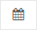 the date can be selected from a graphical calendar.

 To adjust the time of first receipt in the fiscal archive a time can entered here. This can be used for example to export by the start of a shift. By clicking on 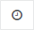 the time can be selected from a graphical watch.

 Enter the date of the last day which should be included included in the fiscal archive. By changing the date the time of this day is set to _23:59_ so the last receipt of the day is included in all circumstances. By clicking on  the date can be selected from a graphical calendar.

 To adjust the time of last receipt in the fiscal archive a time can entered here. This can be used for example to export to the end of a shift. By clicking on  the time can be selected from a graphical watch.

#### Select with the slider

 By dragging the left handle of the slider the star point of the export can be fixed. When dragging is finished and the mouse button is released the date and time of the first exported receipt will be shown on the left handle.

 By dragging the right handle of the slider the end point of the export can be fixed. When dragging is finished and the mouse button is released the date and time of the last exported receipt will be shown on the left handle.

### Define journals to export

The journals included in an export have to be defined in this step. The fiskaltrust.Service divides the journal in several types. The fields and contents of the journals are described in the chapter _Condition “Archiving”_ of the file _11.fiskaltrust-security-mechansim.md_

Export fiscal archive - Drag journal elements to the export container

For including elements in the export container take an element from the right side by pointing with mouse on it, hold the left mouse button and drag it to the export container (gray area) on the left side. Once over this area release the mouse button and drop the element.

For removing an element from the export container just do it the inverse way and drag them to the right side.

Export fiscal archive - Journal elements to export

 **Ticket journal** A journal/file of all tickets issued in the selected queue.

 **Bill journal** A journal/file of all bills issued in the selected queue.

 **Invoice journal** A journal/file of all invoices issued in the selected queue.

 **Copy journal** A journal/file of all duplicates issued in the selected queue.

 **Payment Prove journal** A journal/file of all payment proves issued in the selected queue.

 **Training journal** A journal/file of all receipts issued in training mode in the selected queue.

 **Grand total journal** A journal/file of all counters created and maintained in the selected queue.

 **Archive journal** A journal/file of all archives created from the selected queue.

 **Log journal** A journal/file of all log entries done in the selected queue.

**Full export (XML)** This type is a combination of the eight journals mentioned above. These eight journals are converted to a xml-format containing the same data. This xml-file can be opened as clear text file with every editor. On the other hand the xml is formatted in that way, to be ready to open in _Microsoft Excel_ too.

### Define export locations

The export can be saved on additional location shown on the right side. These elements can be dragged to the left side. For each location one item has to be dragged to the left side. As default the export is saved in the clients storage from fiskaltrust and no additional has to be used.

[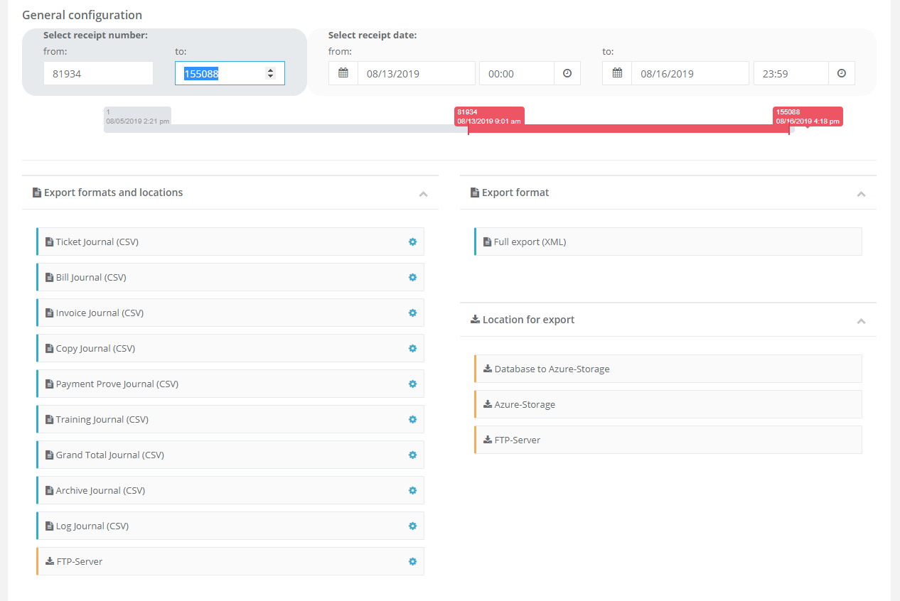](https://portal.fiskaltrust.fr/Queue/)
Export fiscal archive - Storage locations of the export

For each location element in the export container credentials have to be entered. The popup window is shown after a click on . Depending on the type of location the necessary credentials differ. No credentials are saved and are only used once to access the storage for saving the export.

### Start the export

After adding the necessary journals and storage location the export has to be started.

[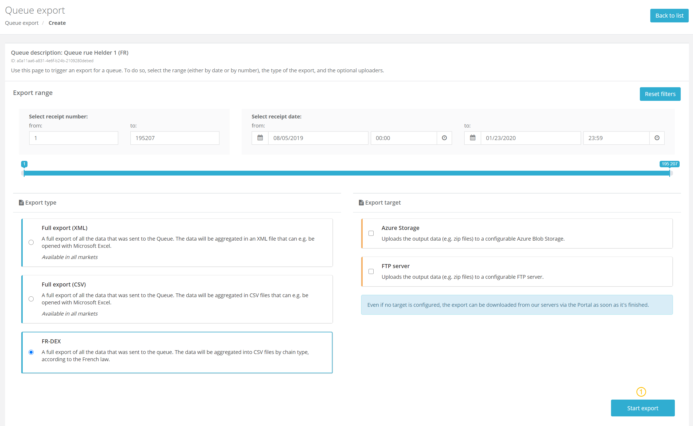](https://portal.fiskaltrust.fr/Queue/)
Export fiscal archive - Storage locations of the export

At the bottom of the export module the button [Start export and close] has to clicked to start the export in the background.

### Running export

If the export has started and the status can be verified in the fiskaltrust.Portal.

[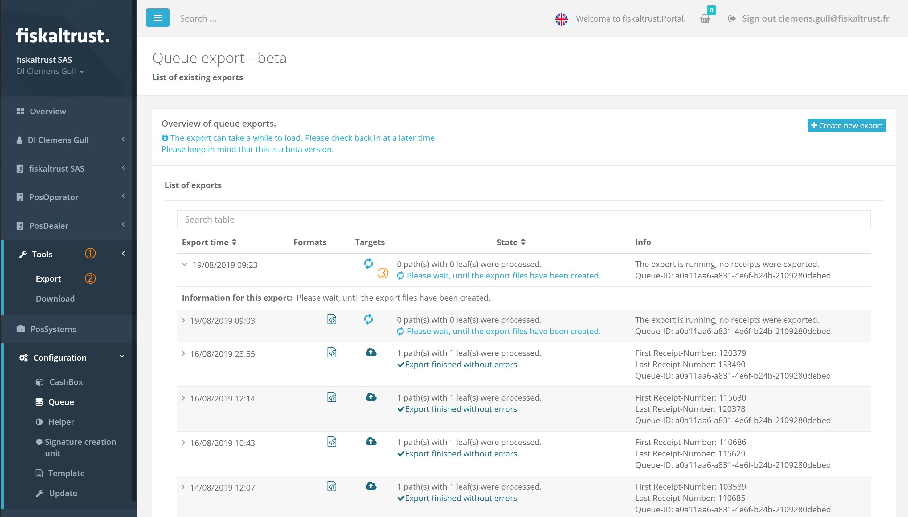](https://portal.fiskaltrust.fr/Queue/Export/)
Export fiscal archive - Verify a running export

The newest started export is shown on top of a list which can be called in the menu _Tools_ with the command _Export_.

In the first column the start date and time is shown. In the column _Targets_ the symbol  is shown until the end of the export.

### Finished export

For a finished export the information shown in the above window changes.

[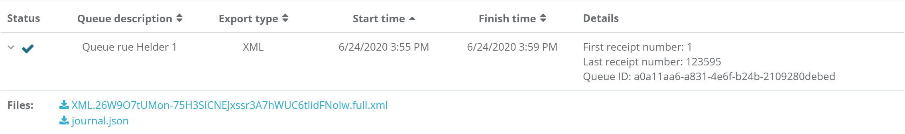](https://portal.fiskaltrust.fr/Queue/Export/)
Export fiscal archive - Finished export

The symbol in the column _Targets_ changes to . For each location one icon is shown. By hovering with the mouse pointer over it a tooltip with the location is shown.

In the column _Formats_ a symbol for each journal and/or format is shown. For the journals the symbol  and for the xml-format the symbol  is displayed. As in the _Targets_ column hovering over the icon shows a tooltip with more information.

The column _State_ shows information about the data. The first line shows how many paths with leafs are in the queue and the second line shows if the chain has errors or is correct.

In the last column _Info_ the first and last exported receipt number is shown and in the last row which queue was effected.

By clicking on the _chevron right_ the downloadable files are shown. Each export started in the fiskaltrust.Portal gets uploaded to the storage of the active account.

#### Information about the export

The file _output.json_ contains the information about the processed export and the checked data.

[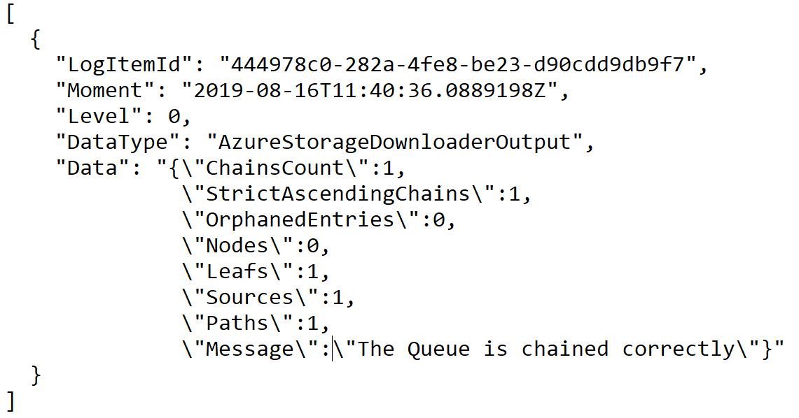](https://portal.fiskaltrust.fr/Queue/Export/)
Export fiscal archive - Example of _output.json_

| field name | type        | meaning                              | example                                  |
|------------|-------------|--------------------------------------|------------------------------------------|
| LogItemId  | GUID        | ID of this export in the log journal | `7948984a-ef54-4c78-8404-66b397280442`   |
| Moment     | date / time | Moment of finished export            | `2019-08-19T23:18:44.245682Z`            |
| Level      | integer     |                                      | `0`                                      |
| DataType   | string      |                                      | `AzureStorageDownloaderOutput`           |
| Data       | json object |                                      |                                          |
Export fiscal archive - content of the _output.json_ (main part)

| field name            | type        | meaning                              | example                        |
|-----------------------|-------------|--------------------------------------|--------------------------------|
| ChainsCount           | integer     | number of chains exported            | `1`                            |
| StrictAscendingChains | integer     | number of chains with no errors      | `1`                            |
| OrphanedEntries       | integer     | entries with no parents and child    | `0`                            |
| Nodes                 | integer     | number of nodes in a chain           | `0`                            |
| Leafs                 | integer     | number of leafs in a chain           | `1`                            |
| Sources               | integer     | number of sources in a chain         | `1`                            |
| Paths                 | integer     | number of paths in a chain           | `1`                            |
| Message               | string      |                                      | The Queue is chained correctly |
Export fiscal archive - content of the _output.json_ (data object)

#### xml export

The full export in xml format contains all journals of a queue in a xml structure. This xml format is created as plain text file and readable with any editor, like shown in the following picture.

[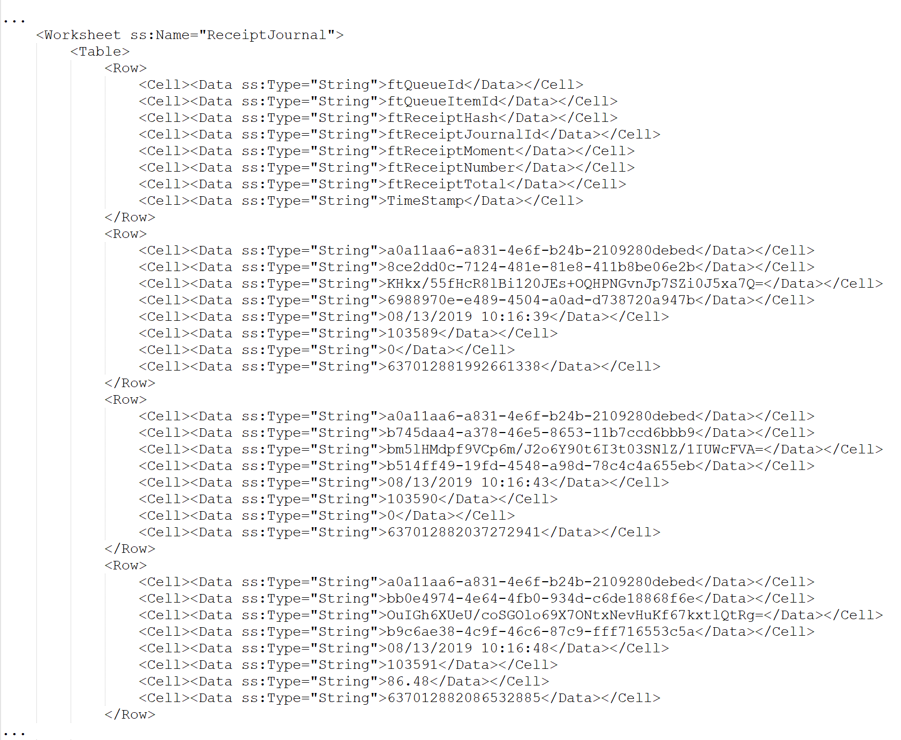](https://portal.fiskaltrust.fr/Queue/Export/)
Export fiscal archive - Example of file xml export (code)

But the xml structure is done in the way for getting a Workbook in _Microsoft Excel_ if it is opened with this application, like shown in the following picture.

[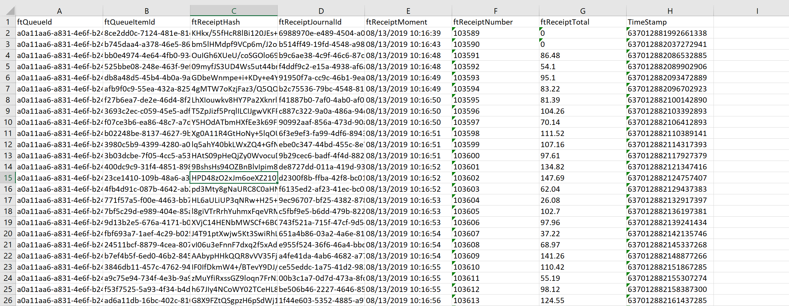](https://portal.fiskaltrust.fr/Queue/Export/)
Export fiscal archive - Example of fill xml export (_Microsoft Excel Workbook__)

### Open an archive csv-format

#### Unformatted raw data
The easiest way is to open the file without any formatting with an editor, like _Notepad_ on _Microsoft Windows_. This gives a comma separated list of the archive's content.

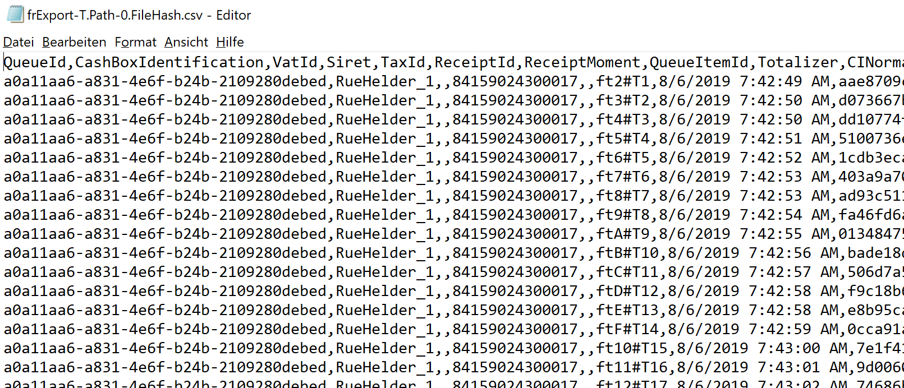
Export fiscal archive - Example of an opened csv-file in notepad

#### Formatted raw data
If an application for spreadsheets is installed on the system, like _Microsoft Excel_, the raw data can be shown up more user friendly. The following steps can be done with the version 2017 or 2019 or Office 365 of the calculation program.

**Open Microsoft Excel with a new workbook.**
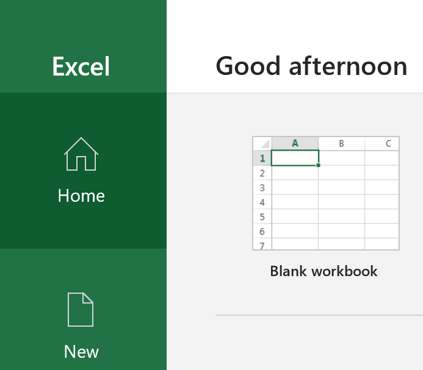
After the start of _Microsoft Excel_ click on _Blank workbook_

**Get data from Text/CSV.**
By clicking on the word _Data_ on the top of the application, the data-band gets opened.

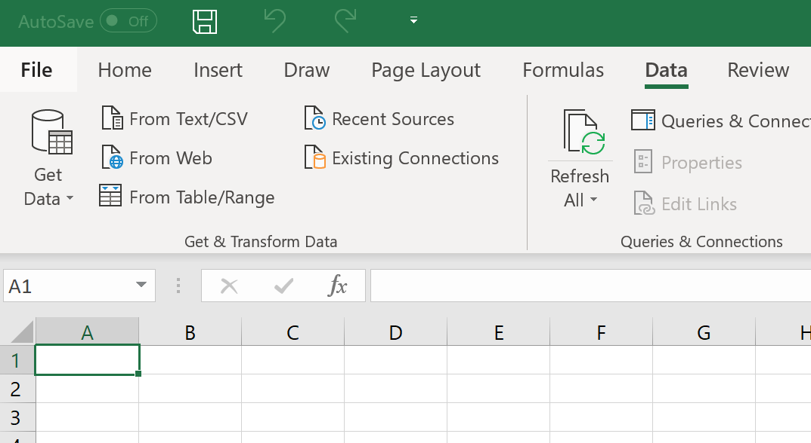

Here on the left side the button _From Text/CSV_ has to be identified and clicked.

**Find csv-file to import**
In the new opened window the csv-file to import can be chosen.
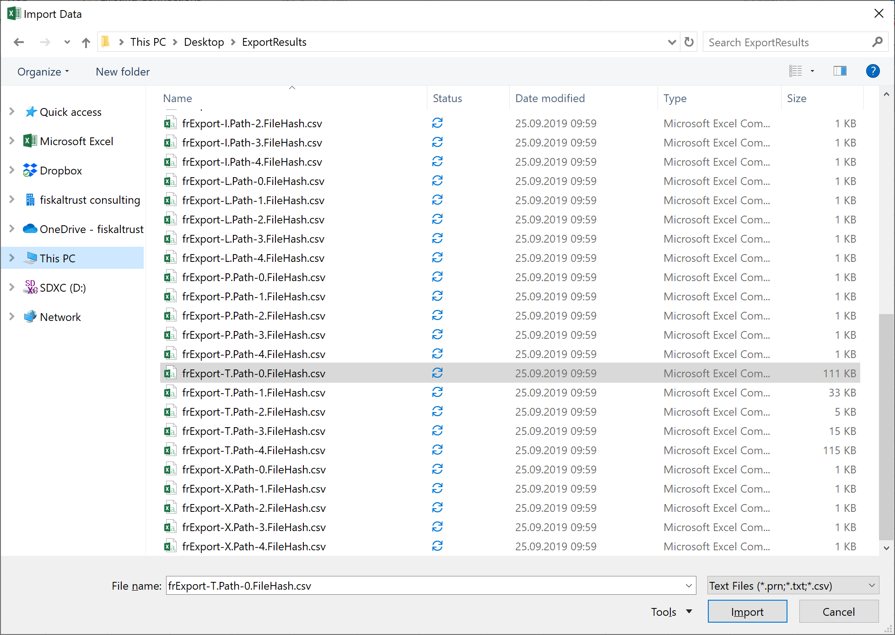
On the left side the different folders can be opened. The list of files shows all csv-files that can be imported. One of them can be selected and with a click on the button _Import_ this files gets used by _Microsoft Excel_.

**Choose the correct character set**
After the import _Microsoft Excel_ offers the data for several formatting options. This occurs because the application tries to find the ideal mode to import and present the data. So the user can change this suggestions.
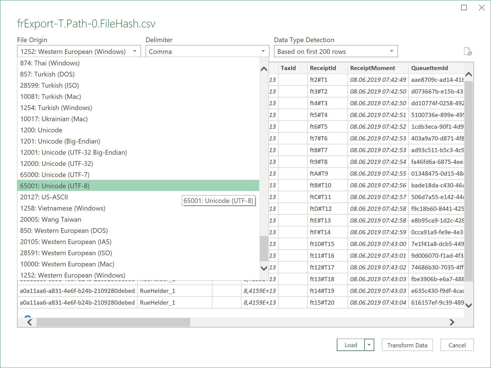

In the list _File Origin_ the correct character set can be selected. In case of national characters in the text of the charge or payment items the best selection is _65001: Unicode (UTF-8)_.

**Change the format of some columns**
Because _Microsoft Excel_ suggests often the format _number_ some columns are not presented perfect. To change the format first of all a click on the button _Transform Data_ has to be done. This changes the shown windows to one that offers formats in each column.

Like shown in the following figure the format of the SIRET is not perfect, because it is considered as number. By clicking in the head of column on _1.2_ the menu for the available formats gets opened. 

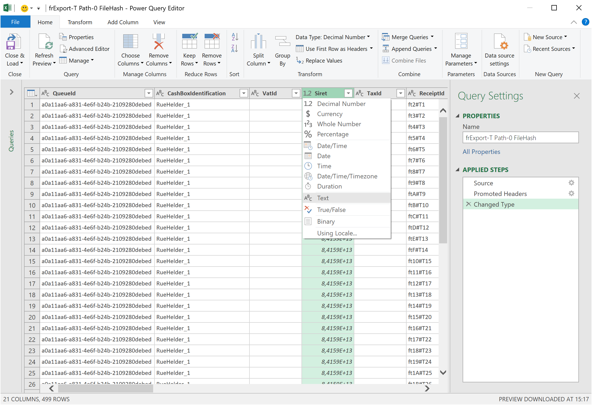

The format is _Text_ which is chosen with a click in the menu. For not changing data by accident the following message has to be confirmed with a click on the button _Replace current_.

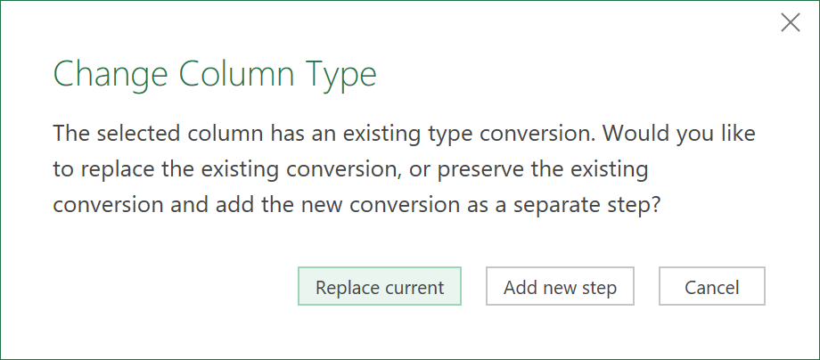

The same procedure with the same format change should be done with the penultimate column called _ReceiptCase_.

**Get data into a _Microsoft Excel_ workbook**
After finishing all format changes the data gets imported with a click on the button _Close & Load_ in the upper left corner of the window.

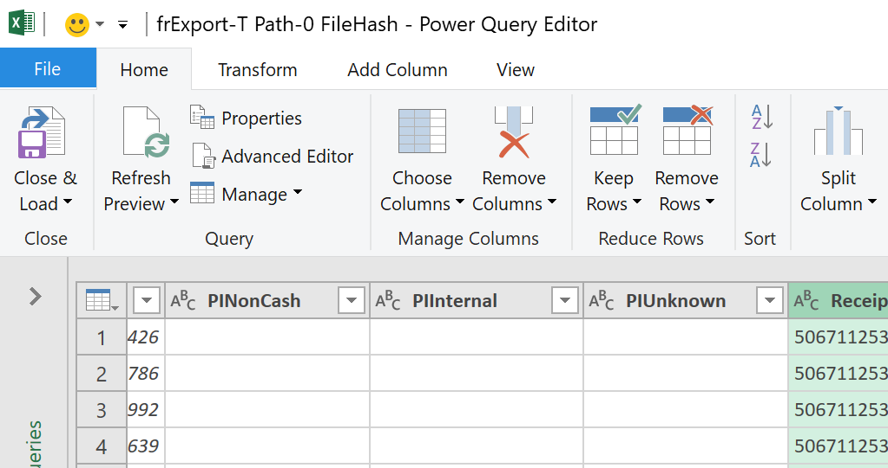
