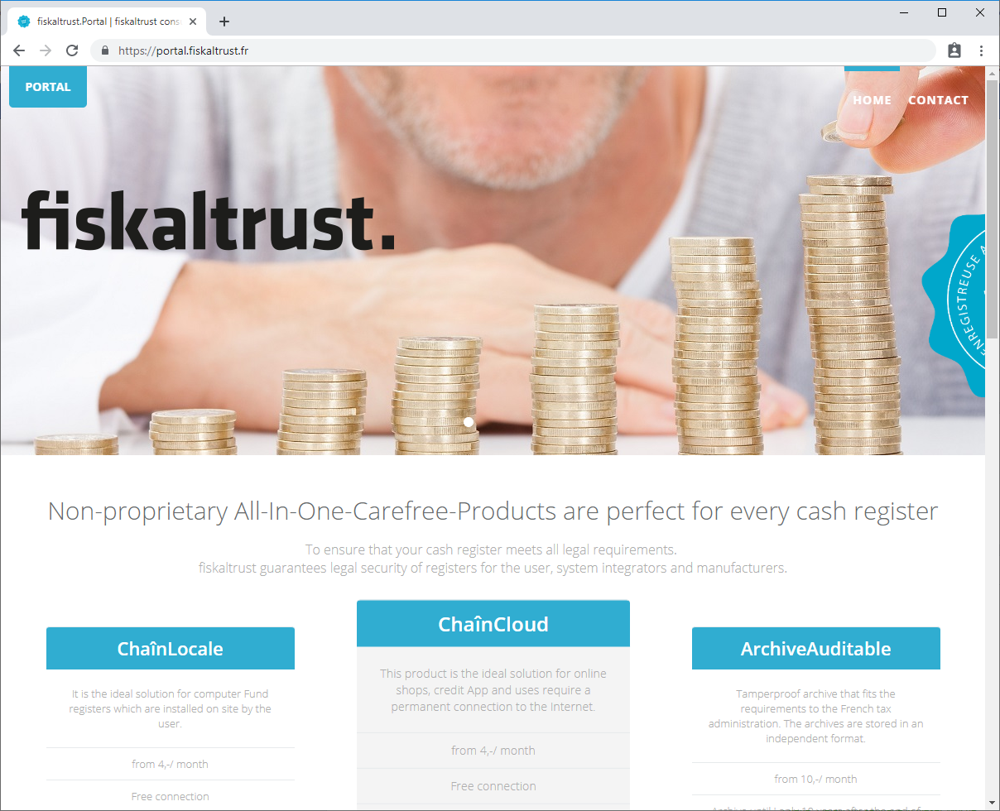
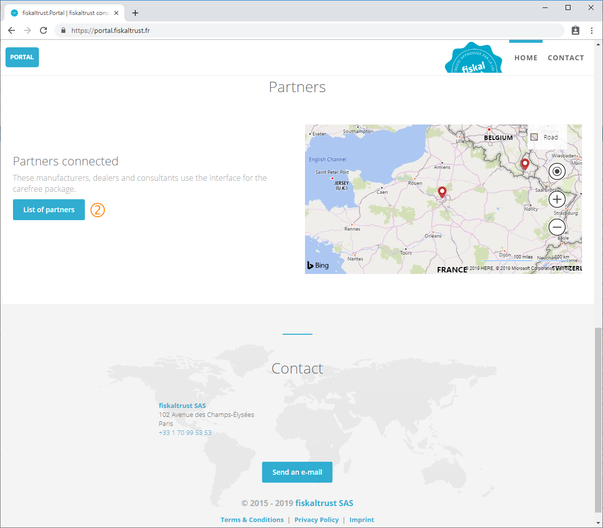

## fiskaltrust.Portal
**[https://portal.fiskaltrust.fr](https://portal.fiskaltrust.fr)**

Please note that various menus and functions presented in this manual are only visible and therefore available after the corresponding authorization has been assigned in the user administration.

The _primary contact_ is the user who has all authorizations for a company and can therefore administer the authorizations.

### Homepage
The fiskaltrust.Portal (hereinafter _ft.Portal_ or simply _Portal_) can be used free of charge by all partners and their PosOperators. It can be reached directly via the URL https://portal.fiskaltrust.fr or via the hyperlink on the homepage https://www.fiskaltrust.fr.
All PosOperators, PosDealers, Consultants and PosCreators can easily manage the necessary functions for operating the POS-Systems via the Portal. Further more auditors of the fiscal authorities can export fiscal archives with the functionality of the portal.

Homepage | [https://www.fiskaltrust.fr](https://www.fiskaltrust.fr) with link to fiskaltrust.Portal

 By clicking on the hyperlink _PORTAIL_ on the homepage, the fiskaltrust.Portal can be accessed.
The registration of the user and the company is explained in chapter [Registration](registration-login.md#registration).

### Landing page
The landing page is the welcome page of the fiskaltrust.Portal and can be accessed directly via the URL: https://portal.fiskaltrust.fr

Landing-Page of the ft.portal | [https://portal.fiskaltrust.fr](https://portal.fiskaltrust.fr)

 The login or registration of a user/company on the ft.Portal is initiated by clicking on .

Landing-Page of the ft.portal | [https://portal.fiskaltrust.fr](https://portal.fiskaltrust.fr)

 As a PosCreator, PosDealer or consultant, you can voluntarily register in the list of fiskaltrust.Partners via the ft.Portal. These companies will be added to the list found at https://fiskaltrust.fr/partenaires/ with their contact details.
