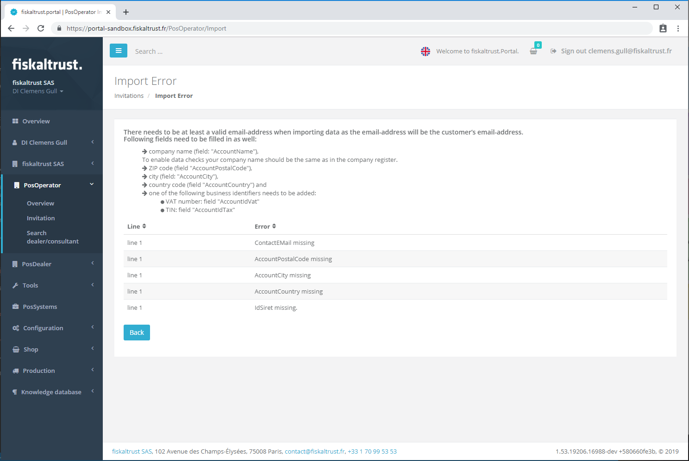
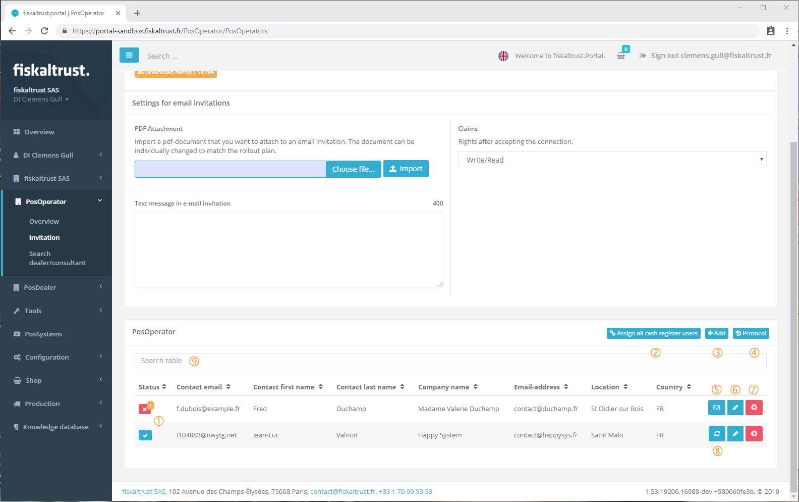
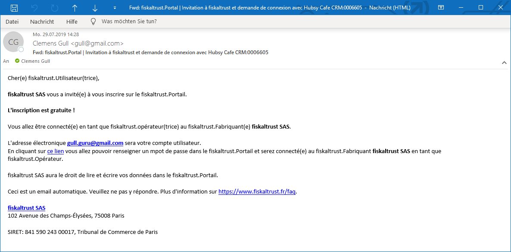
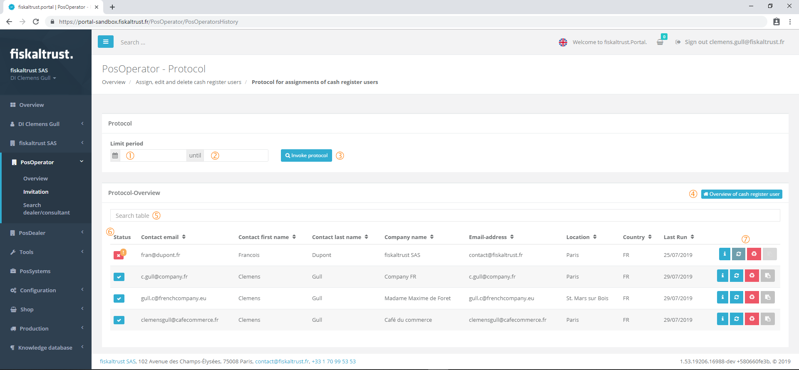
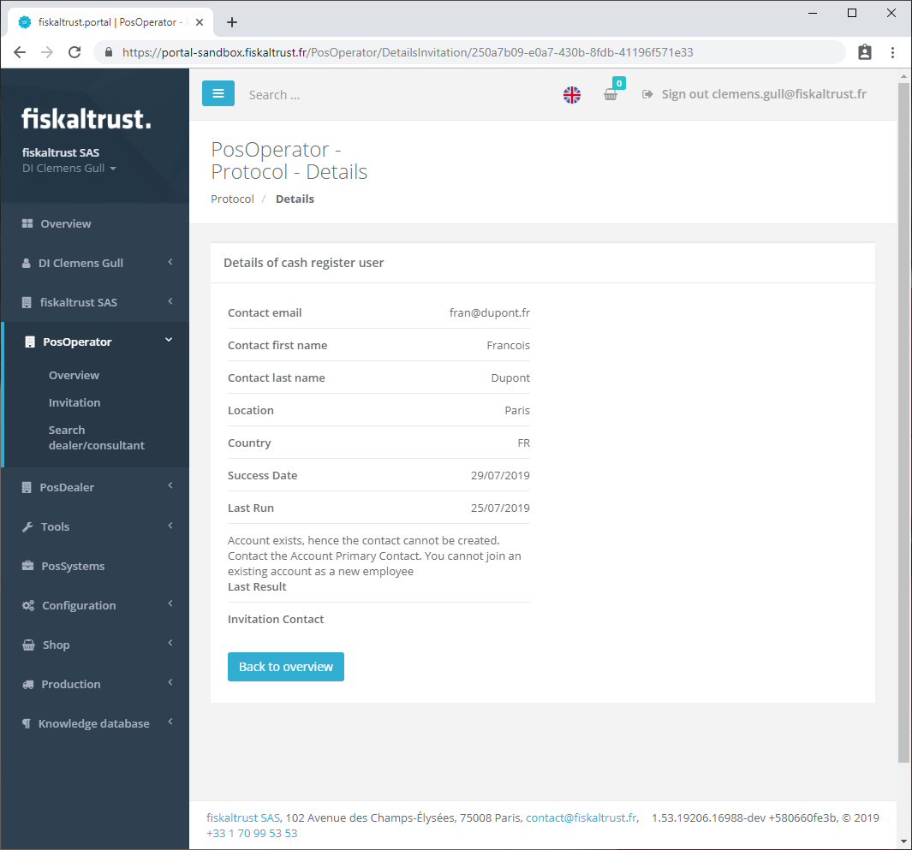

## PosOperator

### Invitation of PosOperators by PosDealers

The invitation of a PosOperator can only be made by a PosDealer, but not by a PosCreator or consultant.

However, the role of a PosDealer can also be activated by these companies and thus taken over in parallel to another role. (see chapter "[Roles](company.md#roles)")

PosOperator - Overview

By opening the PosOperator menu an _Overview_ with the assigned PosOperators is shown.

The assignments of the PosOperators can be found under the menu item _Invitation_.

There are two ways to add/assign PosOperators to a PosDealer:

1. For adding a single PosOperator, see chapter [_Add PosOperator_](#add-posoperator).
2. Adding several PosOperators by importing a CSV file with _Invitation_.

Invite PosOperators to a PosDealer account

 The CSV file is to be imported and selected via [Choose File].
 Then the import is carried out by clicking on [Import].
 The necessary structure of the CSV file is described using an example. This example can be obtained via [Download demo CSV file].

| Fields of the CSV file | Description | Mandatory |
|------------------------|-------------|:---------:|
| ContactFirstName | First name of the primary contact | yes |
| ContactLastName | Last name of primary contact | yes |
| ContactTitle | (Academic) Title of primary contact (before name) | no |
| ContactSuffix | Name suffix of the primary contact (after the name) | no |
| ContactEMail | Eail address of the primary contact **IMPORTANT!** This email address will be the user's login to this newly created company. | yes |
| ContactMobilePhone | Mobile phone number of the primary contact | no |
| AccountName | Company name, this should be written like in the commercial register | yes |
| AccountWeb | URL of the company's website | no |
| AccountEMail |Generel email address of the company **IMPORTANT!** All information about financial messages and all invoices will be sent to this email address! | no |
| AccountPhone | Company phone number | no |
| AccountAddressLine1 | Address, first line of the company | no |
| AccountAddressLine2 | Address, second line of the company | no |
| AccountPostalCode | Postcode of the company | yes |
| AccountCity | Address, first line of the company | yes |
| AccountCountry | Address, first line of the company | yes |
| AccountIdVat | UID number of the company. **IMPORTANT!** This is one of the identification criterias for legalisation of the service. | yes |
| AccountIdFibu| The _SIREN_ of the company **IMPORTANT!** This is one of the identification criterias for legalisation of the service. | yes |
| AccountIdGln | GLN of the company. | no |
| AccountIdTax | Tax office tax number of the company. | yes |

Not all of the fields _AccountIdVat_, _AccountIdTax_ and _AccountIdFibu_ are mandatory. Only one of the three fields have to be completed. It is recommended to use the field _AccountIdFibu_.

A pdf-file can be first choosen and then imported a PDF document, which is sent to the PosOperators as an attachment on the email invitations. This PDF document can be individually adapted to the rollout concept.

Before sending the invitation to all PosOperators listed in the csv file a text message can be added to this invitation email.

By accepting the invitation the PosOperator gets assigned to the PosDealer's account and this get some rights on the PosOperators account. This surrogating rights can be defined in the claims list.

##### Error message importing a csv-file for invitations

If not all of the mandatory fields of the csv file are completed an error message with the wrong or missing data is shown.

#### Add PosOperator

Add PosOperator manually

PosOperators can be added manually using this function, by clicking the [+&nbsp;Add]-button in the PosOperator's list head section. This is particularly interesting for the on-site support given by the PosDealer if a PosOperator wants to use the ft.Services immediately - in connection with the commissioning of a POS-System.

The following fields are mandatory fields and must therefore be filled in:

- Contact First name
- Contact Surname
- Contact Email
- Company's name
- Zip code
- City
- location

This is to guarantee that the PosOperator can be found correctly in the ft.Portal via his email address and can be assigned to the PosDealer.

#### Managing the invitations

Assigning, editing and deleting a PosOperator 

 Status of the invitation:
-  Email invitation has not been sent yet.
-  The data of the PosOperator is not correct and can not be assigned to the PosDealers account. It must be corrected with .
-  Email invitation was sent by clicking on .

 By clicking on [Assign all cash register users] the email invitation can be sent to **all** not yet invited PosOperators.

 By clicking on [+&nbsp;Add] a [manual invitation](#add-posoperator) can be down.

 A click on [Protocol](#protocol) shows the history of invitations of this account.

 By clicking on  the email invitation can be sent to a single PosOperator. The email invitation can be sent as an attachment with an individually designed PDF document.

Example email invitation of a PosOperator.

 The individual PosOperator can be edited again by clicking on .

 The individual PosOperator can be removed by clicking 

 The resend-button  sends the invitation again to the PosOperator's email address.

 By entering text in the search field the list of PosOperators gets filtered and only the PosOperators matching the entered text are shown.

#### Protocol of invitations

Protocol of PosOperator invitations

 The start date  of the log overview can be restricted using this field.
 The last date  of the log overview can be restricted using this field.
 By clicking on [Invoke&nbsp;protocol] the overview is filtered by the entered dsates. If the two fields are empty the whole protocol without any filter is shown
 By clicking on the button this window gets closed and the _Invitation_ module is shown.
 Entering a text filters the overview. By deleting all entered data in the search field the whole overview data is shown.
 Status of the invitation:
-  Email invitation has not been sent yet.
-  The data of the PosOperator is not correct and can not be assigned to the PosDealers account.
-  Email invitation was sent.

 Available commands for this PosOperator:
-  Detailed information about this contact is shown.

-  Sends the invitation to this contact again.
-  Deletes this row from the protocol.
-  Shows a window with the direct link for the invitation. This can be copyied in the clipboard and send by direct message.
