## User and company

:::danger **No maintenance anymore**

These manuals are no longer maintained! 

In case of any questions, we encourage you to refer to our current **[fiskaltrust Documentation Platform](https://docs.fiskaltrust.cloud/de/ "fiskaltrust Documentation Platform")**.  
For further details, check the corresponding Knowledge Base Articles (KBA), which can be found on the fiskaltrust.Portal.

:::

### Registration and Login

The Login or registration of a user takes place after clicking on \[Portal\] or directly going to the URL https://portal.fiskaltrust.fr/Account/Login. These two actions are described in this chapter.

[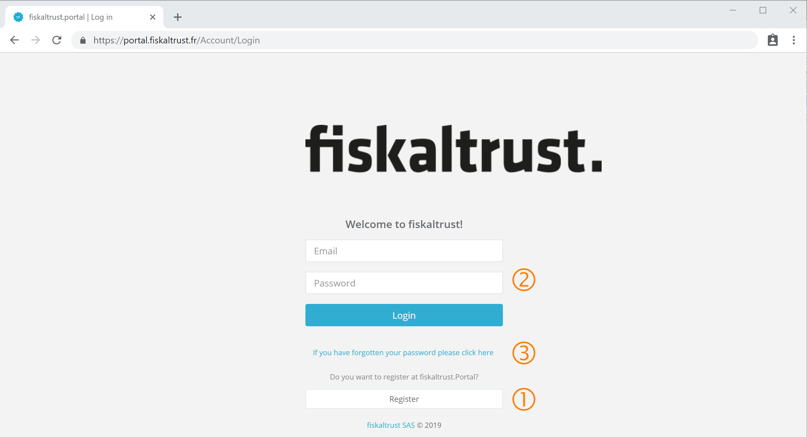](https://portal.fiskaltrust.fr/Account/login)
Login, link for registration with ft.Portal and password reset | [https://portal.fiskaltrust.fr/Account/login](https://portal.fiskaltrust.fr/Account/login)

 If you are not registered as an user on the ft.Portal you can click \[Register\] without filling in the access data and get to the registration form.
 If you are already registered on the Portal and therefore have an e-mail address and a password, you can login by filling the access data and clicking on \[Login\]. All portal functions released for the logged in user and the assigned rights are then available. For further information see Chapter _[Dashboard](dashboard.md)_.
 If you have forgotten your password to login, you can click on _If you have forgotten your password please click here_. This will take you to the page where you can request a new password. For further information see _[Reset password](#reset-password)_.

#### Registration

The registration process consists of four steps, which are described as following. With this process it is the first registration of an user, as well as the associated company to that user. This procedure is independent of the users future role, regardless of it is a PosCreator, PosDealer, Consultant or PosOperator, at the ft.Portal. 

#### Commercial number

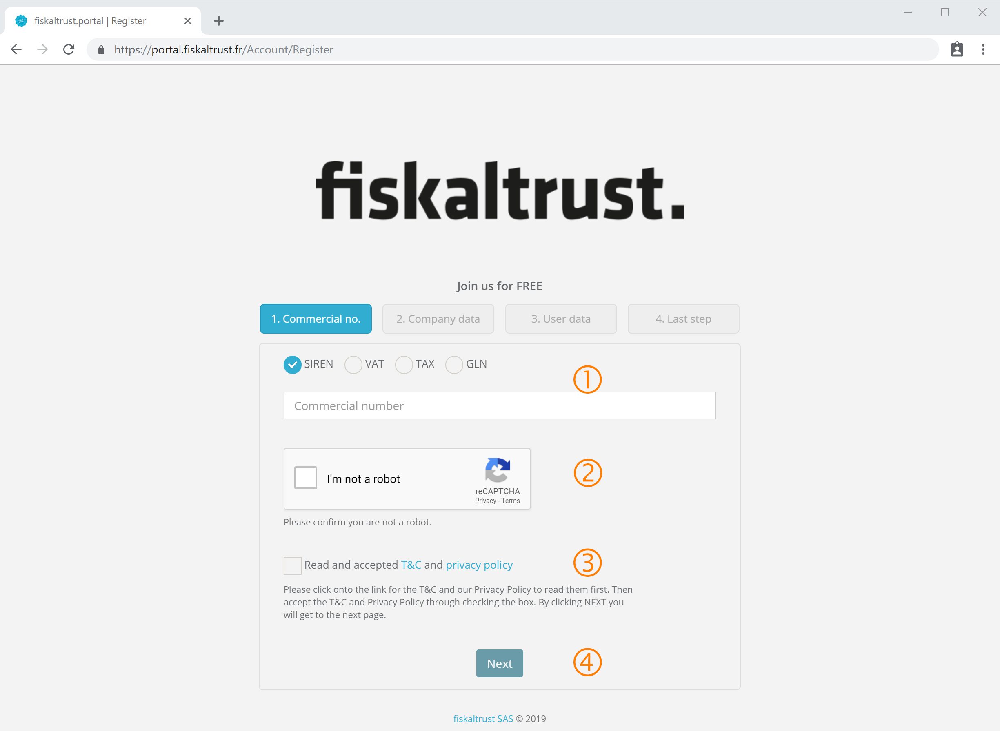
Entering a commercial number

 First of all you can enter one of four different commercial numbers on a voluntary base. Choose one of the radio-buttons to fix whcih type of the number you wish to use. Then enter the number in the textbox. The best option is to enter the SIREN for your company. In this case, in the following steps all data found will be prefilled from the system.
 The checkbox _I'm not a robot_ has to be ticked. This proves that the action being performed is not an automated process (meaning web robot) which is accessing this website. If captcha service is not sure of a personal presence, the following image shows up.

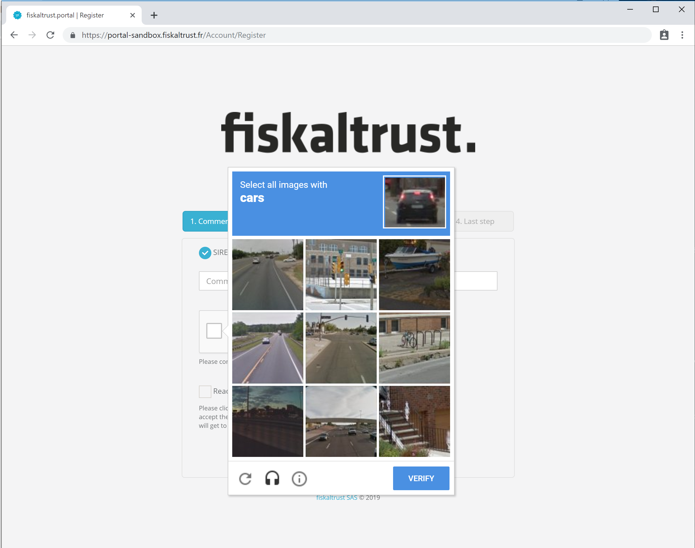
Example: Captcha prompt: "Select all images with cars".

Select all images corresponding to the object shown in the upper right corner and click on \[VERIFY\]. If necessary, you can click on the headset-icon on the left bottom to request audio help. For more information on the captcha service see https://support.google.com/recaptcha.

 Then tick the checkbox to accept the Terms and Conditions and the privacy policy of fiskaltrust. Both can be accessed with a click on the hyperlinks following the checkbox.

 By clicking on \[Next\] you can proceed to the second step called _Company data_.

#### Company data

The second step requires some company data. All the fields marked with a red star are mandatory and must be filled out with the correct data.

Complete the company's data

 The correct company has to be entered. The name will be verified later on against any entered commercial number. This name has to be the same as the one used in the commercial registers. for example the name from the K-bis should be used here. The name of the company may not already be in use for registration.

 A valid email-address must be entered in this field. The email-address for company data may not be used already for another company.

 The address of the company's headquarter must be entered.

 The zip-code and the name of the city where the headquarter resides must be entered.

 You can already enter some or all commercial numbers for the company. This will facilitate the further registration process and usage of the fiskaltrust.Portal.

 By clicking on \[Next\] you proceed to the 3rd step _User data_ of the registration process.

##### Error message after entered company data
If the data entered in _Company name_ and/or _email-address_ was already used for registration an informational page will be displayed.

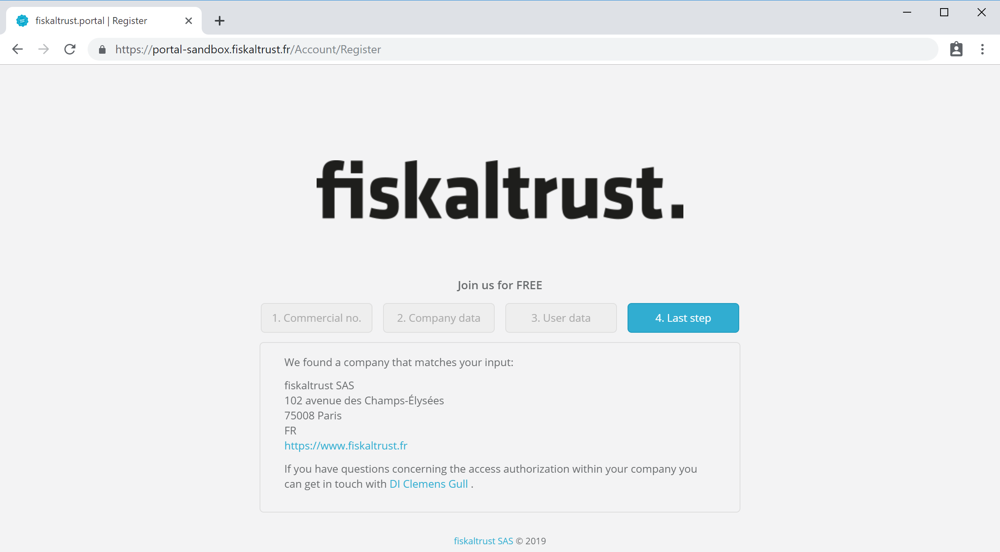
Company is already registered at the fiskaltrust.Portal

This page contains the information of the registered company and how to inform the primary contact in order to connect to this company. Click on the link of the shown primary contact to open your email application.

#### User data

The 3rd step of the registration process queries all the personal data of the primary user. All the fields marked with a red star must be filled out with the correct data. The primary user is the key contact used in the fiskaltrust.Portal.
This contact is the the designated administrator of the newly registered company. With this account other employees of the company can be invited. 
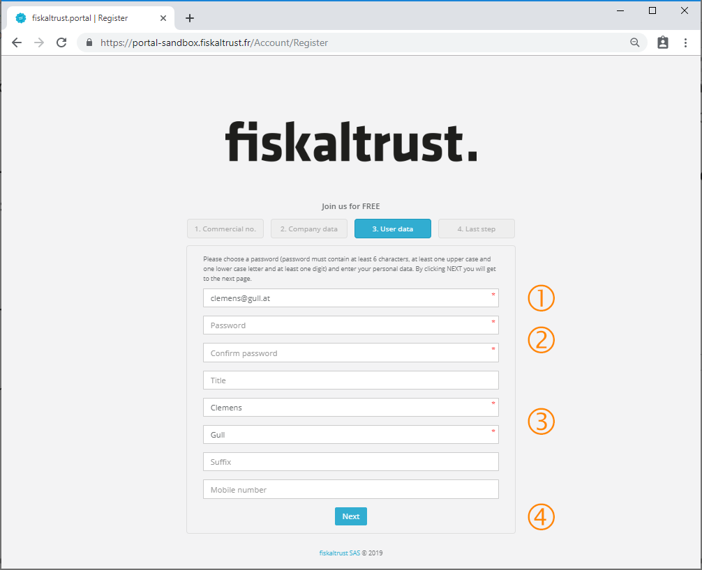
Completing the user data for the primary contact

 A valid email address must be entered and it cannot have been used already for another registration. This will be the primary contact and all messages from the ft.Portal will be sent to this address.

 Enter a password to be used for [login](#login) on the ft.Portal. Confirm the password by entering it twice. Be aware of the rules for passwords written on the top of this step.

 Further on enter the personal data fo the primary contact. Here the field for first and last name are mandatory.

 Click on \[Next\] to proceed to the last step of the registration process.

##### Error message after entered cousermpany data

If the email address entered in _email address_ was already used for registration, the following information will be displayed.

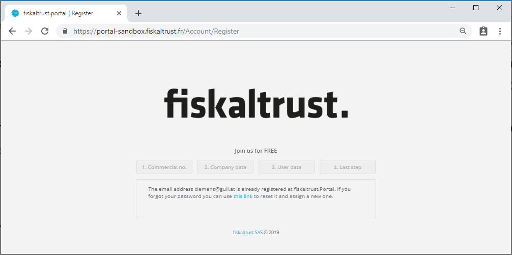
Already registered email address

By clicking on the hyperlink in the text, the password of the user with the entered email address can be reset.

#### Last step

With a successful registration the information at the last step is shown. The fiskaltrust.Portal sends an email with all the necessary information to your primary contact's email.

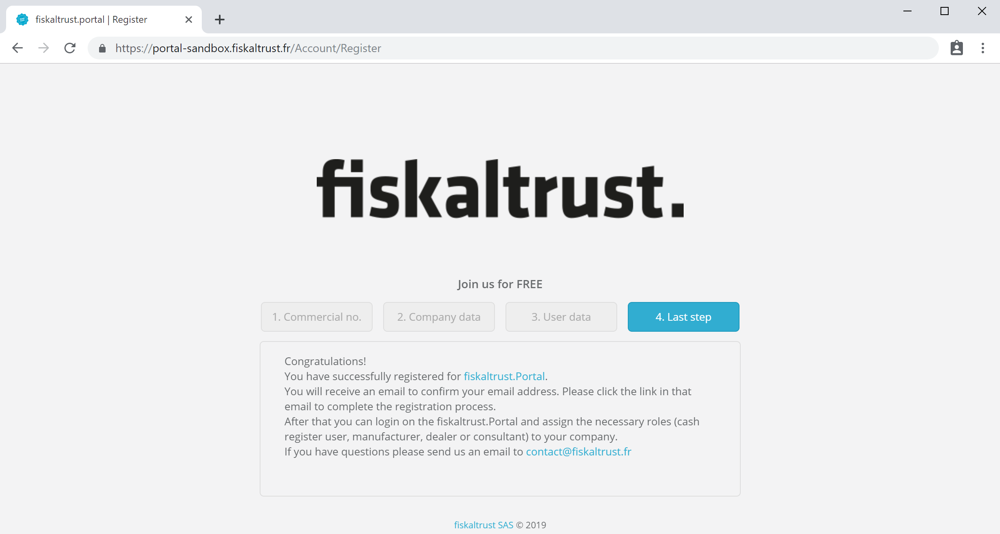
Completing the registration process successful

### Confirm registration

When the email is received in the primary contact's inbox, open it and click on the confirmation link. If you don't find the email in your inbox, look at the spam folder of your email application. Depending on whether you are registering on the _sandbox_ or on the _portal_ you'll receive this email from the sender _sandbox@fiskaltrut.fr_ or _portal@fiskaltrust.fr_

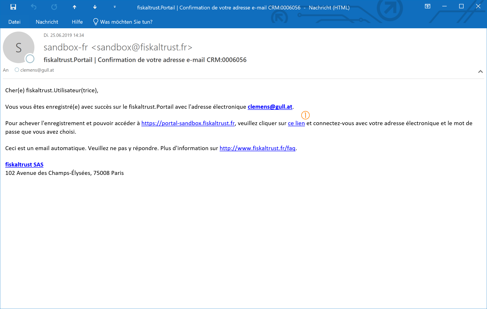
Confirmation email for registering the user

To fulfill the registration process and activate the account the link _ce lien_ has to be clicked. This link will be opened in a new browser window and confirms the activation of your account.

**The activation link is only valid for 24 hours!**
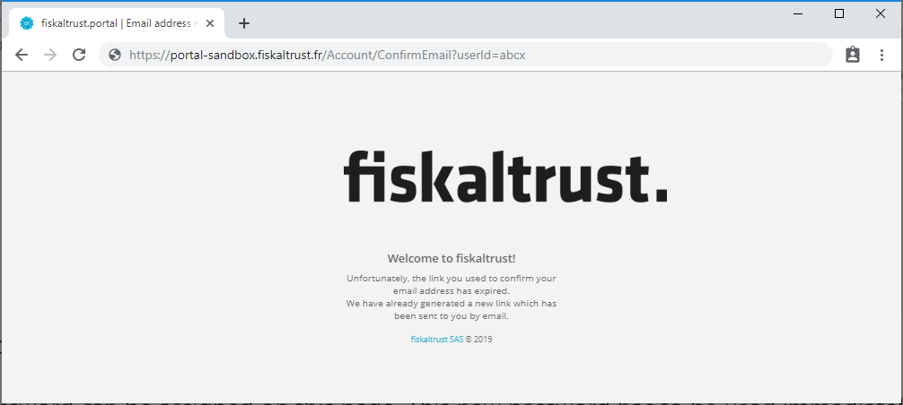
Confirmation email for registering the user

If this link is invalidated or expires, an informational page is shown and you will receive a new confirmation email automatically.

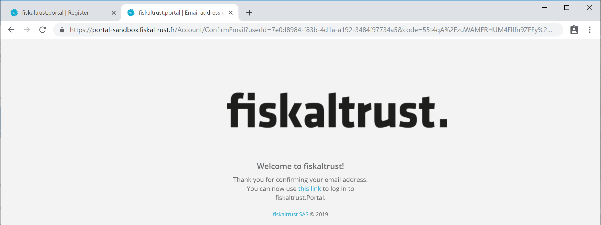
Activating the user account

Now your account is active and the link on the words _this link_ can be used, to proceed with the [login](#login) at the fiskaltrust.Portal.

### Login

If no active enterprise and/or user is know a new registration has to be done. This can be started by clicking on the button [Register]. For registration look at chapter [Registration](#registration).

If a user exists but the password is forgotten it can be reset with a click on the link _If you have forgotten your password please click here_.

For the login on the fiskalturst.Portal the credentials (_Email_ and _Password_) must be entered and confirmed with a click on the button [Login].

Login to the fiskaltrust.Portal

### Logout

To logout from the fiskaltrust.Portal two similar ways are proposed.

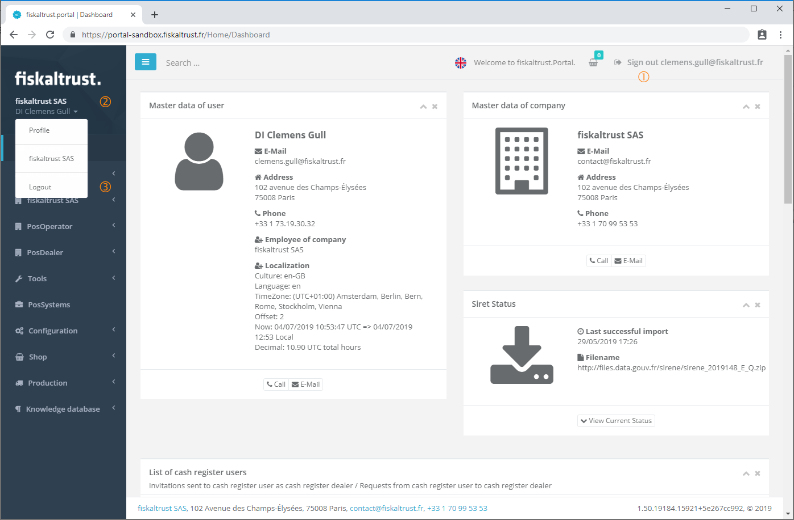
Login to the fiskaltrust.Portal

 By clicking on the name on the right top corner, the user is logged out from the portal.

Another way to logout is to open the submenu by clicking on the enterprise name on the leftside menu. In this menu the last command starts the logout procedure.

### Reset password

If the password is lost or forgotten, this function can be used to reset the password. On the login screen of the ft.Portal a hyperlink for requesting a new password can be found.

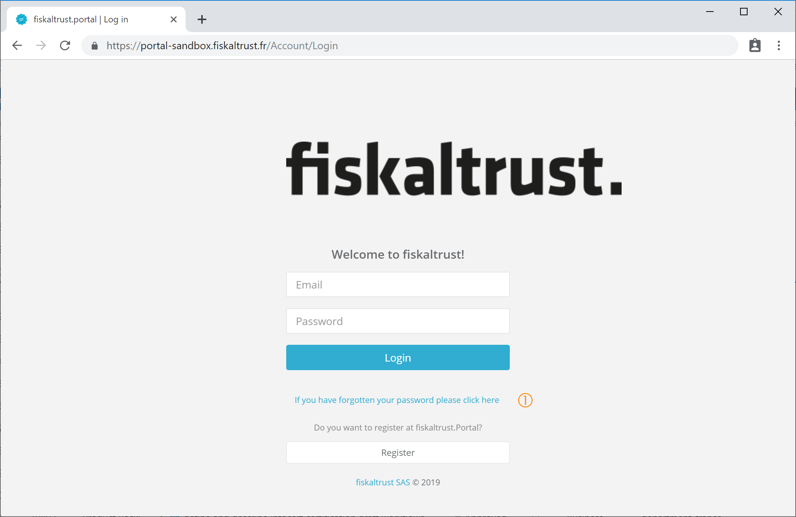
Link to reset the password

In the next step the checkbox for _I'm not a robot_. Then the username (email address) has to be entered. With a click on [SEND LINK] the Link to reset the password is sent to this email address.
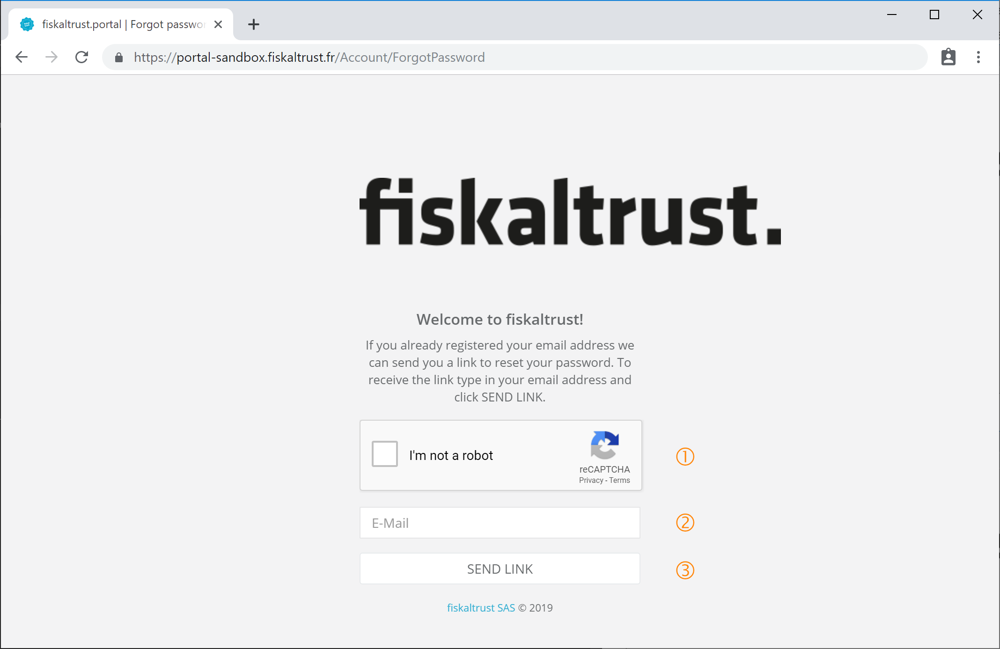
Enter email address for the reset link

The ft.Portal shows a confirmation, that the link for reseting the password was sent to the entered email address.
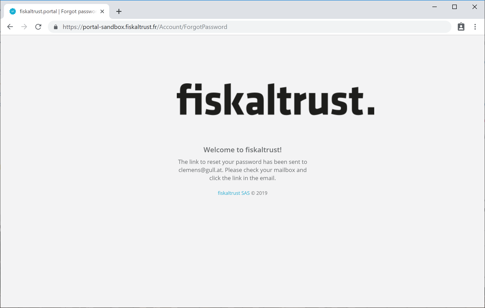
Confirmation of sending the link

After a few minutes the email with the link should be delivered to the inbox. Clicking on the link _ce lien_ opens a new browser window.
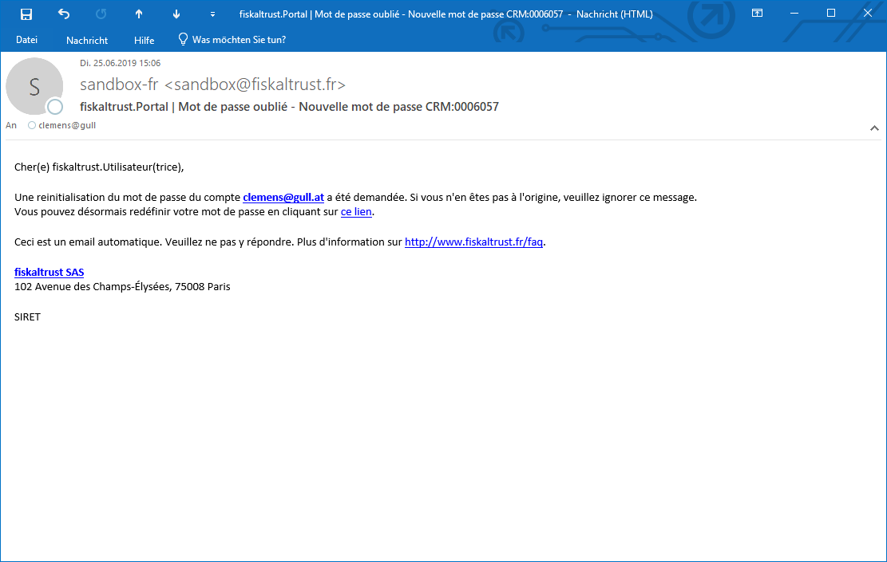
Email with the link to reset the password

In the shown browser window, the email address from the sent email has to be entered. Subsequently the new password can be entered and must be confirmed by entering it a second time. After clicking [RESET] the new password will be saved and a confirmation page is shown.
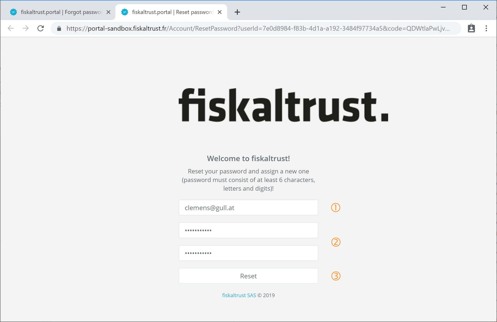
Resetting the password

The confirmation proves that the new password for the user is saved. By clicking on [Portal] the [login](#login) can be done with the new password.
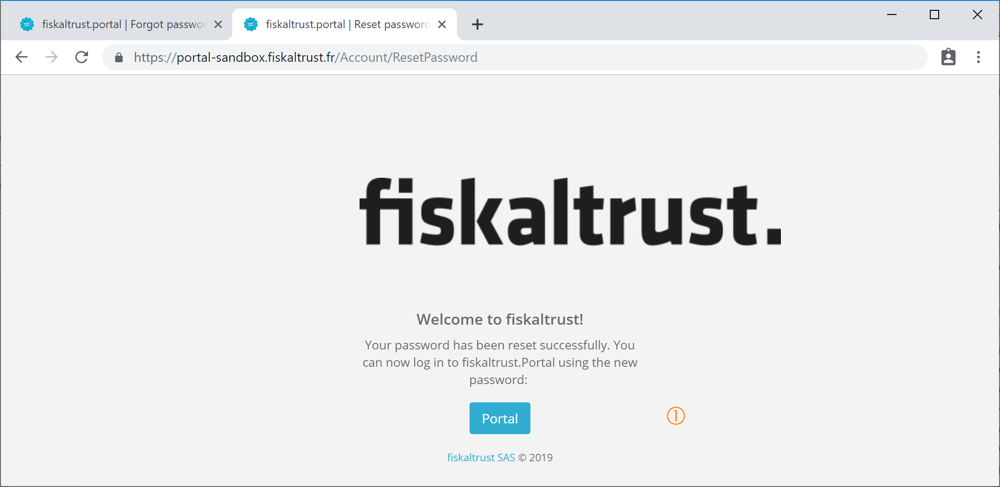
Reset password
