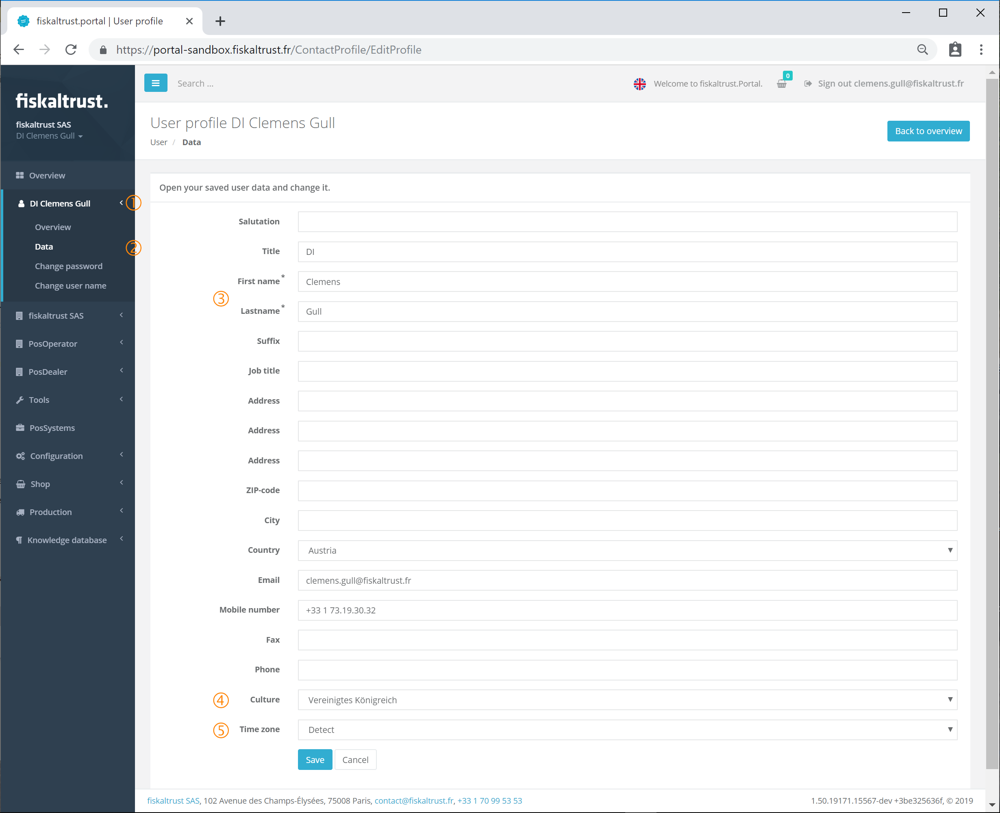
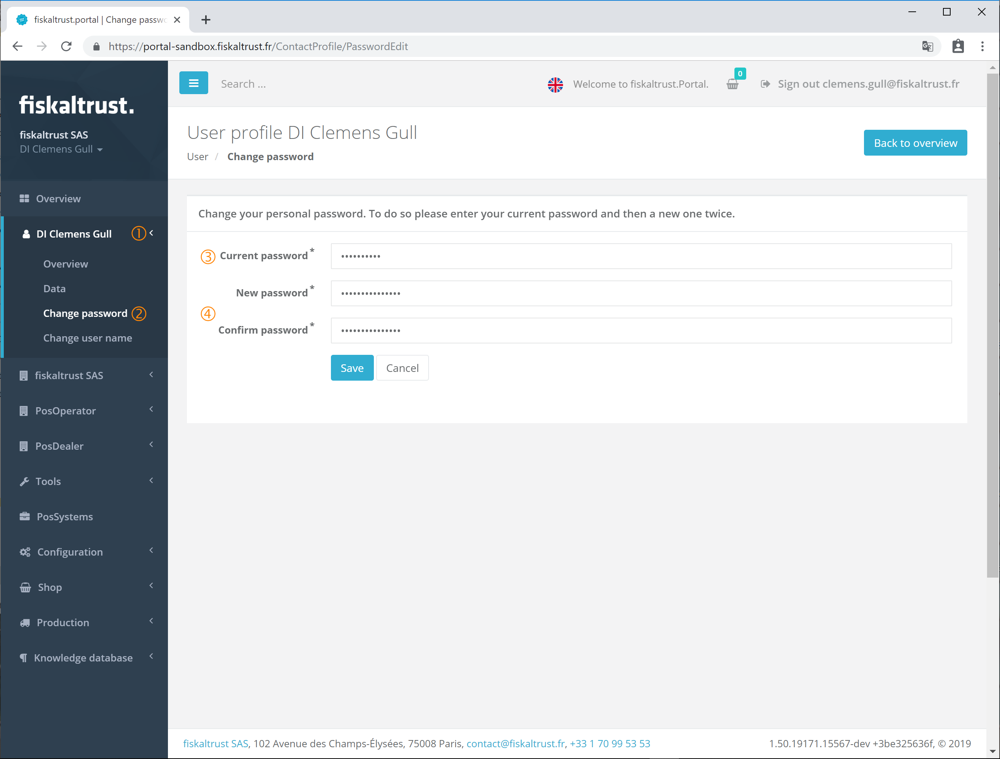
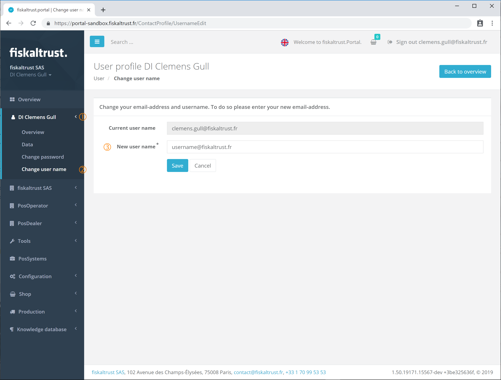

### User

:::danger **No maintenance anymore**

These manuals are no longer maintained! 

In case of any questions, we encourage you to refer to our current [fiskaltrust Documentation Platform](https://docs.fiskaltrust.cloud).  
For further details, check the corresponding Knowledge Base Articles (KBA), which can be found on the fiskaltrust.Portal.

:::

All the user data including password and user name can be managed by opening the menu by clicking on the _name of the user_ in the left sidebar.

#### Overview of the user

User overview

With the command _Overview_ the initial data like _Email_, _Address_ and _Phone_ number is shown. Additionally, all roles the user has in the ft.Portal are listed.

#### User data

User data

After opening the menu with a click on the _user name_ all the personal data can be managed with the command _Data_.

The two fields (_First name_ and _Last name_) marked with an asterisk (__*__) are mandatory. The more data that is entered the easier the user can be found by others. This can be very useful when assigning the user as an employee to an existing company.

To change the language of the fiskaltrust.Portal the correct _Culture_ has to be selected. If the ft.Portal should use the language of the browser then value _Detect_ should be selected.

To use the correct _Time zone_ the corresponding value can be selected. If the time zone of the used browser should be the standard, the value _Detect_ can be selected.

All changes can be stored in the ft.Portal by clicking on the button \[Save\]. The button \[Cancel\] closes the window without any changes being saved and brings the user back to the [Overview](#user-overview).

Changes in the fields _Culture_ and _Time zone_ take effect after a [Logout](registration-login.md#logout) and a new [Login](registration-login.md#login) of the user.

#### Change password

Change password

After opening the menu with a click on the _user name_ the password of the active user can be changed with the command _Change password_.

All the fields shown in this form are mandatory and have to be filled out before saving the data. The password can only be changed if the password of the active user is entered in the field _Current password_. If the current password is lost this form can not be used and the [_Forgotten password_](registration-login.md#reset-password) procedure should be initiated.

The new password has to be entered twice in _New password_ and again in _Confirm password_. The button [Save] stores the new password, which can then used with the next new login to the fiskaltrust.Portal. The button [Cancel] closes the window without any changes being saved and brings the user back to the [Overview](#user-overview).

#### Change user name

Change user name

After opening the menu with a click on the _user name_ the name of the active user can be changed with the command _Change user name_.

This form shows the _Current user name_ which is the email address of the current user. The _New user name_ can be entered and has to be a valid email address. Be aware that all messages from the fiskaltrust.Portal and/or fiskaltrust.Service are sent to the entered email address. The new email address has to be unique. This means the same email address should not be used in our system by another user.

By clicking on the Button \[Save\] the new user name is stored and can be used. For the best user experience a [Logout](registration-login.md#logout) and a new [Login](registration-login.md#login) should be done.
The button \[Cancel\] closes the window without any changes saved and brings the user back to the [Overview](#user-overview).
