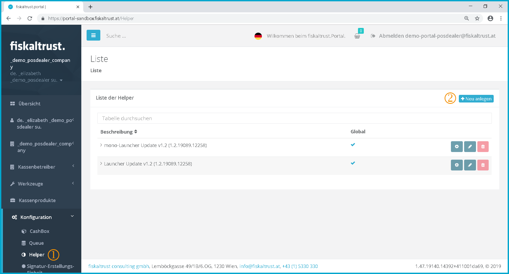
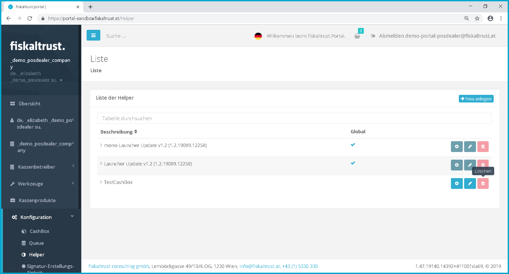

## Configuration

For using a template or a package see chapter [Buying a package in the shop or using a template](shop.md#buy-package-in-shop-or-use-a-template).

Overview of configured and available configuration containers

The creation and management of the components is discussed in the following chapters:

**in general**
- [Signature creation device](#SCU)
- [Helper](#helper)
- [Queue](#queue)
- [CashBox](#cashbox)

**for Austria**
- [Signature creation device](../handbook-at/configuration.md#SCU)
- [CashBox](../handbook-at/configuration.md#cashbox)

**in France**
- [Signature creation device](../handbook-fr/configuration.md#SCU)
- [Queue](#queue)
- [CashBox](#cashbox)

### CashBox

The CashBox is a kind of configuration container and is restricted by national laws. Refer to the chapter "Configuration" in the Appendix for each country.

### Queue

The functions are described in the currently valid interface description: [https://github.com/fiskaltrust/interface-doc](https://github.com/fiskaltrust/interface-doc). Be aware that a queue like the SCU itself are based on national laws. Refer to the chapters in the appendices for the national implementations.

### Helper

Helpers are modules which are extending the [CashBox](#cashbox) with further functionality.

#### Installation of the helpers

Overview of the Helpers

 In order to get to the installation and configuration of the helpers, click on the menu item "*Helper*".

 By clicking on \[Create new\] a page is called up, on which a new Helper can be created.

#### Add a helper

Add Helper

 In this field the name of the helper can be changed.

 Here you can use the dropdown menu to select from the various package versions.

 The package version can also be selected using a dropdown menu. These can be updated by clicking on .

 Click on \[Save\] to save the Helper configuration.

#### Overview Helper

Overview Helper

 To get to the Helper configuration, click on the menu item "*Helper*".

 Click on \[Create new\] to go to the page for creating a new helper.

 The name of the helper is displayed here.

 By clicking on , the basic settings and package configuration for individual use of the Helper in the cash register can be called up again.

 By clicking on  things like the description, package name and version of the helper may be edited.

 Click on  to delete the helper. However, the button to delete the helper is currently inactive for legal reasons, so no helper can currently be deleted.

 A brief overview of the data for the selected helper is displayed here.

 With the help of the search function, a helper can be searched for by entering any parameter in the search field.

#### Helper configuration

Helper - Configuration

 Here you can choose between the individual modes "least active" and "round robin" in the dropdown menu.

 In this field the name of the helper can be changed.

 Here you can create a URL for your Helper. By clicking on  you get a URL, which is suitable for local use without internet connection, because no firewall settings are required.

 By clicking on the  button, the system generates a URL for you with which the POS system can access the helper. You can rename the URL yourself. This can look like this: http://localhost.1200/Helperfiskaltrust

Click on \[Save\] to save the Helper configuration.

#### Helper delete

Helper - Delete

For legal reasons it is currently not possible to delete the helper.

### Signature Creation Unit
Refer to the chapters in the appendices for the national implementations of a signature creation unit.