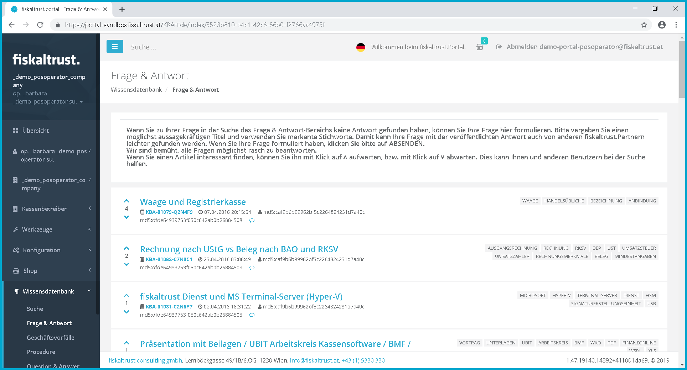
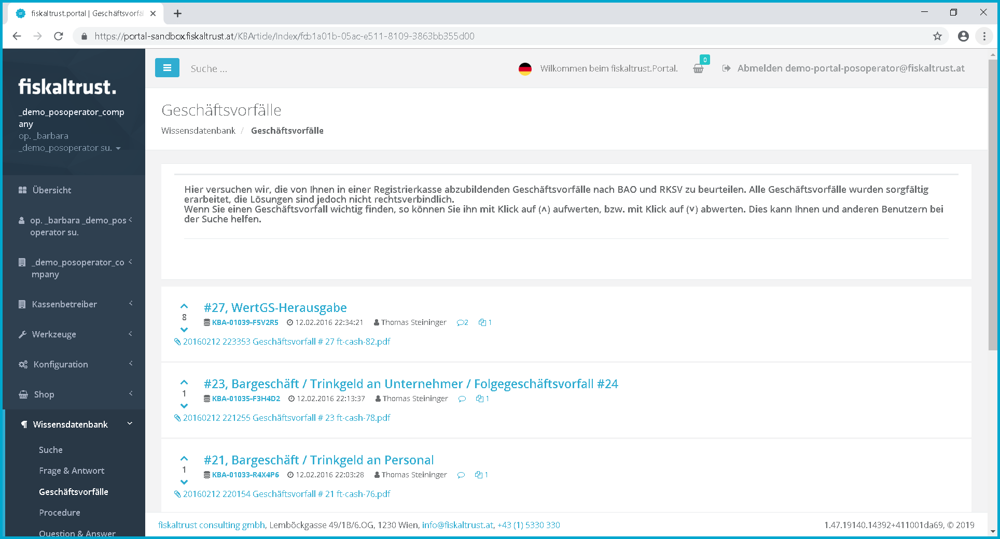

## Knowledge base

The knowledge base gives all users of the fiskaltrust.Portal to get information about common use cases and configuration problems and their solutions. All information provided in this database is available in the national language and coordinated with the national installations.

### Search the knowledge base

Search the knowledge base

### Questions & Answers

The "Questions & Answers" function is currently inactive. However, you can still view questions that have already been asked and their answers. At FAQ-section at the homepage, you will find a list of frequently asked questions. Should you as a partner (PosCreator, PosDealer) have any further special questions, please do not hesitate to contact us by email at [info@fiskaltrust.at](mailto:info@fiskaltrust.at) for Austria or for France at [contact@fiskaltrust.fr](mailto:contact@fiskaltrust.fr) .

Questions & Answers

### Business transactions

Business transactions
