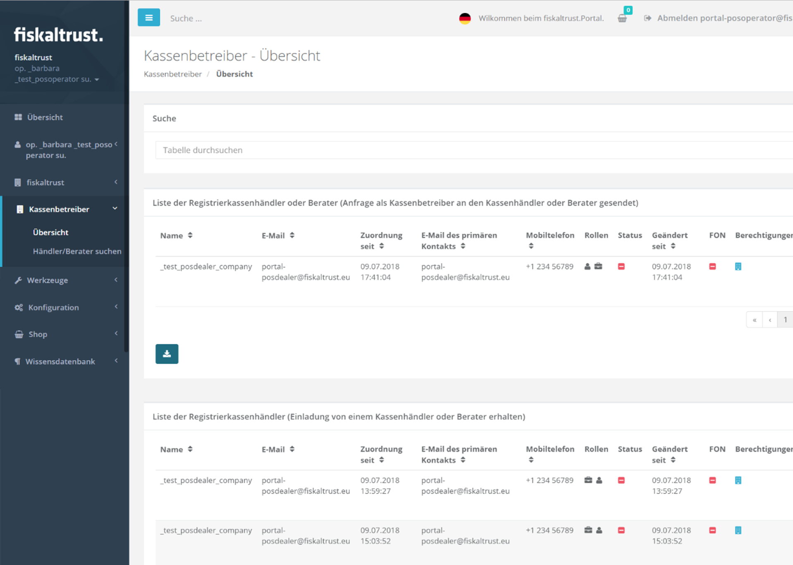

## PosOperator

### Overview of assigned PosOperators

Each PosOperator can log in to the ft.Portal like any other user and any company independently. (see "_Registration and Login_" in the country specific chapters)

The assignment of the PosOperator to a PosDealer is shown below.

Screenshot 21: Example - For the time being, no PosOperators are assigned to the company (PosDealer).

In the next example, a PosOperator is assigned to the PosDealer.

Screenshot 22: PosOperators - overview

 Overview in status - Waiting for approval by PosOperator

### Search for a PosDealer or consultant

Screenshot 23: Search for his consultant or PosDealer

 **Text:** "Search of his PosDealer or (tax) consultant in the fiskaltrust.Portal

 In this search field you can enter either enter a part of the name or the e-mail address.

By clicking on the button \[Search\] the entire fiskaltrust.Portal is searched for the search term.

Screenshot 24: List of PosDealers found

You can send these companies an e-mail inquiry by clicking on the button  "Request assignment - Dealer".

Screenshot 25: The assignment as PosDealer or consultant was requested by e-mail.

This request is immediately visible in the list of PosDealers or consultants and can be accepted by the respective company.

Screenshot 26: Example of a request of a PosOperator