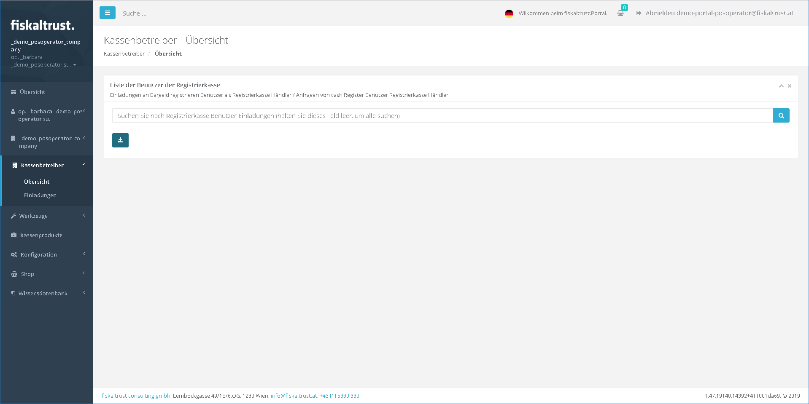
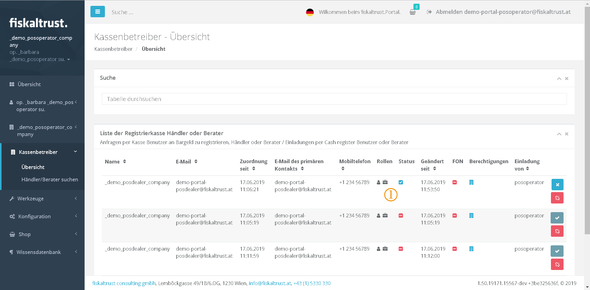
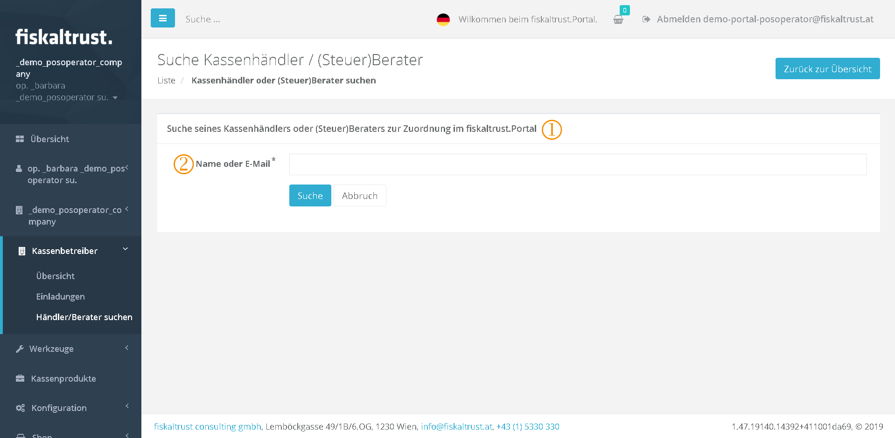
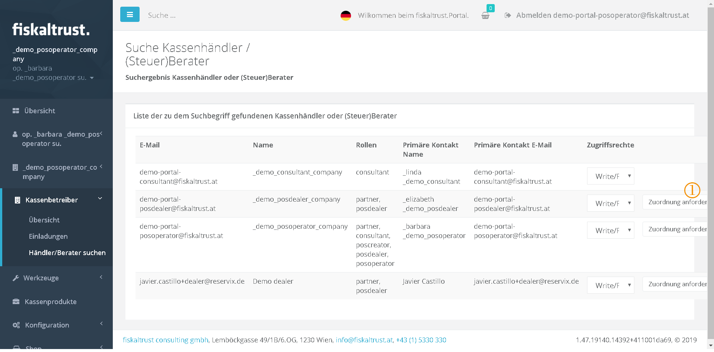
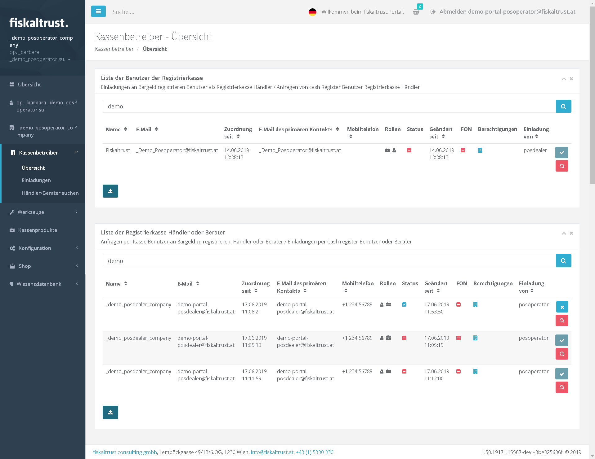

## PosOperator

:::danger **DEPRECATED**

The Portal manual is no longer maintained. For the latest documentation, please refer to the PosDealer or PosCreator section of this site.  

In case of any questions, we encourage you to refer to our current [fiskaltrust Documentation Platform](https://docs.fiskaltrust.cloud).  
For further details, check the corresponding Knowledge Base Articles (KBA), which can be found on the fiskaltrust.Portal.

:::

### Overview of assigned PosOperators

Each PosOperator can log in to the ft.Portal like any other user and any company independently. (see "_Registration and Login_" in the country specific chapters)

The assignment of the PosOperator to a PosDealer is shown below.

Example - For the time being, no PosOperators are assigned to the company (PosDealer).

In the next example, a PosOperator is assigned to the PosDealer.

PosOperators - overview

 Overview in status - Waiting for approval by PosOperator

### Search for a PosDealer or consultant

Search for his consultant or PosDealer

 **Text:** "Search of his PosDealer or (tax) consultant in the fiskaltrust.Portal

 In this search field you can enter either enter a part of the name or the email address.

By clicking on the button \[Search\] the entire fiskaltrust.Portal is searched for the search term.

List of PosDealers found

You can send these companies an email inquiry by clicking on the button  "Request assignment - Dealer".

The assignment as PosDealer or consultant was requested by email.

This request is immediately visible in the list of PosDealers or consultants and can be accepted by the respective company.
