## PosSystems

### Manage POS-System

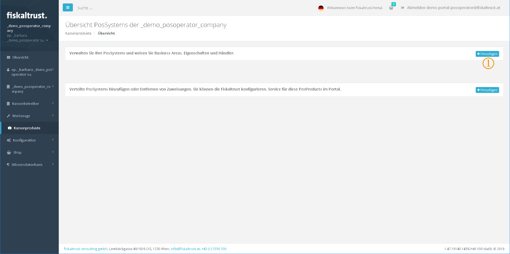
POS-Systems

 **Text:** "Here you can manage your own POS-Systems and assign them to industries, properties and dealers."

### Add POS-System

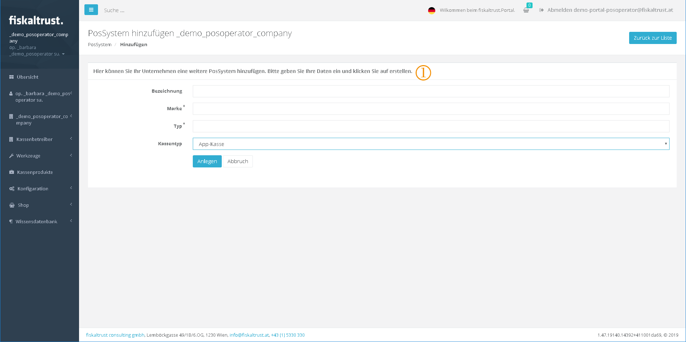
Add a POS-System

 **Text:** "Here you can assign another POS-System to your company. Enter the data and then click on \[CREATE\]."

### Overview

POS-Systems - overview

 **Text:** "Here you can manage your own POS-Systems and assign them to industries, properties and dealers."

 Here you can select the industries for which the POS-System is suitable, e.g. "POS software\_1A".

 Here you can define the properties that apply to the POS-System POS software\_1A.

 Here you can add another PosDealer to the POS-System, e.g. for this manual "POS software\_1A".

 The _PosSystemId_ is automatically assigned by the system. This must be used for programming by the PosCreator in order to send it to the ft.service in the request of the cash register. Only then can the cash register be assigned to the POS-System and thus to the PosCreator. Please note the information for PosCreators and in particular the current interface description at
[https://github.com/fiskaltrust/interface-doc](https://github.com/fiskaltrust/interface-doc).

### Industries served by a POS-System

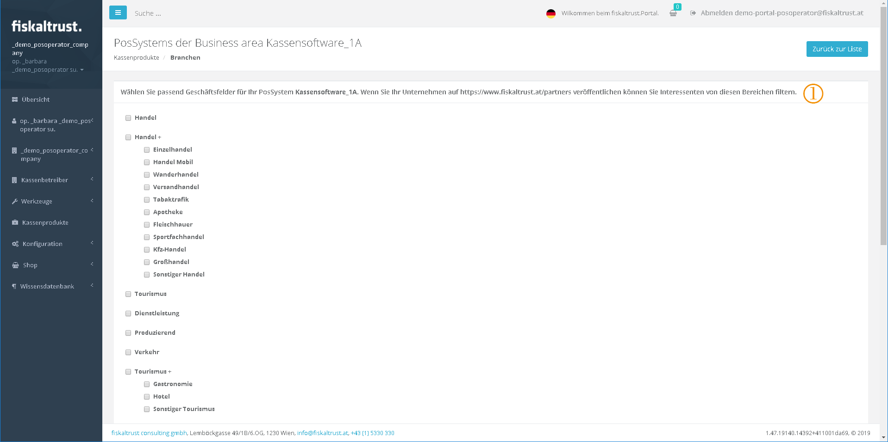
POS-System - Industries

 **Text:"** Here you can select the industries for which the POS-System POS software\_1A is suitable. If you publish your company in [the fiskaltrust partnerlist](https://portal.fiskaltrust.at/public/filterpartners), you can filter interested parties by these industries."

### Features of a POS-System

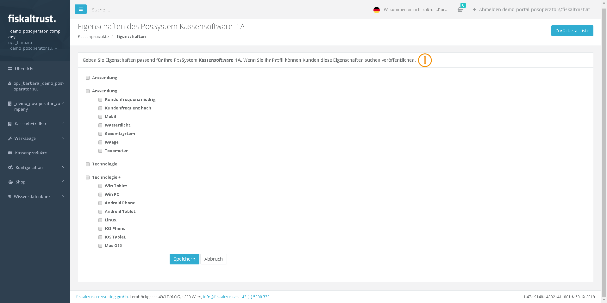
POS-System - Features

 **Text:"** Here you can define the properties that apply to the POS-System POS software\_1A. When you publish your profile, customers can search for these properties."

The "POS software\_1A" is an example for this manual.

### Add PosDealer to a POS-System

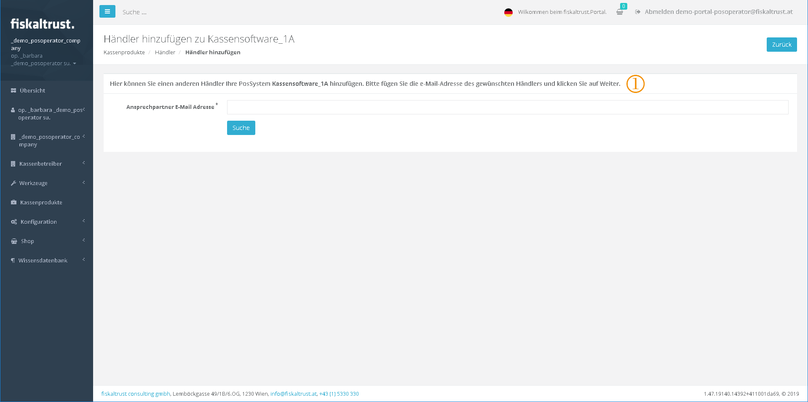
Add PosDealer to a POS-System

 **Text:"** Here you can add another retailer to your cash register software\_1A. First enter the email address of the retailer you wish to contact, then click \[Next\]."

The "POS software\_1A" is an example for this manual.

### Assign existing PosDealer to POS-System

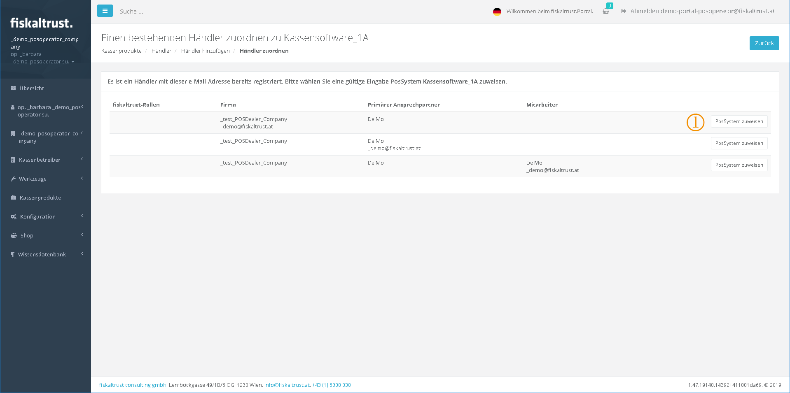
Assign an existing PosDealer to a POS-System

 Here you can assign already registered PosDealers to your POS-System.

### POS-System with assigned PosDealer

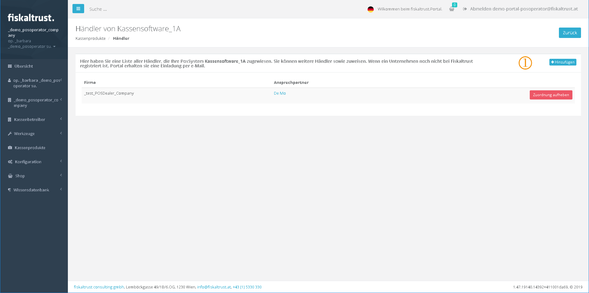
POS-System - assigned PosDeales

 **Text:** "Here you see a list of all dealers assigned to your POS-System POS software\_1A. You can assign further dealers. If a company is not yet registered in the fiskaltrust.portal, an invitation will be sent to it by email."

### Request POS-System as PosDealer

A PosDealer can use this function to assign a POS-System from a manufacturer.

The POS-System is searched for first.

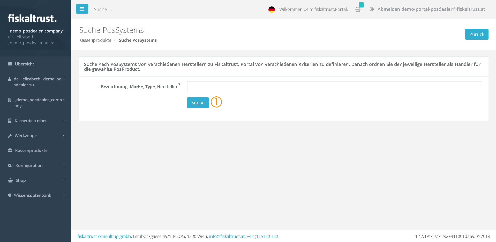
Search a POS-System

 **Text:** "Here you can search all POS-Systems already created in the fiskaltrust.Portal by various manufacturers according to various criteria. Afterwards you can be assigned by the respective manufacturer as a dealer for this POS-System distributed by you."

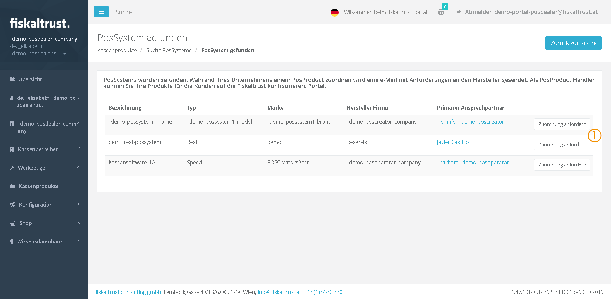
Request POS-System as PosDealer

 If the required POS-System was found, the assignment can be requested from the primary contact of the PosDealer.

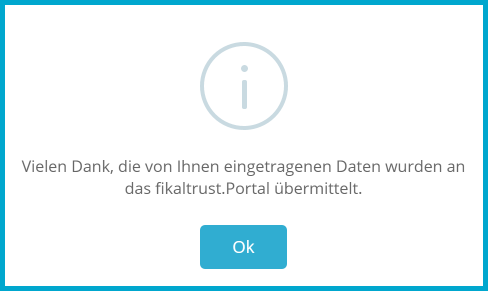
Request was submitted

If the PosCreator accepts the assignment, the connection between the PosDealer and the manufacturer's POS-System is established.

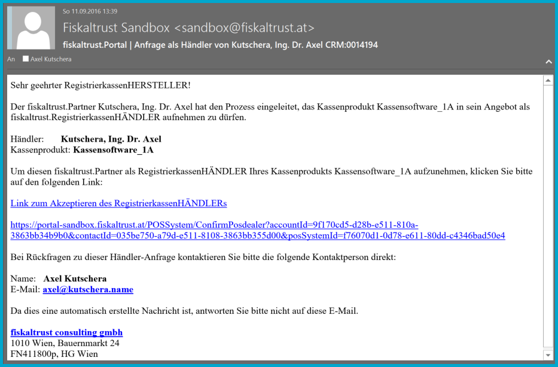
Email request with the request to assign a POS-System to a PosDealer

By clicking on the "Link to accept the PosDealer" or the link below, the assignment is accepted. With the login the overview of the PosDealers and manufacturer is called up.

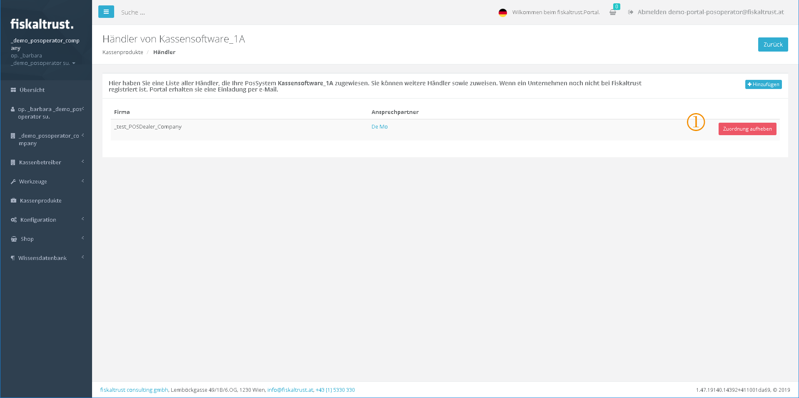
List of PosDealers assigned to a POS-System

 The PosCreator can cancel the assignment of a POS-System to a PosDealer at any time.
