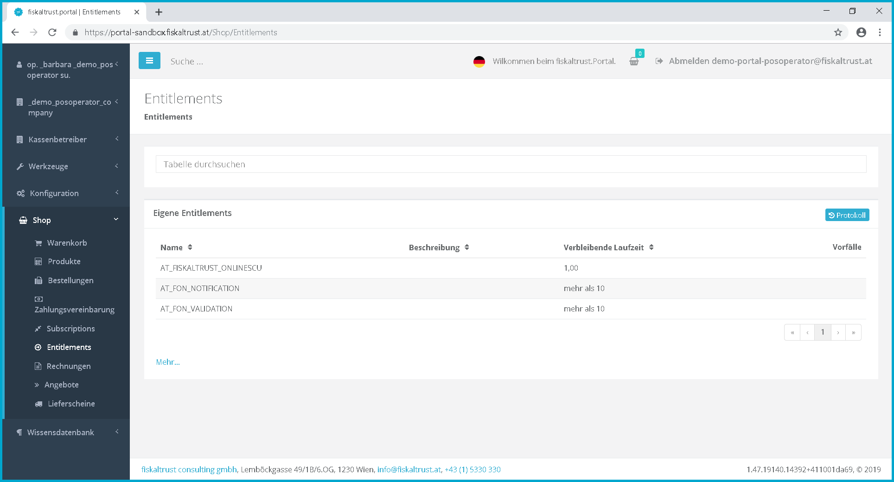
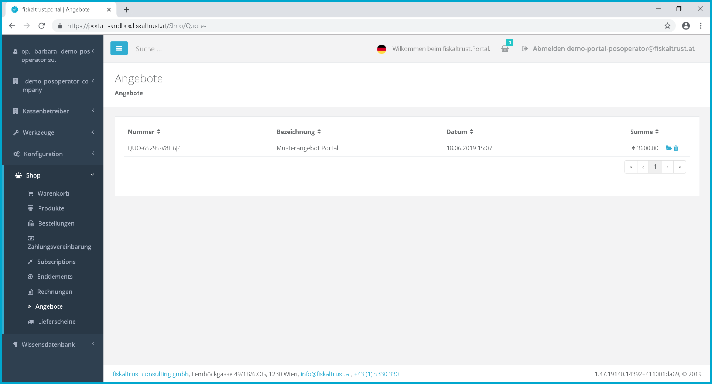

## Shop

The ft.Shop can be reached directly at 
- Austria: [https://portal.fiskaltrust.at/shop/](https://portal.fiskaltrust.at/shop/)
- France: [https://portal.fiskaltrust.fr/shop/](https://portal.fiskaltrust.fr/shop/)

### Methods to purchase ft.Products

You can order ft.products either through your PosDealer (as so-called "Entitlements") or directly through the ft.shop. Please clarify the appropriate method with your PosDealer. You can also place bulk orders with our support team. You can contact us for 
- Austria at [info@fiskaltrust.at](mailto:info@fiskaltrust.at).
- France at [contact@fiskaltrust.fr](mailto:contact@fiskaltrust.fr).

### Description of ft.Products

A list and the current descriptions of our products can be found as a remuneration sheet on our homepage 
- for Austria at [https://www.fiskaltrust.at/entgeltblatt](https://www.fiskaltrust.at/entgeltblatt)
- for France at [https://www.fiskaltrust.fr/tarifs](https://www.fiskaltrust.fr/tarifs)

### Products

Under the section "Products" you will find all products offered by us. Here you can put the selected products into the shopping cart.

Products

 Here you can specify the number of pieces of the selected products that you would like to put into the shopping cart

 By clicking on  you can put the desired product into the shopping cart.

### Shopping cart

In the shopping cart you will see a list of your selected products before payment. Here the contents of the shopping cart can be edited again.

Shopping cart

 All products in your shopping cart are displayed here.

 By clicking on \[Checkout\] you will be redirected to the next page where you can select your payment method.

Checkout

 Here you can see a list of the selected products

 Now you can choose from the different payment methods.

 To complete the purchase, click on \[Binding order\]

### Orders

Overview of previous orders as well as invoices and their status.

Orders

### Pay Agreements

This section shows the next payment due date for each annually recurring payment of subscription products.
](https://portal.fiskaltrust.at/Shop/Products/)
Pay Agreements

### Subscriptions

In "Subcriptions" you can view your subscription products.

### Entitlements (claims)

In this section, you will see a list of your available entitlements.

Entitlements

### Invoices

As soon as an invoice has been created for your products, you can view it under "Invoices".

### Offers

Offers created by fiskaltrust are listed here. By clicking on  the respective offer is put into the shopping cart and you can make the payment as in chapter [Shopping cart](#shopping-cart).  

Offers

### Shipping Notes

For hardware orders, the delivery notes are displayed under the menu item "Shipping notes". Shipment tracking is possible via [https://gls-group.eu/AT/de/paket-verfolgen](https://gls-group.eu/AT/de/paket-verfolgen).

### Buy package in shop or use a template

In the menu item "Configuration" a "CashBox" can be created manually.

Another possibility is the use of a free or chargeable "template". This is a preconfigured "sample template" with various properties to be defined, which is made available in the fiskaltrust.Shop. With such a template you can easily create many similarly configured CashBoxes. These CashBoxes can then furthermore be processed as described in chapter [CashBox](configuration.md#cashbox).
