# Disclaimer  

The Portal.manual is protected by copyright and may not be reproduced or distributed in whole or in part without the prior written consent of fiskaltrust consulting gmbh.

Version history

| Date | Version | Description | Abbreviation |
|------------|---------|-----------------------------------------------|--------|
| 25.09.2016 | 1.6 dev | Sandbox v1.6 dev; process description added | AK |
| 01.10.2016 | 1.6 dev | CSV-Import Customers; Supplements + Corrections | AK |
| 26.11.2016 | 1.6 | Corrections | AK |
| 26.06.2018 | 2.0 | Master Update (AK, DKA, GVA, SME) | AK |

## List_of_abbreviations

| Abbreviation | German | English |
|-----------|------------------------------------|--------------------------------|
| CashSys | Registrierkassa | CashSystem |
| SCU | Signaturerstellungseinheit | Signature Creation Unit |
| SSCU | Sichere Signaturerstellungseinheit | Secure Signature Creation Unit |

## General_and_important_information

The manual describes the most important functions of the fiskaltrust.portal. Also note the abbreviations in the "List of abbreviations"

The individual pages described are sometimes called up with delays of up to 60 seconds. This is due to the fact that some very complex processes, such as a database search, are carried out in the background.

As many details on the fulfilment of the cash register obligation in 2016 were published at very short notice and not all processes can yet be tested on a larger scale (e.g. nationwide registration via Finanz Online), we apologise for any errors in the start-up phase. For larger applications, please contact our team in advance.

We are pleased about any information for the improvement of our services.

## Software

### Internet_browser

If your Internet browser does not display some content correctly or features are not available, try using Google Chrome.

## Contact

### Support_information_of_fiskaltrust_consulting_gmbh

Please note the following information when using our support. This enables us to process your enquiry as quickly and completely as possible\!

fiskaltrust exclusively provides technical support for cash register manufacturers (hereinafter referred to as CashSys manufacturers).

The CashSys manufacturer and fiskaltrust assure each other of mutual support at least to the same extent and quality as this support is also assured to the respective customers within the framework of the user contracts.

Please read the information available by e-mail or on the Internet in advance\!

- [https://www.fiskaltrust.at/faq](https://www.fiskaltrust.at/faq)
- The existing knowledge database can be searched for articles in the fiskaltrust.portal. Please enter the search text at the top of "Search..." and start the search with ENTER.

Support requests can be billed to the requesting company.

The support services include:

- Acceptance of enquiries (electronically or by telephone)
- Qualified fault processing in your own area of responsibility
- Forwarding of more complex problems to downstream support units

Each CashSys dealer or CashSys manufacturer is responsible for his own customers.

The CashSys manufacturer or dealer is responsible for the installation and commissioning of the fiskaltrust security device. fiskaltrust does not know the individual configuration of the respective cash register and only provides the optimum product.

If you have any questions about the individual configuration, please contact your advisor.

We are happy to support the CashSys manufacturer or dealer.

To purchase the fiskaltrust products:

- Products can be ordered at your CashSys dealer or directly via the [fiskaltrust.webshop](https://www.fiskaltrust.at/products/).
- Payment is always made by PayPal or SEPA payment.
- With PayPal you can use a credit card or a bank account.

### Accessibility_of_the_support_hotline

We ask for your understanding that the response time can take several days due to the extremely large number of inquiries - depending on the complexity.

Please choose only ONE way to communicate and only the e-mail address [info@fiskaltrust.at](mailto:info@fiskaltrust.at)

- Support hotline: +43 (1) 5 330 330
- E-mail: [info@fiskaltrust.at](mailto:info@fiskaltrust.at)

Business hours:

- Mo-Th. 9:00-16:00
- Fr. 9:00-13:00

SEPA-Support of the company Slimpay

- [https://www.slimpay.com](https://www.slimpay.com)
- +49 30 30 807 129

## fiskaltrust_Portal

**[https://portal.fiskaltrust.at](https://portal.fiskaltrust.at)**

Please note that various menus and functions presented in this manual are only visible and therefore available after the corresponding authorization has been assigned in the user administration.

The so-called "primary contact" is the user who has all authorizations for a company and can therefore administer the authorizations.

## Homepage

**[https://www.fiskaltrust.at](https://www.fiskaltrust.at)**

The fiskaltrust.Portal (hereinafter ft.Portal) can be used free of charge by all partners and their CashSys operators. It can be reached directly via the URL [https://portal.fiskaltrust.at](https://portal.fiskaltrust.at) or via the hyperlink on the homepage [https://www.fiskaltrust.at](https://www.fiskaltrust.at).

All CashSys operators, manufacturers, dealers or consultants can easily manage the necessary functions for operating the cash registers via the ft.portal.

[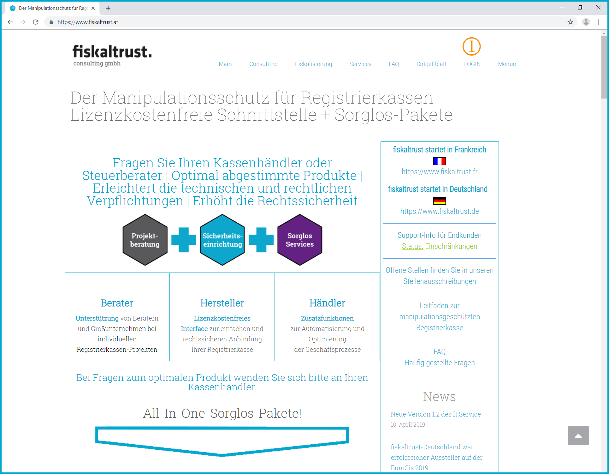](https://www.fiskaltrust.at)

Screenshot 1: Homepage | [https://www.fiskaltrust.at](https://www.fiskaltrust.at) with link to fiskaltrust.Portal

  By clicking on the hyperlink "*LOGIN*" on the homepage the ft.portal can be accessed.

The registration of a user and the company is explained in chapter "[Registration and Login](#registration_and_login)".

## Landing_Page

**[https://portal.fiskaltrust.at](https://portal.fiskaltrust.at)**

The Landing-Page is the welcome page of the ft.portal and can be accessed directly via the URL: [https://portal.fiskaltrust.at](https://portal.fiskaltrust.at).

[](https://portal.fiskaltrust.at)

[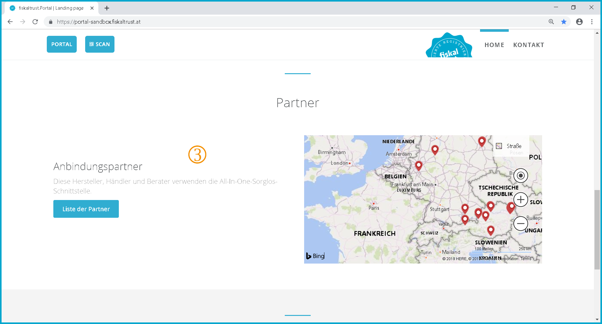](https://portal.fiskaltrust.at)
Screenshots 2_1 and 2_2: Landing-Page of the ft.portal | [https://portal.fiskaltrust.at](https://portal.fiskaltrust.at)

 
The login or registration of a user in the ft.portal is initiated by clicking on 

 By clicking on  the function to scan receipts is activated. See chapter [Scanned QR-Codes](#scanned_qr_codes).

 **Text:** Connection partner

These manufacturers, dealers and consultants use the fiskaltrust Service as well as the "All-In-One Carefree Products."

As a manufacturer, dealer or consultant, you can voluntarily register in the list of ft.partners via the ft.portal. These companies will be added to the list [https://portal.fiskaltrust.at/public/filterpartners](https://portal.fiskaltrust.at/public/filterpartners) with their contact details.

## User_and_company

### Registration_and_login

The login or registration of a user takes place after clicking on [](https://portal.fiskaltrust.at/Account/login)

[](https://portal.fiskaltrust.at/Account/login)
Screenshot 3: Login, link for registration with ft.portal and password reset | [https://portal.fiskaltrust.at/Account/login](https://portal.fiskaltrust.at/Account/login)

 If you are not registered as a user at the ft.portal you can click \[Register\] without filling in the access data and get to the new registration.

 If you are already registered at the ft.portal and therefore have an e-mail address and a password, you can login by filling in the access data and clicking on \[Login\]. All portal functions released for the respective user are then available. (see chapter "[Dashboard](#dashboard)")

 If you have forgotten your password as a user, you can click on "*If you have forgotten your password, please click here:*". This will take you to the page where you can request a new password. (see chapter "[Reset-password](#reset_password)")

### Registration:User's_Email_address

The "Registration" at the ft.portal is the first registration of a user, as well as the associated company (company).

This procedure is valid for all users who are to subsequently perform a function as CashSys operator, manufacturer, dealer or consultant.

[](https://portal.fiskaltrust.at/Account/Register)
Screenshot 4: Registration of a new user at the fiskaltrust.portal | [https://portal.fiskaltrust.at/Account/Register](https://portal.fiskaltrust.at/Account/Register)

#### Enter_Captcha

 The checkbox at "I am not a robot" must be activated to show that there is a manual activity of a person and no automated access by a (web) robot.


Screenshot 5: Example: Captcha prompt: "Select all images with cars".

Images are to be assigned to the corresponding objects. If necessary, you can request an audio task. (Info: [https://support.google.com/recaptcha](https://support.google.com/recaptcha))

 The e-mail address of the user must be filled in.

- This must be a valid email address.
- The e-mail address of a registered user may not be used.

Click on \[Next\]

Error messages after clicking on \[Next\]

- If the checkbox is not activated, the error message "Please execute the captcha\!" is displayed.
- If the e-mail address of an already registered user has been entered, the following information page with the link for resetting the password will be displayed.

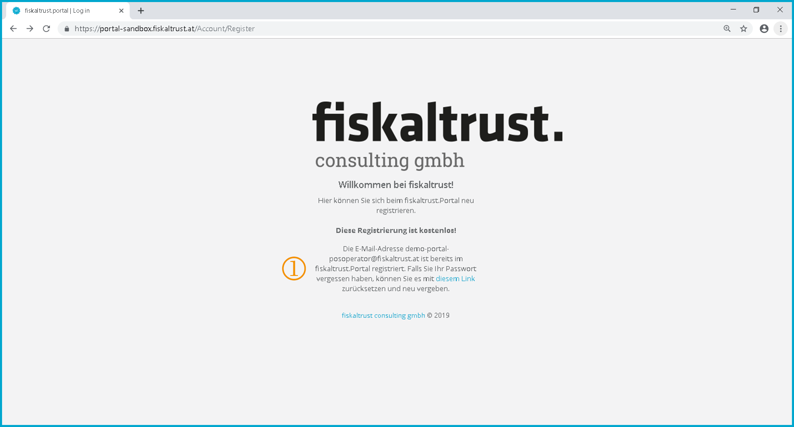

Screenshot 6: Information page after trying to re-register an e-mail address that has already been registered.

 **Text:** "The e-mail address demo-portal-posoperator@fiskaltrust.at is already registered in the fiskaltrust.portal. If you have forgotten your password, you can reset it using this link."

### Registration:User

After entering the e-mail address, you will be asked to enter personal user data.

[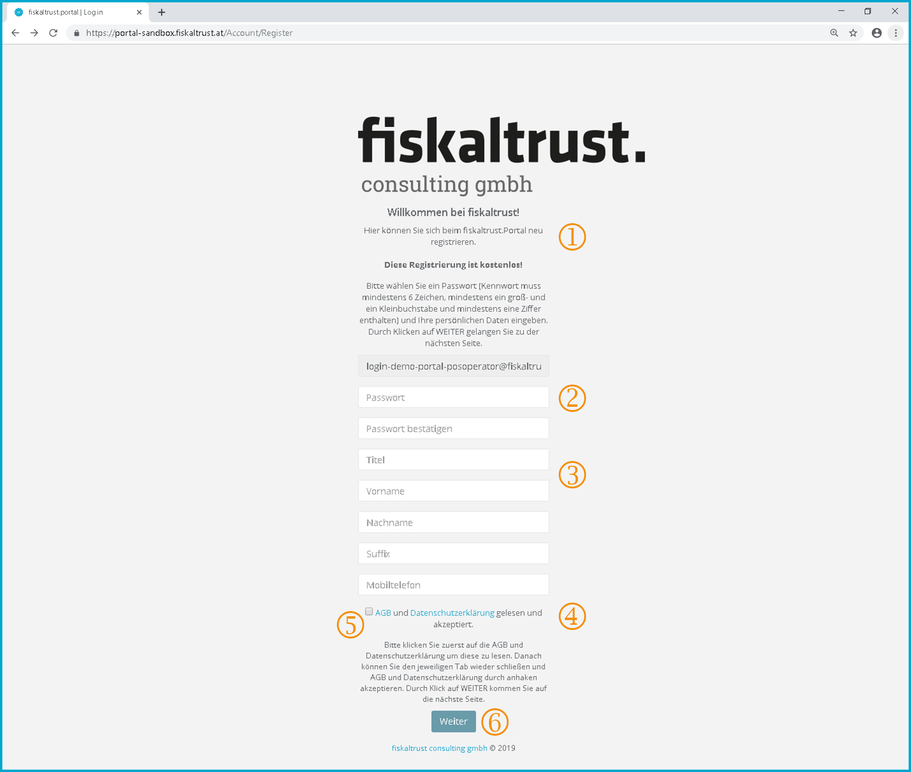](https://portal.fiskaltrust.at/Account/Register)

Screenshot 7: Registration - User (contact)

 **Text:** "Welcome to fiskaltrust\!
Here you can register at the fiskaltrust.portal.

This registration is free\!

Please choose a password (password must contain at least 6 characters, at least one upper and one lower case letter and at least one digit) to enter your personal data. Click on \[Next\] to go to the next page."

 Enter a self-selected password and repeat the password to confirm the correct entry, according to the specified syntax.

The fields "Password" and "Confirm password" are mandatory fields.

 Enter the personal data of the user.

The fields "First name" and "Last name" are mandatory fields. For example, you can enter an (academic) title after the name as a suffix.

 Read and accept the terms and conditions.

By clicking on "GTC" or "Privacy Policy", the GTC or the Privacy Policy will be opened in a new pop-up window of the Internet browser and must be read. After reading the general terms and conditions or the Privacy Policy, the pop-up window can be closed again.

By ticking the checkbox  to accept the GTC and Privacy Policy and clicking on , the contractual basis of the GTC is agreed between the user, the company and fiskaltrust consulting gmbh.

[](https://www.fiskaltrust.at/AGB)
Screenshot 8: GTC opened in a new tab. The text must be read and then accepted.

[](https://www.fiskaltrust.at/datenschutzerklaerung/)
Screenshot 9: Privacy Policy opened in a new tab. The text must be read and then accepted.

 Clicking on \[Next\] is only possible after filling in the mandatory fields and accepting the GTC and the Privacy Policy. Click on \[Next\] to go to the next page of the registration process.

The call up of the next page is to be waited for and can also take a longer time.

### Registration:Company

After entering the user data, you will be asked to enter the firm (company) data.


Screenshot 10: Registration - Company (firm) | [https://portal.fiskaltrust.at/Account/Register](https://portal.fiskaltrust.at/Account/Register)

 **Text:** "Please enter the master data of your company. By clicking on \[Next\] you will be taken to the next page."

 Enter the name of the company for which the user is registering. In the case of a sole proprietorship, the company name usually corresponds to the name of the sole proprietor.

The field "Company name" is a mandatory field. The company name is to be indicated as with the establishment of the enterprise.

 Since the user is created as the company's so-called "primary contact", the user's e-mail address has already been added to the company and cannot be changed.

 Enter the master data of the company. This master data can be changed later in the ft.portal and is also the basis for the voluntary display to be released by the user in [https://portal.fiskaltrust.at/public/filterpartners](https://portal.fiskaltrust.at/public/filterpartners). (see chapter "[Overview of roles and contractual relationships](#overview_of_roles_and_contractual_relationships)")

The fields "Zip Code" and "City" are mandatory fields.

If the company has a "UID number", it should be entered. This can be used to prevent that a company which was already created in the ft.portal is created again and therefore duplicated.

 Since the subsequent registration of a company via the ft.portal is currently not possible, the click should only be made if the user is to become active as an employee of an already registered company\!

At present the administration of all necessary functions can be carried out by the ft.team. We are gladly available at [info@fiskaltrust.at](mailto:info@fiskaltrust.at).

It is possible for a user to be assigned to a company as an employee. It is not possible for a user to be deleted by the user via the ft.portal you can only remove all access rights of a user.

Only an existing connection of a user to a company can be disconnected.

 If you click on \[Next\], the next page of the registration process will only be opened after the mandatory fields have been filled out. The call up of the next page is to be waited for and can take also longer time.

#### Registration:Confirmation_of-data-entry

The entry of the master data is completed with this information page.


Screenshot 11: Information page for the completion of master data entry

 **Text:** "Congratulations\!

You have successfully registered with the fiskaltrust.portal.

An email will be sent to you to confirm your email address. Please click on the link contained therein to complete your registration. Only then can you log on to the fiskaltrust.portal and assign the correct roles to your company (e.g. cash register operator, manufacturer, dealer or consultant).

If you have any questions, please send an e-mail to [info@fiskaltrust.at](mailto:info@fiskaltrust.at)".

#### Registration:Exception:Company_is_already_created_in_fiskaltrust.portal

If the company was already created in the ft.portal during registration and was found by the entered master data, the user is informed.

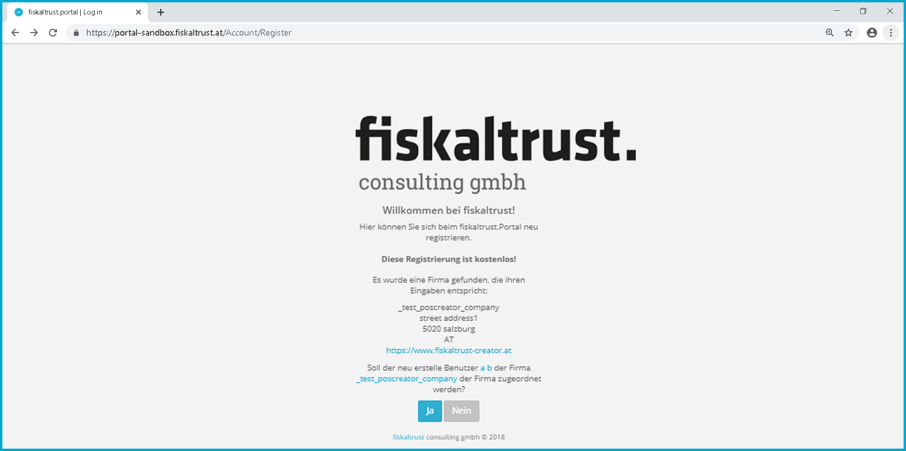
Screenshot 12: Information that a company with the same master data was found.

The comparison is made on the basis of the stored master data. (Order: UID number, postal code, city, name, ...)

Since it is currently not possible to subsequently enter a company in the portal, only click on if the user is to become active as an employee of a company\!

The administration of various administrative functions can be carried out by the ft.team. We can be reached at [info@fiskaltrust.at](mailto:info@fiskaltrust.at).

It is possible for a user to be assigned to a company as an employee. It is (currently) not possible to delete a user.

#### Registration:Confirmation_of_Email_address

Registration must be completed with confirmation of the e-mail address used.


Screenshot 13 - Example: Confirming your email address

 **Text:** "To complete the registration, process with this e-mail address and log into [https://portal.fiskaltrust.at](https://portal.fiskaltrust.at), please click on the following link and log in with your access data (e-mail address and self-chosen password)".

 By clicking on the word "*click*"  or on the visible link  the portal is called up. By using the coded link the portal recognizes that this link was assigned for the confirmation of the e-mail address of the user and/or the company. This releases the user's e-mail address for the ft.portal.

Now it is possible to log in with the newly created user data (e-mail address and personal password).

The link sent in the e-mail is only valid for a maximum of 24 hours. When this time has expired, the link must be opened and the password must be entered. This will send a new email confirmation.

#### Confirmation_of_Email_address_register_organization_account

After clicking on the link in the confirmation e-mail, an information page will be opened.

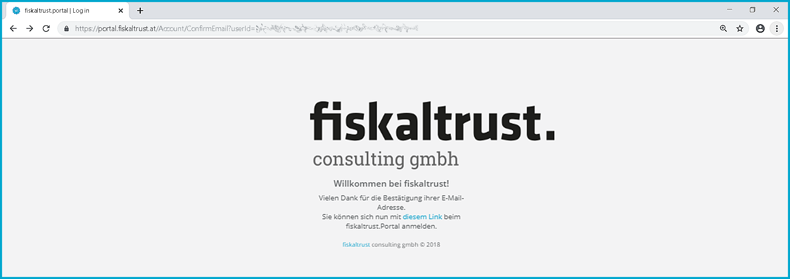
Screenshot 14: Information page after calling the confirmation link

By clicking on "this link" the login page of the ft.portal will be opened. (see chapter "[Login](#login)")

#### Exception:Activation_link_has_expired_or_is_invalid

If the activation link from the e-mail confirmation for the registration of a user has not been called up correctly (by click) within approximately 24 hours after sending, this activation link expires. An incorrect activation link can also clearly not lead to a confirmation of the e-mail address. If an expired or invalid activation link is called up, an information page is opened.

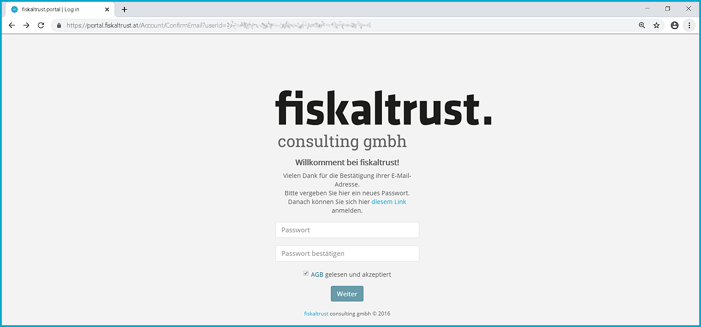
Screenshot 15: Password assignment after calling up an activation link

A new password can be assigned on this page. This new password has to be used immediately for the login of the user. Before clicking on \[Next\] the "*GTC* *and the Privacy Policy*" you have to click on them and accept them by activating the check box.

If the activation link has expired, the password cannot be assigned and the following page appears:


Screenshot 16: Information page: expired or invalid password reset link

 **Text:** "Unfortunately this confirmation link has expired. We have now generated a new link and sent it to you by E-Mail."

If you do not receive the e-mail with the confirmation link - e.g. because you do not have access to the e-mail account - you can contact [info@fiskaltrust.at](mailto:info@fiskaltrust.at).

### Login

[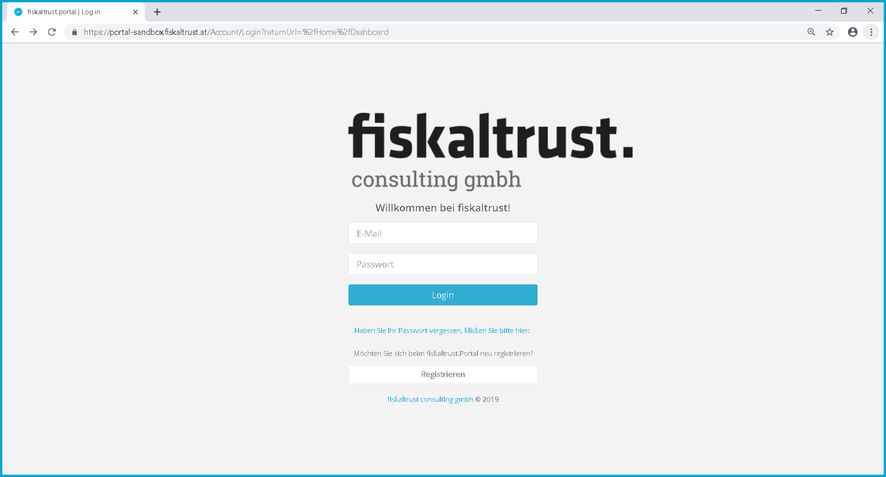](https://portal.fiskaltrust.at/Account/Login?returnUrl=%2fHome%2fDashboard)
Screenshot 17: Login of a user

### Reset_password

If the user forgets his password, this function can be used to reset the password.

[](https://portal.fiskaltrust.at/Account/Login?returnUrl=%2fHome%2fDashboard)
Screenshot 18: Login page with the link to reset password

 **Text:** "If you have forgotten your password, please click here:"

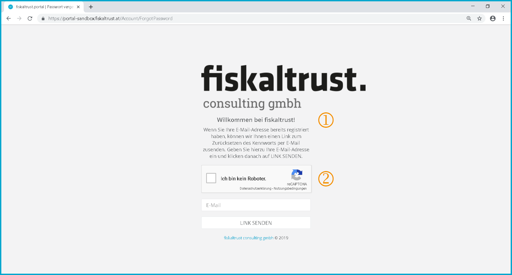
Screenshot 19: Captcha to check whether the function is called by a person.

 **Text:** "If you have already registered your email address, we can email you a password reset link. Enter your e-mail address and click on \[send link\].

 For the correct execution of the captcha check see chapter [Enter Captcha](#enter_captcha)


Screenshot 20: Information that an email was sent with a confirmation link to reset the password.

 **Text:** "The password reset confirmation link has been sent to *Email address*. Please check your e-mail inbox and click on the link contained in the e-mail".

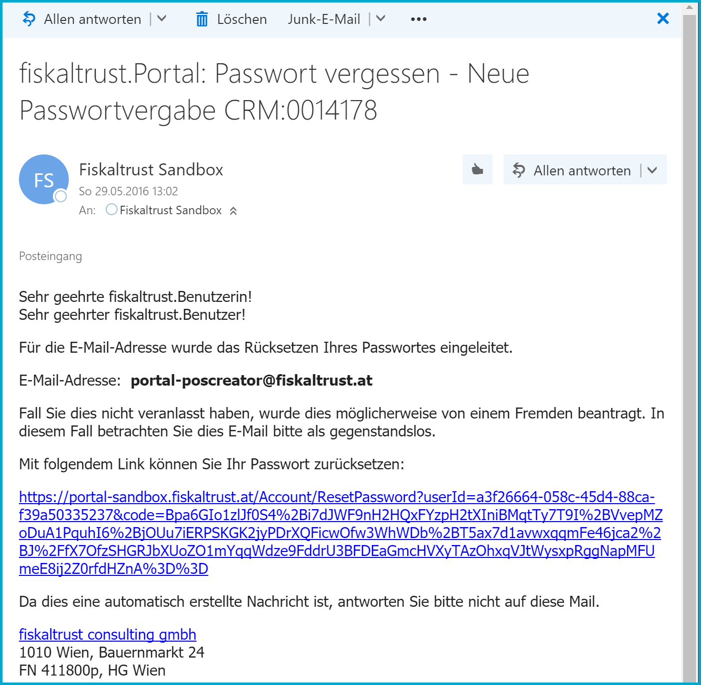
Screenshot 21: Email with a password reset link.

If the password reset link from the user registration confirmation email has not been called up correctly (by click) within 24 hours of sending, this activation link will expire. If an expired or invalid activation link is called up, an information page is opened.

The procedure for the new login begins anew (see chapter [Exception: Activation link has expired or is invalid](#exceptionactivation_link_has_expired_or_is_invalid))

If you do not receive the e-mail with the confirmation link - e.g. because you do not have access to the e-mail account - you can contact [info@fiskaltrust.at](mailto:info@fiskaltrust.at).

## Dashboard

After a user has logged in, the dashboard an overview page is called up. Via the menu bar on the left side, you can access the functions that have been released for the respective user.

Therefore, the menu structure may look different depending on the roles assigned.

[](https://portal.fiskaltrust.at/Home/Dashboard/)
Screenshot 22: Dashboard - overview page with the functions shared with the user

 Name of the user - Click on the username to access the submenus "Overview", "Data", "Change password" and "Change user name".

 Name of the company to which the user is assigned as a contact. If the user is not linked to any company, then no name of the company is given here, only the user. Click on the company name to access the Submenus "Overview", "Master data", "Account settings", "Sales area", "Employees", "Payment Methods" and "Outlets".

 Menus - only the functions available to the user with the respective submenus are displayed.

 By clicking on the symbol  , the displayed menu can be reduced in size on the left margin of the page.

 By clicking on the text "Log out e-mail address" the user is logged out of the ft.portal and the landing page is called up. (see chapter [Landing Page](#landing_page))

 Search field - The knowledge based articles are searched for the expression entered here.

 The contact details of the currently logged in user are displayed here.

 If the user has been linked to a company, the master data of the active company is displayed here.

## Dashboard_display_on_a_mobile_device

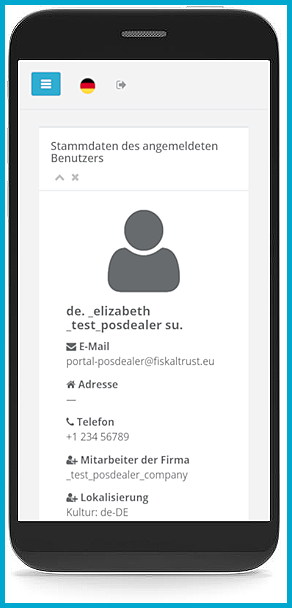
Screenshot 23: Dashboard on a mobile device

The display differs, for example, when using a smartphone or an Internet browser with a different language setting.

The menus should be usable in any display.

## Logoff

The logout from the active session takes place after a timeout or can be performed manually.

[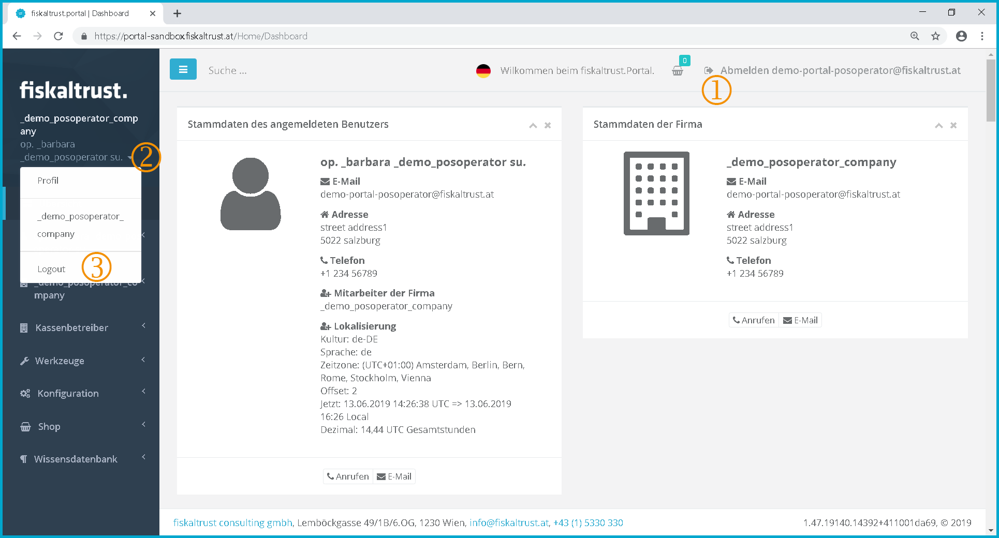](https://portal.fiskaltrust.at/Home/Dashboard/)
Screenshot 24: Page detail - Menu structure Log off

[https://portal.fiskaltrust.at/home/dashboard](https://portal.fiskaltrust.at/home/dashboard)

You can log out by clicking on the text "Sign out *E-Mail address*".

 Alternatively, you can log out by clicking on the company name or the user name and then clicking on the menu item  "Logout".

After logging out, the landing page is called up. [Landing Page](#landing_page)

## User

### Overview

In this menu area the master data of the user can be changed.

[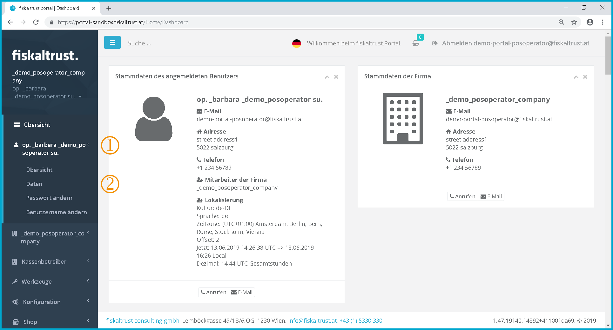](https://portal.fiskaltrust.at/Home/Dashboard/)
Screenshot 25: User overview

 By clicking on *user name* the function menu for users is opened.

 By clicking on *user name* the function menu for the menu items "*Overview*", "*Data*", "*Change password*" and *"Change user name "* can be called up.

### User_data_contact

The user master data can be displayed and changed here.

[](https://portal.fiskaltrust.at/ContactProfile/EditProfile)
Screenshot 26: User - Edit master data

Fields marked with "\*" are mandatory. The more master data is entered, the easier it is for other users to find the user in the ft.portal. This is useful, for example, when assigning the user to an existing company as an employee.

### User_change_password

[](https://portal.fiskaltrust.at/ContactProfile/PasswordEdit)
Screenshot 27: Change user login password

With this function you can change your own password. To increase data security, we recommend that you change your password at regular intervals.

## Company

### Overview_of_roles_and_contractual_relationships

example_in_which"no-role"_is_assigned

If a user has been assigned authorization to manage master data (or is the primary contact), these functions are available to the user.

With the authorization to conclude a contract, the user can enter into the contractual relationships of the company. In this case, the contract is concluded in absentia.

[](https://portal.fiskaltrust.at/AccountProfile)
Screenshot 28: Overview of company roles and contractual relationships with fiskaltrust [https://portal.fiskaltrust.at/AccountProfile](https://portal.fiskaltrust.at/AccountProfile)

In this example, the company has not been assigned a role. All sliders are up on the left side.

 Click on the company name to open up the function menu for the company.

 The menu items "Overview", "Master data", "Account settings", "Sales area", "Employees" "Payment methods" and "Outlets" can be called up here.

 **Text:** "Here you see all active roles and contractual relationships of your company."

 **Text:** "Here you can assign further roles in the fiskaltrust.Portal to your company."

The roles "CashSys Operator", "CashSys Dealer", "CashSys Operator" and "Consultant" can be managed.

 Since the company is not assigned a role as a partner in this example, no slider is visible with which you can enter the company in the publicly accessible partner list [https://portal.fiskaltrust.at/public/filterpartners](https://portal.fiskaltrust.at/public/filterpartners).

### Company_role_CashSys_manufacturer

This section describes how a company can activate and deactivate the role of a CashSys manufacturer. The respective contractual agreements between fiskaltrust consulting gmbh and the company can be concluded or terminated.

The roles CashSys dealer, consultant and CashSys operator are assigned in the same way, which is why the technical representation of these roles is omitted in this document.

#### Cooperation_agreement_CashSys_manufacturer

This function enables companies to use the role of a CashSys manufacturer in the ft.portal. Thus all functions of a CashSys manufacturer, e.g. the creation and administration of employees, cash register products or CashSys dealers are available to him in the ft.Portal.

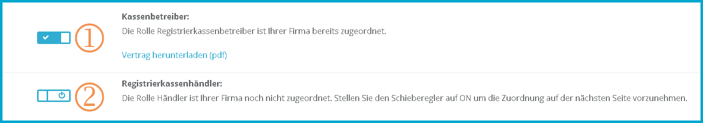
Screenshot 29: Slider for assigning the role "controller manufacturer"

 **Test:** "The Cashregister Operator" role hat been assigned to your company. Set the slider to OFF to remove the assignment on the next page

 **Text:** "The "Cashregister Dealer" role has not yet been assigned to your company. Set the slider to ON to make the assignment on the next page."

The slider is switched is by clicking on it. This works in both directions. This is to request that the role is to be accepted or that the underlying contract is to be concluded or terminated. The underlying contracts are presented on the following page. The sole switching of the slider does not lead to the conclusion of a contract or the termination of the contractual relationship.

This functionality applies analogously to the other contractual relationships.


Screenshot 30: Call of the cooperation contract before the conclusion of the contract.

After changing the slider from disabled to enabled, the page with the content of the cooperation agreement will be opened.

This does not yet lead to the conclusion of the contract.

#### Conclusion_of_contract


Screenshot 31: Conclusion of a contract and thus for role activation.

 **Text:** "GTC and Privacy Policy read and accepted.

Please confirm the contract by entering your name. Furthermore, please click on the GTC to display them, then please accept the GTC by ticking the box and click on send".

 The user must first read the contract text. This forms the basis of the contractual relationship between the company and the fiskaltrust consulting gmbh for each role in the respective version.

 The date and time of the call up of the contract text are logged by fiskaltrust after the conclusion of the contract and transmitted to the user as contract confirmation by e-mail as a .pdf document. The risk of data security and failure to provide information is borne by the user or the company and has no influence on the conclusion of the contract.

 The name of the authorised signatory must be entered in this field.

 Read and accept the terms and conditions. By clicking on "GTC" or "Privacy Policy", the GTC or the Privacy Policy will be opened in a new pop-up window of the Internet browser and must be read. After reading the general terms and conditions or the Privacy Policy, the pop-up window can be closed again.

By ticking the checkbox   to accept the GTC and Privacy Policy and clicking on "Next" , the contractual basis of the GTC is agreed between the user, the company and the fiskaltrust consulting gmbh. Since fiskaltrust has common general terms and conditions for all contracting parties, these are formulated in the same wording as agreed during the registration of user and company.

 Only after activating the checkbox for the "*GTC and Privacy Policy read and accepted*" can the contract be approved by clicking on. \[Sign\]

By clicking on \[Sign\] a contract is concluded between the company and fiskaltrust consulting gmbh and the overview of roles and contractual relationships is then displayed again.

Then the slider for the respective role is changed from \[Disabled\] to \[Enabled\].

 Before clicking  \[Sign\] the process can be canceled by clicking on  \[Cancel\].

Clicking on \[Cancel\] does not lead to the conclusion of a contract and the overview of roles as well as the contractual relationships is called up.

The slider is then reset to the \[Disabled\] position of the respective role.

#### Active_role_CashSys_manufacturer

After you have activated the role and concluded the contract, the overview of roles and contract relationships changes.

[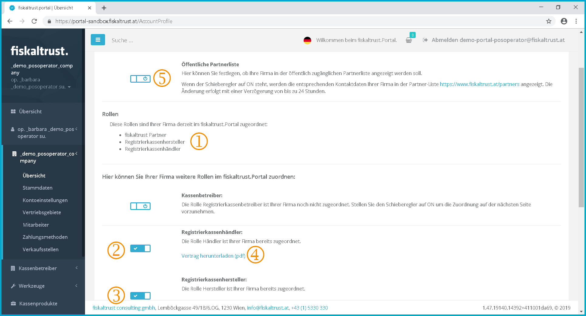](https://portal.fiskaltrust.at/AccountProfile)
Screenshot 32: Active role as CashSys manufacturer - inactive partner role

 **Text:** "These roles are currently assigned to your company in the fiskaltrust.Portal"

 The slider is set to \[Enabled\]. This indicates that the respective role is enabled. By clicking on the slider the role can be put back and the contract can be cancelled. (see chapter [Resetting the Roleof CashSys manufacturer](#resetting_the_role_of_cashsys_manufacturer))

 **Text:** "The cash register manufacturer role is already assigned to your company."

 **Text:** "Download contract (pdf)"

Click on this link to download the contract text. This is personalised with the name of the signatory as well as the date and time of the conclusion of the contract. (Example: "Read and accepted on 29.05.2016 at 17:40:22 by \_jennifer \_test\_poscreator")

 This slider can be used to set whether the company's contact details appear in the public partner list or not ([https://portal.fiskaltrust.at/public/filterpartners](https://portal.fiskaltrust.at/public/filterpartners)). (see chapter " [Activating the role - Public partner list](#activating_the_role_public_partner_list) ")

After the conclusion of the contract an e-mail confirmation is sent to the user of the company.


Screenshot 33: Email confirmation: Welcome as fiskaltrust.CashSys Manufacturer

#### Activating_the_fiskaltrust.partner_role

Already with an active role as a "CashSys manufacturer", "CashSys dealer"
or "consultant" one achieves the status as a fiskaltrust partner.

 
Screenshot 34: Email confirmation: Activation of the fiskaltrust partner role

This partnership is free of charge and enables e.g. the use of the ft.service as well as various advertising media.

#### Activating_the_role_public_partner_list

With the status ft.partner it is possible to enter a company in the public partner list.

This entry is voluntary, free of charge, revocable and can be changed by the ft.partner at any time via the ft.portal.

[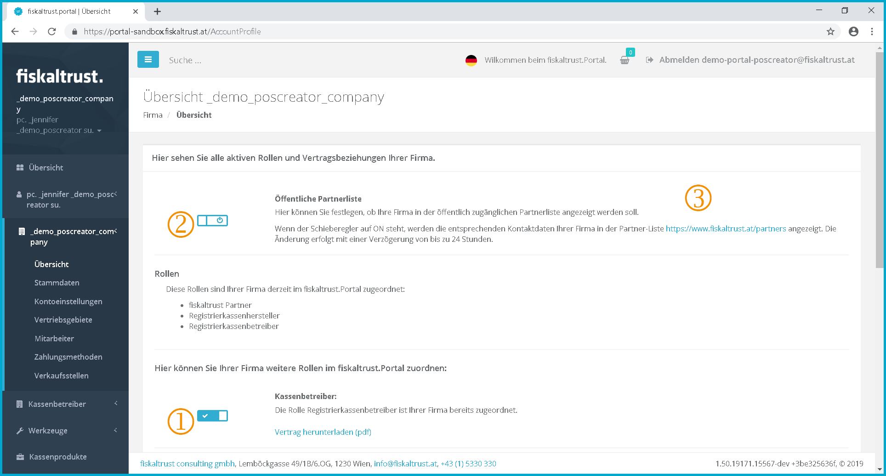](https://portal.fiskaltrust.at/AccountProfile)
Screenshot 35: Entry in the public partner list

 As soon as the role as a "CashSys manufacturer", "CashSys dealer" or "consultant" is active, the status as ft.partner is achieved.

 For each ft.partner the slider is available to display the contact data of his company in the publicly accessible partner list.

 **Text:** "Public Partner List"

Allows you to specify whether your company is displayed in the public partner list.

If this slider is set to ON, the corresponding contact details of your company will be displayed in the Partner List [https://portal.fiskaltrust.at/public/filterpartners](https://portal.fiskaltrust.at/public/filterpartners)."

[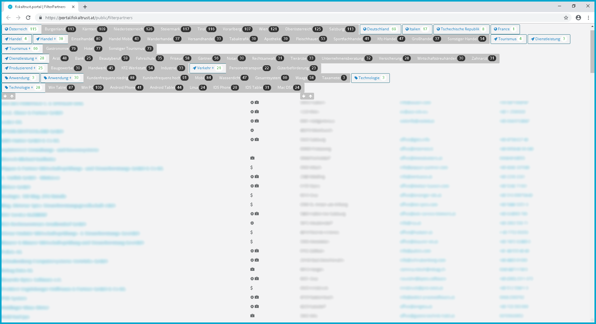](https://portal.fiskaltrust.at/public/filterpartners)
Screenshot 36: Public partner list | [https://portal.fiskaltrust.at/public/filterpartners](https://portal.fiskaltrust.at/public/filterpartners)

#### Active_roles_and_contractual_relationships_including_API_access

[](https://portal.fiskaltrust.at/AccountProfile)
Screenshot 37: Overview - All roles and contractual relationships with fiskaltrust

 **Text:** "Here you see all active roles and contractual relationships of your company."

 **Text:** "Here you can assign further roles in the fiskaltrust.Portal to your company:"

 **Text:** "API access

An account ID and an access token are required to automatically use the online functions of the ft.helipad from your cash register.

If you are currently logged in as the company's primary contact, you can reset these codes and reassign them."

 Here an account ID is generated, which serves as identification of the company for the registration of the company to the ft.helipad. This can be copied to the clipboard for manual transfer to the cash register.

 Here an AccessToken - as access key for the logon of the company to the fiskaltrust.helipad is generated. This can be copied to the clipboard for manual transfer to the cash register.

 The button \[Reset\] can be used to regenerate the account ID and the AccessToken.

#### Resetting_the_role_of_CashSys_manufacturer

You can use this function to terminate the contractual relationships in accordance with the contractual agreement. For this you switch the slider of the role CashSys-manufacturer to disabled and get to the termination page.

[](https://portal.fiskaltrust.at/AccountProfile)
Screenshot 38: Termination of a role and the existing contract

 **Text:** "You hereby terminate an existing contract and deregister the company from the fiskaltrust.portal and its role as a cash register manufacturer."

 **Text:** "I hereby pronounce the termination of the contract as fiskaltrust.manufacturer in accordance with the contractual provision."

 The date and time of the call up for the cancellation form are logged by fiskaltrust with the cancellation and sent to the user as confirmation by e-mail. The risk of data security and failure to provide information is borne by the user or the company and does not affect the termination of the contract.

 The name of the authorised signatory must be entered in this field.

 The declaration of intent is made by clicking on \[Sign\].

The overview of roles and contract relationships is called up.

Then the slider for the respective role is changed from \[Enabled\] to \[Disabled\].

The functions from the role are therefore no longer available.

 Until you click on \[Sign\], you can cancel the process at any time by clicking on \[Cancel\]. In this case the slider for the respective roller is still set to \[Enabled\].

The process of the resignation and thus termination of the contract is confirmed with an e-mail. The termination provisions in the General Terms and Conditions or in the concluded contracts must be observed.

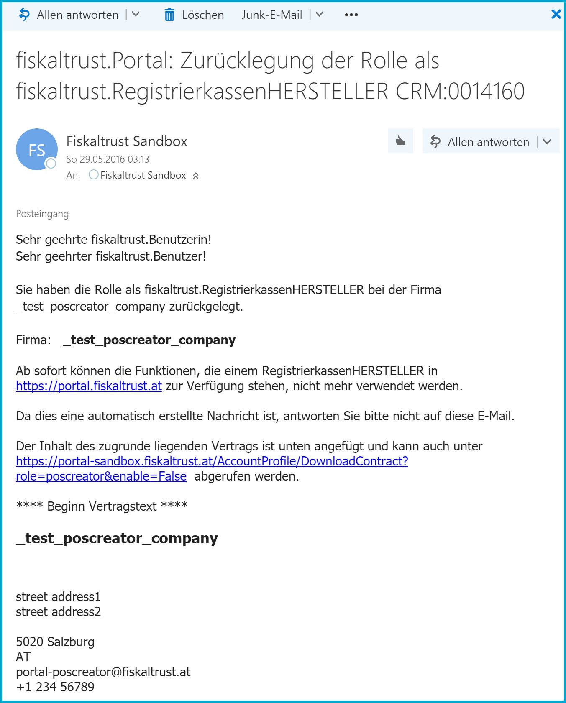
Screenshot 39: Email confirmation: Resignation of the role as fiskaltrust manufacturer of CashSys 

### Master_data_of_the_company

[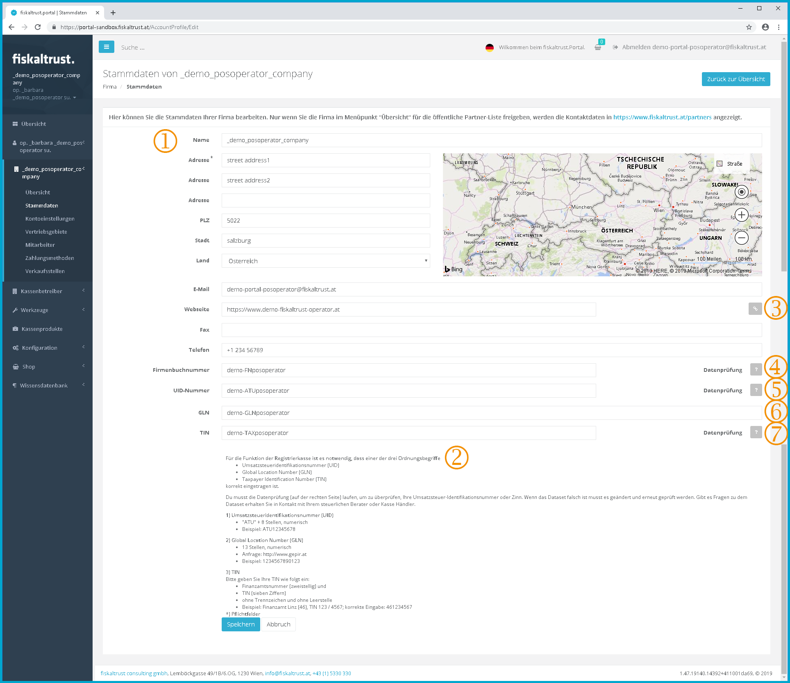](https://portal.fiskaltrust.at/AccountProfile/Edit)
Screenshot 40: Company master data

 **Text:** "Here you can edit the master data of your company. Only if you release the company for the public partner list in the menu item "Overview" will the contact data be displayed in [https://portal.fiskaltrust.at/public/filterpartners](https://portal.fiskaltrust.at/public/filterpartners).

 **Text:** "For the cash register to function, it is necessary that one of these:

- Sales tax identification number (UID)
- Global Location Number (GLN)
- Tax office and tax number (St.Nr.)

is entered correctly.

For the UID or tax number, the data check (on the right side) must also be clicked and checked for its correctness. If an error occurs, the classification key must be corrected and checked again. Your tax advisor or CashSys dealer can help you with any questions you may have about the classification term.

1\) Sales tax identification number (UID)

- ATU" + 8 digits, numeric
- Example: ATU12345678

2\) Global Location Number (GLN)

- 13 digits, numeric
- Inquiry: [http://www.gepir.at](http://www.gepir.at)
- Example: 1234567890123

3\) Tax office and tax number (St.Nr.)

The tax office and tax number must be entered in the following form:

- Tax office number (two digits) and
- Tax number (seven digits)
- without separator and without blank space
- Example: Tax office Linz (46), tax number 123 / 4567; correct input: 461234567.

The following keywords can be checked with the button .

 "Website" (certificate check; the check is not yet active)

 The "company register number" is not required for the functionality of the signature creation.

 "UID number" with leading "ATU" and the 8-digit number. The UID number is the preferred classification term that is used for the signature creation.

Principally, all companies can apply for a UID number.

Companies that do not have a UID number can use the GLN or the tax number as a classification term for the certificates.

 "GLN" The Global Location Number of a company can be queried e.g. via the WKO Firmen A-Z ([https://firmen.wko.at/](https://firmen.wko.at/)) or the company service portal ([https://www.usp.gv.at](https://www.usp.gv.at)).

"Tax number" \[The check of the tax number via the EU portal can temporarily lead to the error message (505) Bad Gateway.\]

### Checking_the_company's_classification_terms

 After entering the UID number or the tax number as a filing key, they are to be saved. Then you should check an order key with the button .

The positive check is absolutely necessary for the later assignment of ONE classification term for the automated personalization of a signature creation device (SmartCard)\!

[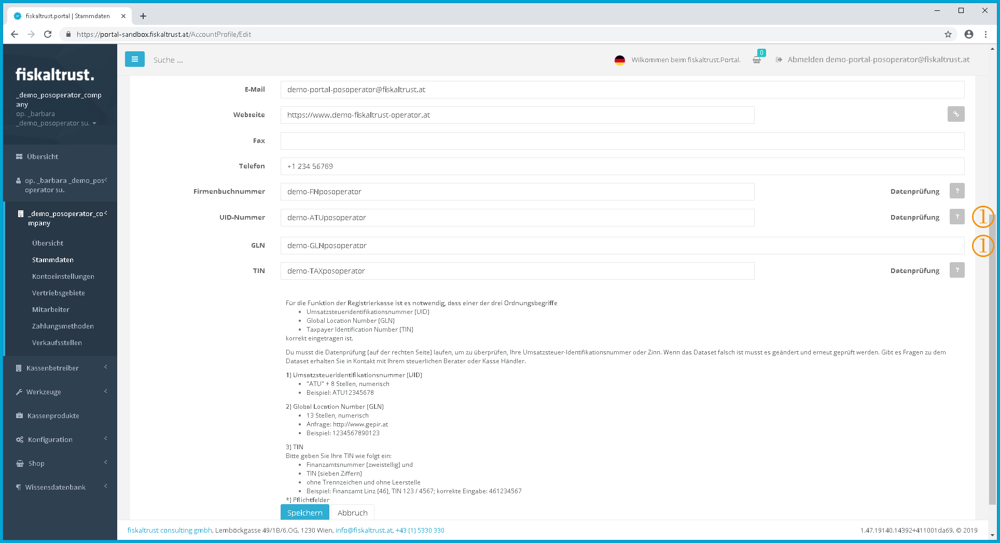](https://portal.fiskaltrust.at/AccountProfile/Edit)
Screenshot 41: Entering a new order key for the company

 The status of the check is indicated by the color and the pictogram of the button . Is the test not yet carried out its indicated by a grey pictogram with a question mark: 

The automated checking of the classification terms is carried out by clicking on 

This example shows the check of the company register number:

[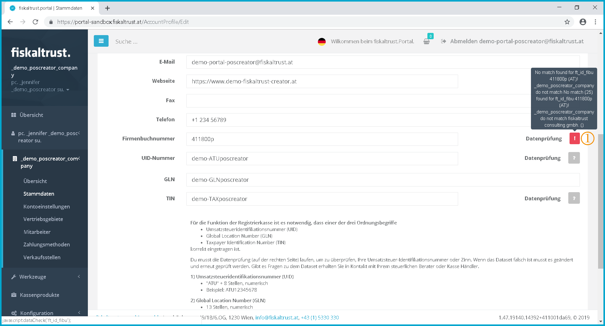](https://portal.fiskaltrust.at/AccountProfile/Edit)
Screenshot 42: Error when checking a classification key (e.g. company register number)

The status of the check is indicated by the color and the pictogram of the button. A negative test is indicated by a red pictogram with a callsign:


Screenshot 43: Example of a negative check result of a check of the company register number

This example of a check result shows that the company name entered in the company master data (above) does not correspond to the data stored in the company register.

After adjusting the name of the company, saving it again and clicking on , the check is carried out again. If the classification key is checked and the master data are now correct - with few deviations - the check leads to a positive result.

[](https://portal.fiskaltrust.at/AccountProfile/Edit)
Screenshot 44: Example of a positive check result of a check of the company register number

 The status of the check is indicated by the color and the pictogram of the button. A positive test is indicated by a pictogram with a check mark: 

Only after a positive check of the classification key can this classification key be used to personalize a signature creation device (SmartCard).

To use the ft.Personalization Tool see chapter [ft.Personalization Tool](#ftpersonalization_tool).

### Account_settings

Under the account settings you can set the length of the display for various lists in the ft.portal.

### Distribution_areas_of_the_company

[](https://portal.fiskaltrust.at/AccountProfile/Territory)
Screenshot 45: Sales areas company

 **Text:** "Here you can select the sales areas of your company. If you display your company in the public partner list, it can be filtered by these sales territories in [https://portal.fiskaltrust.at/public/filterpartners](https://portal.fiskaltrust.at/public/filterpartners)."

## Company_employees

Add new employees to your company and manage their permissions.
[](https://portal.fiskaltrust.at/AccountProfile/Employee)
Screenshot 46: Company - Employees

 By default, the primary contact of the company is the user who registered the company as an employee.

 By clicking on the arrow next to the pictograms to display the authorizations, the sliders for changing the authorizations are displayed.

The different authorizations are described in chapter "[Employees of the company authorization administrations](#employees_of_the_company_authorization_administration)".

 In this case, the primary contact of the company is displayed. This user always has full rights. These authorizations cannot be reset either. Therefore the sliders are grey and cannot be changed.

If no employee has the administrative rights, you loose the possibility to access thee fiskaltrust portal. In this situation the ft.team has to be contacted.

 With this button new employees can be added to the company.

### Add_employees

[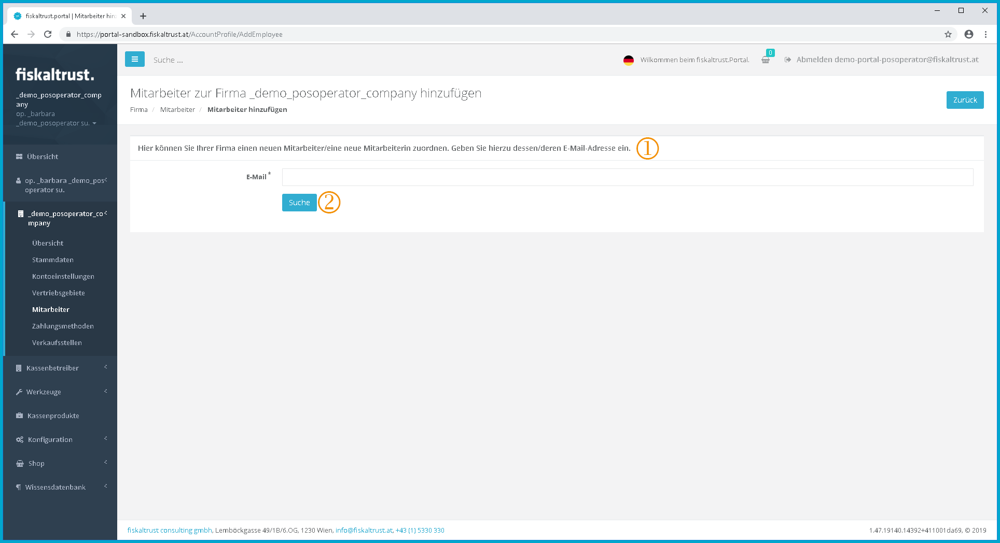](https://portal.fiskaltrust.at/AccountProfile/AddEmployee)
Screenshot 47: Add employees

 **Text:** "Here you can assign a new employee to your company. To do this, enter his/her e-mail address."

 After entering the e-mail address, the e-mail address is searched for in the ft.portal.

### Assign_employees

[](https://portal.fiskaltrust.at/AccountProfile/)
Screenshot 48: Assign found fiskaltrust.contact as employee to the company

 If the contact with the e-mail address that you are looking for has already been created in the ft.portal and is therefore found during the search, it is displayed.

This allows this user to be assigned as an employee. The master data of the sales activity cannot be changed here.

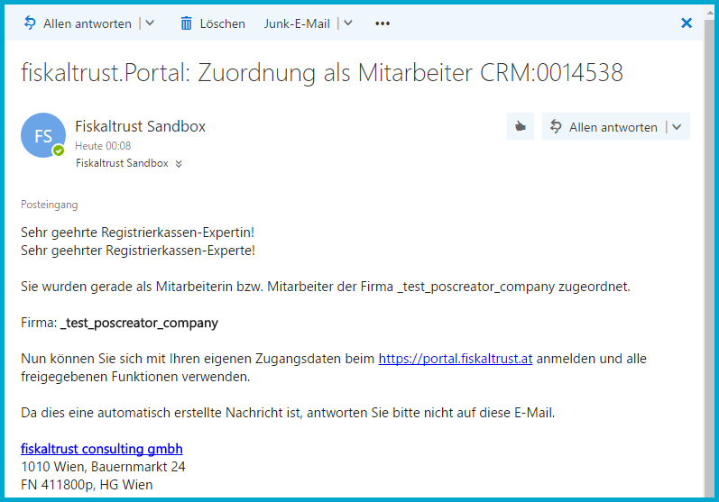
Screenshot 49: Email information that you have been assigned to a company as a fiskaltrust contact.

A contact can only be assigned to one company as an employee.

If no contact is found, it can be invited on the next page.

### Add_employees_new_contact_details

On this page the master data of the new contact can be entered to create it in the ft.portal as a new user and at the same time as an employee of the company.

[](https://portal.fiskaltrust.at/AccountProfile/AddNewEmployee?emailAddress=)
Screenshot 50: Add employees / Employee data

 **Text:** "Enter the employee's master data here. The employee is created in the fiskaltrust.portal and receives an invitation by e-mail to re-register with a personal password".

After creating a new user - who is not yet registered as a contact in the ft.portal - an e-mail invitation will be sent to him.


Screenshot 51: E-mail invitation of a new employee who is to register in the portal and is already assigned to a company as a contact.

### Employees_of_the_company_authorization_administration

[](https://portal.fiskaltrust.at/AccountProfile/Employee)
Screenshot 52: Authorization management for an employee

 **Text:** "** Authorizations for the employee:**

**Read:** Master data of the company may be read.

**Write:** Master data of the company may be changed.

**Manage:** Authorizations can be granted or withdrawn for all employees.

**Substitution:** In the portal the functions for the assigned companies can be exercised.

**Conclusion-of-contract:** Contracts can be concluded e.g. as a CashSys manufacturer or payments can be made in the web shop.

**Checkout-product-Read:** Access to the menu item "Checkout products" and reading the contents (PosSystems).

**Cash-product-Write:** Edit cash products

**Configuration-Read:** Access to the menu item "Configuration" and thus to "Container", "Receipt Chains", "Helper" and "Signature Creation Devices".

**Configuration-Write:** Edit configurations."

 The pictograms show the status of each authorization. If the authorization is not set, the pictogram is displayed in gray. If the authorization is set, the pictogram is displayed in blue. By clicking on the arrow next to the pictograms for displaying the authorizations, the sliders for changing the authorizations are displayed.

 The permissions can be changed by clicking on the sliders. The authorizations of other employees can only be changed by a user with the "*Administrate*" permission set to \[Enabled\].

 Clicking on \[Remove assignment\] cancels the assignment of the employee to the company immediately.

The employee could be reassigned later.

If the companies are assigned via the ft.portal, this administration of user rights can also be performed by an employee of a CashSys-Dealer for an assigned CashSys-Operator.

## Tools_download

[](https://portal.fiskaltrust.at/AccountProfile/Download)
Screenshot 53: Company - Download

Under this menu item, various documents that are relevant for the company - depending on the roles - are made available for download.

## CashSys_manufacturer_functions

### Cash_register_products

[](https://portal.fiskaltrust.at/POSSystem)
Screenshot 54: Cash register products

 **Text:** "Here you can manage your own cash register products and assign them to industries, properties and dealers."

#### Add_cash_product

[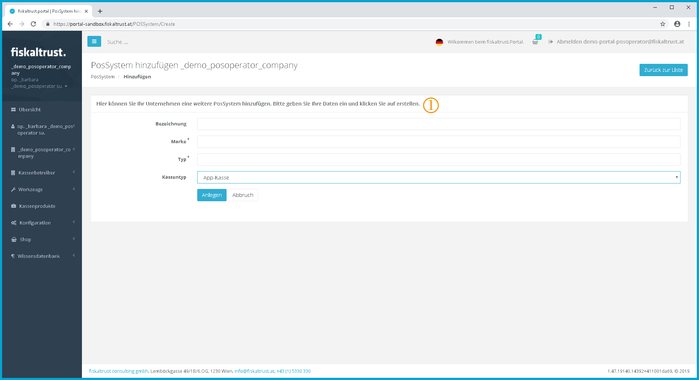](https://portal.fiskaltrust.at/POSSystem/Create)
Screenshot 55: Add cash product

 **Text:** "Here you can assign another cash register product to your company. Enter the data and then click on \[CREATE\]."

#### Cash_register_products_overview

[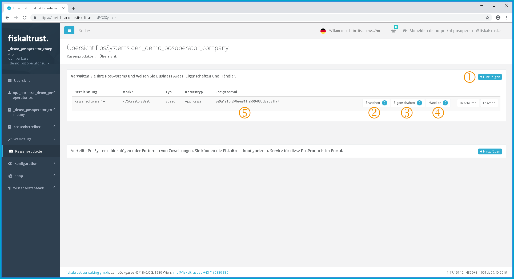](https://portal.fiskaltrust.at/POSSystem)
Screenshot 56: Cash register products - overview

 **Text:** "Here you can manage your own cash register products and assign them to industries, properties and dealers."

 Here you can select the industries for which the POS product is suitable, e.g. "POS software\_1A".

 Here you can define the properties that apply to the POS product POS software\_1A.

 Here you can add another CashSys dealer to the POS product, e.g. for this manual "POS software\_1A".

 The PosSystemId is automatically assigned by the system. This must be used for programming by the CashSys manufacturer in order to send it to the ft.service in the request of the cash register. Only then can the cash register be assigned to the cash register product and thus to the CashSys manufacturer. Please note the information for CashSys manufacturers and in particular the current interface description at
[https://portal.fiskaltrust.at/AccountProfile/Download](https://portal-sandbox.fiskaltrust.at/AccountProfile/Download).

#### Cash_product_Industries

[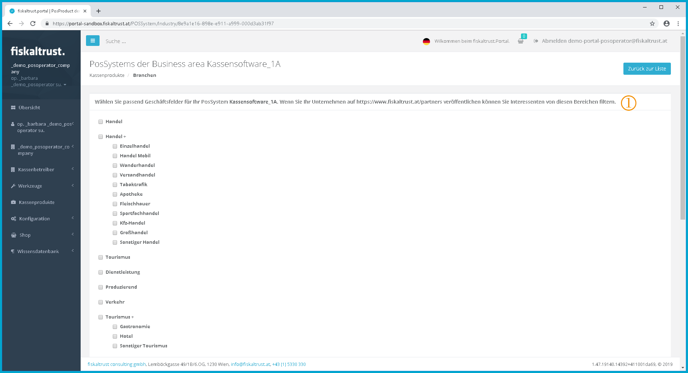](https://portal.fiskaltrust.at/POSSystem/Industry/)
Screenshot 57: Cash product - industries

 **Text:"** Here you can select the industries for which the POS product POS software\_1A is suitable. If you publish your company in [the fiskaltrust partnerlist](https://portal.fiskaltrust.at/public/filterpartners), you can filter interested parties by these industries."

#### Cash_product_Features

[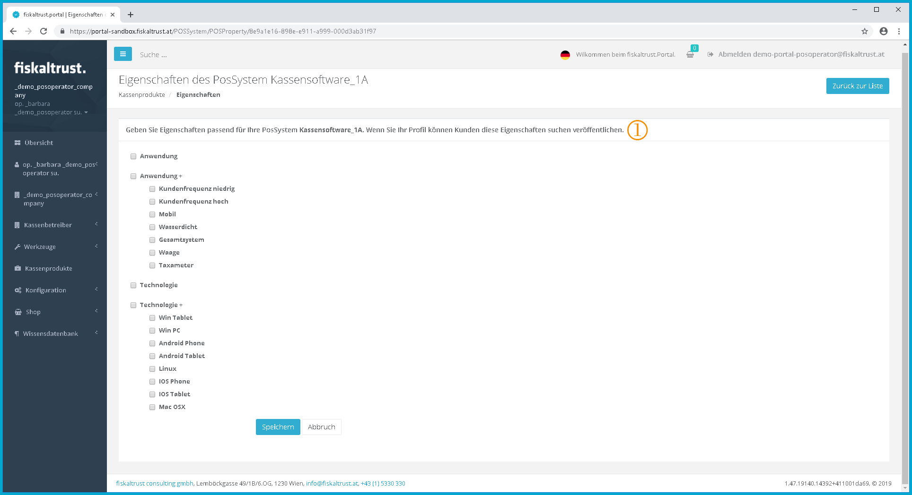](https://portal.fiskaltrust.at/POSSystem/POSProperty/)
Screenshot 58: Cash product - Features

 **Text:"** Here you can define the properties that apply to the POS product POS software\_1A. When you publish your profile, customers can search for these properties."

The "POS software\_1A" is an example for this manual.

#### Add_CashSys_dealer_to_a_Cahsys_product

[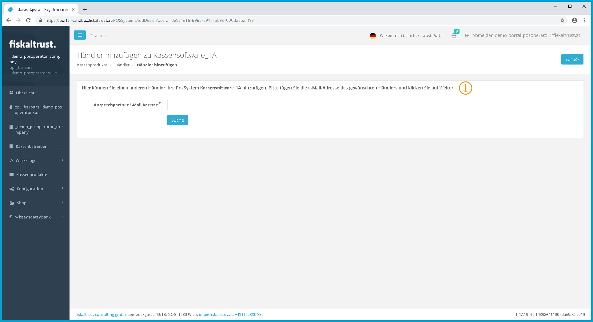](https://portal.fiskaltrust.at/POSSystem/AddDealer)
Screenshot 59: Add CashSys dealer to a CashSys product

 **Text:"** Here you can add another retailer to your cash register software\_1A. First enter the email address of the retailer you wish to contact, then click \[Next\]."

The "POS software\_1A" is an example for this manual.

#### Assign_existing_CashSys_dealer_to_a_CashSys_product

[](https://portal.fiskaltrust.at/POSSystem/AddExistingAccountToPosSystem)

Screenshot 60: Assign an existing CashSys dealer to a CashSys product

 Here you can assign already registered CashSys dealers to your cash register product.

#### CashSys_product_assigned_CashSys_dealer

[](https://portal.fiskaltrust.at/POSSystem/)
Screenshot 61: CashSys product - assigned CashSys dealer

 **Text:** "Here you see a list of all dealers assigned to your CashSys product POS software\_1A. You can assign further dealers. If a company is not yet registered in the fiskaltrust.portal, an invitation will be sent to it by e-mail."

### Request_CashSys_product_as_CashSys_dealer

A CashSys dealer can use this function to assign a CashSys product from a manufacturer.

The CashSys product is searched for first.

[](https://portal.fiskaltrust.at/POSSystem/SearchPossystem)

Screenshot 62: Search cash register product

 **Text:** "Here you can search all cash register products already created in the fiskaltrust.portal by various manufacturers according to various criteria. Afterwards you can be assigned by the respective manufacturer as a dealer for this cash product distributed by you."

[](https://portal.fiskaltrust.at/POSSystem/SearchPossystem)

Screenshot 63: Request cash product as CashSys dealer (POSDealer)

 If the required cash product was found, the assignment can be requested from the primary contact of the CashSys dealer.

[](https://portal.fiskaltrust.at/POSSystem/SearchPossystem)

Screenshot 64: Request was submitted

If the CashSys manufacturer accepts the assignment, the connection between the CashSys dealer and the manufacturer's POS product is established.


Screenshot 65: E-Mail request with the request to assign a cash product to a CashSys dealer

By clicking on the "Link to accept the CashSys dealer" or the link below, the assignment is accepted. With the login the overview of the CashSys dealers and manufacturer is called up.

[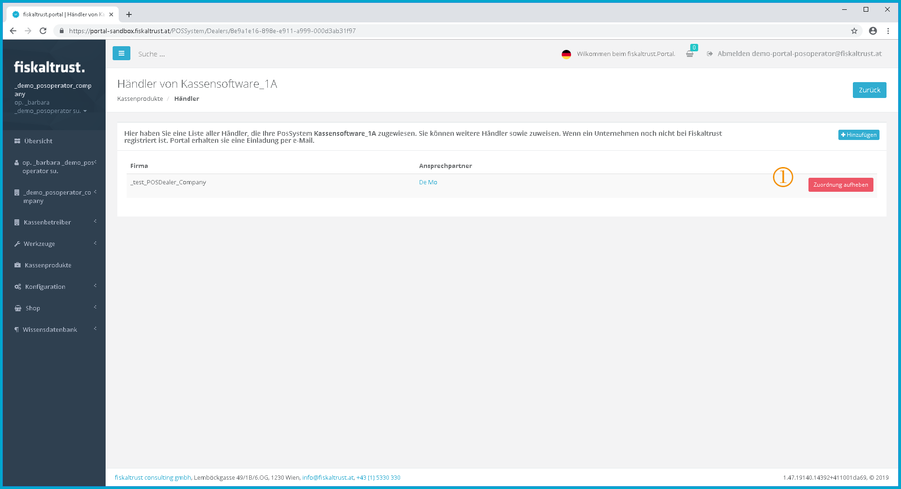](https://portal.fiskaltrust.at/POSSystem/)
Screenshot 66: List of CashSys dealers assigned to a POS product

 The CashSys manufacturer can cancel the assignment of a POS product to a CashSys dealer at any time.

## CashSys_operator_functions_(CashSys_operator)

### Overview_of_assigned_CashSys_operators

Each cash register operator (idF CashSys operator) can log in to the ft.Portal like any other user and any company independently. (see "[Registration and Login](#registration_and_login)")

The assignment of the CashSys operator to a CashSys dealer is shown below.


[](https://portal.fiskaltrust.at/POSOperator)
Screenshot 67: Example - For the time being, no CashSys operators are assigned to the company (CashSys dealer).

In the next example, a CashSys distributor is assigned to the CashSys dealer.

[](https://portal.fiskaltrust.at/POSOperator)
Screenshot 68: CashSys operators - overview

 Overview in status - Waiting for approval by CashSys operator

### Invitation_of_CashSys_operators_by_CashSys_dealers

The invitation of a CashSys operator can only be made by a CashSys dealer, but not by a manufacturer or consultant.

However, the role of a CashSys dealer can also be activated by these companies and thus taken over in parallel to another role. (see chapter "[Company Role CashSys manufacturer](#company_role_cashsys_manufacturer)")

[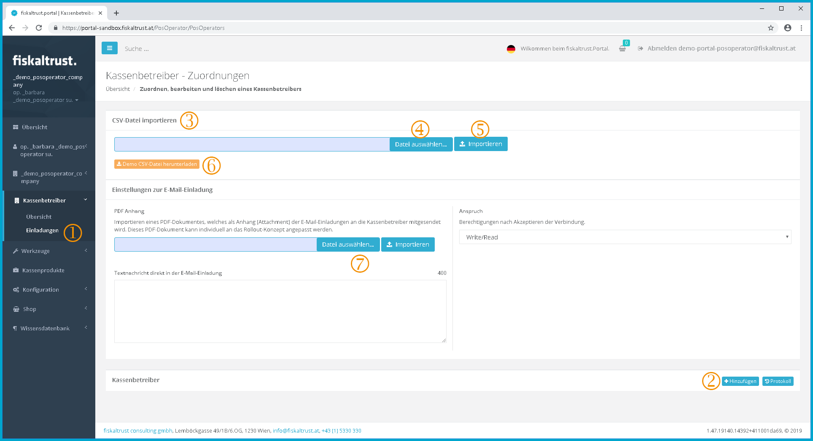](https://portal.fiskaltrust.at/PosOperator/PosOperators/)
Screenshot 69: Invitation of the CashSys operators (POSOperator) by a CashSys dealer (POSDealer)

 The assignments of the CashSys operators can be found under the menu item "Invitations".

There are two ways to add CashSys operators to a CashSys dealer:

1.  add a single CashSys operator see chapter [Add CashSys operator](#add_cashsys_operator).
2.  add several CashSys operators by importing a CSV file.
    1.   The CSV file is to be imported and selected via \[Choose File\].
    2.   Then the import is carried out by clicking on \[Import\].
    3.   The necessary structure of the CSV file is described using an example. This example can be obtained via \[Download demo CSV file\].

| Fields of the CSV file | Description |
|----------------------|--------------------------------------------------------------------------------------------------------------------------------------------------------|
| ContactFirstName | First name of the primary contact |
| ContactLastName | Last name of primary contact |
| ContactTitle | (Academic) Title of primary contact (before name) |
| ContactSuffix | Name suffix of the primary contact (after the name) |
| ContactEMail | E-mail address of the primary contact IMPORTANT\! This e-mail address will be the user's login to this newly created company.                     |
| ContactMobilePhone | Mobile phone number of the primary contact |
| AccountName | Company name |
| AccountWeb | URL of the company's website |
| IMPORTANT: All information about financial online messages and all invoices will be sent to this e-mail address\!        |
| AccountPhone | Company phone number |
| AccountAddressLine1 | Address, first line of the company |
| AccountAddressLine2 | Address, second line of the company |
| AccountPostalCode | Postcode of the company |
| AccountCity | Address, first line of the company |
| AccountCountry | Address, first line of the company |
| AccountIdVat | UID number of the company; This is important for the Finanz Online-Meldungen\! AccountIdFibu; company register number (if available) |<
| AccountIdGln | GLN of the company (from [https://firmen.wko.at](https://firmen.wko.at)) |
| AccountIdTax | Tax office tax number of the company 2 digits tax office number, 3 digits "/" 4 digits tax number = 9 digits without special characters and without spaces. |

 **Text:** "PDF document as an attachment to the e-mail invitation"

Import a PDF document, which is sent to the CashSys operators as an attachment on the e-mail invitations. This PDF document can be individually adapted to the rollout concept (see chapter [Example of a PDF attachment](#example_of_a_pdf_attachment))

#### Add_CashSys_operator

[](https://portal.fiskaltrust.at/PosOperator/CreatePosOperator/)

Screenshot 70: Add CashSys operator

CashSys operators can be added manually using this function. This is particularly interesting for the on-site support given by the CashSys dealer if a CashSys operator wants to use the ft.services immediately - in connection with the commissioning of a cash register.

The following fields are mandatory fields and must therefore be filled in:

- Contact E-Mail
- Contact First name
- Contact Surname
- company's name
- zip code
- location

This is to guarantee that the CashSys operator can be found correctly in the ft.portal via his e-mail address and can be assigned to the CashSys dealer.

[](https://portal.fiskaltrust.at/PosOperator/PosOperators/)
Screenshot 71: Assigning, editing and deleting a CashSys operator 

 Status of the invitation:

-  Email invitation has not been sent yet. 
-  Email invitation was sent by clicking on  or .


- 
 By clicking on  the e-mail invitation can be sent to a single CashSys operator. The e-mail invitation can be sent as an attachment with an individually designed PDF document.

 By clicking on \[Assign all cash register users\] the e-mail invitation can be sent to ALL not yet invited CashSys operators.

 The individual CashSys operator can be edited again by clicking on .

[](portal-sandbox.fiskaltrust.at/PosOperator/)
Screenshot 72: Edit CashSys operator

 The individual CashSys operator can be removed by clicking 

 By clicking \[Protocol\)] the historical sequence of the assignment can be called up.

[](https://portal.fiskaltrust.at/PosOperator/)
Screenshot 73 Protocol overview of the historical sequence of assignments 

 The period of the log overview can be restricted using this function.

 By clicking  the detailed data for the invitation of a CashSys operator can be called up.

[](https://portal.fiskaltrust.at/PosOperator/)
Screenshot 74: Detailed data of the protocol from the invitation of a CashSys operator

The following e-mail invitation is sent:

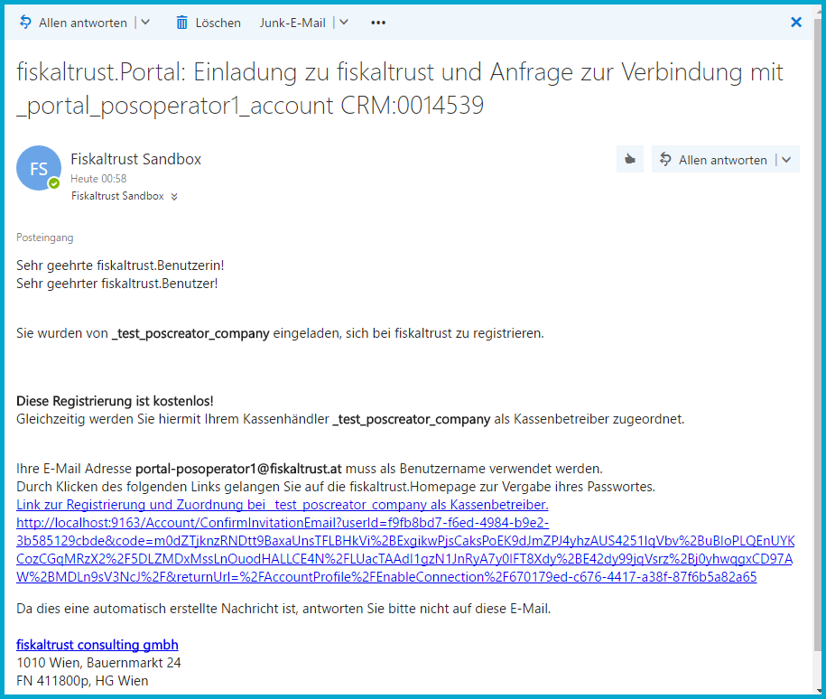
Screenshot 75: Example e-mail invitation of a CashSys operator.

CashSys operator

  By clicking on the link, the portal login is called up and the CashSys operator has to register as a new user and as a new company or log in with his existing data. (see chapter "[Registration and Login](#registration_and_login)")

#### Example_of_a_PDF_attachment

CashSys dealer name

street

Zip Code - City

client name

street

Zip Code - City

Cash register safety device for 1.4.2017

Dear customer\! Dear Customer\!

With this letter we would like to inform you about the procedure **to retrofit your cash register system with the prescribed manipulation protection** to meet the cash register obligation set April 1. 2017 with **fiskaltrust**.

1. cash register software:

The XXX version must be installed ... This costs EUR XXX.

2. important steps for setting up the manipulation protection with fiskaltrust:
    1. registration of your company at https://portal.fiskaltrust.at (according to e-mail)
    2. installation of the free fiskaltrust security device
    3. acquisition of a signature creation device from the trust service provider
    4. registration of the cash register via Finanz Online and examination of the start receipt
3. start of live operation set April 1. 2017 at the latest
4. there is a bonus of at least € 200,- for purchase or conversion. (bonus payments ended with 31st of december 2017)

> fiskaltrust ensures compliance with the law and offers interesting additional products to simplify and optimise the legal obligations.

We recommend the product fiskaltrust.carefree as a cost-effective all-in-one package.

Further information can be found on the supplement or can also be found here:

https://www.fiskaltrust.at

[https://www.bmf.gv.at/steuern/selbststaendige-unternehmer/Sicherheitseinrichtung_in_Registrierkassen.html](https://www.bmf.gv.at/steuern/selbststaendige-unternehmer/Sicherheitseinrichtung_in_Registrierkassen.html "https://www.bmf.gv.at/steuern/selbststaendige-unternehmer/Sicherheitseinrichtung_in_Registrierkassen.html")

If you have any questions please do not hesitate to contact us

Contact us

How do I get to the
manipulation protection
for my cash register?

Installation of the technical safety device

fiskaltrust - All-In-One

All processes are optimally supported in the **free fiskaltrust.Portal**:

1. You are a **CashSys operator** recieved an invetation email from the **CashSys dealer**
2. Free **Registration** as a user and company on [https://portal.fiskaltrust.at](https://portal.fiskaltrust.at)
3. **Assignment** of the company to the CashSys dealer, tax consultant by e-mail invitations
4. **Configuration** of the cash register in the fiskaltrust.portal
5. Acquisition of a signature creation device (chip or online)
6. **Commissioning** Safety device = creation of start receipt
7. **Reporting** Notification of the cash register and signature creation device via Finanz Online
8. **Checking** the start receipt via Finanz Online or BMF-App
9. Legally compliant audit-proof data backup 
10. Preparation of the **monthly receipts**
11. Preparation of **yearly receipt** and verification via Finanz Online
12. **Notification** of failures, recommissioning or deregistrations via Finanz Online

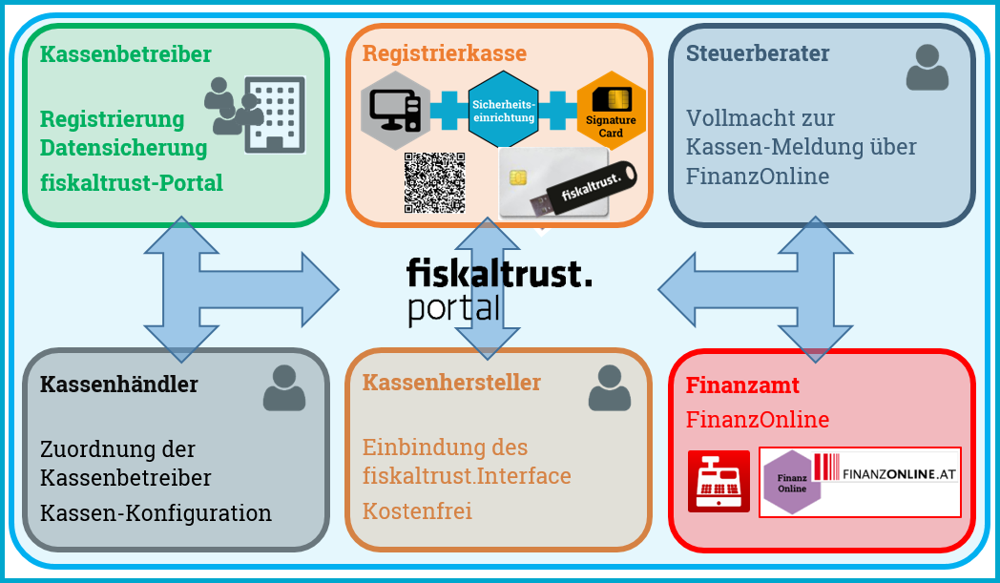

#### Search_for_a_cash_consultant_or_CashSys_dealer

[](https://portal.fiskaltrust.at/PosOperator)
Screenshot 76: Search for his cash consultant or CashSys dealer

 **Text:** "Search of his cash dealer or (tax) consultant in the fiskaltrust.portal

 In this search field you can enter either enter a part of the name or the e-mail address.

By clicking on the button \[Search\] the entire fiskaltrust.portal is searched for the search term.

[](https://portal.fiskaltrust.at/PosOperator)
Screenshot 77: List of CashSys dealers found

You can send these companies an e-mail inquiry by clicking on the button  "Request assignment - Dealer".

[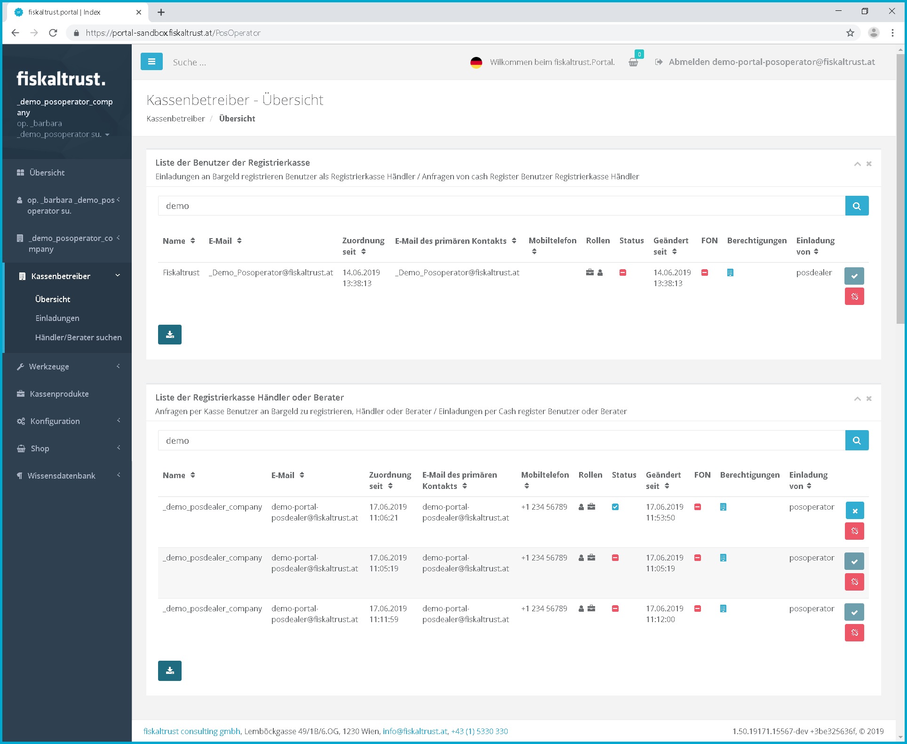](https://portal.fiskaltrust.at/PosOperator)
Screenshot 78: The assignment as CashSys dealer or consultant was requested by e-mail.

This request is immediately visible in the list of CashSys dealers or consultants and can be accepted by the respective company.

[](https://portal.fiskaltrust.at/)
Screenshot 79: Example of a request of a CashSys operator

## Tools

### AT-Finanz-Online_messages

For further information see chapter [Messages](#messages).

### Export

[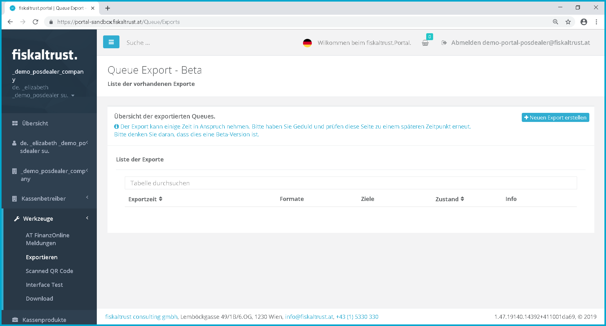](https://portal.fiskaltrust.at/Queue/)
Screenshot 80: Queue export

If the CashSys is configured with an ft.product to send the data to the ft.portal, the data can be exported via the ft.portal.

These products contain the legally required online storage via the ft.Cloud:

- 4154-0201 | fiskaltrust.carefree AT  [https://www.fiskaltrust.at/products/product_01/#1468153721989-91b86112-b158](https://www.fiskaltrust.at/products/product_01/#1468153721989-91b86112-b158)
- 4154-0207 | fiskaltrust.SignatureCloud incl. carefree package AT [https://www.fiskaltrust.at/products/product_01/#1475349131348-1769c5fd-b93f](https://www.fiskaltrust.at/products/product_01/#1475349131348-1769c5fd-b93f)
- Product No. 4154-0218 | fiskaltrust.POS Archive AT [https://www.fiskaltrust.at/products/product_01/#1518106534858-d3d2d959-b0fe](https://www.fiskaltrust.at/products/product_01/#1518106534858-d3d2d959-b0fe)

By clicking on \[create new export\]  you can access the overview of the Queues

### Scanned_QR_codes

Scanned QR codes are displayed here.

First, the required receiptss must be scanned from the portal's homepage [https://portal.fiskaltrust.at](https://portal.fiskaltrust.at).

[](https://portal.fiskaltrust.at/)
Screenshot 81: Scanning a receipt via the ft.portal

 Click on  to activate functions for scanning receipts. This is only possible if the computer system you are using has a camera (webcam) installed.

 By clicking on the (large) image, the QR code can be photographed from a receipt. Then you can see the just created photo as a small icon under the big picture.

Only if a QR code is recognized, the image stops, otherwise it disappears again after a few seconds.

 A recognized QR code is marked with a red frame and can be transferred to the portal for further processing by clicking on the small image. To do this, you must log in to the portal with an existing login.

Thus a start or yearly receipt can be processed automatically in the ft.portal afterwards.

Now the scanned receipt can be viewed in the portal under "Scanned QR Codes".
[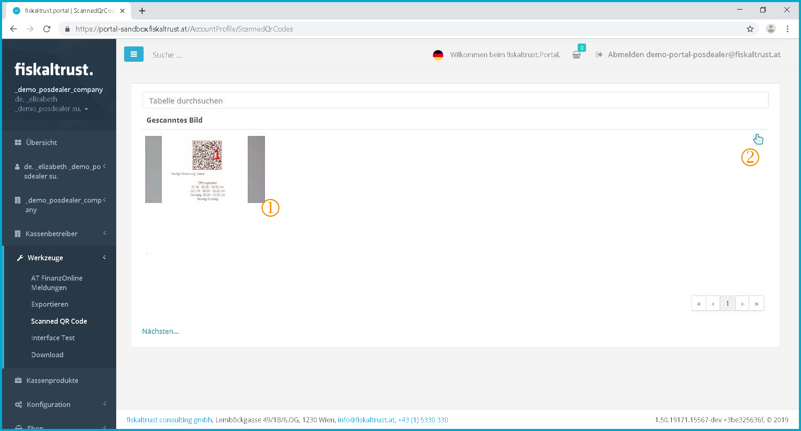](https://portal.fiskaltrust.at/AccountProfile/ScannedQrCodes)
Screenshot 82: Scanned QR codes

 Here you can see the preview of a scanned receipt

 Click on  to open the respective receipt for further processing.

[](https://portal.fiskaltrust.at/AccountProfile/ScannedQrCodes)
Screenshot 83: Create receipt check

 Click on \[Create receipt check\] to start the receipt check.

### Interface_test

[](https://portal.fiskaltrust.at/AccountProfile/InterfaceTest)
Screenshot 84: Interface Test Nummer

### Download

In the download area you will find manuals and instructions for our products.
[](https://portal.fiskaltrust.at/AccountProfile/Download)
Screenshot 85: Download in the ft.portal

## Configuration_of_a_cash_register

For using a template or a package see chapter [Buying a package in the shop or using a template](#buy_package_in_shop_or_use_template).

[](https://portal.fiskaltrust.at/CashBox/)
Screenshot 86: Overview of configured and available configuration containers

The creation and management of the components is discussed in the following chapters:

- [Signature_creation_device](#signature_creation_device)
- [Helper](#helper)
- [Queue](#queue)
- [Cash_Box](#cash_box)

For further information for CashSys manufacturers or dealers see chapter [Rollout for CashSys manufacturers and dealers - Important process steps](#rollout_for_cashsys_manufacturers_and_dealers_important_process_steps).

### Signature_creation_device

#### Creation_of_signature_creation_devices

[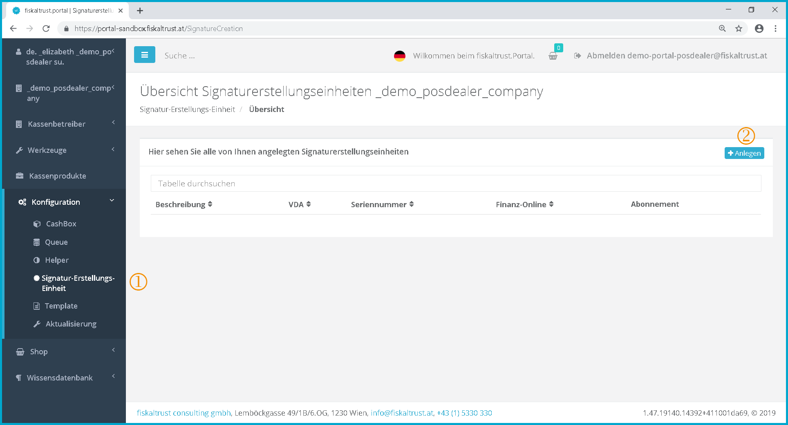](https://portal.fiskaltrust.at/SignatureCreation/)
Screenshot 87: Adding a signature creation device

 To create, configure and delete the signature creation devices, click on the "Signature creation device" menu item.

 Click on \[Create\] to open a page where a new signature creation device can be created.

#### Add_signature_creation_device

[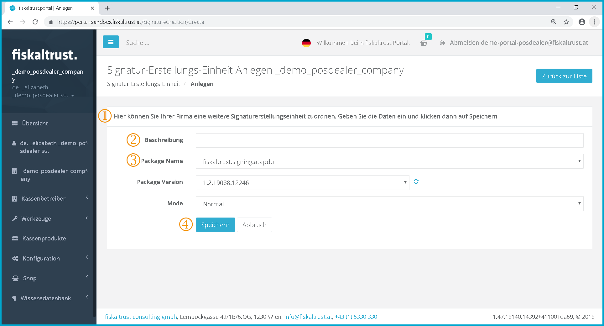](https://portal.fiskaltrust.at/SignatureCreation/)
Screenshot 88: Adding a signature creation device

 **Text:** "Here you can assign another signature creation device to your company. Enter the data and click on "Save".

 Here you can name your signature creation device.

 Here you can select the package to be used. This must be specified by the CashSys manufacturer.

 Click on \[Save\] to save the configuration of the SCU.

#### Overview_of_signature_creation_devices

[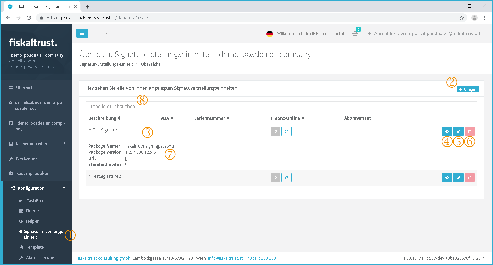](https://portal.fiskaltrust.at/SignatureCreation/)
Screenshot 89: Overview - Signature Creation Devices (SCU)

 To get to the configuration of the signature creation devices, click on the menu item "*Signature creation device*".

 Click on \[Create\] to go to the page for creating a new signature creation device.

 The name of the SCU is displayed here.

 By clicking on , the basic settings and package configuration for individual use of the signature creation device in the cash register can be called up again.

 By clicking on  things like the description, package name, version and mode of SCU may be edited.

 Click on  to delete the SCU. However, the button to delete the helper is currently inactive for legal reasons, so no helper can currently be deleted.

 A brief overview of the data for the selected signature creation device is displayed here.

 The search function can be used to search for a SCU by entering any parameter in the search field.

#### Signature_creation_device_configuration

[](https://portal.fiskaltrust.at/SignatureCreation/)
Screenshot 90: Signature Creation Device - Configuration

 The serial number of the certificate is stored here after creation.

 In this field, you can change the name of the signature creation device.

 Here you can create a URL for your signature creation device. By clicking on  you get a URL, which is suitable for local use without internet connection, because no firewall settings are required.

 By clicking on the , the system generates a URL for you with which the POS system can access the SCU. You can rename the URL yourself. This can look like this: [http://localhost.1200/SCUfiskaltrust]()

 Click on \[Save\] to save the configuration of the SCU.

#### Signature_creation_device_edit

[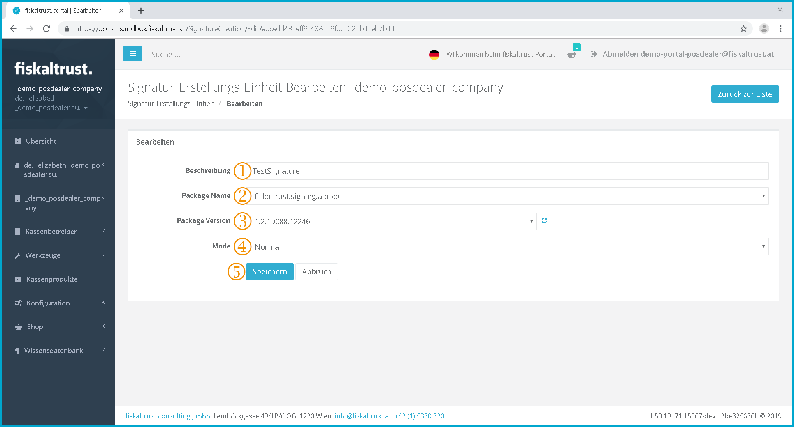](https://portal.fiskaltrust.at/SignatureCreation/)
Screenshot 91: Signature creation device - Edit

 In this field, you can change the name of the signature creation device.

 Here you can use the dropdown menu to select from the various package names.

 The package version can also be selected using a dropdown menu. These can be updated by clicking on .

 In the field Mode you can choose between the different modes "Normal", "Backup" and "Deactivated".

 Click on \[Save\] to save the configuration of the SCU.

#### Signature_creation_device_delete

For legal reasons, it is currently not possible to delete the signature creation device.
[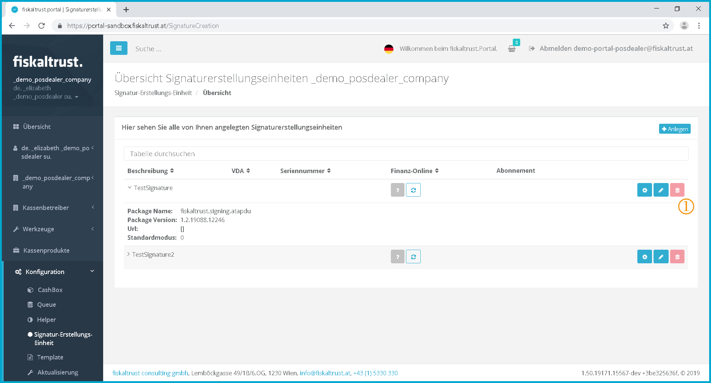](https://portal.fiskaltrust.at/SignatureCreation/)
Screenshot 92: Signature creation device - Delete

 The button for deleting a SCU is currently inactive.

### Helper

#### Installation_of_the_helpers

[](https://portal.fiskaltrust.at/Helper/)
Screenshot 93: Plant of the Helper

 In order to get to the installation and configuration of the helpers, click on the menu item "*Helper*".

 By clicking on \[Create new\] a page is called up, on which a new Helper can be created.

#### Add_helper

[](https://portal.fiskaltrust.at/Helper/)
Screenshot 94: Add Helper

 In this field the name of the helper can be changed.

 Here you can use the dropdown menu to select from the various package versions.

 The package version can also be selected using a dropdown menu. These can be updated by clicking on .

 Click on \[Save\] to save the Helper configuration.

#### Overview_helper

[](https://portal.fiskaltrust.at/Helper/)
Screenshot 95: Overview Helper

 To get to the Helper configuration, click on the menu item "*Helper*".

 Click on \[Create new\] to go to the page for creating a new helper.

 The name of the helper is displayed here.

 By clicking on , the basic settings and package configuration for individual use of the Helper in the cash register can be called up again.

 By clicking on  things like the description, package name and version of the helper may be edited.

 Click on  to delete the helper. However, the button to delete the helper is currently inactive for legal reasons, so no helper can currently be deleted.

 A brief overview of the data for the selected helper is displayed here.

 With the help of the search function, a helper can be searched for by entering any parameter in the search field.

#### Helper_configuration

[](https://portal.fiskaltrust.at/Helper/)
Screenshot 96: Helper - Configuration

 Here you can choose between the individual modes "least active" and "round robin" in the dropdown menu.

 In this field the name of the helper can be changed.

 Here you can create a URL for your Helper. By clicking on  you get a URL, which is suitable for local use without internet connection, because no firewall settings are required.

 By clicking on the  button, the system generates a URL for you with which the POS system can access the helper. You can rename the URL yourself. This can look like this: [http://localhost.1200/Helperfiskaltrust]()

Click on \[Save\] to save the Helper configuration.

#### Helper_delete

[](https://portal.fiskaltrust.at/Helper/)
Screenshot 97: Helper - Delete

For legal reasons it is currently not possible to delete the helper.

### Queue

The functions are described in the currently valid interface description [https://portal.fiskaltrust.at/AccountProfile/Download](https://portal.fiskaltrust.at/AccountProfile/Download).

#### Creating_the_queue

[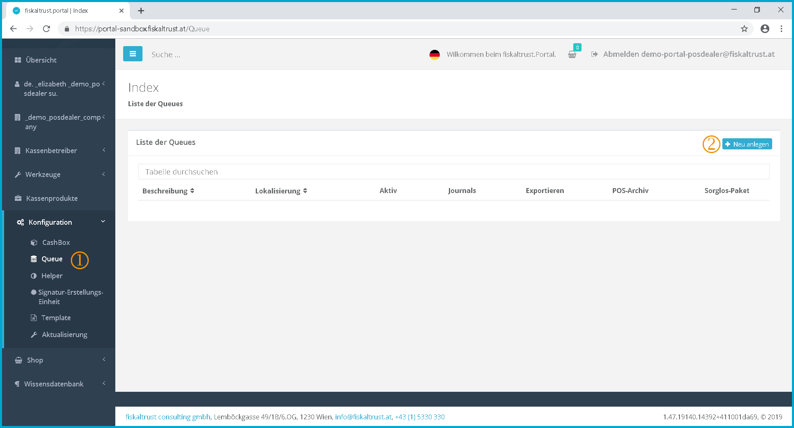](https://portal.fiskaltrust.at/Queue/)
Screenshot 98: Creating the queue

 To get to the creation and configuration of a queue, click on the menu item "*Queue*".

 Click on \[Create new\] to add a new queue.

#### Queue_add

[](https://portal.fiskaltrust.at/Queue/)
Screenshot 99: Queue - Adding

 In this field, you can change the name of the queue.

 Here you can select the appropriate storage method depending on your operating system.

 The package version can also be selected using a dropdown menu. These can be updated by clicking on 

 Here you can set a timeout for the connection attempt with the signature creation device. (The time is given in milliseconds)

 Enter the country in which you would like to use fiskaltrust here.

 Enter the desired health insurance identification number here.

 The system automatically generates the encryption key for you when you click on .

 Click on \[Save\] to save the configuration of the queue.

##### Fiskalization_example_Germany

[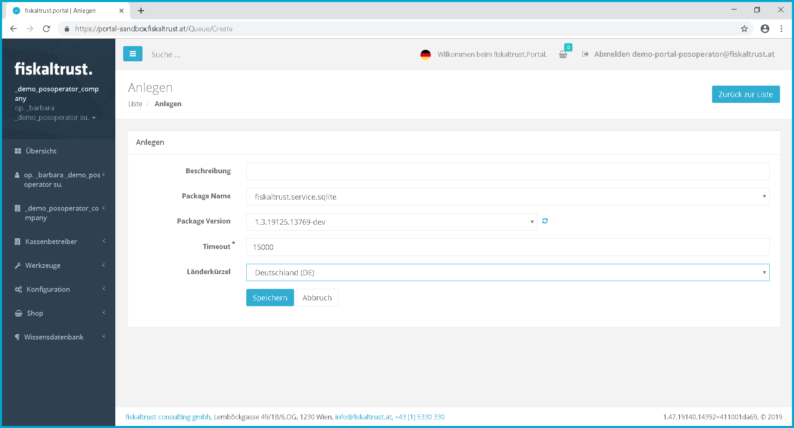](https://portal.fiskaltrust.at/Queue/)
Screenshot 100: Fiskalization - Example Germany

German fiskalization does not (yet) include a signature creation device. This function is in test mode.

#### Queue_overview

[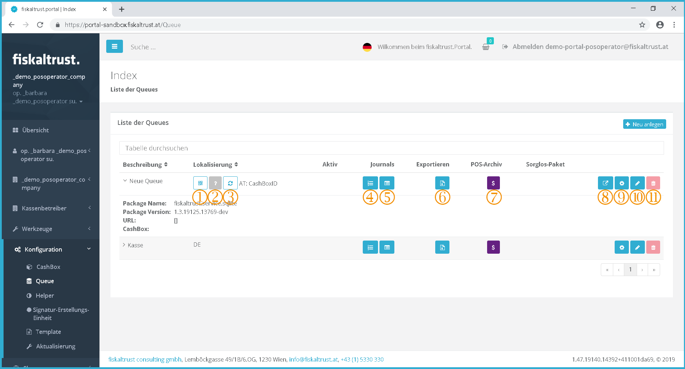](https://portal.fiskaltrust.at/Queue/)
Screenshot 101: Queue overview

 Click on  to go to the receipt check. For further explanations see chapter [Receipt validation](#receipt_validation)

 Here the current status of the CashSys is displayed, by clicking on  a message about the status can be sent.

 By clicking on  a status check is immediately transmitted to Finanz Online.

 By clicking on  all transmitted receipts are displayed.

 The Action Journal can be accessed by clicking on . All status changes and important actions are displayed here.

 The queue export can be started by pressing the button . For further information see chapter [Queue - Export](#queue_export).

 The POS archive can be placed in the shopping cart by clicking on .

 By clicking on  the connected SCUs can be displayed and managed.

 Here the configuration of the queue can be opened by clicking on .

 Click on  to edit the description, package version and timeout of the queue.

 Click  to delete the queue. However, the button for deleting the queue is currently inactive for legal reasons, so no queue can be deleted there will be an option to hide queues in the future.

#### Queue_connected_signature_creation_devices

[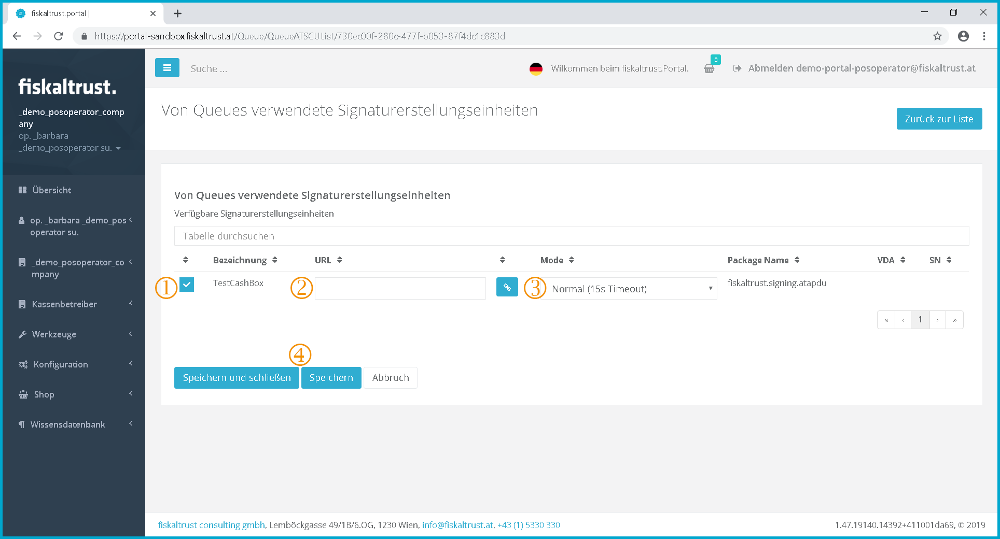](https://portal.fiskaltrust.at/Queue/)
Screenshot 102: Queue - Connected Signature Creation Devices (SCU)

 By setting a check mark the SCU to be connected to the queue is selected.

 The previously selected URL of the SCU is stored here.

 The drop-down menu allows you to choose between different timeout modes. Normal and Backup, and different times.

 Click on \[Save\]  to save the configuration of the queue.

#### Queue_configuration

[](https://portal.fiskaltrust.at/Queue/)
Screenshot 103: Queue configuration

 In this field, you can change the name of the signature creation device.

 Here you can create a URL for your queue. By clicking on  you get a URL, which is suitable for local use without internet connection, because no firewall settings are required.

 By clicking on , the system generates a URL for you with which the POS system can access the queue. You can rename the URL yourself. This can look like this: [http://localhost.1200/Queuefiskaltrust]()

 Click on \[Save\] to save the configuration of the queue.

#### Queue-overview-receipts

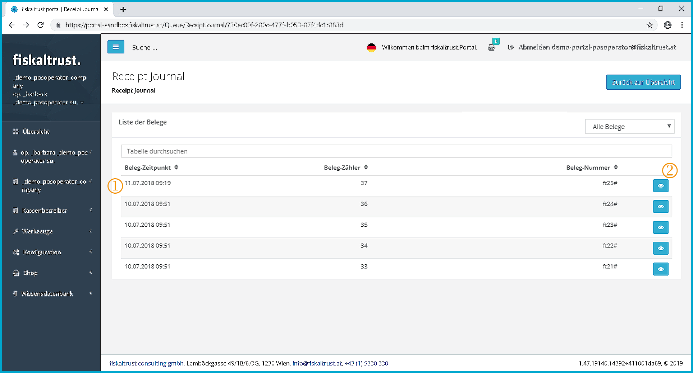
Screenshot 104: Queue - Overview ReceiptJournal

 The receipts created so far are listed here.

 Click on  to display the respective receipt.

After selecting a receipt, it is displayed as follows.This view makes it possible to verify the accuracy of the receipt content.

[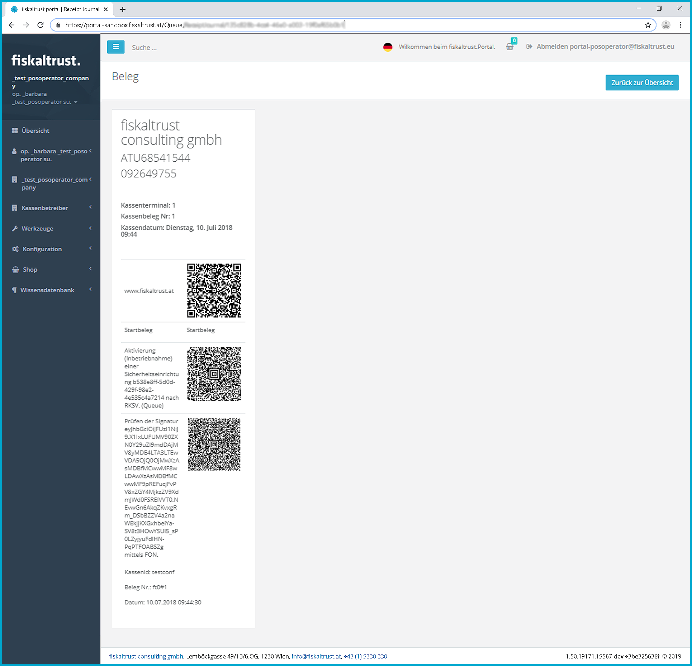](https://portal.fiskaltrust.at/Queue)
Screenshot 105: Queue - Start receipt

#### Queue_edit

[](https://portal.fiskaltrust.at/Queue)
Screenshot 106: Queue - Edit

 In this field, you can change the name of the queue.

 The previously selected package name is displayed here.

 Here you can select from the various package versions using the drop-down menu. These can be updated by clicking on .

#### Queue_export

[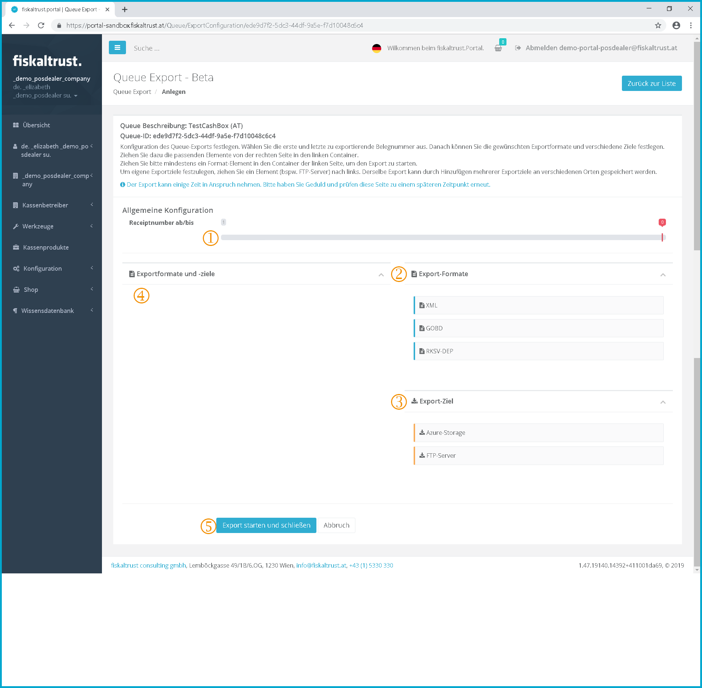](https://portal.fiskaltrust.at/Queue/)
Screenshot 107: Queue - Export

 First you have to define the area which should be exported, this is done with the help of the receipt number and the slider.

 The export format must then be dragged to the left  using Drag\&Drop.

 The export target is also dragged to the left  using Drag\&Drop.

 Click on \[Start\] to start the export, then you will be redirected to a page showing the progress of the export. After completion of the export you will receive an info mail.

### Cash_Box

#### Creation_of_the_Cash_Box

[](http://portal.fiskaltrust.at/CashBox)
Screenshot 108: Creating the configuration containers

 **Text:** "Here you can see all the cash registers you have created. You can add, delete or configure some."

 To get to the creation and configuration of a queue, click on the menu item "*Queue*".

 Click on \[add\] to create a new configuration container.

#### Add_Cash_Box

[](http://portal.fiskaltrust.at/CashBox)
Screenshot 109: Configuration container - Add

 In this field, you can change the name of the configuration container.

 If you are working in a network mode, enter the IP address of the endpoint here. 

 Click on \[Save\] to save the changes to the configuration container.

 Clicking \[Cancel\] cancels the operation without saving the changes.

#### Overview_first_Cash_Box

[](http://portal.fiskaltrust.at/CashBox)
Screenshot 110: Overview - First configuration container 

 After creating a CashBox, it is initially empty, it only has the CashBox ID and the AccessToken which are required to access the CashBox.

 Here you can see the assigned queues, helpers, and SCUs. Since the configuration container has just been created and nothing is stored yet, the fields are empty.

 By clicking on  you can download the "dotnet Launcher". This must be used if there is an Internet connection to the cash register.

 The "dotnet useOffline Launcher" should be used if no internet connection can be established. This can be downloaded by clicking on .

 If you are using a Linux system, download the "mono useOffline Launcher" by clicking on . This is set to "useOffline" by default.

 If no carefree package has yet been purchased, the purchase can be made by clicking on . If a package has already been purchased, the validity date is displayed here.

 The CashBox can be edited with a click on  by Drag\&Drop.

 The CashBox can also be edited in a list view by clicking on .

 By clicking on  the cashbox can be deleted.

#### Edit_CashBox_by_Drag\&Drop

[](http://portal.fiskaltrust.at/CashBox)
Screenshot 111: Edit CashBox by Drag\&Drop

 Here you can see your already created queues. This corresponds to a data acquisition protocol and therefore a CashSys in the sense of the RKSV.

 Here you can see your already created helpers. Further information see chapter [Helpers](#helper).

 Here you can see the signature creation devices that you have already created.

 This field contains your CashBox. Using Drag\&Drop, you can now drag units that have already been created from and into the fields.

 Click on \[Save\] to save the changes to the configuration container.

#### Edit_CashBox_by_list

Furthermore, the CashBox can be edited via a list.
[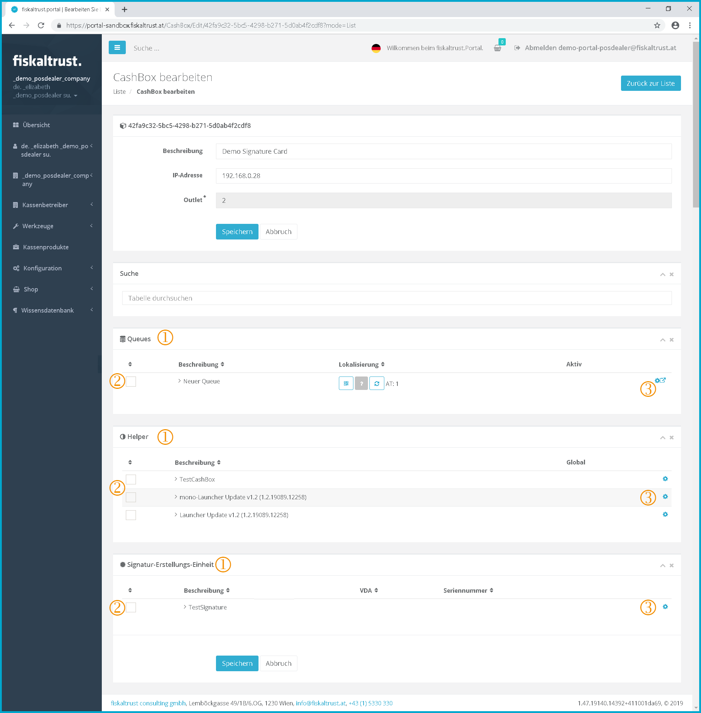](http://portal.fiskaltrust.at/CashBox)
Screenshot 112: Edit CashBox per list

 The list view is divided into three sections showing the available objects (Queues, Helper, Signature Creation Device)

 The required objects can be added to the cash box by ticking the checkbox.

 Click  to display the settings for each object.

#### Ready_configured_CashBox

[](http://portal.fiskaltrust.at/CashBox)
Screenshot 113: Ready configured CashBox

 **Text:** "Here you can see all the cash registers you have created. You can add, delete or configure them."

 By clicking on "+Add" you can create a new configuration container.

 In the section Queues you will find the deposited cash register identification number as well as the automatically generated AES key (Base64 encryption), which is required to register the cash register with Finanz Online. By clicking on  you can configure your queue(s) and set which signature creation devices the queue can access. See Chapter [AT Finanz Online Messages](#at-finanz-online_messages).

For further information see chapter "[Messages](#messages) ".

By clicking on  you can edit them again.

 In this section you can see the connected helpers as well as the package name and version. By clicking on  you can edit them again.

 The connected signature creation devices are displayed here, and the package name and version are also displayed. By clicking on  you can edit them again.

##### Example:Overview_several_ready_configured_CashBoxes

[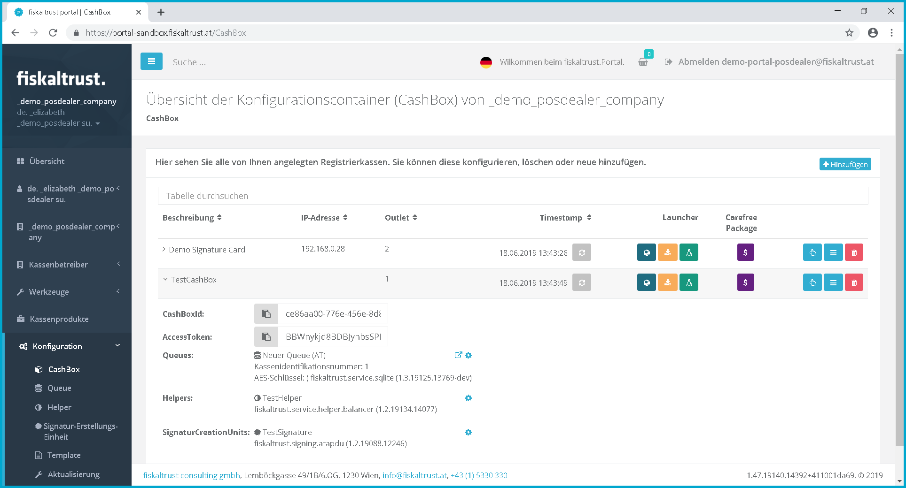](http://portal.fiskaltrust.at/CashBox)
Screenshot 114: Example: Overview - several ready configured CashBoxes

#### Delete_CashBox

[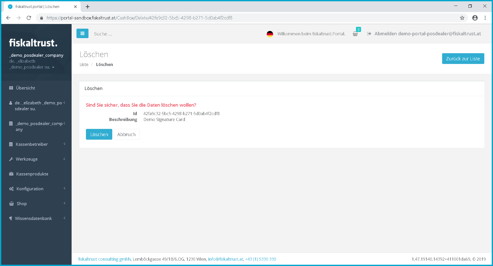](http://portal.fiskaltrust.at/CashBox)
Screenshot 115: Delete CashBox

For legal reasons it is currently not possible to delete a CashBox. However, there is the exception, that if the CashBox was not yet in use, it can still be deleted.

#### Download_Launcher

[](http://portal.fiskaltrust.at/CashBox)
Screenshot 116: Download Launcher

 By clicking on this button, you download the launcher you need for commissioning. This is a ZIP file that you download into the download folder. Extract the file from your download folder with a right-click, then click "Extract" and "Save".

For further information see chapter [Overview first configuration container](#overview_first_configuration_container)

## Shop

The ft.shop can be reached directly at [https://portal.fiskaltrust.at/shop/](https://portal.fiskaltrust.at/shop/).

### Methods_to_purchase_ft.products

You can order ft.products either through your CashSys dealer (as so-called "Entitlements") or directly through the ft.shop. Please clarify the appropriate method with your CashSys dealer. You can also place bulk orders with our support team. You can contact us at [info@fiskaltrust.at](mailto:info@fiskaltrust.at).

### Description_of_ft.products

A list and the current descriptions of our products can be found as a remuneration sheet on our homepage [https://www.fiskaltrust.at/entgeltblatt](https://www.fiskaltrust.at/entgeltblatt)

### Products

Under the section "Products" you will find all products offered by us. Here you can put the selected products into the shopping cart.

[](https://portal.fiskaltrust.at/Shop/Products/)
Screenshot 117: Products

 Here you can specify the number of pieces of the selected products that you would like to put into the shopping cart

 By clicking on  you can put the desired product into the shopping cart.

### Shopping_cart

In the shopping cart you will see a list of your selected products before payment. Here the contents of the shopping cart can be edited again.

[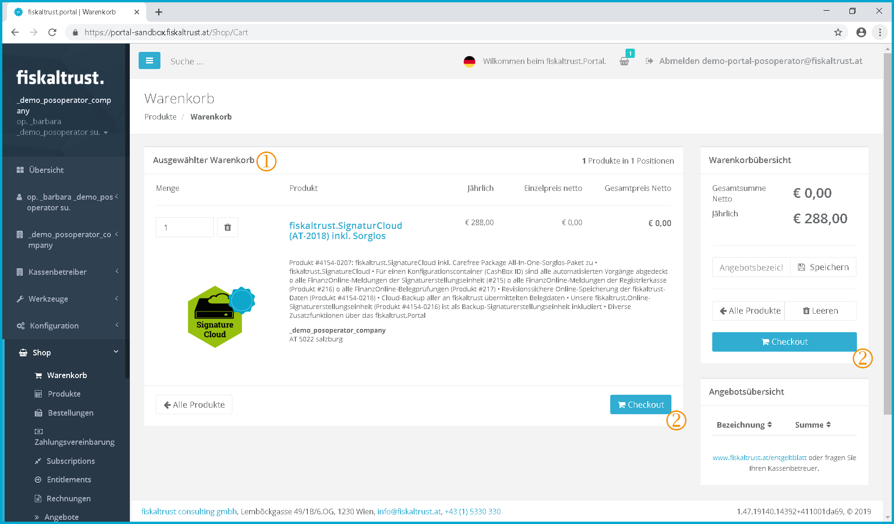](https://portal.fiskaltrust.at/Shop/Products/)
Screenshot 118: Shopping cart

 All products in your shopping cart are displayed here.

 By clicking on \[Checkout\] you will be redirected to the next page where you can select your payment method.

[](https://portal.fiskaltrust.at/Shop/Products/)
Screenshot 119: Checkout

 Here you can see a list of the selected products

 Now you can choose from the different payment methods.

 To complete the purchase, click on \[Binding order\]

### Orders

Overview of previous orders as well as invoices and their status.

[](https://portal.fiskaltrust.at/Shop/Products/)
Screenshot 120: Orders

### Payment_agreement

This section shows the next payment due date for each annually recurring payment of subscription products.
[](https://portal.fiskaltrust.at/Shop/Products/)
Screenshot 121: Payment agreement

### Subscription_products_(subscriptions)

In "Subcriptions" you can view your subscription products.

### Entitlements_(claims)

In this section, you will see a list of your available entitlements.

[](https://portal.fiskaltrust.at/Shop/Products/)
Screenshot 122: Entitlements

### Bills

As soon as an invoice has been created for your products, you can view it under "Invoices".

### Offers

Offers created by fiskaltrust are listed here. By clicking on  the respective offer is put into the shopping cart and you can make the payment as in chapter [Shopping cart](#shopping_cart).  

[](https://portal.fiskaltrust.at/Shop/Products/)  
Screenshot 123: Offers

### Delivery_notes

For hardware orders, the delivery notes are displayed under the menu item "Delivery notes". Shipment tracking is possible via [https://gls-group.eu/AT/de/paket-verfolgen](https://gls-group.eu/AT/de/paket-verfolgen).

## Knowledge_base

### Search_the_knowledge_base

[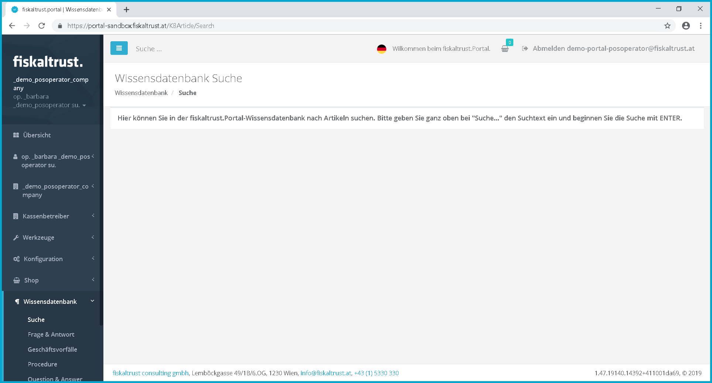](https://portal.fiskaltrust.at/KBArticle/)
Screenshot 124: Search the knowledge base

### Questions_&_Answers

The "Questions & Answers" function is currently inactive. However, you can still view questions that have already been asked and their answers. At www.fiskaltrust.at/faq, you will find a list of frequently asked questions. Should you as a partner (CashSys manufacturer, CashSys dealer) have any further special questions, please do not hesitate to contact us by e-mail at [info@fiskaltrust.at](mailto:info@fiskaltrust.at).
[](https://portal.fiskaltrust.at/KBArticle/)
Screenshot 125: Questions & Answers

### Business_transactions

[](https://portal.fiskaltrust.at/KBArticle/)
Screenshot 126: Business transactions

## Rollout_for_CashSys_manufacturers_and_dealers_important_process_steps

**Overview:** The following steps are performed for an example rollout. If you have already done a rollout (such as creating an R**egK dealer**), you can skip these points.

| All described functions can be tested in the test environment (sandbox) under [*https://portal-sandbox.fiskaltrust.at*](https://portal-sandbox.fiskaltrust.at).                                                                                                                                                                                                                                                                                                                                                                       |
------------------------------------------------------------------------------------------------------------------------------------------------------------------------------------------------------------------------------------------------------------------------------|
| Attention | \- The e-mails are also actually sent from the sandbox\!<br />Therefore, the data of the real customers should not be tested with the data of the sandbox.<br />- The data created in the sandbox are deleted with the following portal update and would have to be entered again.<br />- With each update, the data from the real system are transferred to the sandbox.<br />- In the real system (https://portal.fiskaltrust.at), the functions are taken over in the same way after the test in the sandbox, but not the test data, but the test data. |

### Preparation_collect_all_necessary_information

Please ensure that the following **minimum** information is available:

| Information<br />CashSys Dealer | For the (main) contact | Email address Contact |
|---------------------------------------------------------------|------------------------------------------------------------------------------------------------------------|------------------------|
| | Password | | |
| | First Name || ||
| Last name.
| For the company | Company name | | |
| | E-mail address Company | | |
| Zip code, city, country.
| | UID Number (here optional) | | |
For employees (optional): | e-mail address employees | | |
| | First Name || ||
| Last name.
| CashSys operator | For the (main) contact | Contact E-mail address |
| | Contact First Name | | |
| | Contact Surname | | |
| | Password | | |
For the company: | Company name | | |
| Zip code, city, country.
| | UID Number | ||
| | Company e-mail address | | |
| FinanzOnline RK User (WebService) | Subscriber Identification | | |
| | User Identification | | |
| | PIN | ||
| signature creation device | A-Trust SmartCard (per unit) | | |
| Card reader.
| fiskaltrust.map activation tool | Download in fiskaltrust.portal | | |
| A-Trust a.sign Client<br />(Full installation not necessary) | [https://www.a-trust.at/ATrust/asignclient.aspx](https://www.a-trust.at/ATrust/asignclient.aspx) | | |
Payment in the webshop | Credit card (Mastercard, Visa) or <br />Paypal account (of **CashSys operator** or **CashSys dealer**) | | |

| TIP | Make sure that you can retrieve e-mails from those e-mail addresses that are entered in the fiskaltrust.portal or contact the persons who have access to them. This is also necessary for the tests in the sandbox. |
|------|-----------------------------------------------------------------------------------------------------------------------------------------------------------------------------------------------------------------------------------|
| TIP | The UID number should be entered in any case.<br />This is useful for the later FinanzOnline messages.                                                                                                           |

### Create_the_**CashSys_dealer**_(contact_and_company)

| **1 Registration** <br />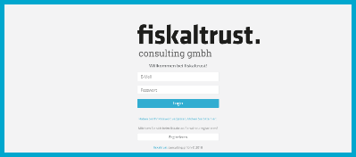|
  | To register the contact and the company, please go to [https://portal.fiskaltrust.at](https://portal.fiskaltrust.at)<br />(Test environment under [https://portal-sandbox.fiskaltrust.at](https://portal-sandbox.fiskaltrust.at)) top left on \[Portal\] and follow the instructions<br />(see chapter "[Registration and Login](#registration_and_login)")<br />The re-registration of a company and a user on the fiskaltrust.portal must be performed jointly in order to connect the user as the primary contact with the company. This connection can currently only be established later by the fiskaltrust.support. |
|------------|----------------------------------------------------------------------------------------------------------------------------------------------------------------------------------------------------------------------------------------------------------------------------------------------------------------------|
| **2 TIP** <br> 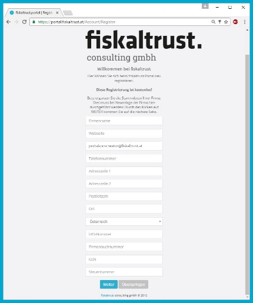 |
  | The data of the company - especially the name, UID number and postal code - should be recorded and not skipped. In the event that the company is not created, the company can be created by another new contact. A new company can only be created for an existing contact via the fiskaltrust.Hotline.<br />Only if the contact is created NEW and the company already exists in the fiskaltrust.Portal, the entry of company data can be skipped.|
| **3 TIP** |
  |If you (also) log into the production system under this link: [https://portal.fiskaltrust.at](https://portal.fiskaltrust.at), the access data will be transferred from the production system to the sandbox in irregular intervalls. This allows you to register in the sandbox even after the next update.|
| **4 Email confirmation** <br />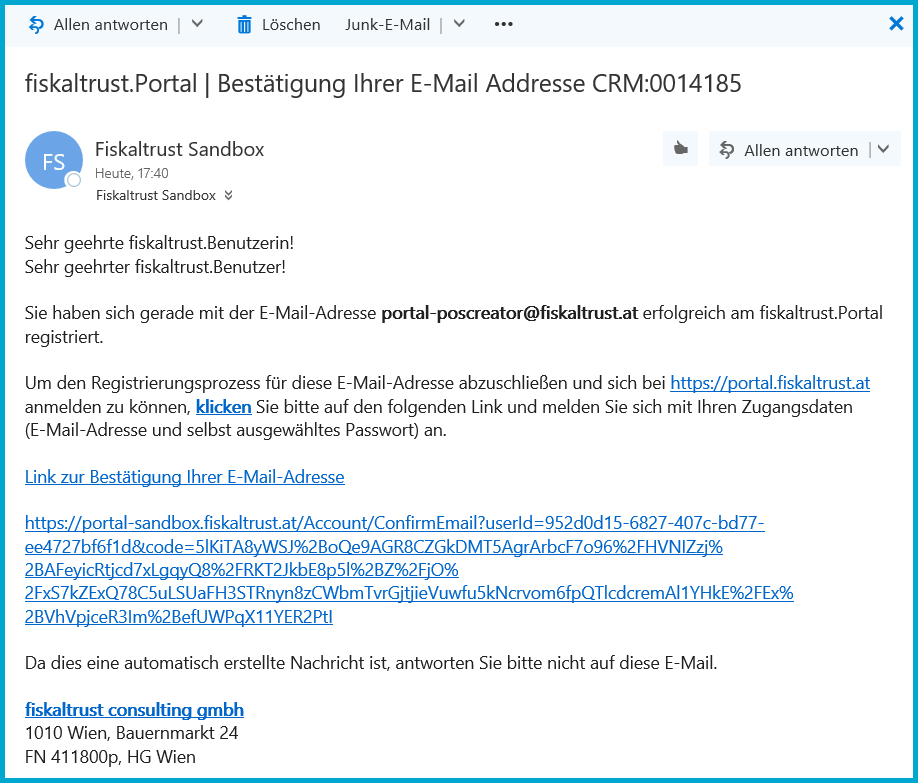<br />Screenshot 129 - Example: Confirming your e-mail
  |The fiskaltrust.portal sends an email to the newly registered address. Please click on the link to complete the registration. Then log in with the access data you have just created.|
| **5 Conclusion of contract** <br />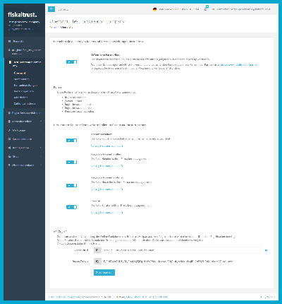[Conclusion of contract](#conclusion_of_contract)|
  |Click on the company name in the menu sidebar on the left and then on {Overview} and move the switch at the CashSys dealer to ON.<br />
  (see chapter [Overview of roles and contractual relationships - example in which "no role" is assigned](#overview_of_roles_and_contractual_relationships) |
| **6 Public Partner List** |
  |If desired, set the "Public Partner List" slider to "ON". (this activates the display in the Public Partner List) |
| **7 {AccountID} and {AccessToken}** |
  |In the company overview below you will find the access data for automated access to a cash register via {AccountID} and {AccessToken}. This data is used to configure the cash registers (see below).|
| **8 Add master data** |
  |Please select the company name and master data from the menu on the left and enter the company e-mail address there, as an example.|
| **9 Automated UID confirmation** |
  |Optional: You can also check its validity here to the right of the UID number. This checks whether the EU VAT information system recognizes the VAT number as belonging to the company name.|
| 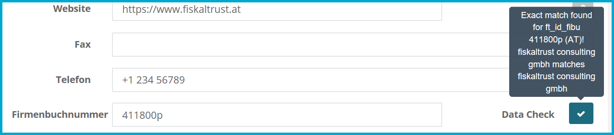 |
  |If an order key has not been positively checked, it cannot be used to personalize a signature creation device (SmartCard). <br /> Only after a positive check of the order key can this order key be used to personalize a signature creation device (SmartCard).<br /> (see "Checking the company order keys") <br> If the check fails, you can move the mouse over the "DataCheck" field to see the response.|

### Invitation_of_a_**CashSys-operator**\_by_the_**CashSys-dealer**

| 1 CashSys operator | Menu "CashSys operator / invitations" |
|------------------|------------------------------------------------------------------------------------------------------------------------------------------------------------------------------------------------------------------------------------------------------------------------------|
| 2 Add | In the line CashSys operator click on "**add "** | |
| 3 Data input | Enter the data of the **CashSys operator** noted above and save it.                                                                                                                                                                                   |
| TIP | 4 If you want to create many CashSys operators at once, you can create a CSV file and import it into the portal.                                                                                                                                              |
| 5 Assign | Click on "Assign" in the line of the created CashSys operator, or on "Assign all CashSys operators" to send an e-mail invitation to all.                                                                                                                  |
TIP | 6 TIP | It is possible to design the e-mail invitation individually by the CashSys dealer with an attached PDF document. This PDF document can be used, for example, to refer to further product recommendations or the rollout schedule for the CashSys operator. |

### Activating_the_**CashSys-operator**_in_the_portal

| The **CashSys operator** receives an invitation to register on the fiskaltrust.portal at his e-mail address <br /> he clicks the link, he arrives at the fiskaltrust.portal, where he only has to choose a password and accept the terms and conditions, as well as the privacy policy. |
|--------------------|-------------------------------------------------------------------------------------------------------------------------------------------------------------------------------------------------------------------------------------------------------------------------------|
| 2 Activation | This not only creates the **CashSys operator** in the fiskaltrust.portal, but also registers it.                                                                                                                                                                        |

### Assign_permissions_of_the_**CashSys-operator**_to_the_**CashSys-dealer**

| 1 Authorization of the CashSys dealer | In the menu bar of the **CashSys operator** click on **CashSys operator** **/** Overview. The inviting CashSys dealer is now already listed and can be selected.                                                                                                                                                                    |
|----------------------------------|-------------------------------------------------------------------------------------------------------------------------------------------------------------------------------------------------------------------------------------------------------------------------------------------------------------------------------------------------------------|
| 2 Authorization assignment | In order to carrie out furthrt steps with the CashSys dealer on behalf of the **CashSys operator**, the rights "Write", "Write cash register product" and "Write configuration" must be added here. If this is not done, the following steps must be performed by the **CashSys operator**. |
| 3\. Optional Employees | Add employees for the **CashSys dealer** |
TIP | 4 TIP | The **CashSys dealer** can create its employees in the portal and grant them access rights.                                                                                                                                                                                                                                                  |
| 5 Add employees | Log in as CashSys dealer, click on the company name in the menu on the left and employees, click on Add, enter the e-mail address of the employee.                                                                                                                                                                                                     |
| 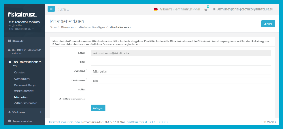 | Every person who should work with the fiskaltrust.portal have to be added as employees.<br />(see chapter [Add employees](#add_employees)) |
| 6 E-mail confirmation | If the employee is found in the portal, he can be assigned directly. Otherwise, first name and surname must be added and the employee can be created again. The employee then receives an e-mail invitation with a confirmation link.                                                                           |

### Entry_of_the_**CashSys-dealer**_as_a_**CashSys-operator**

| 1 TIP | To make portal entries and configurations for the customer (CashSys operator), the **CashSys dealer** (with his own access data) can switch to the view of the **CashSys operator**. However, this requires the prior assignment of the authorizations from the **CashSys operator**.                        |
|---------------------|---------------------------------------------------------------------------------------------------------------------------------------------------------------------------------------------------------------------------------------------------------------------------------------------------------------------------------|
| 2 Login | Login as **CashSys dealer** |
| Please note that in the menu, directly under the logo "fiskaltrust", the company name of the **CashSys dealer** is displayed.                                                                                                                                                                                                            |
| 3 Change company | To the left in the menu go to CashSys operator, Overview and click on the name of the **CashSys operator** in the list on the left. Under the logo "fiskaltrust" the company name of the **CashSys operator** is now displayed, the **CashSys dealer** can now act like the **CashSys operator** (assuming corresponding rights have been assigned) |
| 4 TIP | To return to the view of the **CashSys dealer**, click on the company name of the **CashSys operator** directly below the "fiskaltrust" logo on the left. Then a field will open up with the company name of the **CashSys dealer**, from which you can switch back.                                                        |

### Completing_the_master_data_of_the_**CashSys-operator**

| 1 UID number check | Click on the {Company} / Master data in the menu, enter the company e-mail address and UID number, use the {Data Check} to check that the company name matches the UID number. |
|-------------------|--------------------------------------------------------------------------------------------------------------------------------------------------------------------------------------|
| TIP | 2 If the UID check fails, you can move the mouse over the "DataCheck" field to see the cause as a tooltip and then specifically correct it.             |

### Enter_and_check_the_FinanzOnline_access_data_of_the_**CashSys-operator**

| 1 AT FinanzOnline messages | Click on {Tools} / "AT FinanzOnline messages" in the menu |
|-----------------------------------|--------------------------------------------------------------------------------------------------------------------------------------------------------------------------------------------------------------------------------------------------------------------------------------------------------------------------------------------------------------------------------------------------------------------------------------------------------------------|
| 2 FinanzOnline<br />Login data | Enter the access data of a FinanzOnline user who is authorized for the cash register web service (participant identification (TID), user identification (BenID, PIN). Then: Check and Save |
| TIP | 3 The status of the access data is indicated by a status button at the top of the page. The examination can take several minutes, since the access data is compared with the portal "Finanz-Online". With a browser refresh (key F5) the status can be updated. If the check fails, you can move the mouse pointer over the status button with exclamation and get information why the check failed. |

### Personalize_SmartCard_and_transfer_to_portal

| 1 A-Sign Client | The A-Sign Client from A-Trust must first be installed on the PC. ([https://www.a-trust.at/ATrust/asignclient.aspx](https://www.a-trust.at/ATrust/asignclient.aspx)) If installed correctly, the red icon in the taskbar is visible |
|-----------------------------------|--------------------------------------------------------------------------------------------------------------------------------------------------------------------------------------------------------------------------------------------------------------------------------------------------------------------------------------------------------------------------------------------------------------------------------------------------------------------|
| 2 Card reader | Connect a card reader, the card must not yet be inserted.|
| 3 Install tool and start | Unpack the fiskaltrust.map activation tool in a directory and start it by double-clicking on "fiskaltrust.signing.tools.atrust.exe" |
| Select card reader | Recognized card readers are displayed in the lower left corner, for multiple card readers the correct one must be selected.|
| 5 Real operation <br />or Sandbox | In test operation "Sandbox" must be checked and the language can be changed to German.<br />In the portal under the Company overview {AccountID} and {AccessToken} of the **CashSys operator** enter or copy into the login fields. Register by clicking on the arrow and the company information is read from the portal and displayed. An Internet connection must be established for this. |
| Insert 6 SmartCard | Insert a new SmartCard and select "New SmartCard" from the menu on the left.<br />SmartCards can be ordered in the fiskaltrust.shop: [https://portal.fiskaltrust.at/shop/products](https://portal.fiskaltrust.at/shop/products)
| 7 UID control | The UID number of the **CashSys operator** should now be displayed for "Order key". If this is not the case, the UID number check may not have been carried out correctly.                                                                                                                                                                                               |
| 8 Name | A name for the SmartCard that can be freely selected and must be entered (this name is displayed in the portal after personalization to make it easier to assign this SmartCard) |
| 9 Write | Click "Write SmartCard and create in fiskaltrust.portal". The card is personalized with the selected key (usually the UID number), read and then immediately stored in the fiskaltrust.portal of the **CashSys operator**. The storage can be controlled in the fiskaltrust.portal under "Configuration / Signature Creation Unit".                                |

### Buy_package_in_shop_or_use_template

In the menu item "Configuration" a "CashBox" can be created manually.

Another possibility is the use of a free or chargeable "template". This is a preconfigured "sample template" with various properties to be defined, which is made available in the [ft.shop](https://portal.fiskaltrust.at/Shop/Products "Fiskaltrust Shop"). With such a template you can easily create many similarly configured CashBoxes. These CashBoxes can then furthermore be processed as described in chapter [Cash Box](#cash_box).

If you would like to do so, please contact our support team at [info@fiskaltrust.at](mailto:info@fiskaltrust.at) We will be happy to advise you on the individual implementation.

### Use_individual_template

Under the menu item "Template" you will find an overview of the templates already created.
[](https://portal.fiskaltrust.at/Template/)
Screenshot 133: Templates overview

 Click on \[Create new\] to create a new template.

 To duplicate an existing template, click on .

 Edit existing template by clicking on .

 Open tool for card personalization by clicking .

#### Creation_of_a_new_template

When creating a new template, the following form must be filled out.
[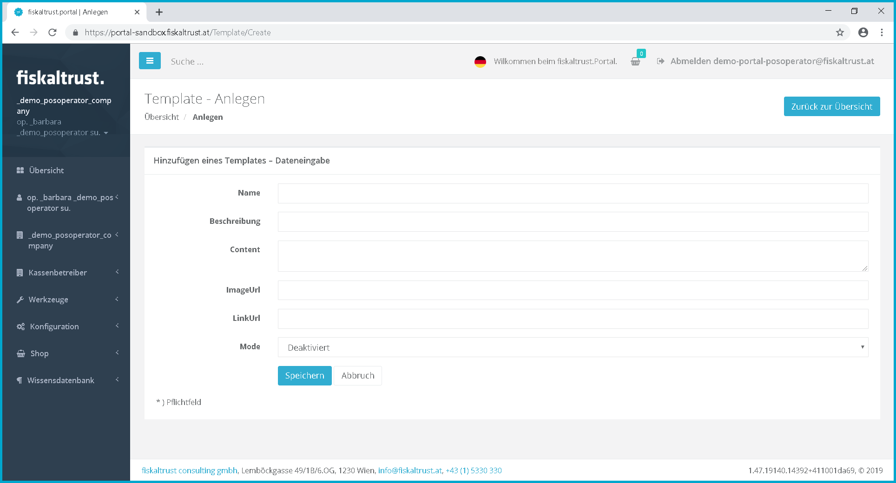](https://portal.fiskaltrust.at/Template/)
Screenshot 134: Create new template

#### Example_for_template_content

```json
{
  "ftCashBoxId": " |[cashbox_id]| ",
  "ftSignaturCreationDevices": [
    {
      "Id": "scu0_id]|",
      "Package": "fiskaltrust.signing.atapdu",
      "Configuration": { "reader": "0" },
      "Url": [ "net.pipe://localhost/|[scu0_id]|" ]
    }
  ],
  "ftQueues": [
    {
      "Id": "|[queue0_id]|",
      "Package": "fiskaltrust.service.sqlite",
      "Configuration": {
      "init_ftQueue": [
        {
          "ftQueueId": "|[queue0_id]|",
          "ftCashBoxId": "cashbox_id]|",
          "CountryCode": "AT",
          "Timeout": 15000
        }
      ],
      "init_ftQueueAT": [
        {
          "ftQueueATId": "|[queue0_id]|",
          "CashBoxIdentification": "fiskaltrust|[count]|"
        }
      ],
      "init_ftSignatureCreationUnitAT": [
        {
          "ftSignaturCreationUnitATId": "|[scu0_id]|",
          "Url": "net.pipe://localhost/|[scu0_id]|",
          "Fashion": 0
        },
        {
          "Url": "signaturcloud-signing-atrustonline]|",
          "Fashion": 0
        },
        {
          "Url": "signaturcloud-signing-primesignhsm]|",
          "Fashion": 0
        }
      ]
    },
    "Url": [ "http://localhost:1200/fiskaltrust" ]
    }
  ]
}
```

### Finanz_Online_signature_creation_device_automated_notification

| 1 Signature Creation Unit | Menu "Configuration / Signature Creation Unit" click |
|--------------------------------|-------------------------------------------------------------------------------------------------------------------------------------------------------------------------------------------------------------------------------------------------------------------------------------------------------------------------------------------------------------------------|
| In the list of signature creation devices created previously, click on the "question mark" at "Finanz-Online".                                                                                                                                                                                                                                                      |
| 3 Perform message | Message type: "Signature creation device logon", IMPORTANT: "Check Sandbox mode\! Create notification.                                                                                                                                                                                                                                                    |
| 4 Query status | You are taken to the Finanz Online Overview, where the status of the message you just created is displayed and updated by browser refresh ("F5" key).                                                                                                                                                                                                      |
TIP | 5 TIP | If there are problems during the execution of the online financial report, you will receive a meaningful error descriptions as a tooltip when you move the mouse over to the "Status" field. You can restart the message on the far right, or confirm it manually. <br />WARNING: In live operation, all FinanzOnline messages are contained in the carefree packages. |

### Register_Finanz-Online_Cash-Register_(Queue)

| 1 Queue | Left in menu to "Configuration", "Queue" |
|-------------------|-----------------------------------------------------------------------------------------------------------------------------------------------------------------------------------------------------------------------------------------------------------------------------------------------------------------------------------------------------------------------|
| 2 Select queue | Click on the "?" at "Localization" in the list for the created queue.                                                                                                                                                                                                                                                                                        |
| 3 Start message | Message type: Cash register login, tick Sandbox mode\! Create notification |
| 4 Query status | You are taken to the Finanz Online Overview, where the status of the message you just created is displayed. The status can be updated using the browser refresh button ("F5" key).                                                                                                                                                                                         |
TIP | 5 TIP | If there are problems during the execution of the online financial report, you will receive a meaningful error descriptions as a tooltip when you move the mouse over the "Status" field. You can restart the message on the far right, or confirm it manually. <br />WARNING: In live operation, all FinanzOnline messages are contained in the carefree packages. |

### Create_receipt_and_perform_receipt_check

| 1 Call queue | To the left in the menu "Configuration" / "Queue" |
|------------------------|-----------------------------------------------------------------------------------------------------------------------------------------------------------------------------------------------------------------------------------------------------------------------------------------------------------------------------------------------------------------------|
| 2 Start receipt check | Click on "Start receipt check" in the list for the created queue / "Localization" |
| 3 Create check | Either manually copy in the QR code value / DEP value, or the data is automatically stored here if the service has received a start receipt request and is connected to the Internet. Click "Create validation".                                                                                                                         |
| 4 FinanzOnline Status | You are taken to the Finanz-Online overview, where the status of the check you just created is displayed. It can be updated with a browser refresh ("F5" key).                                                                                                                                                                                             |
TIP | 5 TIP | If there are problems during the execution of the online financial report, you will receive a meaningful error descriptions as a tooltip when you move the mouse over the "Status" field. You can restart the message on the far right, or confirm it manually. <br />WARNING: In live operation, all FinanzOnline messages are contained in the carefree packages. |
| 6 TIP | During the execution of this process you have received some e-mails with interesting information.<br />It is worth taking a look at them.                                                                                                                                                                                                            |

## Fiskalization-AT

## ft.personalization_tool

### ft.personalization_tool_download_&_installation

[](https://portal-sandbox.fiskaltrust.at/AccountProfile/Download)
Screenshot 135: Overview of the "Download" menu item

 As a CashSys dealer you will find the download of the personalization tool in the left menu bar under **Download.**

[](https://www.a-trust.at/downloads/)
Screenshot 136: Available downloads from the A-Trust website

 In order to use the ft.personalization tool the "a.Sign Cilent" must be downloaded first. This can be done by clicking on the hyperlink or directly via the [A-Trust website](https://www.a-trust.at/downloads/). The downloaded file must now be executed.

 Afterwards you can click on fiskaltrust.signing.tools.atrust.setup and start the download. Now the file must be executed and the installation must be initiated.

### ft.personalization_tool_Login

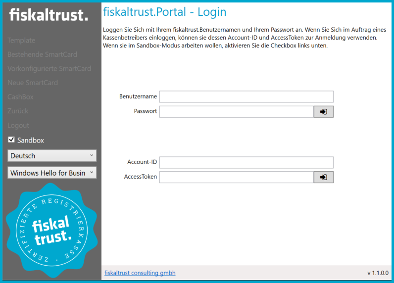
Screenshot 137: Login mask of the ft.personalization tool

The login data (user name and password) or the account ID and the AccessToken are required for the login.

[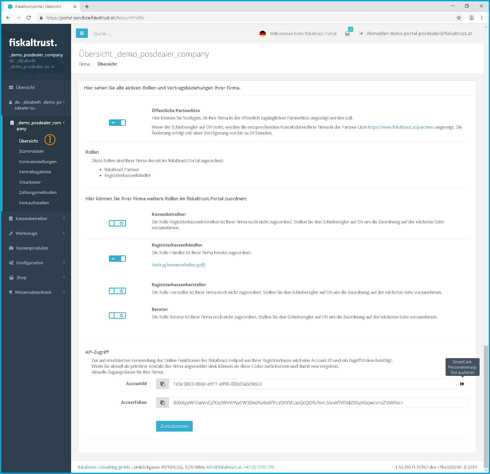](https://portal.fiskaltrust.at/AccountProfile)
Screenshot 138: Overview of the company

 Under the menu item {Company}, "Overview", you can download a file by clicking on it. This file copies the account ID and the AccessToken and automatically opens the ft.personalization tool and inserts the data onto the login screen.

## FinanzOnline-(AT)

### Messages

[](https://portal.fiskaltrust.at/AccountProfile/ATFon)
Screenshot 139: AT FinanzOnline / Overview

Enter access data

Open FinanceOnline notifications and audits

- notifications
- receipt validation

 Participant identification (PID)

 Forwarding Setting

 Click here to verify and Save

 Click to check the status of your access data

 Click to checkout notifications and validations

 Notifications

 Validations

 Unfinished notifications

 Unfinished validations

 Timeline

### Report_on_Finanz-Online_status

With the help of the link [https://portal.fiskaltrust.at/posoperator/ATFonReport](https://portal.fiskaltrust.at/posoperator/ATFonReport), it is possible to retrieve a report about the Finanz Online status.
[](https://portal.fiskaltrust.at/PosOperator/ATFonReport)
Screenshot 140: Finanz Online status report

 By clicking on all entries listed below it will be resent to Finanz Online.

 The current forwarding status to Finanz Online is displayed here.

 The forwarding status can be updated by clicking this button.

 The following list shows a list of existing entitlements, messages, queues and SCUs including their current state at Finanz Online.

### Completion_via_the_portal

1. new
2nd inquiry (incident)
    1. a product must have been purchased with which the Finanz Online messages can be carried out.
3. forwarding (redirect)
4. processed
    2. successful
    3. failed
        1 The Finanz Online feedback is available as a tooltip at the button.

### Identification_of_manual_completion

The Finanz Online notifications can always be carried out manually by the CashSys operator or his tax consultant via Finanz Online.

If the completion of a Finanz Online message has already been done manually, this is signalled to the fiskaltrust.portal by clicking on the button "Mark as done manually".

### Receipt_validation

#### Automatic_receipt_validation

#### Receipt_validation_in_dialog_procedure

## Charter-(FR)
